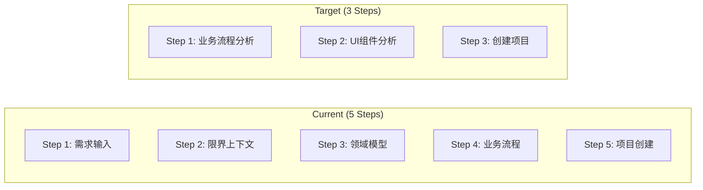
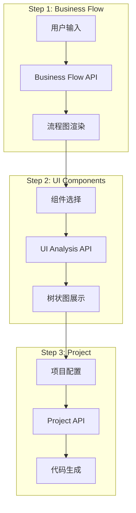
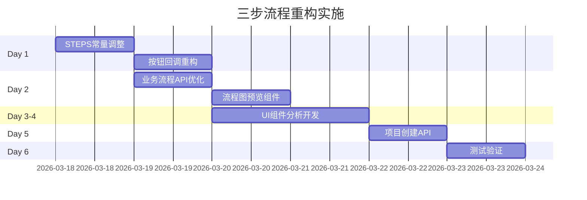

# 首页三步流程重构架构设计

**项目**: vibex-homepage-flow-redesign  
**架构师**: Architect Agent  
**日期**: 2026-03-18  
**状态**: ✅ 设计完成

---

## 一、技术栈

| 技术 | 版本 | 用途 |
|------|------|------|
| React | 18.x | UI 框架 |
| Next.js | 14.x | 应用框架 |
| Mermaid | - | 流程图渲染 |
| Zustand | 4.x | 状态管理 |

---

## 二、架构图

### 2.1 当前 vs 目标流程



### 2.2 组件交互



---

## 三、核心改动

### 3.1 STEPS 常量调整

```typescript
// types/homepage.ts

// 当前 (5步)
const STEPS_FIVE: Step[] = [
  { id: 1, label: '需求输入', description: '输入项目需求' },
  { id: 2, label: '限界上下文', description: '分析限界上下文' },
  { id: 3, label: '领域模型', description: '构建领域模型' },
  { id: 4, label: '业务流程', description: '设计业务流程' },
  { id: 5, label: '项目创建', description: '生成项目代码' },
];

// 目标 (3步)
const STEPS_THREE: Step[] = [
  { id: 1, label: '业务流程分析', description: '输入上下文，生成业务流程图' },
  { id: 2, label: 'UI组件分析', description: '勾选流程节点，生成UI组件树' },
  { id: 3, label: '创建项目', description: '选择组件，生成项目代码' },
];
```

### 3.2 按钮回调调整

```typescript
// HomePage.tsx

const handleGenerate = useCallback(() => {
  switch (currentStep) {
    case 1:
      // 业务流程分析
      generateBusinessFlow(requirementText);
      break;
    case 2:
      // UI 组件分析
      analyzeUIComponents(selectedFlowNodes);
      break;
    case 3:
      // 创建项目
      createProject(selectedUIComponents);
      break;
  }
}, [currentStep, requirementText, selectedFlowNodes, selectedUIComponents]);

// 按钮文字
const buttonConfig = {
  1: { label: '🚀 分析业务流程', disabled: !requirementText.trim() },
  2: { label: '🔍 分析UI组件', disabled: selectedFlowNodes.length === 0 },
  3: { label: '💼 创建项目', disabled: selectedUIComponents.length === 0 },
};
```

---

## 四、组件设计

### 4.1 Step 1: 业务流程分析

```tsx
// components/homepage/steps/StepBusinessFlowNew.tsx

export function StepBusinessFlowNew() {
  const { requirementText, onRequirementChange, onGenerate } = props;
  
  return (
    <div className={styles.stepBusinessFlow}>
      {/* 输入区域 */}
      <RequirementInput
        value={requirementText}
        onChange={onRequirementChange}
        placeholder="描述您的业务流程..."
      />
      
      {/* 流程图预览 */}
      <PreviewArea
        type="flowchart"
        code={mermaidCode}
      />
      
      {/* 操作按钮 */}
      <button onClick={onGenerate} disabled={!requirementText}>
        业务流程分析
      </button>
    </div>
  );
}
```

### 4.2 Step 2: UI组件分析

```tsx
// components/homepage/steps/StepUIAnalysis.tsx

export function StepUIAnalysis() {
  const [selectedNodes, setSelectedNodes] = useState<string[]>([]);
  
  return (
    <div className={styles.stepUIAnalysis}>
      {/* 流程节点选择 */}
      <FlowNodeSelector
        nodes={flowNodes}
        selected={selectedNodes}
        onChange={setSelectedNodes}
      />
      
      {/* UI 组件树预览 */}
      <ComponentTreePreview
        components={uiComponentTree}
      />
      
      <button onClick={analyzeUIComponents}>
        分析UI组件
      </button>
    </div>
  );
}
```

### 4.3 Step 3: 创建项目

```tsx
// components/homepage/steps/StepProjectNew.tsx

export function StepProjectNew() {
  const [selectedComponents, setSelectedComponents] = useState<string[]>([]);
  
  return (
    <div className={styles.stepProject}>
      {/* 组件选择 */}
      <ComponentSelector
        components={availableComponents}
        selected={selectedComponents}
        onChange={setSelectedComponents}
      />
      
      {/* 项目预览 */}
      <ProjectPreview
        components={selectedComponents}
      />
      
      <button onClick={createProject}>
        创建项目
      </button>
    </div>
  );
}
```

---

## 五、API 设计

### 5.1 业务流程 API

```typescript
// API: POST /api/ddd/business-flow

interface BusinessFlowRequest {
  requirement: string;
  contexts?: string[];
}

interface BusinessFlowResponse {
  mermaidCode: string;        // Mermaid 流程图代码
  flowNodes: FlowNode[];      // 可选流程节点
  status: 'success' | 'error';
}
```

### 5.2 UI 组件分析 API

```typescript
// API: POST /api/ddd/ui-analysis

interface UIAnalysisRequest {
  flowNodes: string[];
  projectType?: string;
}

interface UIAnalysisResponse {
  components: UIComponent[];   // UI 组件树
  mermaidCode: string;        // 组件图 Mermaid 代码
}
```

### 5.3 项目创建 API

```typescript
// API: POST /api/projects/create

interface CreateProjectRequest {
  name: string;
  components: string[];
  flowNodes: string[];
}

interface CreateProjectResponse {
  projectId: string;
  repoUrl: string;
  status: 'success' | 'error';
}
```

---

## 六、状态管理

### 6.1 Zustand Store

```typescript
interface HomePageStore {
  // 流程步骤
  currentStep: 1 | 2 | 3;
  
  // Step 1 状态
  requirementText: string;
  flowNodes: FlowNode[];
  flowMermaidCode: string;
  
  // Step 2 状态
  selectedFlowNodes: string[];
  uiComponents: UIComponent[];
  componentTreeMermaid: string;
  
  // Step 3 状态
  selectedComponents: string[];
  createdProject: Project | null;
  
  // Actions
  setCurrentStep: (step: 1 | 2 | 3) => void;
  setFlowData: (data: FlowData) => void;
  setUIAnalysis: (data: UIAnalysisData) => void;
  createProject: (components: string[]) => Promise<void>;
}
```

---

## 七、测试策略

### 7.1 单元测试

| 测试项 | 方法 | 预期 |
|--------|------|------|
| STEPS 常量 | 3 项 | length === 3 |
| 按钮回调 | switch 分支 | 3 个分支 |
| 状态转换 | 步骤切换 | 正确 |

### 7.2 集成测试

```typescript
describe('3-Step Flow', () => {
  it('Step 1 → Step 2: 业务流程分析', async () => {
    // 1. 输入需求
    // 2. 点击分析
    // 3. 验证流程图显示
    // 4. 验证步骤切换
  });
  
  it('Step 2 → Step 3: UI组件分析', async () => {
    // 1. 选择流程节点
    // 2. 点击分析
    // 3. 验证组件树显示
  });
  
  it('Step 3: 创建项目', async () => {
    // 1. 选择组件
    // 2. 点击创建
    // 3. 验证项目创建成功
  });
});
```

---

## 八、验收标准

| ID | 验收标准 | 验证方法 |
|----|----------|----------|
| ARCH-001 | STEPS.length === 3 | 代码检查 |
| ARCH-002 | handleGenerate 3 分支 | 单元测试 |
| ARCH-003 | 业务流程 API 定义 | API 文档 |
| ARCH-004 | UI分析 API 定义 | API 文档 |
| ARCH-005 | 状态管理结构 | 代码检查 |

---

## 九、实施计划



---

## 十、产出物

| 文件 | 位置 |
|------|------|
| 架构文档 | `docs/vibex-homepage-flow-redesign/architecture.md` |

---

**完成时间**: 2026-03-18 01:23  
**架构师**: Architect Agent