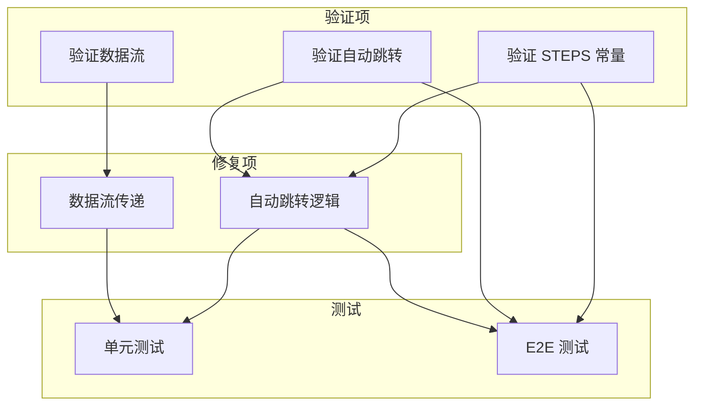
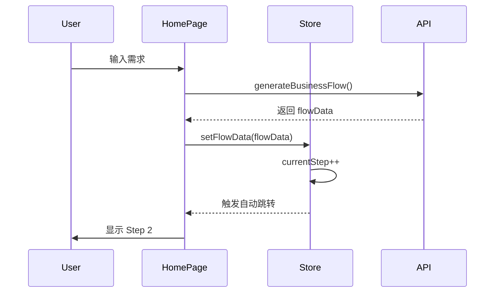

# 首页三步流程验证与修复架构设计

**项目**: vibex-homepage-flow-verify  
**架构师**: Architect Agent  
**日期**: 2026-03-18  
**状态**: ✅ 设计完成

---

## 一、技术栈

| 技术 | 用途 |
|------|------|
| React 18.x | UI 框架 |
| Zustand 4.x | 状态管理 |
| Jest | 单元测试 |
| Playwright | E2E 测试 |

---

## 二、架构图

### 2.1 验证与修复架构



### 2.2 数据流设计



---

## 三、修复方案

### 3.1 自动跳转逻辑

```typescript
// hooks/useHomePage.ts

// 自动跳转 useEffect
useEffect(() => {
  // Step 1 完成后自动跳转 Step 2
  if (currentStep === 1 && flowData) {
    const timer = setTimeout(() => {
      setCurrentStep(2);
    }, 1500); // 1.5秒后跳转
    return () => clearTimeout(timer);
  }
  
  // Step 2 完成后自动跳转 Step 3
  if (currentStep === 2 && pageStructureData) {
    const timer = setTimeout(() => {
      setCurrentStep(3);
    }, 1500);
    return () => clearTimeout(timer);
  }
}, [currentStep, flowData, pageStructureData]);
```

### 3.2 数据流传递

```typescript
// hooks/useHomePage.ts

// 扩展状态
interface HomePageState {
  // Step 1 数据
  flowData: FlowData | null;
  flowMermaidCode: string;
  
  // Step 2 数据
  pageStructureData: PageStructureData | null;
  pageStructureMermaid: string;
  
  // Step 3 数据
  selectedComponents: string[];
  createdProject: Project | null;
}

// 数据保存 actions
const setFlowData = (data: FlowData) => {
  set({ flowData: data, flowMermaidCode: data.mermaidCode });
};

const setPageStructureData = (data: PageStructureData) => {
  set({ 
    pageStructureData: data, 
    pageStructureMermaid: data.mermaidCode 
  });
};
```

### 3.3 按钮状态管理

```typescript
// 按钮状态配置
const buttonStates = {
  1: { 
    label: '🚀 分析业务流程', 
    disabled: !requirementText.trim(),
    loading: isGenerating 
  },
  2: { 
    label: '🔍 分析页面结构', 
    disabled: !flowData,
    loading: isGenerating 
  },
  3: { 
    label: '💼 创建项目', 
    disabled: !pageStructureData,
    loading: isCreating 
  },
};
```

---

## 四、测试策略

### 4.1 单元测试

```typescript
describe('三步流程', () => {
  it('STEPS 应为3个元素', () => {
    expect(STEPS.length).toBe(3);
  });
  
  it('Step 1 标签正确', () => {
    expect(STEPS[0].label).toBe('业务流程分析');
  });
  
  it('自动跳转逻辑触发', () => {
    const { result } = renderHook(() => useHomePage());
    
    act(() => {
      result.current.setFlowData(mockFlowData);
    });
    
    // 验证状态更新
    expect(result.current.flowData).toEqual(mockFlowData);
  });
});
```

### 4.2 E2E 测试

```typescript
// e2e/three-step-flow.spec.ts

test('完整三步流程', async ({ page }) => {
  // Step 1
  await page.fill('[data-testid=requirement-input]', '测试需求');
  await page.click('[data-testid=generate-flow]');
  await page.waitForSelector('[data-testid=flow-preview]');
  
  // 验证自动跳转
  await page.waitForSelector('[data-testid=step-2]', { timeout: 2000 });
  
  // Step 2
  await page.click('[data-testid=generate-structure]');
  await page.waitForSelector('[data-testid=structure-preview]');
  
  // 验证自动跳转
  await page.waitForSelector('[data-testid=step-3]', { timeout: 2000 });
  
  // Step 3
  await page.click('[data-testid=create-project]');
  await page.waitForSelector('[data-testid=project-success]');
});
```

---

## 五、验收标准

| ID | 验收标准 | 验证 |
|----|----------|------|
| ARCH-001 | STEPS.length === 3 | 单元测试 |
| ARCH-002 | 自动跳转 useEffect 存在 | 代码检查 |
| ARCH-003 | 数据流状态完整 | 功能测试 |
| ARCH-004 | 按钮状态正确 | E2E 测试 |

---

## 六、实施计划

```mermaid
gantt
    title 修复实施计划
    dateFormat  HH:mm
    section Day 1
    验证 STEPS 常量      :a1, 08:00, 1h
    实现自动跳转        :a2, after a1, 2h
    section Day 2
    完善数据流          :b1, 08:00, 2h
    单元测试            :b2, after b1, 2h
    section Day 3
    E2E 测试            :c1, 08:00, 4h
```



---

## 七、产出物

| 文件 | 位置 |
|------|------|
| 架构文档 | `docs/vibex-homepage-flow-verify/architecture.md` |

---

**完成时间**: 2026-03-18 06:09  
**架构师**: Architect Agent