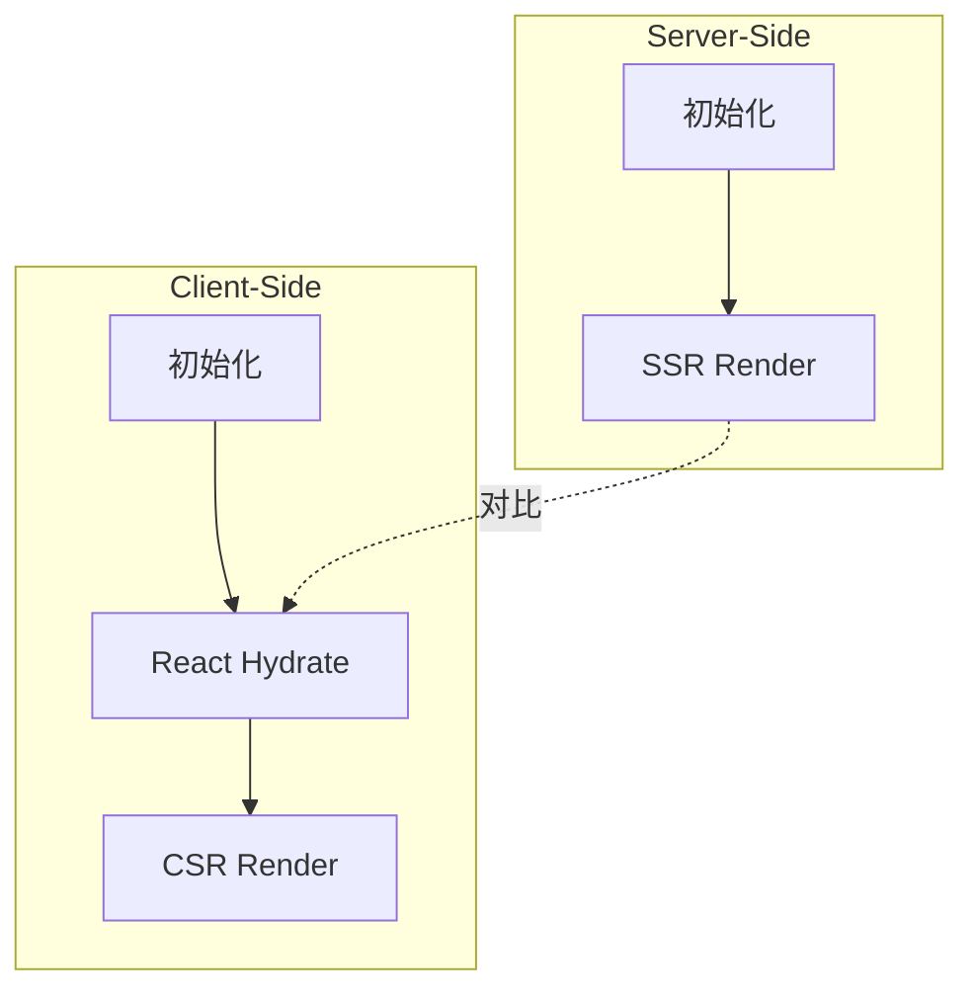

# Architecture: 首页 Hydration 错误修复

**项目**: vibex-homepage-hydration-fix  
**版本**: 1.0  
**架构师**: Architect  
**日期**: 2026-03-19

---

## 1. 问题概述

修复首页 React Error #310 Hydration mismatch 问题。

---

## 2. 根因分析

```
Hydration failed because the initial UI does not match what was rendered on the server.
```

常见原因：
- 服务端和客户端渲染内容不同
- 使用了浏览器特定对象 (window, document)
- 条件渲染基于客户端状态
- 时间相关的数据差异

---

## 3. 修复模式

| 模式 | 修复方案 |
|------|----------|
| 时间戳 | useEffect 初始化 |
| 随机数 | useState + useEffect |
| 浏览器 API | typeof window 检查 |
| 条件内容 | suppressHydrationWarning |

---

## 4. 架构图



---

## 5. 修复要点

```typescript
// 延迟客户端初始化
const [data, setData] = useState(null);

useEffect(() => {
  // 客户端初始化
  setData(computeClientSideData());
}, []);

// 或使用 suppressHydrationWarning
<div suppressHydrationWarning>{clientOnlyContent}</div>
```

---

## 6. 验收标准

| 标准 | 验证方式 |
|------|----------|
| 无 Hydration 警告 | DevTools Console |
| 页面加载无闪烁 | 视觉检查 |
| 服务端渲染正常 | curl 检查 HTML |

---

## 7. 工作量

**1天**

---

*Architecture - 2026-03-19*
