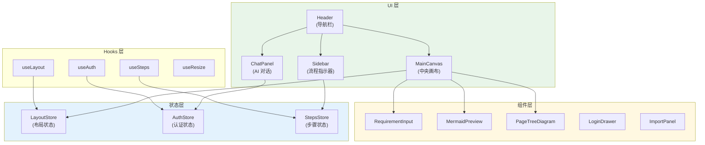
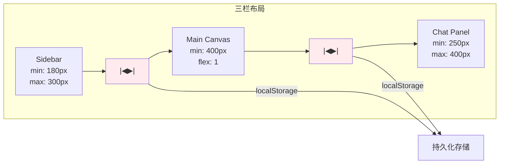
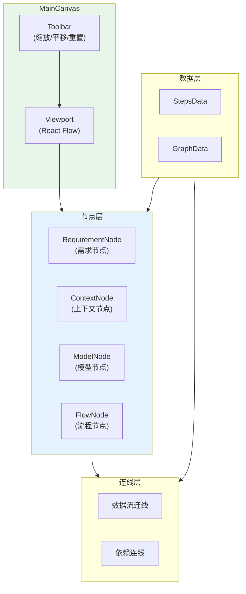
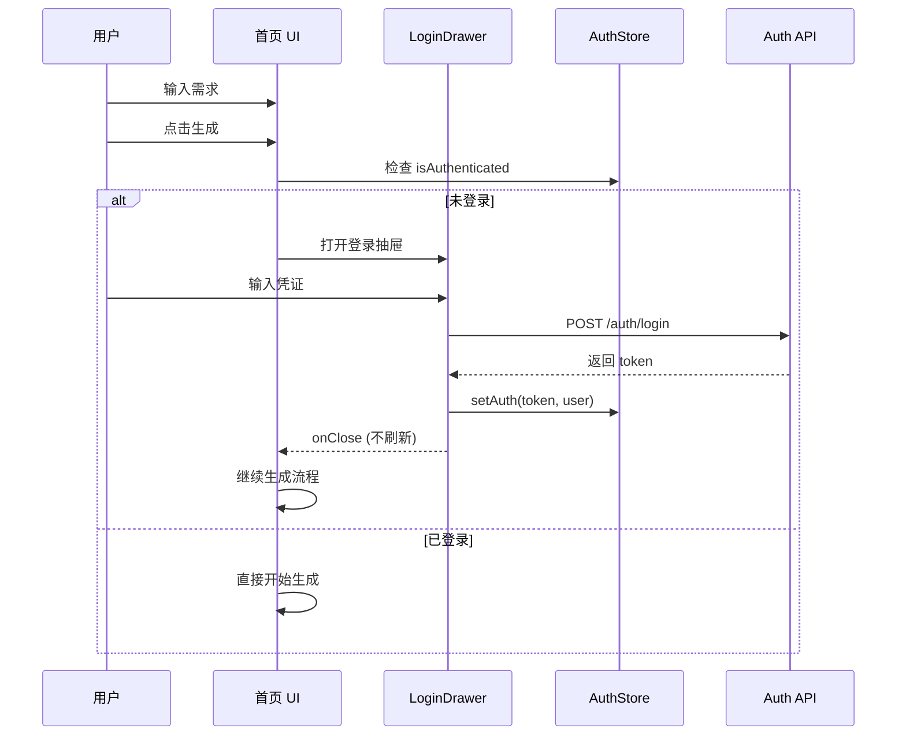

# 架构设计: VibeX 首页改进

**项目**: vibex-homepage-improvements  
**架构师**: Architect Agent  
**版本**: 1.0  
**日期**: 2026-03-14

---

## 1. 技术栈

| 技术 | 版本 | 用途 | 选择理由 |
|------|------|------|----------|
| React | 19.x | UI 框架 | 已有项目基础 |
| React Flow | 11.x | 画布引擎 | 已安装，功能丰富 |
| Zustand | 4.x | 状态管理 | 已有项目基础 |
| react-resizable-panels | 2.x | 布局调整 | 轻量、支持持久化 |
| TypeScript | 5.x | 类型系统 | 已有项目基础 |

---

## 2. 架构图

### 2.1 整体架构



### 2.2 三栏可调整布局



### 2.3 画布展示架构



### 2.4 登录状态流



---

## 3. API 定义

### 3.1 布局状态 API

```typescript
// stores/layout-store.ts

interface LayoutState {
  // 三栏比例
  sidebarWidth: number    // 默认 15%
  chatWidth: number       // 默认 25%
  
  // 操作方法
  setSidebarWidth: (width: number) => void
  setChatWidth: (width: number) => void
  resetLayout: () => void
  
  // 持久化
  persist: () => void
  restore: () => void
}

// 约束
const LAYOUT_CONSTRAINTS = {
  sidebar: { min: 180, max: 300 },
  chat: { min: 250, max: 400 },
  main: { min: 400 },
}

// Hook
export function useLayout() {
  const store = useLayoutStore()
  
  const handleResize = useCallback((panel: 'sidebar' | 'chat', width: number) => {
    const constraints = LAYOUT_CONSTRAINTS[panel]
    const clampedWidth = Math.max(constraints.min, Math.min(constraints.max, width))
    
    if (panel === 'sidebar') {
      store.setSidebarWidth(clampedWidth)
    } else {
      store.setChatWidth(clampedWidth)
    }
    
    store.persist()
  }, [store])
  
  return {
    ...store,
    handleResize,
  }
}
```

### 3.2 步骤状态 API

```typescript
// stores/steps-store.ts

interface StepsState {
  currentStep: number      // 1-5
  completedSteps: Set<number>
  
  // 每步数据
  stepData: {
    1: { requirement: string }
    2: { contexts: BoundedContext[] }
    3: { models: DomainModel[] }
    4: { flows: BusinessFlow[] }
    5: { pages: Page[]; components: Component[] }
  }
  
  // 操作
  setStep: (step: number) => void
  completeStep: (step: number) => void
  updateStepData: <K extends keyof StepsState['stepData']>(
    step: K, 
    data: Partial<StepsState['stepData'][K]>
  ) => void
  reset: () => void
}

const STEPS = [
  { id: 1, label: '需求输入', description: '描述你的产品需求' },
  { id: 2, label: '限界上下文', description: 'AI 生成的上下文划分' },
  { id: 3, label: '领域模型', description: '核心实体和关系' },
  { id: 4, label: '业务流程', description: '关键业务场景' },
  { id: 5, label: '项目创建', description: '页面和组件结构' },
] as const
```

### 3.3 示例交互 API

```typescript
// hooks/use-sample-interaction.ts

interface SampleInteractionOptions {
  onApply?: (sample: SampleRequirement) => void
  scrollToInput?: boolean
  highlightDuration?: number
}

interface SampleRequirement {
  title: string
  desc: string
  category: string
}

export function useSampleInteraction(options?: SampleInteractionOptions) {
  const [appliedSample, setAppliedSample] = useState<string | null>(null)
  const inputRef = useRef<HTMLTextAreaElement>(null)
  
  const applySample = useCallback((sample: SampleRequirement) => {
    // 1. 设置应用标记
    setAppliedSample(sample.title)
    
    // 2. 滚动到输入框
    if (options?.scrollToInput) {
      inputRef.current?.scrollIntoView({ behavior: 'smooth', block: 'center' })
    }
    
    // 3. 触发回调
    options?.onApply?.(sample)
    
    // 4. 清除高亮
    setTimeout(() => {
      setAppliedSample(null)
    }, options?.highlightDuration ?? 2000)
  }, [options])
  
  return {
    appliedSample,
    inputRef,
    applySample,
  }
}
```

### 3.4 登录状态 API

```typescript
// stores/auth-store.ts

interface AuthState {
  isAuthenticated: boolean
  user: User | null
  token: string | null
  
  // 操作
  login: (credentials: Credentials) => Promise<void>
  logout: () => void
  checkAuth: () => Promise<void>
}

// 扩展 LoginDrawer
interface LoginDrawerProps {
  isOpen: boolean
  onClose: () => void
  onSuccess: (user: User) => void  // 改为传递用户信息，不刷新
  mode?: 'login' | 'register'
}

// 首页集成
const handleLoginSuccess = useCallback((user: User) => {
  setIsLoginDrawerOpen(false)
  authStore.login(user)
  // 不刷新页面，继续之前的操作
  // window.location.reload() // 移除
}, [])
```

---

## 4. 数据模型

### 4.1 布局模型

```typescript
// types/layout.ts

interface LayoutConfig {
  sidebar: {
    width: number      // 像素值
    collapsed: boolean
  }
  main: {
    width: number      // flex-1
    view: 'input' | 'preview' | 'canvas'
  }
  chat: {
    width: number
    collapsed: boolean
  }
}

// localStorage key
const LAYOUT_STORAGE_KEY = 'vibex-layout-config'

// 默认值
const DEFAULT_LAYOUT: LayoutConfig = {
  sidebar: { width: 220, collapsed: false },
  main: { width: 0, view: 'input' },
  chat: { width: 320, collapsed: false },
}
```

### 4.2 画布节点模型

```typescript
// types/canvas-node.ts

interface CanvasNode {
  id: string
  type: 'requirement' | 'context' | 'model' | 'flow' | 'page'
  position: { x: number; y: number }
  data: {
    label: string
    description?: string
    status: 'pending' | 'generating' | 'complete' | 'error'
    metadata?: Record<string, unknown>
  }
}

interface CanvasEdge {
  id: string
  source: string
  target: string
  type: 'data' | 'dependency'
  animated?: boolean
}

interface CanvasData {
  nodes: CanvasNode[]
  edges: CanvasEdge[]
  viewport: { x: number; y: number; zoom: number }
}
```

### 4.3 步骤数据模型

```typescript
// types/step-data.ts

interface Step1Data {
  requirement: string
  source: 'manual' | 'sample' | 'github' | 'figma'
}

interface Step2Data {
  contexts: BoundedContext[]
  mermaidCode: string
}

interface Step3Data {
  models: DomainModel[]
  mermaidCode: string
}

interface Step4Data {
  flows: BusinessFlow[]
  mermaidCode: string
}

interface Step5Data {
  pages: Page[]
  components: Component[]
  treeData: PageTreeNode[]
}

type AllStepsData = {
  1: Step1Data
  2: Step2Data
  3: Step3Data
  4: Step4Data
  5: Step5Data
}
```

---

## 5. 模块划分

### 5.1 文件结构

```
src/
├── app/
│   └── page.tsx                    # 首页主文件 (重构)
│
├── components/home/
│   ├── HomeLayout.tsx              # 三栏布局容器
│   ├── HomeLayout.module.css
│   ├── ResizablePanel.tsx          # 可调整面板
│   ├── Sidebar.tsx                 # 流程指示器
│   ├── MainCanvas.tsx              # 中央画布
│   ├── ChatPanel.tsx               # AI 对话面板
│   ├── Header.tsx                  # 顶部导航
│   └── index.ts
│
├── components/canvas/
│   ├── CanvasContainer.tsx         # React Flow 容器
│   ├── nodes/
│   │   ├── RequirementNode.tsx
│   │   ├── ContextNode.tsx
│   │   ├── ModelNode.tsx
│   │   └── FlowNode.tsx
│   ├── edges/
│   │   ├── DataEdge.tsx
│   │   └── DependencyEdge.tsx
│   └── index.ts
│
├── components/steps/
│   ├── StepTitle.tsx               # 步骤标题 (修复重复)
│   ├── SampleButtons.tsx           # 示例按钮 (优化交互)
│   ├── ImportPanel.tsx             # 导入面板
│   └── index.ts
│
├── stores/
│   ├── layout-store.ts             # 布局状态
│   ├── steps-store.ts              # 步骤状态
│   └── auth-store.ts               # 认证状态
│
├── hooks/
│   ├── use-layout.ts
│   ├── use-steps.ts
│   ├── use-sample-interaction.ts
│   └── use-resize.ts
│
└── types/
    ├── layout.ts
    ├── canvas-node.ts
    └── step-data.ts
```

### 5.2 模块职责

| 模块 | 职责 | 对应需求 |
|------|------|---------|
| HomeLayout | 三栏可调整布局 | #5 |
| ResizablePanel | 拖拽分隔条 | #5 |
| MainCanvas | 画布展示 | #1 |
| CanvasContainer | React Flow 封装 | #1 |
| StepTitle | 步骤标题组件 | #2 |
| SampleButtons | 示例按钮交互 | #6 |
| layout-store | 布局状态管理 | #5 |
| steps-store | 步骤数据管理 | 全流程 |

---

## 6. 核心实现

### 6.1 三栏可调整布局

```typescript
// components/home/HomeLayout.tsx

import { Panel, PanelGroup, PanelResizeHandle } from 'react-resizable-panels'
import { useLayout } from '@/hooks/use-layout'
import styles from './HomeLayout.module.css'

export function HomeLayout({ children }: { children: React.ReactNode }) {
  const { sidebarWidth, chatWidth, handleResize } = useLayout()
  
  return (
    <PanelGroup direction="horizontal" className={styles.container}>
      {/* 左侧边栏 */}
      <Panel
        defaultSize={15}
        minSize={10}
        maxSize={20}
        onResize={(size) => handleResize('sidebar', size)}
      >
        <Sidebar />
      </Panel>
      
      {/* 分隔条 */}
      <PanelResizeHandle className={styles.resizeHandle} />
      
      {/* 中央画布 */}
      <Panel defaultSize={60} minSize={40}>
        <MainCanvas />
      </Panel>
      
      {/* 分隔条 */}
      <PanelResizeHandle className={styles.resizeHandle} />
      
      {/* 右侧对话 */}
      <Panel
        defaultSize={25}
        minSize={15}
        maxSize={35}
        onResize={(size) => handleResize('chat', size)}
      >
        <ChatPanel />
      </Panel>
    </PanelGroup>
  )
}

// 样式
/* HomeLayout.module.css */
.container {
  height: 100vh;
  width: 100%;
}

.resizeHandle {
  width: 4px;
  background: rgba(255, 255, 255, 0.1);
  cursor: col-resize;
  transition: background 0.2s;
}

.resizeHandle:hover {
  background: rgba(59, 130, 246, 0.5);
}
```

### 6.2 示例按钮交互优化

```typescript
// components/steps/SampleButtons.tsx

import { useState, useRef } from 'react'
import { useSampleInteraction } from '@/hooks/use-sample-interaction'
import styles from './SampleButtons.module.css'

const SAMPLES = [
  { title: '电商平台', desc: '开发一个电商平台，支持商品管理、订单处理和用户系统', category: 'ecommerce' },
  { title: '博客系统', desc: '开发一个博客系统，支持文章发布、评论和用户管理', category: 'content' },
  { title: '任务管理', desc: '开发一个任务管理工具，支持看板视图、任务分配和进度追踪', category: 'productivity' },
]

export function SampleButtons({ onApply }: { onApply: (text: string) => void }) {
  const { appliedSample, inputRef, applySample } = useSampleInteraction({
    onApply: (sample) => onApply(sample.desc),
    scrollToInput: true,
    highlightDuration: 2000,
  })
  
  return (
    <div className={styles.container}>
      <span className={styles.label}>试试这些示例：</span>
      <div className={styles.list}>
        {SAMPLES.map((sample) => (
          <button
            key={sample.title}
            className={`${styles.button} ${appliedSample === sample.title ? styles.active : ''}`}
            onClick={() => applySample(sample)}
          >
            {sample.title}
            {appliedSample === sample.title && (
              <span className={styles.check}>✓</span>
            )}
          </button>
        ))}
      </div>
      <button 
        className={styles.clearBtn}
        onClick={() => onApply('')}
      >
        清空
      </button>
    </div>
  )
}

/* SampleButtons.module.css */
.button {
  padding: 8px 16px;
  border-radius: 20px;
  background: rgba(255, 255, 255, 0.1);
  border: 1px solid rgba(255, 255, 255, 0.2);
  color: #fff;
  cursor: pointer;
  transition: all 0.2s;
}

.button:hover {
  background: rgba(255, 255, 255, 0.2);
}

.button.active {
  background: rgba(59, 130, 246, 0.3);
  border-color: #3b82f6;
}

.check {
  margin-left: 4px;
  color: #3b82f6;
}
```

### 6.3 步骤标题修复

```typescript
// components/steps/StepTitle.tsx

import { STEPS } from '@/constants/steps'
import styles from './StepTitle.module.css'

interface StepTitleProps {
  step: number
}

const STEP_DESCRIPTIONS: Record<number, string> = {
  1: '描述你的产品需求，AI 将协助你完成完整的设计',
  2: 'AI 正在分析你的需求，划分业务边界',
  3: '识别核心领域实体和它们的关系',
  4: '梳理关键业务场景和流程',
  5: '生成项目结构和代码骨架',
}

export function StepTitle({ step }: StepTitleProps) {
  const stepInfo = STEPS.find(s => s.id === step)
  
  return (
    <div className={styles.container}>
      {/* 不显示 "Step N: xxx"，只显示描述 */}
      <h1 className={styles.title}>
        {STEP_DESCRIPTIONS[step]}
      </h1>
      <p className={styles.hint}>
        当前阶段：{stepInfo?.label}
      </p>
    </div>
  )
}
```

### 6.4 登录无缝切换

```typescript
// app/page.tsx (修改部分)

import { useAuthStore } from '@/stores/auth-store'

export default function HomePage() {
  const { isAuthenticated } = useAuthStore()
  const [pendingAction, setPendingAction] = useState<(() => void) | null>(null)
  
  const handleGenerate = useCallback(() => {
    if (!isAuthenticated) {
      // 保存待执行的操作
      setPendingAction(() => () => generateContexts(requirementText))
      setIsLoginDrawerOpen(true)
      return
    }
    
    generateContexts(requirementText)
  }, [isAuthenticated, requirementText])
  
  const handleLoginSuccess = useCallback((user: User) => {
    setIsLoginDrawerOpen(false)
    // 不刷新页面
    useAuthStore.getState().setUser(user)
    
    // 执行之前保存的操作
    if (pendingAction) {
      pendingAction()
      setPendingAction(null)
    }
  }, [pendingAction])
  
  return (
    <>
      {/* ... */}
      <LoginDrawer
        isOpen={isLoginDrawerOpen}
        onClose={() => setIsLoginDrawerOpen(false)}
        onSuccess={handleLoginSuccess}
      />
    </>
  )
}
```

---

## 7. 修复清单

### 7.1 #4 修复 design 404

```typescript
// app/page.tsx (修改导航链接)

// 之前
<Link href="/design" className={styles.navLink}>
  设计
</Link>

// 之后
<Link href="/confirm" className={styles.navLink}>
  设计
</Link>
```

### 7.2 #2 Step 标题重复

```typescript
// 移除重复的 "Step N:" 前缀
// 只保留描述性标题
```

### 7.3 #3 移除重复诊断

```typescript
// 检查 RequirementInput 是否已集成诊断功能
// 如果是，移除独立的 DiagnosisPanel
```

---

## 8. 测试策略

### 8.1 单元测试

```typescript
// __tests__/hooks/use-layout.test.ts
describe('useLayout', () => {
  it('persists layout to localStorage', () => {
    const { result } = renderHook(() => useLayout())
    
    act(() => {
      result.current.handleResize('sidebar', 250)
    })
    
    const saved = localStorage.getItem('vibex-layout-config')
    expect(saved).toContain('250')
  })
  
  it('enforces min/max constraints', () => {
    const { result } = renderHook(() => useLayout())
    
    act(() => {
      result.current.handleResize('sidebar', 50) // 低于 min
    })
    
    expect(result.current.sidebarWidth).toBe(180) // min 值
  })
})

// __tests__/components/SampleButtons.test.tsx
describe('SampleButtons', () => {
  it('applies sample on click', () => {
    const onApply = jest.fn()
    render(<SampleButtons onApply={onApply} />)
    
    fireEvent.click(screen.getByText('电商平台'))
    
    expect(onApply).toHaveBeenCalledWith(expect.stringContaining('电商平台'))
  })
})
```

### 8.2 集成测试

```typescript
// __tests__/integration/home-flow.test.tsx
describe('Home Page Flow', () => {
  it('completes 5-step flow', async () => {
    render(<HomePage />)
    
    // Step 1: 输入需求
    await userEvent.type(screen.getByRole('textbox'), '开发一个博客系统')
    await userEvent.click(screen.getByText('开始设计'))
    
    // Step 2: 等待上下文生成
    await waitFor(() => {
      expect(screen.getByText('限界上下文')).toBeInTheDocument()
    })
    
    // ... 继续其他步骤
  })
  
  it('shows login drawer for guest', async () => {
    // Mock 未登录状态
    useAuthStore.setState({ isAuthenticated: false })
    
    render(<HomePage />)
    
    await userEvent.type(screen.getByRole('textbox'), 'test')
    await userEvent.click(screen.getByText('开始设计'))
    
    expect(screen.getByText('登录')).toBeInTheDocument()
  })
})
```

### 8.3 覆盖率目标

| 模块 | 覆盖率目标 |
|------|-----------|
| useLayout | 90% |
| useSteps | 85% |
| SampleButtons | 80% |
| HomeLayout | 75% |
| StepTitle | 80% |

---

## 9. 实施计划

| 阶段 | 内容 | 需求 | 工时 |
|------|------|------|------|
| Phase 1 | Bug 修复 | #4, #2, #3 | 2h |
| Phase 2 | 示例交互优化 | #6 | 2h |
| Phase 3 | 布局可调整 | #5 | 4h |
| Phase 4 | 登录无缝切换 | #10 | 3h |
| Phase 5 | 中央画布 | #1 | 6h |
| Phase 6 | 关系图 | #7 | 8h |
| Phase 7 | 导入优化 | #8 | 6h |
| Phase 8 | 游客模式 | #9 | 4h |
| Phase 9 | 测试覆盖 | #11 | 8h |

**总计**: 43h

---

## 10. 风险评估

| 风险 | 概率 | 影响 | 缓解措施 |
|------|------|------|----------|
| react-resizable-panels 兼容性 | 低 | 中 | 备用自定义实现 |
| React Flow 性能 | 中 | 中 | 虚拟化节点，限制数量 |
| 登录状态同步 | 低 | 高 | Zustand 统一管理 |
| 响应式布局影响 | 中 | 低 | 设置最小宽度，移动端禁用拖拽 |

---

## 11. 检查清单

- [x] 技术栈选型 (React Flow + react-resizable-panels)
- [x] 架构图 (整体架构 + 布局 + 画布)
- [x] API 定义 (布局 + 步骤 + 登录)
- [x] 数据模型 (布局 + 节点 + 步骤)
- [x] 核心实现 (三栏布局 + 示例交互 + 登录切换)
- [x] 修复清单 (#4, #2, #3)
- [x] 测试策略 (单元 + 集成)
- [x] 实施计划
- [x] 风险评估

---

**产出物**: `/root/.openclaw/vibex/docs/vibex-homepage-improvements/architecture.md`