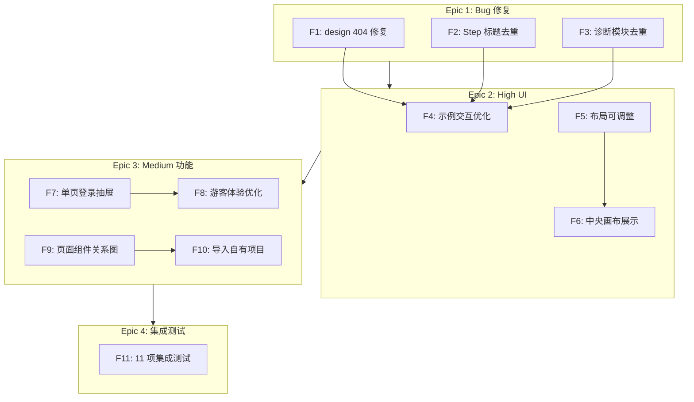
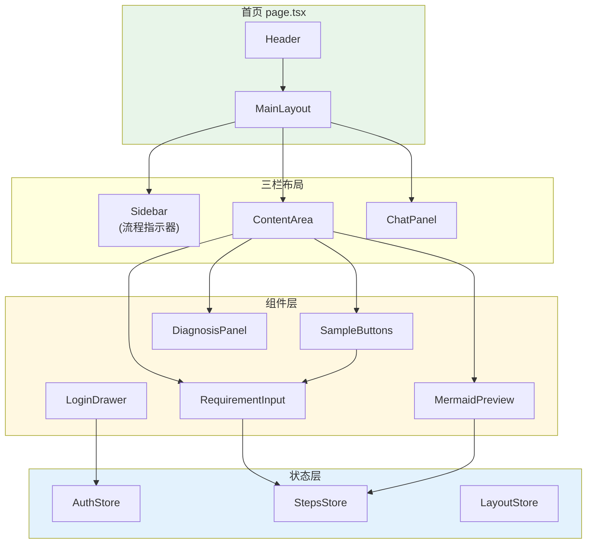
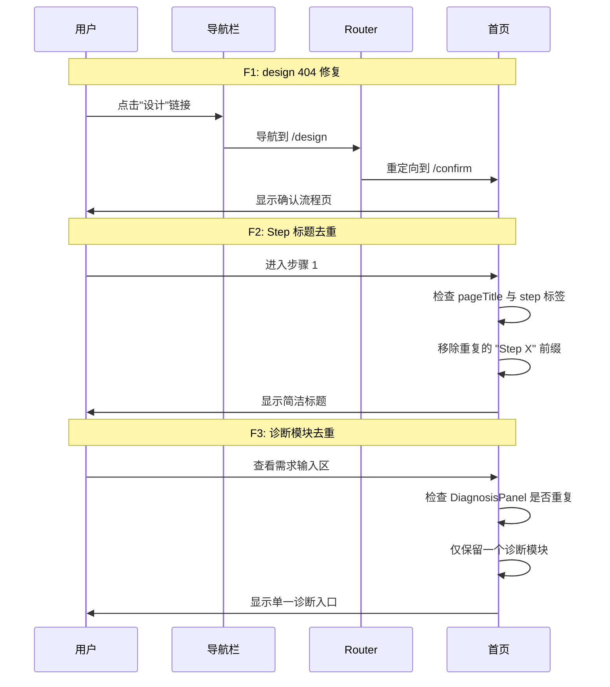

# 架构设计: 首页迭代优化

**项目**: vibex-homepage-iteration  
**架构师**: Architect Agent  
**版本**: 1.0  
**日期**: 2026-03-14

---

## 1. 技术栈

| 技术 | 版本 | 用途 | 选择理由 |
|------|------|------|----------|
| React | 19.x | UI 框架 | 已有项目基础 |
| TypeScript | 5.x | 类型系统 | 已有项目基础 |
| Zustand | 4.x | 状态管理 | 已有项目基础，支持持久化 |
| Jest + RTL | 29.x | 单元测试 | 已有项目基础 |
| Playwright | 1.x | E2E 测试 | 已有项目基础 |
| MSW | 2.x | API Mock | 推荐，支持 SSE Mock |
| CSS Modules | 现有 | 样式方案 | 复用现有 |

**依赖检查**:
- ✅ Zustand 已安装
- ✅ Playwright 已配置
- ✅ Jest + RTL 已配置
- ⚠️ MSW 需安装或使用 Playwright route mock

---

## 2. 架构图

### 2.1 任务依赖关系



### 2.2 组件交互架构



### 2.3 Bug 修复流程



### 2.4 集成测试架构

```mermaid
flowchart LR
    subgraph Tests["E2E 测试层"]
        IT001["IT-001: 示例点击"]
        IT002["IT-002: 开始设计"]
        IT003["IT-003: 步骤导航"]
        IT004["IT-004: 领域模型"]
        IT005["IT-005: 业务流程"]
        IT006["IT-006: 项目创建"]
        IT007["IT-007: 登录抽屉"]
        IT008["IT-008: Plan/Build"]
        IT009["IT-009: GitHub 导入"]
        IT010["IT-010: Figma 导入"]
        IT011["IT-011: AI 快捷回复"]
    end
    
    subgraph Mock["Mock 层"]
        MSW["MSW / Playwright Route"]
        AuthMock["Auth Mock"]
        APIMock["API Mock"]
        SSEMock["SSE Mock"]
    end
    
    subgraph Assertions["断言层"]
        Visible["可见性断言"]
        State["状态断言"]
        Network["网络断言"]
        UI["UI 断言"]
    end
    
    Tests --> Mock
    Mock --> Assertions
    
    style Tests fill:#e8f5e9
    style Mock fill:#fff8e1
    style Assertions fill:#e3f2fd
```



---

## 3. API 定义

### 3.1 示例交互 API (F4)

```typescript
// hooks/use-sample-click.ts

interface SampleClickOptions {
  scrollToInput?: boolean       // 是否滚动到输入框
  highlightDuration?: number    // 高亮持续时间 (ms)
  onApply?: (sample: Sample) => void
}

interface Sample {
  id: string
  title: string
  desc: string
  category: string
}

interface SampleClickResult {
  appliedSample: string | null
  applySample: (sample: Sample) => void
  inputRef: RefObject<HTMLTextAreaElement>
}

export function useSampleClick(options?: SampleClickOptions): SampleClickResult {
  // 实现逻辑：
  // 1. 点击示例后填充输入框
  // 2. 可选滚动到输入框
  // 3. 高亮输入框
  // 4. 触发预览更新
}
```

### 3.2 登录状态 API (F7)

```typescript
// hooks/use-login-drawer.ts

interface UseLoginDrawerOptions {
  onLoginSuccess?: (user: User) => void
  persistState?: boolean
}

interface UseLoginDrawerResult {
  isOpen: boolean
  openDrawer: () => void
  closeDrawer: () => void
  handleLoginSuccess: (user: User) => void
}

export function useLoginDrawer(options?: UseLoginDrawerOptions): UseLoginDrawerResult {
  // 实现逻辑：
  // 1. 管理抽屉开关状态
  // 2. 登录成功后更新 AuthStore
  // 3. 不刷新页面，保持用户操作状态
}

// LoginDrawer 组件扩展
interface LoginDrawerProps {
  isOpen: boolean
  onClose: () => void
  onSuccess: (user: User) => void  // 修改：传递用户而非刷新
  mode?: 'login' | 'register'
  defaultEmail?: string            // 新增：预填邮箱
}
```

### 3.3 集成测试 API (F11)

```typescript
// tests/integration/homepage.spec.ts

import { test, expect } from '@playwright/test';

// Mock 配置
const mockAuth = async (page: Page) => {
  await page.evaluate(() => {
    localStorage.setItem('auth_token', 'mock_token');
    localStorage.setItem('user', JSON.stringify({ id: '1', email: 'test@test.com' }));
  });
};

const mockSSE = async (page: Page) => {
  await page.route('**/api/v1/ddd/**', async (route) => {
    await route.fulfill({
      status: 200,
      contentType: 'text/event-stream',
      body: 'data: {"type":"thinking","content":"分析中..."}\n\n' +
            'data: {"type":"result","content":"完成"}\n\n'
    });
  });
};

// 测试用例定义
const INTEGRATION_TESTS = {
  IT001: {
    name: '示例点击后预览更新',
    priority: 'critical',
    timeout: 10000,
  },
  IT002: {
    name: '开始设计按钮完整流程',
    priority: 'critical',
    timeout: 30000,
  },
  IT003: {
    name: '步骤导航点击验证',
    priority: 'critical',
    timeout: 10000,
  },
  // ... 其他测试
} as const;
```

### 3.4 组件修复 API (F1-F3)

```typescript
// fixes/design-link.ts (F1)

// 修复前
<Link href="/design">设计</Link>

// 修复后
<Link href="/confirm">设计</Link>
// 或使用 Next.js redirect 配置

// fixes/step-title.ts (F2)

interface StepTitleProps {
  step: number
  title: string
}

export function StepTitle({ step, title }: StepTitleProps) {
  // 修复前: <h1>Step {step}: {title}</h1>
  // 修复后: 仅显示描述性标题
  return <h1>{title}</h1>;
}

// fixes/diagnosis-dedup.ts (F3)

export function RequirementSection() {
  // 检查 RequirementInput 是否已包含诊断功能
  const hasIntegratedDiagnosis = checkDiagnosisIntegration();
  
  return (
    <div>
      <RequirementInput />
      {/* 仅在未集成时显示独立诊断模块 */}
      {!hasIntegratedDiagnosis && <DiagnosisPanel />}
    </div>
  );
}
```

---

## 4. 数据模型

### 4.1 测试用例模型

```typescript
// types/test-case.ts

interface IntegrationTestCase {
  id: string                    // IT-001 ~ IT-011
  name: string
  description: string
  priority: 'critical' | 'high' | 'medium'
  category: 'interaction' | 'navigation' | 'api' | 'auth'
  
  // 测试步骤
  steps: TestStep[]
  
  // 预期结果
  assertions: Assertion[]
  
  // Mock 配置
  mockConfig?: MockConfig
  
  // 超时配置
  timeout: number
}

interface TestStep {
  action: 'click' | 'fill' | 'navigate' | 'wait' | 'scroll'
  target: string              // CSS 选择器
  value?: string              // 输入值
  waitFor?: string            // 等待元素
}

interface Assertion {
  type: 'visible' | 'text' | 'value' | 'state' | 'network'
  target: string
  expected: string | boolean | RegExp
}

interface MockConfig {
  auth?: boolean              // 是否 Mock 认证
  api?: string[]               // 需要 Mock 的 API 路径
  sse?: boolean                // 是否 Mock SSE
}
```

### 4.2 首页状态模型

```typescript
// types/homepage-state.ts

interface HomepageState {
  // 步骤状态
  currentStep: 1 | 2 | 3 | 4 | 5
  completedSteps: number[]
  
  // 输入状态
  requirementText: string
  appliedSample: string | null
  
  // UI 状态
  activeTab: 'input' | 'preview'
  isLoginDrawerOpen: boolean
  
  // 生成状态
  isGenerating: boolean
  generationProgress: number
  generationStage: 'requirement' | 'context' | 'model' | 'flow' | 'create'
}

// 状态持久化
interface HomepagePersist {
  requirementText: string
  currentStep: number
  completedSteps: number[]
  lastActiveAt: string
}
```

### 4.3 Bug 修复清单模型

```typescript
// types/bug-fix.ts

interface BugFix {
  id: string                    // F1-F3
  title: string
  description: string
  severity: 'critical' | 'high' | 'medium'
  
  // 修复位置
  files: string[]
  
  // 修复前/后对比
  before: string
  after: string
  
  // 验证方法
  verification: VerificationMethod
}

type VerificationMethod = 
  | { type: 'e2e'; test: string }
  | { type: 'unit'; test: string }
  | { type: 'manual'; steps: string[] }

const BUG_FIXES: BugFix[] = [
  {
    id: 'F1',
    title: '修复 design 404',
    description: '导航栏 /design 链接指向不存在的页面',
    severity: 'critical',
    files: ['app/page.tsx'],
    before: '<Link href="/design">',
    after: '<Link href="/confirm">',
    verification: { type: 'e2e', test: 'IT-design-redirect' }
  },
  {
    id: 'F2',
    title: 'Step 标题去重',
    description: '页面标题与侧边栏 Step 标签重复',
    severity: 'high',
    files: ['app/page.tsx', 'styles/page.module.css'],
    before: '<h1>Step {step}: {title}</h1>',
    after: '<h1>{description}</h1>',
    verification: { type: 'unit', test: 'StepTitle.spec.ts' }
  },
  {
    id: 'F3',
    title: '移除重复诊断模块',
    description: '诊断模块可能存在重复',
    severity: 'medium',
    files: ['app/page.tsx'],
    before: 'DiagnosisPanel 独立显示',
    after: '检查并移除重复',
    verification: { type: 'manual', steps: ['检查页面渲染', '确认单一诊断入口'] }
  }
];
```

---

## 5. 测试策略

### 5.1 测试框架

| 类型 | 框架 | 配置 |
|------|------|------|
| 单元测试 | Jest + RTL | `jest.config.js` |
| E2E 测试 | Playwright | `playwright.config.ts` |
| API Mock | Playwright Route | 或 MSW |

### 5.2 覆盖率要求

| 层级 | 目标 | 范围 |
|------|------|------|
| Bug 修复 | 100% | F1-F3 验证测试 |
| UI 优化 | > 80% | F4-F6 交互测试 |
| Feature | > 70% | F7-F10 功能测试 |
| 集成测试 | 11/11 通过 | IT-001 ~ IT-011 |

### 5.3 核心测试用例

```typescript
// tests/e2e/homepage-iteration.spec.ts

import { test, expect } from '@playwright/test';

test.describe('Bug 修复验证', () => {
  
  test('F1: design 链接重定向到 confirm', async ({ page }) => {
    await page.goto('/');
    await page.click('nav a:has-text("设计")');
    await expect(page).toHaveURL(/\/confirm/);
  });
  
  test('F2: Step 标题不重复', async ({ page }) => {
    await page.goto('/');
    const stepLabels = await page.locator('[data-step-label]').allTextContents();
    const pageTitle = await page.locator('h1').textContent();
    
    // 标题不应包含 "Step X:" 前缀
    expect(pageTitle).not.toMatch(/Step \d+:/);
  });
  
  test('F3: 诊断模块唯一', async ({ page }) => {
    await page.goto('/');
    const diagnosisPanels = await page.locator('[data-testid="diagnosis-panel"]').count();
    expect(diagnosisPanels).toBeLessThanOrEqual(1);
  });
});

test.describe('示例交互 (F4)', () => {
  
  test('IT-001: 示例点击后预览更新', async ({ page }) => {
    await page.goto('/');
    
    // 点击第一个示例
    await page.click('[data-testid="sample-button"]:first-child');
    
    // 验证输入框填充
    const inputValue = await page.locator('textarea').inputValue();
    expect(inputValue.length).toBeGreaterThan(0);
    
    // 验证预览区域显示
    await expect(page.locator('[data-testid="preview-area"]')).toBeVisible();
  });
});

test.describe('登录抽屉 (F7)', () => {
  
  test('IT-007: 未登录时点击生成弹出登录抽屉', async ({ page }) => {
    await page.goto('/');
    
    // 确保未登录
    await page.evaluate(() => localStorage.clear());
    
    // 输入需求
    await page.fill('textarea', '测试需求');
    
    // 点击生成
    await page.click('button:has-text("开始设计")');
    
    // 验证登录抽屉弹出
    await expect(page.locator('[data-testid="login-drawer"]')).toBeVisible();
    
    // 验证未跳转到 /auth
    expect(page.url()).not.toContain('/auth');
  });
});

test.describe('完整生成流程 (IT-002)', () => {
  
  test('已登录用户完整生成流程', async ({ page }) => {
    // Mock 认证
    await page.evaluate(() => {
      localStorage.setItem('auth_token', 'test_token');
      localStorage.setItem('user', JSON.stringify({ id: '1', email: 'test@test.com' }));
    });
    
    // Mock SSE
    await page.route('**/api/v1/ddd/**', async (route) => {
      await route.fulfill({
        status: 200,
        contentType: 'text/event-stream',
        body: 'data: {"type":"complete"}\n\n'
      });
    });
    
    await page.goto('/');
    await page.fill('textarea', '电商平台');
    await page.click('button:has-text("开始设计")');
    
    // 验证步骤推进
    await expect(page.locator('[data-step="2"][class*="active"]')).toBeVisible({ timeout: 30000 });
  });
});
```

### 5.4 测试文件组织

```
tests/
├── e2e/
│   ├── homepage-iteration.spec.ts    # 主测试文件
│   ├── bug-fixes.spec.ts             # Bug 修复验证
│   └── integration/
│       ├── sample-click.spec.ts      # IT-001
│       ├── generate-flow.spec.ts     # IT-002
│       ├── step-navigation.spec.ts   # IT-003
│       └── ...
├── unit/
│   ├── useSampleClick.test.ts        # Hook 单元测试
│   ├── useLoginDrawer.test.ts
│   └── StepTitle.test.tsx
└── mocks/
    ├── auth.mock.ts
    ├── api.mock.ts
    └── sse.mock.ts
```

---

## 6. 实施计划

### 6.1 Phase 1: Bug 修复 (2h)

| 任务 | 工时 | 产出 |
|------|------|------|
| F1: design 404 | 0.5h | 链接修复 |
| F2: Step 标题去重 | 1h | 组件重构 |
| F3: 诊断模块去重 | 0.5h | 条件渲染 |

### 6.2 Phase 2: High UI (8h)

| 任务 | 工时 | 产出 |
|------|------|------|
| F4: 示例交互优化 | 2h | useSampleClick Hook |
| F5: 布局可调整 | 4h | useResize Hook |
| F6: 中央画布展示 | 6h | React Flow 集成 |

### 6.3 Phase 3: Medium 功能 (17h)

| 任务 | 工时 | 产出 |
|------|------|------|
| F7: 单页登录抽屉 | 3h | useLoginDrawer Hook |
| F8: 游客体验优化 | 4h | GuestMode 组件 |
| F9: 页面组件关系图 | 5h | PageTreeDiagram 集成 |
| F10: 导入自有项目 | 5h | ImportFlow 完善 |

### 6.4 Phase 4: 集成测试 (8h)

| 任务 | 工时 | 产出 |
|------|------|------|
| Critical 测试 (IT-001~003) | 4h | 3 个测试用例 |
| High 测试 (IT-004~007) | 3h | 4 个测试用例 |
| Medium 测试 (IT-008~011) | 2h | 4 个测试用例 |

---

## 7. 验收标准

### 7.1 功能验收

- [ ] F1: `/design` 链接重定向到 `/confirm`
- [ ] F2: 页面标题不包含 "Step X:" 前缀
- [ ] F3: 诊断模块仅显示一个
- [ ] F4: 点击示例后输入框填充 + 高亮
- [ ] F7: 未登录点击生成弹出登录抽屉（不跳转）
- [ ] F11: 11 项集成测试全部通过

### 7.2 质量验收

- [ ] 单元测试覆盖率 > 80%
- [ ] E2E 测试通过率 100%
- [ ] 无 console 错误
- [ ] 无 TypeScript 错误

---

## 8. 风险评估

| 风险 | 可能性 | 影响 | 缓解措施 |
|------|--------|------|----------|
| SSE Mock 不完整 | 中 | 高 | 使用真实响应模板 |
| 登录状态 Mock 失败 | 低 | 高 | localStorage 注入 token |
| 布局调整影响响应式 | 中 | 中 | 设置最小宽度，移动端禁用 |
| 测试超时不稳定 | 高 | 中 | 增加重试机制 |

---

*架构设计完成时间: 2026-03-14*  
*Architect Agent*