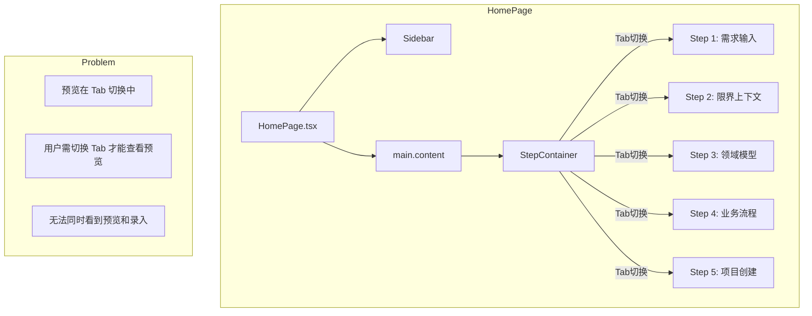
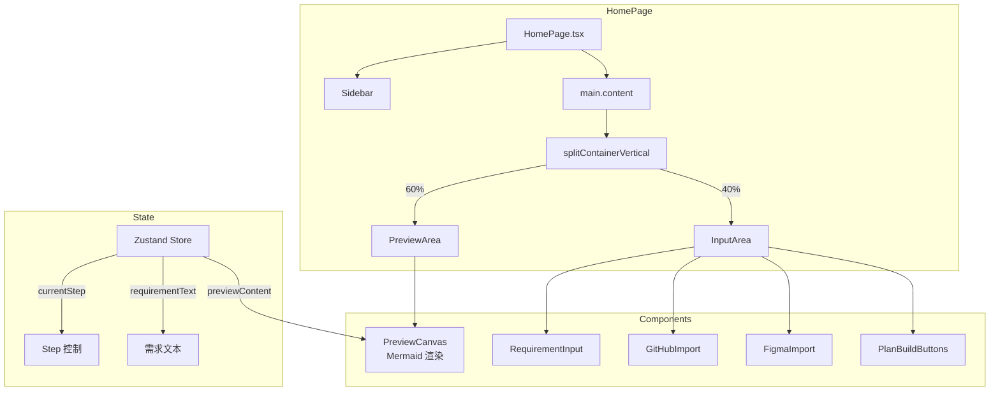
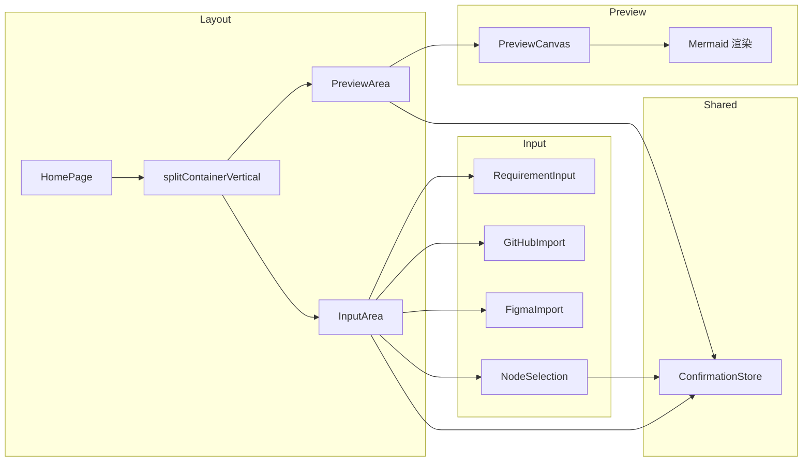

# 首页布局修复架构设计

**项目**: vibex-homepage-layout-fix  
**架构师**: Architect Agent  
**日期**: 2026-03-17  
**状态**: ✅ 设计完成

---

## 一、技术栈

| 技术 | 版本 | 说明 |
|------|------|------|
| Next.js | 14.x | App Router 架构 |
| React | 18.x | 函数组件 + Hooks |
| TypeScript | 5.x | 类型安全 |
| CSS Modules | - | 样式隔离 |
| Zustand | 4.x | 状态管理 |

---

## 二、架构图

### 2.1 当前架构 (问题)



### 2.2 目标架构 (解决方案)



### 2.3 组件依赖关系



---

## 三、核心组件接口定义

### 3.1 PreviewArea 组件

```typescript
// types/homepage.ts
interface PreviewAreaProps {
  /** 预览内容 (Mermaid 代码或渲染结果) */
  content: string;
  /** 加载状态 */
  isLoading?: boolean;
  /** 刷新回调 */
  onRefresh?: () => void;
  /** 面板折叠状态 */
  isCollapsed?: boolean;
  /** 折叠切换回调 */
  onCollapse?: (collapsed: boolean) => void;
}

// 组件签名
export const PreviewArea: React.FC<PreviewAreaProps>;
```

### 3.2 InputArea 组件

```typescript
// types/homepage.ts
interface InputAreaComponentProps {
  /** 当前步骤 (1-5) */
  currentStep: number;
  /** 需求文本 */
  requirementText: string;
  /** 需求变更回调 */
  onRequirementChange: (text: string) => void;
  /** 生成回调 */
  onGenerate: () => void;
  /** 生成领域模型回调 */
  onGenerateDomainModel?: () => void;
  /** 生成业务流程回调 */
  onGenerateBusinessFlow?: () => void;
  /** 创建项目回调 */
  onCreateProject?: () => void;
  /** 生成中状态 */
  isGenerating?: boolean;
  /** 限界上下文列表 */
  boundedContexts?: BoundedContext[];
  /** 领域模型列表 */
  domainModels?: DomainModel[];
  /** 业务流程 */
  businessFlow?: BusinessFlow;
  /** 自定义类名 */
  className?: string;
  /** 面板折叠状态 */
  isCollapsed?: boolean;
  /** 折叠切换回调 */
  onCollapse?: (collapsed: boolean) => void;
}

// 组件签名
export const InputArea: React.FC<InputAreaComponentProps>;
```

### 3.3 SplitContainer 组件

```typescript
// 新增组件
interface SplitContainerVerticalProps {
  /** 子组件 */
  children: React.ReactNode;
  /** 初始分割比例 (默认 [60, 40]) */
  initialRatios?: [number, number];
  /** 最小面板尺寸 (像素) */
  minSizes?: [number, number];
  /** 是否可调整大小 */
  resizable?: boolean;
  /** 分割线位置: top/bottom */
  dividerPosition?: 'middle' | 'top' | 'bottom';
}

// 组件签名
export const SplitContainerVertical: React.FC<SplitContainerVerticalProps>;
```

---

## 四、CSS 样式设计

### 4.1 新增样式类

```css
/* homepage.module.css */

/* 垂直分栏容器 (核心新增) */
.splitContainerVertical {
  display: flex;
  flex-direction: column;
  width: 100%;
  height: 100%;
  gap: 16px;
  overflow: hidden;
}

/* 预览区域 - 60% */
.previewArea {
  flex: 6;  /* 6/10 = 60% */
  min-height: 300px;
  display: flex;
  flex-direction: column;
  background: rgba(0, 0, 0, 0.3);
  border-radius: 12px;
  border: 1px solid rgba(255, 255, 255, 0.1);
  overflow: hidden;
}

/* 录入区域 - 40% */
.inputArea {
  flex: 4;  /* 4/10 = 40% */
  min-height: 200px;
  display: flex;
  flex-direction: column;
  background: rgba(0, 0, 0, 0.3);
  border-radius: 12px;
  border: 1px solid rgba(255, 255, 255, 0.1);
  overflow: hidden;
}

/* 响应式调整 */
@media (max-width: 768px) {
  .splitContainerVertical {
    flex-direction: column;
  }
  
  .previewArea,
  .inputArea {
    flex: none;
    width: 100%;
    min-height: 200px;
  }
}
```

### 4.2 拖拽分隔线 (可选)

```css
/* 如需支持拖拽调整 */
.resizeHandleHorizontal {
  height: 8px;
  background: rgba(255, 255, 255, 0.05);
  cursor: row-resize;
  transition: background 0.2s ease;
  flex-shrink: 0;
}

.resizeHandleHorizontal:hover {
  background: rgba(0, 212, 255, 0.2);
}
```

---

## 五、组件实现方案

### 5.1 HomePage.tsx 改造

```tsx
// 修改前
<main className={styles.content}>
  <StepContainer />
</main>

// 修改后
<main className={styles.content}>
  <div className={styles.splitContainerVertical}>
    <PreviewArea
      content={previewContent}
      isLoading={isGenerating}
      onRefresh={handleRefresh}
    />
    <InputArea
      currentStep={currentStep}
      requirementText={requirementText}
      onRequirementChange={setRequirementText}
      onGenerate={handleGenerate}
      isGenerating={isGenerating}
      // ... 其他 props
    />
  </div>
</main>
```

### 5.2 StepContainer 保留用途

- StepContainer 作为步骤路由器继续存在
- 但不再处理预览/录入的 Tab 切换
- 仅负责步骤导航逻辑

```tsx
// StepContainer 简化后的职责
export function StepContainer() {
  const currentStep = useConfirmationStore((state) => state.currentStep);
  
  // 仅负责步骤导航和状态管理
  return null; // 或者仅渲染步骤指示器
}
```

---

## 六、状态管理

### 6.1 Zustand Store 结构

```typescript
// stores/confirmationStore.ts
interface ConfirmationStore {
  // 当前步骤
  currentStep: number;
  setCurrentStep: (step: number) => void;
  
  // 需求文本
  requirementText: string;
  setRequirementText: (text: string) => void;
  
  // 预览内容
  previewContent: string;
  setPreviewContent: (content: string) => void;
  
  // 生成状态
  isGenerating: boolean;
  setIsGenerating: (generating: boolean) => void;
  
  // ... 其他状态
}
```

---

## 七、测试策略

### 7.1 测试框架

- **Jest**: 单元测试
- **React Testing Library**: 组件测试
- **Playwright**: E2E 测试 (可选)

### 7.2 覆盖率要求

- 目标覆盖率: **> 80%**
- 关键组件: **100%** (PreviewArea, InputArea)

### 7.3 核心测试用例

#### PreviewArea 测试

```typescript
describe('PreviewArea', () => {
  it('should render with content', () => {
    render(<PreviewArea content="graph TD[A-->B]" />);
    expect(screen.getByText('预览')).toBeInTheDocument();
  });
  
  it('should show loading state', () => {
    render(<PreviewArea content="" isLoading={true} />);
    expect(screen.getByText(/加载中/)).toBeInTheDocument();
  });
  
  it('should show placeholder when empty', () => {
    render(<PreviewArea content="" />);
    expect(screen.getByText(/暂无预览/)).toBeInTheDocument();
  });
  
  it('should call onRefresh when refresh button clicked', () => {
    const onRefresh = jest.fn();
    render(<PreviewArea content="" onRefresh={onRefresh} />);
    fireEvent.click(screen.getByRole('button'));
    expect(onRefresh).toHaveBeenCalled();
  });
});
```

#### InputArea 测试

```typescript
describe('InputArea', () => {
  it('should render requirement input', () => {
    render(<InputArea currentStep={1} requirementText="" onRequirementChange={jest.fn()} onGenerate={jest.fn()} />);
    expect(screen.getByLabelText(/描述你的产品需求/)).toBeInTheDocument();
  });
  
  it('should show correct step title', () => {
    render(<InputArea currentStep={2} requirementText="" onRequirementChange={jest.fn()} onGenerate={jest.fn()} />);
    expect(screen.getByText(/限界上下文/)).toBeInTheDocument();
  });
  
  it('should disable generate button when text is empty', () => {
    render(<InputArea currentStep={1} requirementText="" onRequirementChange={jest.fn()} onGenerate={jest.fn()} />);
    expect(screen.getByRole('button', { name: /开始生成/ })).toBeDisabled();
  });
  
  it('should enable generate button when text is provided', () => {
    render(<InputArea currentStep={1} requirementText="test" onRequirementChange={jest.fn()} onGenerate={jest.fn()} />);
    expect(screen.getByRole('button', { name: /开始生成/ })).not.toBeDisabled();
  });
});
```

#### 布局集成测试

```typescript
describe('HomePage Layout', () => {
  it('should render both preview and input areas', () => {
    render(<HomePage />);
    expect(screen.getByText('预览')).toBeInTheDocument();
    expect(screen.getByText('需求录入')).toBeInTheDocument();
  });
  
  it('should have correct layout ratio (60/40)', () => {
    render(<HomePage />);
    const previewArea = screen.getByTestId('preview-area');
    const inputArea = screen.getByTestId('input-area');
    
    // Check flex basis
    expect(previewArea).toHaveStyle({ flex: '6' });
    expect(inputArea).toHaveStyle({ flex: '4' });
  });
});
```

---

## 八、性能考量

### 8.1 懒加载

- 保持 StepContainer 的懒加载机制
- PreviewCanvas 使用动态导入

```typescript
const PreviewCanvas = dynamic(
  () => import('./PreviewCanvas'),
  { loading: () => <PreviewLoading /> }
);
```

### 8.2 状态优化

- 使用 Zustand 的 selector 避免不必要的重渲染
- 对大型数据使用 useMemo 缓存

```typescript
const previewContent = useConfirmationStore(
  useCallback(state => state.previewContent, [])
);
```

### 8.3 CSS 优化

- 使用 `will-change` 优化动画
- 避免强制同步布局

```css
.splitContainerVertical {
  will-change: transform;
  contain: layout;
}
```

---

## 九、迁移计划

### 9.1 阶段一：CSS 添加

1. 添加 `splitContainerVertical` 样式类
2. 验证样式正确性

### 9.2 阶段二：组件集成

1. 修改 HomePage.tsx 引入新的布局
2. 连接 PreviewArea 和 InputArea

### 9.3 阶段三：测试验证

1. 编写单元测试
2. 手动验证布局效果
3. 回归测试现有功能

---

## 十、验收标准

| ID | 验收标准 | 测试方法 |
|----|----------|----------|
| ARCH-001 | PreviewArea 占中央区域 60% | CSS 检查 flex: 6 |
| ARCH-002 | InputArea 占中央区域 40% | CSS 检查 flex: 4 |
| ARCH-003 | 两个区域同时可见 | 视觉验证 |
| ARCH-004 | 响应式布局正常 | 窄屏测试 |
| ARCH-005 | 单元测试覆盖率 > 80% | Jest --coverage |
| ARCH-006 | 无回归问题 | 手动测试 |

---

## 十一、文档产出

- **位置**: `/root/.openclaw/vibex/docs/vibex-homepage-layout-fix/architecture.md`
- **包含**:
  - [x] 技术栈说明
  - [x] 架构图 (Mermaid)
  - [x] API 接口定义
  - [x] 数据模型 (状态管理)
  - [x] 测试策略
  - [x] 性能考量
  - [x] 迁移计划

---

**完成时间**: 2026-03-17 05:34  
**架构师**: Architect Agent