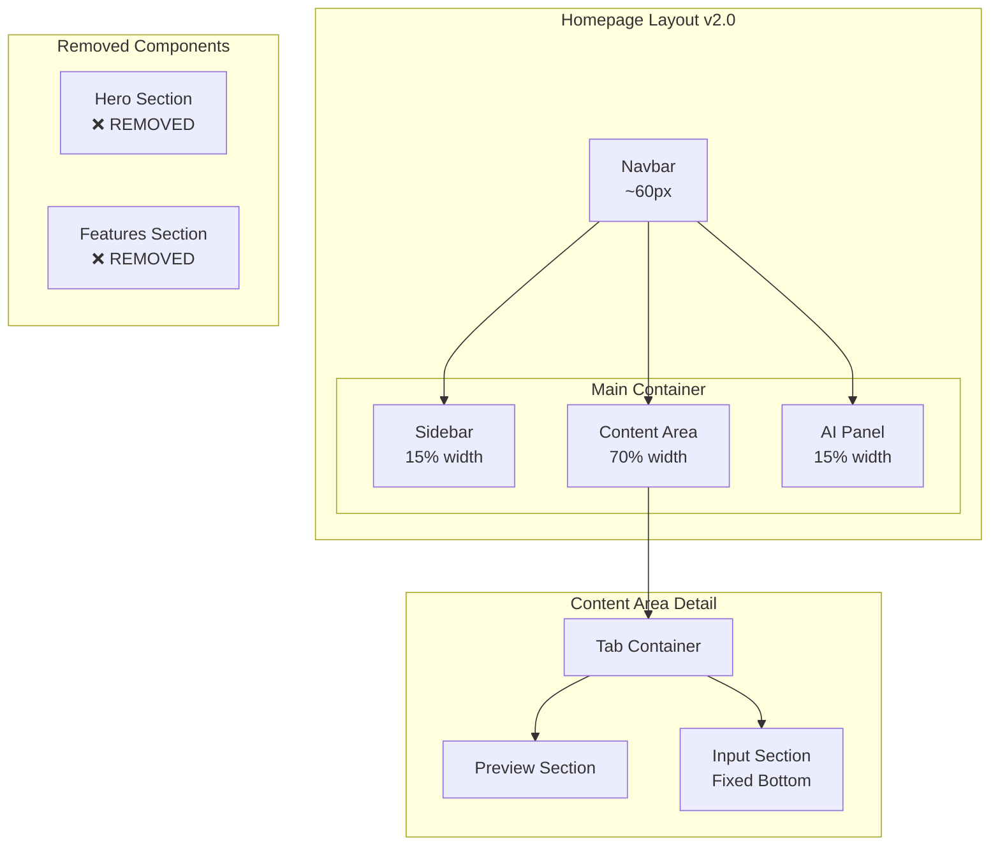
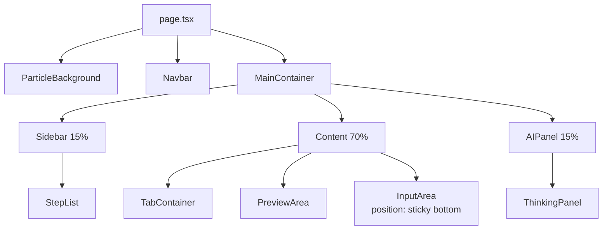
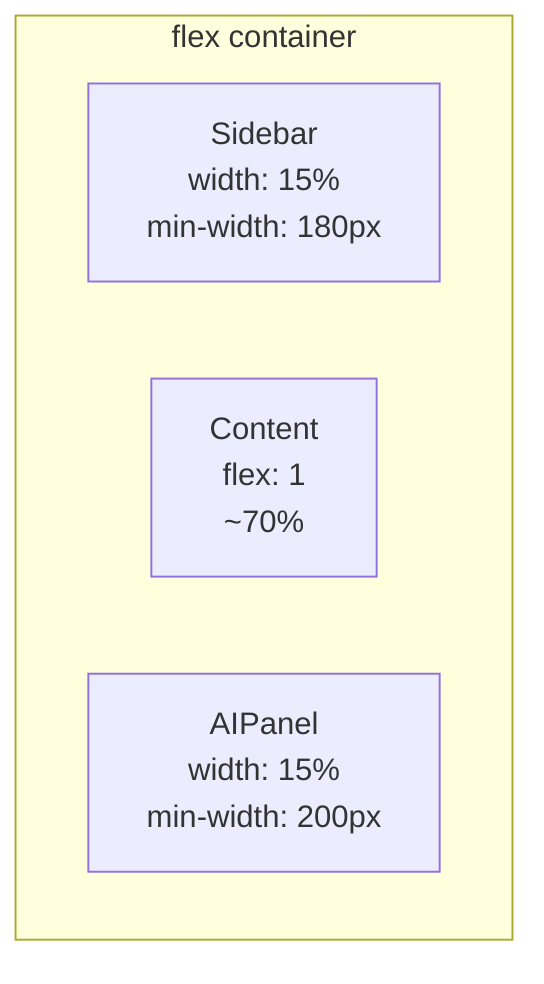

# 架构设计: 首页布局迭代

**项目**: vibex-homepage-layout-iteration  
**版本**: 1.0  
**日期**: 2026-03-16  
**架构师**: Architect Agent  

---

## 1. 技术栈

| 技术 | 版本 | 选择理由 |
|------|------|----------|
| Next.js | 15.x | 现有框架，保持一致性 |
| React | 19.x | 现有框架，保持一致性 |
| CSS Modules | - | 现有方案，局部作用域安全 |
| Jest | 29.x | 单元测试框架 |
| Playwright | 1.x | E2E 测试，布局验证 |

---

## 2. 架构图

### 2.1 目标布局结构 (Mermaid)



### 2.2 组件层级结构



### 2.3 CSS Flexbox 布局



---

## 3. API 定义

本项目为纯前端布局调整，无新增 API。

### 3.1 现有 API 依赖

| API | 用途 | 影响 |
|-----|------|------|
| /api/ddd/bounded-context | 限界上下文生成 | 无影响 |
| /api/ddd/domain-model | 领域模型生成 | 无影响 |
| /api/chat | AI 对话 | 无影响 |

---

## 4. 数据模型

本项目无新增数据模型，仅调整现有 UI 组件布局。

### 4.1 组件状态

```typescript
// 现有状态，无变更
interface PageState {
  activeTab: 'input' | 'preview';
  isGenerating: boolean;
  currentStep: number;
}

// 新增：Input 固定状态
interface InputPosition {
  position: 'sticky';
  bottom: 0;
  zIndex: 10;
}
```

---

## 5. 实施方案

### 5.1 变更清单

| ID | 变更项 | 文件 | 类型 | 风险 |
|----|--------|------|------|------|
| C1 | 移除 Hero | page.tsx | 删除 | 低 |
| C2 | 移除 Features | page.tsx | 删除 | 低 |
| C3 | 调整 AI Panel 宽度 | homepage.module.css | 修改 | 低 |
| C4 | Input 底部固定 | homepage.module.css | 修改 | 中 |
| C5 | Content 区域扩展 | homepage.module.css | 自动 | - |

### 5.2 详细变更

#### C1: 移除 Hero 区域

**文件**: `vibex-fronted/src/app/page.tsx`

```diff
- <header className={styles.hero}>
-   <div className={styles.heroContent}>
-     <span className={styles.badge}>...</span>
-     <h1 className={styles.title}>...</h1>
-     <p className={styles.subtitle}>...</p>
-     <div className={styles.heroCta}>...</div>
-   </div>
- </header>
```

**相关 CSS 清理**: `.hero`, `.heroContent`, `.badge`, `.title`, `.subtitle`, `.heroCta`

#### C2: 移除 Features 区域

**文件**: `vibex-fronted/src/app/page.tsx`

```diff
- <section className={styles.featuresSection} id="features">
-   <div className={styles.featuresGrid}>
-     {/* 4 feature cards */}
-   </div>
- </section>
```

**相关 CSS 清理**: `.featuresSection`, `.featuresGrid`, `.featureCard`, `.featureIcon`, `.featureTitle`, `.featureDesc`

#### C3: 调整 AI Panel 宽度

**文件**: `vibex-fronted/src/app/homepage.module.css`

```diff
  .aiPanel {
-   width: 25%;
+   width: 15%;
-   min-width: 280px;
+   min-width: 200px;
  }
```

#### C4: Input 底部固定

**文件**: `vibex-fronted/src/app/homepage.module.css`

```diff
+ .inputSection {
+   position: sticky;
+   bottom: 0;
+   z-index: 10;
+   background: var(--background);
+   padding: 16px;
+   border-top: 1px solid var(--border-color);
+ }
```

---

## 6. 测试策略

### 6.1 测试框架

| 类型 | 框架 | 覆盖率要求 |
|------|------|------------|
| 单元测试 | Jest + React Testing Library | > 80% |
| E2E 测试 | Playwright | 关键路径 |
| 视觉回归 | Playwright Screenshots | 布局验证 |

### 6.2 核心测试用例

#### 正向测试

```typescript
describe('Homepage Layout v2.0', () => {
  // TC1: Hero 区域已移除
  it('should not render Hero section', () => {
    render(<Home />);
    expect(screen.queryByTestId('hero')).not.toBeInTheDocument();
  });

  // TC2: Features 区域已移除
  it('should not render Features section', () => {
    render(<Home />);
    expect(screen.queryByTestId('features')).not.toBeInTheDocument();
  });

  // TC3: Sidebar 宽度为 15%
  it('should render Sidebar with 15% width', () => {
    render(<Home />);
    const sidebar = screen.getByTestId('sidebar');
    expect(sidebar).toHaveStyle({ width: '15%' });
  });

  // TC4: AI Panel 宽度为 15%
  it('should render AI Panel with 15% width', () => {
    render(<Home />);
    const aiPanel = screen.getByTestId('ai-panel');
    expect(aiPanel).toHaveStyle({ width: '15%' });
  });

  // TC5: Input 固定在底部
  it('should fix Input at bottom', () => {
    render(<Home />);
    const input = screen.getByTestId('input-section');
    expect(input).toHaveStyle({ position: 'sticky', bottom: '0' });
  });
});
```

#### 反向测试

```typescript
describe('Homepage Layout v2.0 - Negative', () => {
  // TC6: 不应存在 Hero 相关元素
  it('should not have any Hero elements', () => {
    render(<Home />);
    expect(screen.queryByText(/开始设计/i)).not.toBeInTheDocument();
    expect(screen.queryByRole('heading', { level: 1 })).not.toBeInTheDocument();
  });

  // TC7: 不应存在 Features 相关元素
  it('should not have any Features elements', () => {
    render(<Home />);
    expect(screen.queryByText(/功能/i)).not.toBeInTheDocument();
    expect(screen.queryAllByTestId('feature-card')).toHaveLength(0);
  });
});
```

#### 边界测试

```typescript
describe('Homepage Layout v2.0 - Edge Cases', () => {
  // TC8: 窄屏布局响应
  it('should handle narrow screen layout', () => {
    // Mock window.innerWidth
    window.innerWidth = 768;
    render(<Home />);
    const sidebar = screen.getByTestId('sidebar');
    // 响应式断点验证
    expect(sidebar).toBeVisible();
  });

  // TC9: Content 区域自适应
  it('should auto-expand Content area', () => {
    render(<Home />);
    const content = screen.getByTestId('content');
    const styles = window.getComputedStyle(content);
    expect(styles.flex).toBe('1');
  });
});
```

### 6.3 E2E 测试

```typescript
// tests/e2e/homepage-layout.spec.ts
import { test, expect } from '@playwright/test';

test.describe('Homepage Layout v2.0', () => {
  test.beforeEach(async ({ page }) => {
    await page.goto('/');
  });

  test('Hero section should not exist', async ({ page }) => {
    const hero = page.locator('[data-testid="hero"]');
    await expect(hero).not.toBeVisible();
  });

  test('Features section should not exist', async ({ page }) => {
    const features = page.locator('[data-testid="features"]');
    await expect(features).not.toBeVisible();
  });

  test('Layout proportions should match spec', async ({ page }) => {
    const viewport = page.viewportSize();
    
    const sidebar = page.locator('[data-testid="sidebar"]');
    const sidebarBox = await sidebar.boundingBox();
    expect(sidebarBox.width / viewport.width).toBeCloseTo(0.15, 1);

    const aiPanel = page.locator('[data-testid="ai-panel"]');
    const aiPanelBox = await aiPanel.boundingBox();
    expect(aiPanelBox.width / viewport.width).toBeCloseTo(0.15, 1);
  });

  test('Input should be fixed at bottom', async ({ page }) => {
    const input = page.locator('[data-testid="input-section"]');
    await expect(input).toHaveCSS('position', 'sticky');
    await expect(input).toHaveCSS('bottom', '0px');
  });
});
```

### 6.4 覆盖率命令

```bash
# 运行单元测试 + 覆盖率
npm test -- --coverage --coverageThreshold='{"global":{"branches":80,"functions":80,"lines":80,"statements":80}}'

# 运行 E2E 测试
npx playwright test tests/e2e/homepage-layout.spec.ts
```

---

## 7. 风险评估

| 风险 | 等级 | 影响 | 缓解措施 |
|------|------|------|----------|
| 删除 Hero/Features 影响营销页面 | 低 | 无 SEO 影响 | 可移至独立 /landing 路由 |
| CSS 宽度调整影响响应式 | 低 | 移动端布局 | 保持现有 media query |
| Input 固定影响滚动体验 | 中 | 用户习惯变化 | 添加平滑滚动过渡 |
| 现有测试用例失败 | 中 | CI/CD 阻塞 | 同步更新测试用例 |

---

## 8. 工时估算

| 任务 | 工时 | 风险缓冲 | 总计 |
|------|------|----------|------|
| C1: 移除 Hero | 0.5h | 0.25h | 0.75h |
| C2: 移除 Features | 0.5h | 0.25h | 0.75h |
| C3: 调整 AI Panel | 0.5h | 0.25h | 0.75h |
| C4: Input 固定 | 1h | 0.5h | 1.5h |
| 测试用例更新 | 1h | 0.5h | 1.5h |
| E2E 测试验证 | 0.5h | 0.25h | 0.75h |

**总计**: 6h (0.75 工作日)

---

## 9. 决策记录 (ADR)

### ADR-001: 移除而非隐藏 Hero/Features

**状态**: 已采纳

**背景**: Hero 和 Features 区域在 PRD 中未定义，属于多余功能。

**决策**: 直接删除代码，而非 CSS 隐藏。

**理由**:
- 减少打包体积
- 避免不必要的 DOM 节点
- 代码更清晰

**后果**:
- 如需恢复，需从 git 历史找回
- 建议：如未来需要 Landing Page，可新建独立路由

---

### ADR-002: 使用 CSS sticky 而非 fixed

**状态**: 已采纳

**背景**: Input 需要固定在 Preview 底部。

**决策**: 使用 `position: sticky` 而非 `position: fixed`。

**理由**:
- sticky 相对于父容器，不会脱离文档流
- fixed 相对于视口，可能遮挡内容
- sticky 更符合 PRD 中的"Preview 底部固定"语义

**后果**:
- 需要确保父容器有足够高度
- IE 不支持（可忽略）

---

## 10. 检查清单

### 架构师检查清单

- [x] 技术栈版本已确认
- [x] 架构图完整（布局 + 组件层级）
- [x] 变更清单详尽（5 项变更）
- [x] 测试策略明确（单元 + E2E）
- [x] 风险已评估（4 项风险）
- [x] 工时已估算（6h）
- [x] ADR 已记录（2 项决策）

### 开发检查清单

- [ ] 移除 Hero 区域代码
- [ ] 移除 Features 区域代码
- [ ] 清理相关 CSS 类
- [ ] 调整 AI Panel 宽度
- [ ] 实现 Input 底部固定
- [ ] 添加 data-testid 属性
- [ ] 更新现有测试用例
- [ ] 新增布局测试用例

---

**产出物**: `/root/.openclaw/vibex/docs/vibex-homepage-layout-iteration/architecture.md`  
**下一步**: 交由 Dev Agent 实施  
**审核**: 等待 Coord 审批