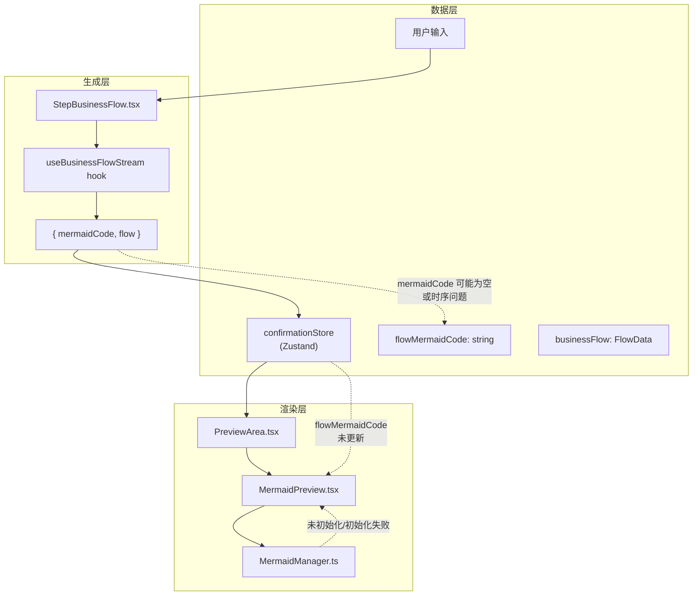

# 架构设计: 首页 Mermaid 流程图渲染修复

**项目**: vibex-homepage-mermaid-fix  
**架构师**: Architect Agent  
**日期**: 2026-03-20

---

## 1. 问题概述

| 症状 | 用户完成业务流程（Step 4）后返回首页，预览区显示占位图而非 Mermaid SVG |
|------|-------|
| 根因 | 未明确定位（三层均有可能：数据层/渲染层/UI层） |
| 影响 | 核心功能不可用，用户无法预览生成的流程图 |

---

## 2. 数据流架构



---

## 3. 根因定位流程

### 3.1 三层诊断协议

```
Layer 1 (数据层)
  ↓ 确认 flowMermaidCode 有值
Layer 2 (渲染层)
  ↓ 确认 MermaidManager.isInitialized() = true  
Layer 3 (UI层)
  ↓ 确认 PreviewArea 正确传递 code 给 MermaidPreview
```

**诊断清单**:

```typescript
// 在 PreviewArea.tsx console.debug
console.debug('[PreviewArea Debug]', {
  flowMermaidCode: !!flowMermaidCode,
  codeLength: flowMermaidCode?.length,
  businessFlow: !!businessFlow,
  previewType: store.getState().previewType,
})

// 在控制台验证
// 1. 打开浏览器 DevTools → Application → Zustand
// 2. 找到 confirmationStore
// 3. 检查 flowMermaidCode 字段是否有值
```

### 3.2 最可能根因（基于代码审查）

| 可能根因 | 概率 | 检查方法 |
|----------|------|----------|
| `flowMermaidCode` 在 `handleNext` 时仍为空（异步未完成） | 高 | console.debug 验证 |
| PreviewArea 订阅的字段错误 | 中 | 检查 selector |
| MermaidManager 初始化时序问题 | 中 | 检查 initialize() 调用时机 |
| 首页加载时 store 未持久化/恢复 | 低 | 检查 persist 配置 |

---

## 4. 修复架构

### 4.1 核心修复：PreviewArea 订阅逻辑

```typescript
// PreviewArea.tsx
export function PreviewArea() {
  const flowMermaidCode = useConfirmationStore((s) => s.flowMermaidCode);
  const businessFlow = useConfirmationStore((s) => s.businessFlow);
  const previewType = useConfirmationStore((s) => s.previewType);

  // 调试日志
  useEffect(() => {
    console.debug('[PreviewArea] Rerender:', {
      flowMermaidCode: flowMermaidCode?.substring(0, 80),
      businessFlow: !!businessFlow,
      previewType,
    });
  }, [flowMermaidCode, businessFlow, previewType]);

  // 渲染决策
  if (!flowMermaidCode && !businessFlow) {
    return <EmptyState />;  // 首页默认状态
  }

  if (flowMermaidCode) {
    return <MermaidPreview code={flowMermaidCode} />;
  }

  if (previewType === 'domain-model') {
    return <DomainModelPreview />;
  }

  return <Placeholder />;
}
```

### 4.2 修复：StepBusinessFlow 保存时序

```typescript
// StepBusinessFlow.tsx — handleNext / handleGenerate

// 确保 mermaidCode 生成完成后再导航
const handleGenerate = async () => {
  const result = await generateFlow(input);
  
  // 关键：等待 mermaidCode 可用后再保存到 store
  if (result.mermaidCode) {
    confirmationStore.getState().setFlowMermaidCode(result.mermaidCode);
  }
  if (result.flow) {
    confirmationStore.getState().setBusinessFlow(result.flow);
  }
  
  // 延迟保存，确保状态同步
  setTimeout(() => {
    confirmationStore.getState().setPreviewType('flow');
  }, 0);
};
```

### 4.3 修复：MermaidManager 初始化时序

```typescript
// MermaidPreview.tsx
export function MermaidPreview({ code }: { code: string }) {
  const [svg, setSvg] = React.useState('');
  const [isReady, setIsReady] = React.useState(false);
  const [error, setError] = React.useState<string | null>(null);

  // 确保 Manager 初始化完成
  React.useEffect(() => {
    let cancelled = false;
    
    const init = async () => {
      const manager = MermaidManager.getInstance();
      
      if (!manager.isInitialized()) {
        await manager.initialize();
      }
      
      if (!cancelled) {
        setIsReady(true);
      }
    };
    
    init().catch((err) => {
      if (!cancelled) {
        setError(err.message);
        setIsReady(true); // 即使初始化失败也显示
      }
    });
    
    return () => { cancelled = true; };
  }, []);

  // code 变化时重新渲染
  React.useEffect(() => {
    if (!isReady || !code) return;
    
    const render = async () => {
      try {
        const result = await MermaidManager.getInstance().render(code);
        setSvg(result);
      } catch (err) {
        console.error('[MermaidPreview] Render failed:', err);
        setSvg(''); // 渲染失败时清空
      }
    };
    
    render();
  }, [code, isReady]);

  if (error) return <MermaidError error={error} code={code} />;
  if (!svg) return <MermaidSkeleton />;
  return <div dangerouslySetInnerHTML={{ __html: svg }} />;
}
```

---

## 5. 状态持久化架构

如果问题与首页刷新/导航相关，需检查 store 的 `persist` 配置：

```typescript
// confirmationStore.ts
export const useConfirmationStore = create(
  persist(
    (set, get) => ({
      flowMermaidCode: null,
      businessFlow: null,
      previewType: 'empty',
      setFlowMermaidCode: (code) => set({ flowMermaidCode: code }),
      setBusinessFlow: (flow) => set({ businessFlow: flow }),
    }),
    {
      name: 'vibex-confirmation',
      partialize: (state) => ({
        flowMermaidCode: state.flowMermaidCode,
        businessFlow: state.businessFlow,
        previewType: state.previewType,
      }),
    }
  )
);
```

---

## 6. E2E 测试

```typescript
// tests/e2e/mermaid-render.spec.ts
test('homepage preview shows mermaid diagram after flow generation', async ({ page }) => {
  await page.goto('/');
  
  // 完成业务流程生成
  await page.getByTestId('requirement-input').fill('用户登录并下单');
  await page.getByTestId('analyze-btn').click();
  
  // 完成 Step 4
  await page.getByTestId('step-nav').getByText('业务流程').click();
  await page.getByTestId('generate-flow-btn').click();
  await page.waitForResponse('**/api/generate-flow**');
  
  // 返回首页
  await page.getByTestId('back-to-home').click();
  
  // 验证预览区显示 SVG（非占位图）
  await expect(page.getByTestId('preview-area')).not.toContainText('占位图');
  const svg = page.locator('#preview-area svg');
  await expect(svg).toBeVisible();
});
```

---

## 7. 实施计划

```
Phase 1: Debug 定位 (30分钟)
  ↓ 添加 console.debug
  ↓ 复现问题
  ↓ 确认根因

Phase 2: 修复实现 (30分钟)
  ↓ 根据根因实施修复
  ↓ PreviewArea 订阅逻辑
  ↓ MermaidManager 时序

Phase 3: 验证 (15分钟)
  ↓ Playwright E2E 测试
  ↓ 回归验证
```

**总工作量**: 1.5 小时

---

*Generated by: Architect Agent*
