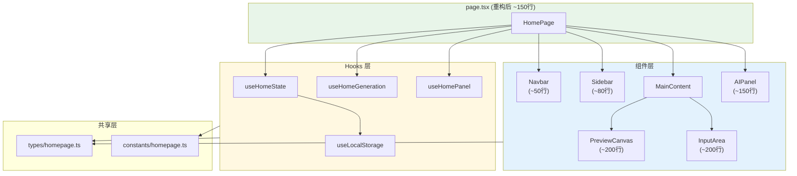
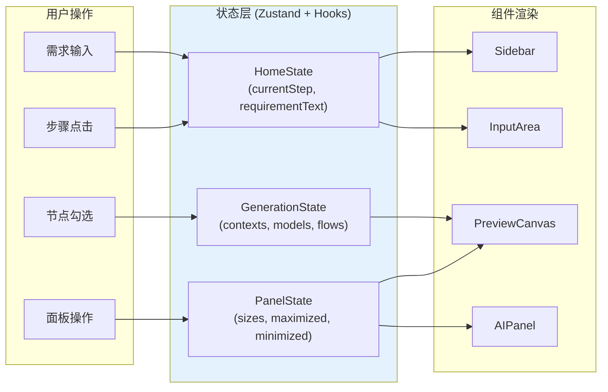
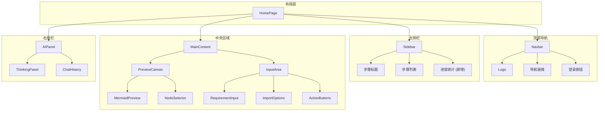

# 架构设计: 首页模块化重构

**项目**: vibex-homepage-modular-refactor  
**架构师**: Architect Agent  
**版本**: 1.0  
**日期**: 2026-03-15

---

## 1. 技术栈

| 技术 | 版本 | 用途 | 选择理由 |
|------|------|------|----------|
| React | 19.x | UI 框架 | 已有项目基础 |
| TypeScript | 5.x | 类型系统 | 已有项目基础 |
| CSS Modules | - | 样式方案 | 已有样式架构，支持作用域隔离 |
| Zustand | 4.x | 状态管理 | 已有项目基础 |
| React.memo | - | 性能优化 | 减少重渲染 |

---

## 2. 架构图

### 2.1 组件拆分架构



### 2.2 数据流架构



### 2.3 组件层级关系



---

## 3. API 定义

### 3.1 组件接口

```typescript
// components/homepage/Navbar.tsx

interface NavbarProps {
  /** 是否已认证 */
  isAuthenticated: boolean
  /** 登录点击回调 */
  onLoginClick: () => void
  /** 自定义类名 */
  className?: string
}

export function Navbar({
  isAuthenticated,
  onLoginClick,
  className,
}: NavbarProps): JSX.Element
```

```typescript
// components/homepage/Sidebar.tsx

interface Step {
  id: number
  label: string
  description: string
}

interface SidebarProps {
  /** 步骤列表 */
  steps: Step[]
  /** 当前步骤 */
  currentStep: number
  /** 已完成的步骤 */
  completedStep: number
  /** 步骤点击回调 */
  onStepClick: (step: number) => void
  /** 判断步骤是否可点击 */
  isStepClickable?: (step: number) => boolean
  /** 自定义类名 */
  className?: string
}

export function Sidebar({
  steps,
  currentStep,
  completedStep,
  onStepClick,
  isStepClickable,
  className,
}: SidebarProps): JSX.Element
```

```typescript
// components/homepage/PreviewCanvas.tsx

interface PreviewCanvasProps {
  /** 当前步骤 */
  currentStep: number
  /** Mermaid 代码映射 */
  mermaidCodes: {
    contexts?: string
    models?: string
    flows?: string
  }
  /** 限界上下文列表 */
  boundedContexts: BoundedContext[]
  /** 领域模型列表 */
  domainModels: DomainModel[]
  /** 业务流程 */
  businessFlow: BusinessFlow | null
  /** 选中的节点 */
  selectedNodes: Set<string>
  /** 节点切换回调 */
  onNodeToggle: (nodeId: string) => void
  /** 面板尺寸 */
  panelSizes: number[]
  /** 面板尺寸变化回调 */
  onPanelResize: (sizes: number[]) => void
  /** 最大化面板 */
  maximizedPanel: string | null
  /** 最小化面板 */
  minimizedPanel: string | null
  /** 最大化回调 */
  onMaximize: (panelId: string) => void
  /** 最小化回调 */
  onMinimize: (panelId: string) => void
  /** 自定义类名 */
  className?: string
}

export function PreviewCanvas({
  currentStep,
  mermaidCodes,
  boundedContexts,
  domainModels,
  businessFlow,
  selectedNodes,
  onNodeToggle,
  panelSizes,
  onPanelResize,
  maximizedPanel,
  minimizedPanel,
  onMaximize,
  onMinimize,
  className,
}: PreviewCanvasProps): JSX.Element
```

```typescript
// components/homepage/InputArea.tsx

interface InputAreaProps {
  /** 当前步骤 */
  currentStep: number
  /** 需求文本 */
  requirementText: string
  /** 需求变化回调 */
  onRequirementChange: (text: string) => void
  /** 生成回调 */
  onGenerate: () => void
  /** 生成领域模型回调 */
  onGenerateDomainModel?: () => void
  /** 生成业务流程回调 */
  onGenerateBusinessFlow?: () => void
  /** 创建项目回调 */
  onCreateProject?: () => void
  /** 是否正在生成 */
  isGenerating: boolean
  /** 限界上下文 (用于 Step 2+) */
  boundedContexts?: BoundedContext[]
  /** 领域模型 (用于 Step 3+) */
  domainModels?: DomainModel[]
  /** 业务流程 (用于 Step 4+) */
  businessFlow?: BusinessFlow | null
  /** 自定义类名 */
  className?: string
}

export function InputArea({
  currentStep,
  requirementText,
  onRequirementChange,
  onGenerate,
  onGenerateDomainModel,
  onGenerateBusinessFlow,
  onCreateProject,
  isGenerating,
  boundedContexts,
  domainModels,
  businessFlow,
  className,
}: InputAreaProps): JSX.Element
```

```typescript
// components/homepage/AIPanel.tsx

interface AIPanelProps {
  /** 消息列表 */
  messages: ChatMessage[]
  /** 发送消息回调 */
  onSendMessage: (message: string) => void
  /** 思考消息列表 (ThinkingPanel) */
  thinkingMessages?: string[]
  /** 流状态 */
  streamStatus?: 'idle' | 'streaming' | 'complete' | 'error'
  /** 中止回调 */
  onAbort?: () => void
  /** 重试回调 */
  onRetry?: () => void
  /** 是否折叠 */
  collapsed?: boolean
  /** 折叠变化回调 */
  onCollapsedChange?: (collapsed: boolean) => void
  /** 自定义类名 */
  className?: string
}

interface ChatMessage {
  id: string
  role: 'user' | 'assistant'
  content: string
  timestamp: string
}

export function AIPanel({
  messages,
  onSendMessage,
  thinkingMessages,
  streamStatus,
  onAbort,
  onRetry,
  collapsed,
  onCollapsedChange,
  className,
}: AIPanelProps): JSX.Element
```

### 3.2 Hooks 接口

```typescript
// hooks/useHomeState.ts

interface HomeState {
  // 步骤状态
  currentStep: number
  completedStep: number
  setCurrentStep: (step: number) => void
  setCompletedStep: (step: number) => void
  
  // 需求状态
  requirementText: string
  setRequirementText: (text: string) => void
  
  // 生成结果
  boundedContexts: BoundedContext[]
  domainModels: DomainModel[]
  businessFlow: BusinessFlow | null
  setBoundedContexts: (contexts: BoundedContext[]) => void
  setDomainModels: (models: DomainModel[]) => void
  setBusinessFlow: (flow: BusinessFlow | null) => void
  
  // 节点选择
  selectedNodes: Set<string>
  toggleNode: (nodeId: string) => void
  
  // 重置
  reset: () => void
}

export function useHomeState(): HomeState
```

```typescript
// hooks/useHomeGeneration.ts

interface HomeGeneration {
  // 生成状态
  isGenerating: boolean
  generationError: Error | null
  
  // 生成方法
  generateContexts: (requirement: string) => Promise<void>
  generateDomainModels: (contexts: BoundedContext[]) => Promise<void>
  generateBusinessFlow: (models: DomainModel[]) => Promise<void>
  createProject: () => Promise<void>
  
  // 控制
  abort: () => void
  retry: () => void
  clearError: () => void
}

export function useHomeGeneration(
  state: HomeState,
  onSuccess?: (result: GenerationResult) => void,
  onError?: (error: Error) => void
): HomeGeneration
```

```typescript
// hooks/useHomePanel.ts

interface HomePanel {
  // 面板尺寸
  panelSizes: number[]
  setPanelSizes: (sizes: number[]) => void
  
  // 最大化
  maximizedPanel: string | null
  setMaximizedPanel: (panelId: string | null) => void
  toggleMaximize: (panelId: string) => void
  
  // 最小化
  minimizedPanel: string | null
  setMinimizedPanel: (panelId: string | null) => void
  toggleMinimize: (panelId: string) => void
  
  // 重置
  reset: () => void
}

export function useHomePanel(): HomePanel
```

```typescript
// hooks/useLocalStorage.ts

/**
 * SSR 安全的 localStorage Hook
 */
export function useLocalStorage<T>(
  key: string,
  initialValue: T
): [T, (value: T | ((prev: T) => T)) => void]
```

### 3.3 类型定义

```typescript
// types/homepage.ts

/** 步骤定义 */
interface Step {
  id: number
  label: string
  description: string
}

/** 限界上下文 */
interface BoundedContext {
  id: string
  name: string
  type: 'core' | 'supporting' | 'generic'
  description?: string
  entities?: string[]
}

/** 领域模型 */
interface DomainModel {
  id: string
  name: string
  type: 'aggregate_root' | 'entity' | 'value_object' | 'service'
  contextId: string
  attributes?: ModelAttribute[]
}

/** 业务流程 */
interface BusinessFlow {
  id: string
  name: string
  steps: FlowStep[]
  actors?: string[]
}

/** 面板状态 */
type PanelState = 'normal' | 'maximized' | 'minimized'

/** 生成结果 */
interface GenerationResult {
  type: 'contexts' | 'models' | 'flows' | 'project'
  data: unknown
}
```

---

## 4. 数据模型

### 4.1 状态模型

```typescript
// stores/home-store.ts (可选，如果需要全局状态)

interface HomeStore {
  // 步骤
  currentStep: number
  completedStep: number
  
  // 需求
  requirementText: string
  
  // 生成结果
  boundedContexts: BoundedContext[]
  domainModels: DomainModel[]
  businessFlow: BusinessFlow | null
  
  // 面板
  panelSizes: number[]
  maximizedPanel: string | null
  minimizedPanel: string | null
  
  // 选择
  selectedNodes: Set<string>
  
  // 操作
  actions: {
    setCurrentStep: (step: number) => void
    setRequirementText: (text: string) => void
    setBoundedContexts: (contexts: BoundedContext[]) => void
    setDomainModels: (models: DomainModel[]) => void
    setBusinessFlow: (flow: BusinessFlow | null) => void
    toggleNode: (nodeId: string) => void
    setPanelSizes: (sizes: number[]) => void
    toggleMaximize: (panelId: string) => void
    toggleMinimize: (panelId: string) => void
    reset: () => void
  }
}
```

### 4.2 持久化模型

```typescript
// localStorage 结构

interface PersistedHomeState {
  panelSizes: number[]
  selectedNodes: string[]
  lastRequirementText?: string
  savedAt: string
}

// key: 'vibex-home-state'
```

---

## 5. 模块划分

### 5.1 文件结构

```
src/
├── app/
│   └── page.tsx                    # 主页面 (~150 行)
│
├── components/
│   └── homepage/
│       ├── index.ts                # 统一导出
│       ├── Navbar.tsx              # 顶部导航 (~50 行)
│       ├── Navbar.module.css
│       ├── Sidebar.tsx             # 左侧步骤 (~80 行)
│       ├── Sidebar.module.css
│       ├── PreviewCanvas.tsx       # 预览画布 (~200 行)
│       ├── PreviewCanvas.module.css
│       ├── InputArea.tsx           # 需求录入 (~200 行)
│       ├── InputArea.module.css
│       ├── AIPanel.tsx             # AI 面板 (~150 行)
│       ├── AIPanel.module.css
│       ├── MainContent.tsx         # 中央容器 (~50 行)
│       └── MainContent.module.css
│
├── hooks/
│   ├── useHomeState.ts             # 状态管理 (~100 行)
│   ├── useHomeGeneration.ts        # 生成逻辑 (~80 行)
│   ├── useHomePanel.ts             # 面板控制 (~60 行)
│   └── useLocalStorage.ts          # SSR 安全存储 (~30 行)
│
├── types/
│   └── homepage.ts                 # 类型定义 (~50 行)
│
├── constants/
│   └── homepage.ts                 # 常量定义 (~50 行)
│
└── __tests__/
    └── homepage/
        ├── Navbar.test.tsx
        ├── Sidebar.test.tsx
        ├── PreviewCanvas.test.tsx
        ├── InputArea.test.tsx
        └── AIPanel.test.tsx
```

### 5.2 模块职责

| 模块 | 职责 | 行数 |
|------|------|------|
| page.tsx | 组装组件，协调状态 | ~150 |
| Navbar | 顶部导航栏 | ~50 |
| Sidebar | 左侧步骤导航 | ~80 |
| PreviewCanvas | Mermaid 预览 + 节点勾选 | ~200 |
| InputArea | 需求输入 + 导入选项 | ~200 |
| AIPanel | AI 对话面板 | ~150 |
| useHomeState | 状态管理 Hook | ~100 |
| useHomeGeneration | 生成逻辑 Hook | ~80 |
| useHomePanel | 面板控制 Hook | ~60 |

---

## 6. 核心实现

### 6.1 主页面重构

```typescript
// app/page.tsx (重构后)

import { Navbar, Sidebar, PreviewCanvas, InputArea, AIPanel, MainContent } from '@/components/homepage'
import { useHomeState } from '@/hooks/useHomeState'
import { useHomeGeneration } from '@/hooks/useHomeGeneration'
import { useHomePanel } from '@/hooks/useHomePanel'
import { STEPS } from '@/constants/homepage'
import styles from './page.module.css'

export default function HomePage() {
  const state = useHomeState()
  const generation = useHomeGeneration(state)
  const panel = useHomePanel()
  const { isAuthenticated } = useAuth()
  const [isLoginDrawerOpen, setIsLoginDrawerOpen] = useState(false)
  
  return (
    <div className={styles.container}>
      <Navbar
        isAuthenticated={isAuthenticated}
        onLoginClick={() => setIsLoginDrawerOpen(true)}
      />
      
      <div className={styles.main}>
        <Sidebar
          steps={STEPS}
          currentStep={state.currentStep}
          completedStep={state.completedStep}
          onStepClick={state.setCurrentStep}
        />
        
        <MainContent
          panelSizes={panel.panelSizes}
          onPanelResize={panel.setPanelSizes}
        >
          <PreviewCanvas
            currentStep={state.currentStep}
            mermaidCodes={{
              contexts: state.mermaidCodes.contexts,
              models: state.mermaidCodes.models,
              flows: state.mermaidCodes.flows,
            }}
            boundedContexts={state.boundedContexts}
            domainModels={state.domainModels}
            businessFlow={state.businessFlow}
            selectedNodes={state.selectedNodes}
            onNodeToggle={state.toggleNode}
            maximizedPanel={panel.maximizedPanel}
            minimizedPanel={panel.minimizedPanel}
            onMaximize={panel.toggleMaximize}
            onMinimize={panel.toggleMinimize}
          />
          
          <InputArea
            currentStep={state.currentStep}
            requirementText={state.requirementText}
            onRequirementChange={state.setRequirementText}
            onGenerate={() => generation.generateContexts(state.requirementText)}
            onGenerateDomainModel={() => generation.generateDomainModels(state.boundedContexts)}
            onGenerateBusinessFlow={() => generation.generateBusinessFlow(state.domainModels)}
            onCreateProject={() => generation.createProject()}
            isGenerating={generation.isGenerating}
            boundedContexts={state.boundedContexts}
            domainModels={state.domainModels}
            businessFlow={state.businessFlow}
          />
        </MainContent>
        
        <AIPanel
          messages={state.messages}
          onSendMessage={generation.sendMessage}
          thinkingMessages={state.thinkingMessages}
          streamStatus={generation.streamStatus}
          onAbort={generation.abort}
          onRetry={generation.retry}
          collapsed={panel.minimizedPanel === 'ai'}
          onCollapsedChange={(c) => c ? panel.toggleMinimize('ai') : panel.setMinimizedPanel(null)}
        />
      </div>
      
      <LoginDrawer
        isOpen={isLoginDrawerOpen}
        onClose={() => setIsLoginDrawerOpen(false)}
        onSuccess={() => setIsLoginDrawerOpen(false)}
      />
    </div>
  )
}
```

### 6.2 useLocalStorage Hook (SSR 安全)

```typescript
// hooks/useLocalStorage.ts

import { useState, useCallback, useEffect } from 'react'

export function useLocalStorage<T>(
  key: string,
  initialValue: T
): [T, (value: T | ((prev: T) => T)) => void] {
  // 初始化状态
  const [storedValue, setStoredValue] = useState<T>(() => {
    // SSR 安全检查
    if (typeof window === 'undefined') {
      return initialValue
    }
    
    try {
      const item = window.localStorage.getItem(key)
      return item ? JSON.parse(item) : initialValue
    } catch (error) {
      console.warn(`Error reading localStorage key "${key}":`, error)
      return initialValue
    }
  })
  
  // 设置值
  const setValue = useCallback((value: T | ((prev: T) => T)) => {
    setStoredValue((prev) => {
      const newValue = value instanceof Function ? value(prev) : value
      
      // SSR 安全检查
      if (typeof window !== 'undefined') {
        try {
          window.localStorage.setItem(key, JSON.stringify(newValue))
        } catch (error) {
          console.warn(`Error setting localStorage key "${key}":`, error)
        }
      }
      
      return newValue
    })
  }, [key])
  
  return [storedValue, setValue]
}
```

### 6.3 Sidebar 组件 (含进度统计)

```typescript
// components/homepage/Sidebar.tsx

import { Step } from '@/types/homepage'
import styles from './Sidebar.module.css'

interface SidebarProps {
  steps: Step[]
  currentStep: number
  completedStep: number
  onStepClick: (step: number) => void
  isStepClickable?: (step: number) => boolean
  className?: string
}

export function Sidebar({
  steps,
  currentStep,
  completedStep,
  onStepClick,
  isStepClickable,
  className,
}: SidebarProps) {
  const progressPercent = (completedStep / steps.length) * 100
  
  return (
    <aside className={`${styles.sidebar} ${className || ''}`}>
      <div className={styles.header}>
        <h2 className={styles.title}>设计流程</h2>
      </div>
      
      <ul className={styles.stepList}>
        {steps.map((step) => {
          const isActive = step.id === currentStep
          const isCompleted = step.id <= completedStep
          const clickable = isStepClickable?.(step.id) ?? isCompleted
          
          return (
            <li
              key={step.id}
              className={`${styles.stepItem} ${isActive ? styles.active : ''} ${isCompleted ? styles.completed : ''}`}
              onClick={() => clickable && onStepClick(step.id)}
              role="button"
              tabIndex={clickable ? 0 : -1}
              aria-current={isActive ? 'step' : undefined}
            >
              <span className={styles.stepNumber}>{step.id}</span>
              <span className={styles.stepLabel}>{step.label}</span>
              {isCompleted && <span className={styles.checkmark}>✓</span>}
            </li>
          )
        })}
      </ul>
      
      {/* 新增: 进度统计 */}
      <div className={styles.progress}>
        <div className={styles.progressBar}>
          <div
            className={styles.progressFill}
            style={{ width: `${progressPercent}%` }}
          />
        </div>
        <span className={styles.progressText}>
          已完成 {completedStep}/{steps.length} 步
        </span>
      </div>
    </aside>
  )
}
```

---

## 7. 测试策略

### 7.1 单元测试

```typescript
// __tests__/homepage/Sidebar.test.tsx

import { render, screen, fireEvent } from '@testing-library/react'
import { Sidebar } from '@/components/homepage/Sidebar'

const STEPS = [
  { id: 1, label: '需求输入', description: '' },
  { id: 2, label: '限界上下文', description: '' },
]

describe('Sidebar', () => {
  it('renders all steps', () => {
    render(
      <Sidebar
        steps={STEPS}
        currentStep={1}
        completedStep={0}
        onStepClick={jest.fn()}
      />
    )
    
    expect(screen.getByText('需求输入')).toBeInTheDocument()
    expect(screen.getByText('限界上下文')).toBeInTheDocument()
  })
  
  it('shows progress correctly', () => {
    render(
      <Sidebar
        steps={STEPS}
        currentStep={2}
        completedStep={1}
        onStepClick={jest.fn()}
      />
    )
    
    expect(screen.getByText('已完成 1/2 步')).toBeInTheDocument()
  })
  
  it('calls onStepClick when step is clickable', () => {
    const handleClick = jest.fn()
    render(
      <Sidebar
        steps={STEPS}
        currentStep={1}
        completedStep={1}
        onStepClick={handleClick}
      />
    )
    
    fireEvent.click(screen.getByText('需求输入'))
    expect(handleClick).toHaveBeenCalledWith(1)
  })
})
```

### 7.2 集成测试

```typescript
// __tests__/integration/homepage.test.tsx

import { render, screen, fireEvent, waitFor } from '@testing-library/react'
import HomePage from '@/app/page'

describe('HomePage Integration', () => {
  it('renders all main components', () => {
    render(<HomePage />)
    
    expect(screen.getByRole('navigation')).toBeInTheDocument()
    expect(screen.getByText('设计流程')).toBeInTheDocument()
    expect(screen.getByPlaceholderText(/需求/)).toBeInTheDocument()
  })
  
  it('updates progress when step changes', async () => {
    render(<HomePage />)
    
    const input = screen.getByPlaceholderText(/需求/)
    fireEvent.change(input, { target: { value: 'test requirement' } })
    
    const generateBtn = screen.getByText(/开始/)
    fireEvent.click(generateBtn)
    
    await waitFor(() => {
      expect(screen.getByText('已完成 1/5 步')).toBeInTheDocument()
    })
  })
})
```

### 7.3 覆盖率目标

| 模块 | 覆盖率目标 |
|------|-----------|
| Navbar | 80% |
| Sidebar | 85% |
| PreviewCanvas | 75% |
| InputArea | 75% |
| AIPanel | 70% |
| useHomeState | 90% |
| useLocalStorage | 95% |

---

## 8. 性能评估

### 8.1 性能指标

| 指标 | 当前 | 目标 |
|------|------|------|
| page.tsx 行数 | 1142 | < 200 |
| 首屏渲染 | ~300ms | < 200ms |
| 组件重渲染 | 高 | 低 (React.memo) |
| 测试覆盖率 | < 50% | > 70% |

### 8.2 性能优化策略

| 策略 | 实现 |
|------|------|
| 组件 memo | React.memo 包裹所有子组件 |
| 回调缓存 | useCallback 缓存回调函数 |
| 状态分割 | 拆分状态到不同 Hook |
| 懒加载 | import() 动态导入大型组件 |

---

## 9. 风险评估

| 风险 | 概率 | 影响 | 缓解措施 |
|------|------|------|----------|
| 状态管理复杂化 | 中 | 高 | 使用 Hooks 隔离状态 |
| 样式冲突 | 低 | 中 | CSS Modules 作用域隔离 |
| 功能回归 | 中 | 高 | 先补充测试再重构 |
| SSR 水合错误 | 高 | 高 | useLocalStorage Hook |

---

## 10. 实施计划

| 阶段 | 内容 | 工时 |
|------|------|------|
| Phase 1 | 创建文件结构 + 类型定义 | 0.5 天 |
| Phase 2 | 拆分 Navbar + Sidebar | 1 天 |
| Phase 3 | 拆分 PreviewCanvas + InputArea | 1 天 |
| Phase 4 | 拆分 AIPanel + 抽取 Hooks | 1 天 |
| Phase 5 | 样式优化 + 空间调整 | 0.5 天 |
| Phase 6 | 测试 + 验证 | 1 天 |

**总计**: 5 天

---

## 11. 检查清单

- [x] 技术栈确认 (React + CSS Modules + Hooks)
- [x] 架构图 (组件拆分 + 数据流 + 层级关系)
- [x] API 定义 (组件接口 + Hooks + 类型)
- [x] 数据模型 (状态 + 持久化)
- [x] 核心实现 (主页面 + useLocalStorage + Sidebar)
- [x] 测试策略 (单元 + 集成)
- [x] 性能评估
- [x] 风险评估 (SSR 水合)

---

**产出物**: `/root/.openclaw/vibex/docs/vibex-homepage-modular-refactor/architecture.md`