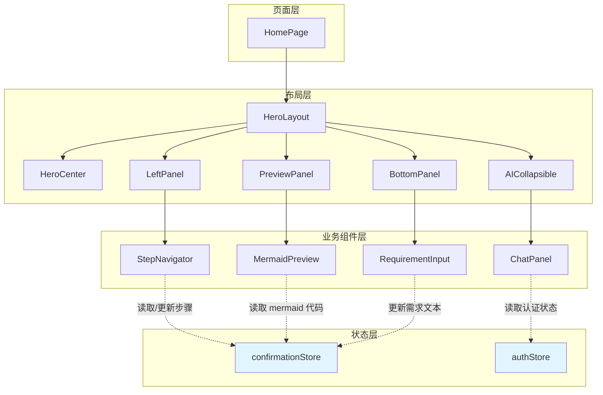
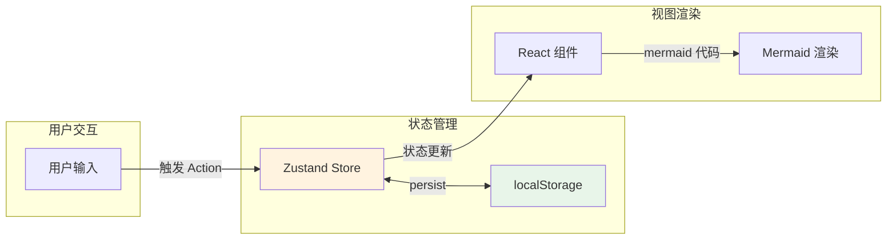
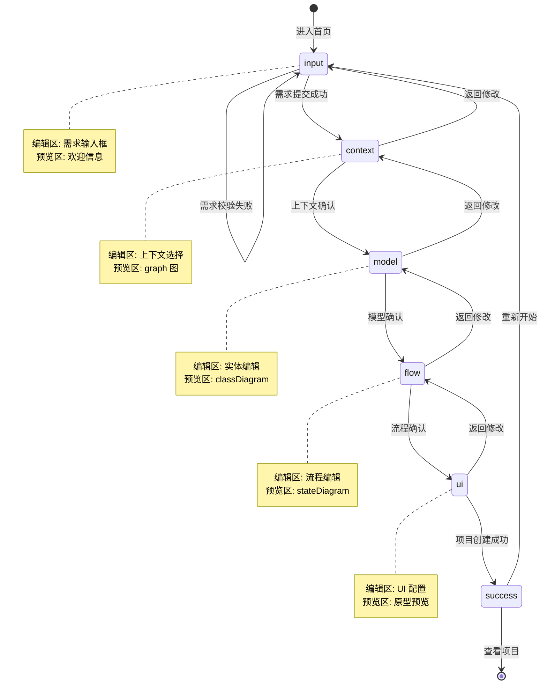
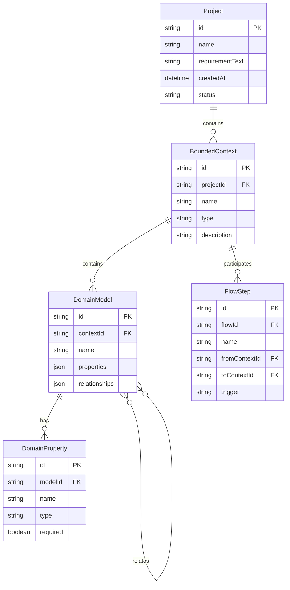

# 架构设计: 首页 UI/UX 重构 (VIBEX-006)

> **项目**: vibex-homepage-redesign-v2  
> **版本**: 1.0  
> **架构师**: Architect Agent  
> **日期**: 2026-03-12

---

## 1. 技术栈选型

### 1.1 前端框架

| 技术 | 版本 | 选型理由 |
|------|------|----------|
| **Next.js** | 14.x | 已有项目基础，App Router 支持良好 |
| **React** | 18.x | 组件化开发，Hooks 生态成熟 |
| **TypeScript** | 5.x | 类型安全，减少运行时错误 |
| **Zustand** | 4.x | 轻量级状态管理，已有 confirmationStore |
| **Mermaid** | 10.x | 图表渲染，项目已集成 |
| **CSS Modules** | - | 样式隔离，已有基础设施 |

### 1.2 状态管理方案

```typescript
// 选择 Zustand 而非 Redux 的原因：
// 1. 已有 confirmationStore 基础设施
// 2. 轻量级，适合中等复杂度状态
// 3. 内置 persist 中间件支持持久化
// 4. 学习曲线平缓，团队熟悉
```

### 1.3 性能优化方案

| 方案 | 说明 |
|------|------|
| **动态导入 Mermaid** | 减少首屏加载体积 |
| **React.memo** | 防止不必要的重渲染 |
| **useMemo/useCallback** | 缓存计算结果 |
| **虚拟列表** | 长列表性能优化（如需要） |

---

## 2. 架构图

### 2.1 组件架构



### 2.2 数据流架构



### 2.3 五步流程状态机



---

## 3. 接口定义

### 3.1 状态接口

```typescript
// types/confirmation.ts

/** 步骤类型 */
export type Step = 'input' | 'context' | 'model' | 'flow' | 'ui' | 'success';

/** 限界上下文 */
export interface BoundedContext {
  id: string;
  name: string;
  type: 'core' | 'supporting' | 'generic';
  description?: string;
}

/** 领域模型属性 */
export interface DomainProperty {
  name: string;
  type: string;
  required: boolean;
}

/** 领域模型 */
export interface DomainModel {
  id: string;
  name: string;
  contextId: string;
  properties: DomainProperty[];
  relationships?: {
    targetId: string;
    type: 'has-one' | 'has-many' | 'belongs-to';
  }[];
}

/** 业务流程步骤 */
export interface FlowStep {
  id: string;
  name: string;
  fromContext: string;
  toContext: string;
  trigger: string;
}

/** 业务流程 */
export interface BusinessFlow {
  id: string;
  name: string;
  steps: FlowStep[];
}

/** Mermaid 代码集合 */
export interface MermaidCodes {
  context: string;
  model: string;
  flow: string;
}

/** 确认流程状态 */
export interface ConfirmationState {
  // 当前步骤
  currentStep: Step;
  
  // 需求输入
  requirementText: string;
  
  // 限界上下文
  boundedContexts: BoundedContext[];
  
  // 领域模型
  domainModels: DomainModel[];
  
  // 业务流程
  businessFlow: BusinessFlow | null;
  
  // Mermaid 代码
  mermaidCodes: MermaidCodes;
  
  // 元数据
  lastSaved: number | null;
  projectId: string | null;
  
  // Actions
  setCurrentStep: (step: Step) => void;
  setRequirementText: (text: string) => void;
  setBoundedContexts: (contexts: BoundedContext[]) => void;
  addBoundedContext: (context: BoundedContext) => void;
  removeBoundedContext: (id: string) => void;
  setDomainModels: (models: DomainModel[]) => void;
  setBusinessFlow: (flow: BusinessFlow) => void;
  setMermaidCodes: (codes: Partial<MermaidCodes>) => void;
  reset: () => void;
}
```

### 3.2 组件 Props 接口

```typescript
// components/types.ts

/** 步骤导航 Props */
export interface StepNavigatorProps {
  currentStep: Step;
  onStepClick: (step: Step) => void;
  completedSteps: Step[];
}

/** Mermaid 预览 Props */
export interface MermaidPreviewProps {
  code: string;
  type: 'graph' | 'classDiagram' | 'stateDiagram' | 'none';
  loading?: boolean;
  error?: string;
}

/** 需求输入 Props */
export interface RequirementInputProps {
  value: string;
  onChange: (value: string) => void;
  onSubmit: () => void;
  placeholder?: string;
  disabled?: boolean;
}

/** AI 聊天面板 Props */
export interface ChatPanelProps {
  isOpen: boolean;
  onToggle: () => void;
  messages: ChatMessage[];
  onSendMessage: (message: string) => void;
}

/** AI 聊天消息 */
export interface ChatMessage {
  id: string;
  role: 'user' | 'assistant';
  content: string;
  timestamp: number;
}
```

### 3.3 API 接口

```typescript
// services/api/clarify.ts

/** 需求澄清 API */
export const clarifyApi = {
  /** 提交需求进行分析 */
  analyzeRequirement: async (text: string): Promise<{
    contexts: BoundedContext[];
    suggestedModels: DomainModel[];
  }> => {
    return fetch('/api/v1/clarify/analyze', {
      method: 'POST',
      body: JSON.stringify({ requirementText: text }),
    }).then(res => res.json());
  },
  
  /** 生成 Mermaid 图 */
  generateMermaid: async (type: 'context' | 'model' | 'flow', data: object): Promise<{
    code: string;
  }> => {
    return fetch(`/api/v1/mermaid/${type}`, {
      method: 'POST',
      body: JSON.stringify(data),
    }).then(res => res.json());
  },
};

// services/api/project.ts

/** 项目 API */
export const projectApi = {
  /** 创建项目 */
  createProject: async (data: {
    requirementText: string;
    boundedContexts: BoundedContext[];
    domainModels: DomainModel[];
    businessFlow: BusinessFlow | null;
  }): Promise<{
    projectId: string;
    status: string;
  }> => {
    return fetch('/api/v1/projects', {
      method: 'POST',
      body: JSON.stringify(data),
    }).then(res => res.json());
  },
  
  /** 保存草稿 */
  saveDraft: async (state: Partial<ConfirmationState>): Promise<void> => {
    return fetch('/api/v1/drafts', {
      method: 'POST',
      body: JSON.stringify(state),
    }).then(res => res.json());
  },
};
```

---

## 4. 数据模型

### 4.1 核心实体关系



### 4.2 localStorage 持久化结构

```typescript
// localStorage key: 'vibex-design-session'
interface PersistedSession {
  version: number;
  data: {
    currentStep: Step;
    requirementText: string;
    boundedContexts: BoundedContext[];
    domainModels: DomainModel[];
    businessFlow: BusinessFlow | null;
    mermaidCodes: MermaidCodes;
    lastSaved: number;
  };
}
```

---

## 5. 测试策略

### 5.1 测试框架

| 工具 | 用途 |
|------|------|
| **Jest** | 单元测试、集成测试 |
| **React Testing Library** | 组件测试 |
| **Playwright** | E2E 测试 |

### 5.2 覆盖率要求

| 类型 | 目标覆盖率 |
|------|------------|
| 语句覆盖率 | ≥ 80% |
| 分支覆盖率 | ≥ 75% |
| 函数覆盖率 | ≥ 80% |
| 行覆盖率 | ≥ 80% |

### 5.3 核心测试用例

#### 5.3.1 状态管理测试

```typescript
// __tests__/stores/confirmationStore.test.ts

describe('confirmationStore', () => {
  beforeEach(() => {
    localStorage.clear();
  });
  
  describe('步骤切换', () => {
    it('应该正确切换到下一步', () => {
      const { setCurrentStep, currentStep } = useConfirmationStore.getState();
      setCurrentStep('context');
      expect(useConfirmationStore.getState().currentStep).toBe('context');
    });
    
    it('不应该跳过步骤', () => {
      // 验证步骤顺序约束
      const { setCurrentStep } = useConfirmationStore.getState();
      // input -> model 是非法跳转
      expect(() => setCurrentStep('model')).toThrow('Invalid step transition');
    });
  });
  
  describe('持久化', () => {
    it('应该在状态变化时自动保存到 localStorage', () => {
      const { setRequirementText } = useConfirmationStore.getState();
      setRequirementText('测试需求');
      
      const saved = JSON.parse(localStorage.getItem('vibex-design-session') || '{}');
      expect(saved.data.requirementText).toBe('测试需求');
    });
    
    it('应该在刷新后恢复状态', () => {
      // 模拟已有数据
      localStorage.setItem('vibex-design-session', JSON.stringify({
        version: 1,
        data: {
          currentStep: 'context',
          requirementText: '恢复的文本',
          boundedContexts: [],
          domainModels: [],
          businessFlow: null,
          mermaidCodes: { context: '', model: '', flow: '' },
          lastSaved: Date.now(),
        },
      }));
      
      // 重新创建 store 或触发恢复
      // expect(state.requirementText).toBe('恢复的文本');
    });
  });
});
```

#### 5.3.2 组件测试

```typescript
// __tests__/components/StepNavigator.test.tsx

import { render, screen, fireEvent } from '@testing-library/react';
import { StepNavigator } from '@/components/StepNavigator';

describe('StepNavigator', () => {
  const mockProps = {
    currentStep: 'input' as const,
    onStepClick: jest.fn(),
    completedSteps: [] as string[],
  };
  
  it('应该渲染所有步骤', () => {
    render(<StepNavigator {...mockProps} />);
    
    expect(screen.getByText('需求输入')).toBeInTheDocument();
    expect(screen.getByText('上下文')).toBeInTheDocument();
    expect(screen.getByText('模型')).toBeInTheDocument();
    expect(screen.getByText('流程')).toBeInTheDocument();
  });
  
  it('应该高亮当前步骤', () => {
    render(<StepNavigator {...mockProps} />);
    
    const currentStepElement = screen.getByText('需求输入');
    expect(currentStepElement).toHaveClass('active');
  });
  
  it('应该在点击步骤时调用回调', () => {
    const onStepClick = jest.fn();
    render(<StepNavigator {...mockProps} onStepClick={onStepClick} />);
    
    fireEvent.click(screen.getByText('上下文'));
    expect(onStepClick).toHaveBeenCalledWith('context');
  });
  
  it('已完成步骤应该显示勾选标记', () => {
    render(<StepNavigator {...mockProps} completedSteps={['input']} />);
    
    const completedStep = screen.getByTestId('step-input');
    expect(completedStep).toHaveClass('completed');
  });
});
```

#### 5.3.3 Mermaid 渲染测试

```typescript
// __tests__/components/MermaidPreview.test.tsx

import { render, screen, waitFor } from '@testing-library/react';
import { MermaidPreview } from '@/components/MermaidPreview';

describe('MermaidPreview', () => {
  it('应该在加载中显示骨架屏', () => {
    render(<MermaidPreview code="" type="graph" loading />);
    
    expect(screen.getByTestId('skeleton')).toBeInTheDocument();
  });
  
  it('应该渲染有效的 mermaid 代码', async () => {
    const code = 'graph TD\nA-->B';
    render(<MermaidPreview code={code} type="graph" />);
    
    await waitFor(() => {
      expect(screen.getByTestId('mermaid-svg')).toBeInTheDocument();
    });
  });
  
  it('应该在代码无效时显示错误', () => {
    render(<MermaidPreview code="invalid code" type="graph" error="解析错误" />);
    
    expect(screen.getByText('解析错误')).toBeInTheDocument();
  });
});
```

#### 5.3.4 E2E 测试

```typescript
// e2e/homepage-redesign.spec.ts

import { test, expect } from '@playwright/test';

test.describe('首页五步流程', () => {
  test.beforeEach(async ({ page }) => {
    await page.goto('/');
  });
  
  test('应该显示完整的布局结构', async ({ page }) => {
    // Hero 区域
    await expect(page.locator('[data-testid="hero-section"]')).toBeVisible();
    
    // 步骤导航
    await expect(page.locator('[data-testid="step-navigator"]')).toBeVisible();
    
    // 预览区域
    await expect(page.locator('[data-testid="preview-area"]')).toBeVisible();
    
    // 输入框
    await expect(page.locator('[data-testid="requirement-input"]')).toBeVisible();
  });
  
  test('应该完成完整的五步流程', async ({ page }) => {
    // Step 1: 输入需求
    await page.fill('[data-testid="requirement-input"] textarea', '开发一个电商网站');
    await page.click('button:has-text("开始生成")');
    
    // 等待进入上下文步骤
    await expect(page.locator('[data-testid="step-context"]')).toHaveClass(/active/);
    
    // Step 2: 确认上下文
    await page.click('button:has-text("确认继续")');
    await expect(page.locator('[data-testid="step-model"]')).toHaveClass(/active/);
    
    // Step 3: 确认模型
    await page.click('button:has-text("确认继续")');
    await expect(page.locator('[data-testid="step-flow"]')).toHaveClass(/active/);
    
    // Step 4: 确认流程
    await page.click('button:has-text("确认继续")');
    await expect(page.locator('[data-testid="step-ui"]')).toHaveClass(/active/);
    
    // Step 5: 创建项目
    await page.click('button:has-text("创建项目")');
    await expect(page.locator('[data-testid="success-panel"]')).toBeVisible();
  });
  
  test('刷新后应该恢复进度', async ({ page }) => {
    // 输入需求
    await page.fill('[data-testid="requirement-input"] textarea', '测试需求');
    await page.click('button:has-text("开始生成")');
    
    // 刷新页面
    await page.reload();
    
    // 验证状态恢复
    await expect(page.locator('[data-testid="step-context"]')).toHaveClass(/active/);
    await expect(page.locator('[data-testid="requirement-input"] textarea')).toHaveValue('测试需求');
  });
  
  test('AI 助手应该可以收起和展开', async ({ page }) => {
    // 点击收起按钮
    await page.click('[data-testid="chat-toggle"]');
    await expect(page.locator('[data-testid="chat-panel"]')).not.toBeVisible();
    
    // 点击展开按钮
    await page.click('[data-testid="chat-expand"]');
    await expect(page.locator('[data-testid="chat-panel"]')).toBeVisible();
  });
});
```

### 5.4 测试运行命令

```bash
# 单元测试
pnpm test -- --coverage

# 组件测试
pnpm test -- --testPathPattern=components

# E2E 测试
pnpm playwright test e2e/homepage-redesign.spec.ts
```

---

## 6. 组件结构

### 6.1 目录结构

```
src/
├── app/
│   └── page.tsx                 # 首页入口
├── components/
│   ├── home/
│   │   ├── HomePage.tsx         # 首页主组件
│   │   ├── HomePage.module.css
│   │   ├── HeroSection.tsx      # Hero 区域
│   │   ├── StepNavigator.tsx    # 步骤导航
│   │   ├── PreviewArea.tsx      # 预览区域
│   │   └── BottomPanel.tsx      # 底部输入区
│   ├── steps/
│   │   ├── RequirementInput.tsx # 步骤1: 需求输入
│   │   ├── ContextPanel.tsx     # 步骤2: 上下文
│   │   ├── ModelPanel.tsx       # 步骤3: 模型
│   │   ├── FlowPanel.tsx        # 步骤4: 流程
│   │   └── UIPanel.tsx          # 步骤5: UI
│   ├── preview/
│   │   ├── MermaidPreview.tsx   # Mermaid 渲染
│   │   └── MermaidPreview.module.css
│   └── chat/
│       ├── CollapsibleChat.tsx  # 可收起 AI 助手
│       └── CollapsibleChat.module.css
├── stores/
│   ├── confirmationStore.ts     # 流程状态管理
│   └── authStore.ts             # 认证状态
├── services/
│   └── api/
│       ├── clarify.ts           # 澄清 API
│       └── project.ts           # 项目 API
└── types/
    └── confirmation.ts          # 类型定义
```

### 6.2 组件职责

| 组件 | 职责 | 依赖 |
|------|------|------|
| `HomePage` | 页面布局组合 | 所有子组件 |
| `HeroSection` | 产品介绍展示 | 无 |
| `StepNavigator` | 步骤导航和状态指示 | confirmationStore |
| `PreviewArea` | Mermaid 图渲染 | MermaidPreview |
| `BottomPanel` | 动态编辑面板 | 步骤组件 |
| `CollapsibleChat` | AI 助手交互 | authStore |

---

## 7. 性能考量

### 7.1 关键性能指标

| 指标 | 目标 | 实现方式 |
|------|------|----------|
| 首屏 LCP | < 2s | 懒加载非关键组件 |
| 步骤切换 | < 300ms | React.memo + 状态缓存 |
| Mermaid 渲染 | < 500ms | 动态导入 + 渲染缓存 |
| 状态持久化 | < 100ms | 异步写入 localStorage |

### 7.2 优化策略

```typescript
// 1. Mermaid 动态导入
const MermaidPreview = dynamic(
  () => import('@/components/preview/MermaidPreview'),
  { 
    loading: () => <Skeleton height={400} />,
    ssr: false,
  }
);

// 2. 组件记忆化
const StepNavigator = memo(function StepNavigator(props: StepNavigatorProps) {
  // ...
});

// 3. 状态分片
const useStepStore = create(
  devtools(
    persist(
      (set) => ({
        currentStep: 'input',
        setCurrentStep: (step) => set({ currentStep: step }),
      }),
      { name: 'step-store' }
    )
  )
);

const useContextStore = create(
  devtools(
    persist(
      (set) => ({
        boundedContexts: [],
        // ...
      }),
      { name: 'context-store' }
    )
  )
);
```

---

## 8. 兼容性评估

### 8.1 现有架构兼容

| 模块 | 兼容性 | 说明 |
|------|--------|------|
| `confirmationStore` | ✅ 完全兼容 | 扩展现有结构 |
| `MermaidPreview` | ✅ 完全兼容 | 已有组件，直接复用 |
| `ChatPanel` | ⚠️ 需改造 | 添加收起/展开功能 |
| API 层 | ✅ 完全兼容 | 使用现有 API 结构 |

### 8.2 迁移路径

```
阶段 1: 新增组件 (无破坏性)
├── 创建新的布局组件
├── 创建步骤组件
└── 扩展 confirmationStore

阶段 2: 集成替换
├── 切换首页到新布局
├── 移除旧跳转逻辑
└── 测试验证

阶段 3: 清理
├── 删除废弃代码
└── 更新文档
```

---

## 9. 风险与缓解

| 风险 | 概率 | 影响 | 缓解措施 |
|------|------|------|----------|
| 状态管理复杂度增加 | 高 | 中 | 使用 Zustand 分片，保持职责单一 |
| Mermaid 渲染性能 | 中 | 中 | 懒加载、缓存渲染结果 |
| AI 响应延迟 | 高 | 高 | 显示进度条、支持取消操作 |
| 移动端适配 | 中 | 中 | 响应式布局、简化移动端 UI |

---

## 10. 总结

### 10.1 关键决策

1. **状态管理**: 使用 Zustand + persist，扩展现有 confirmationStore
2. **布局方案**: 三栏布局（左导航、中预览、下输入），AI 助手悬浮收起
3. **渲染方案**: Mermaid 动态导入，缓存渲染结果
4. **测试策略**: Jest 单元测试 + Playwright E2E，覆盖率 ≥ 80%

### 10.2 产出物清单

| 文件 | 位置 |
|------|------|
| 架构设计文档 | `docs/vibex-homepage-redesign-v2/architecture.md` |
| 类型定义 | `src/types/confirmation.ts` |
| 状态管理 | `src/stores/confirmationStore.ts` |
| 组件目录 | `src/components/home/`, `src/components/steps/` |

---

**验证命令**: `test -f docs/vibex-homepage-redesign-v2/architecture.md`