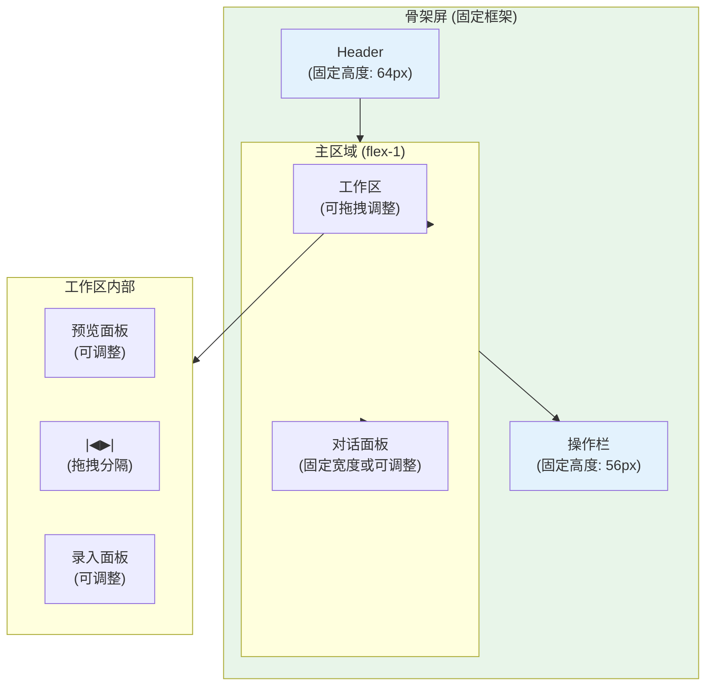
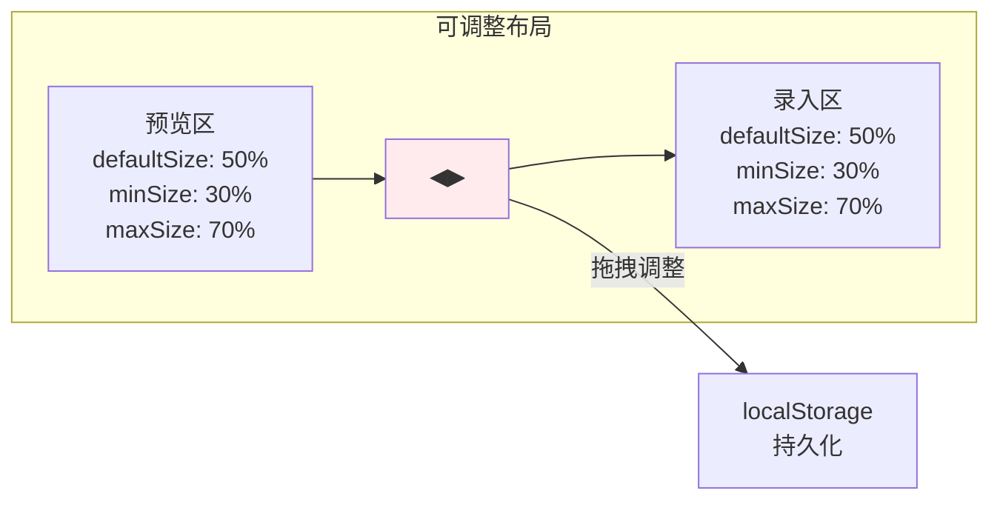
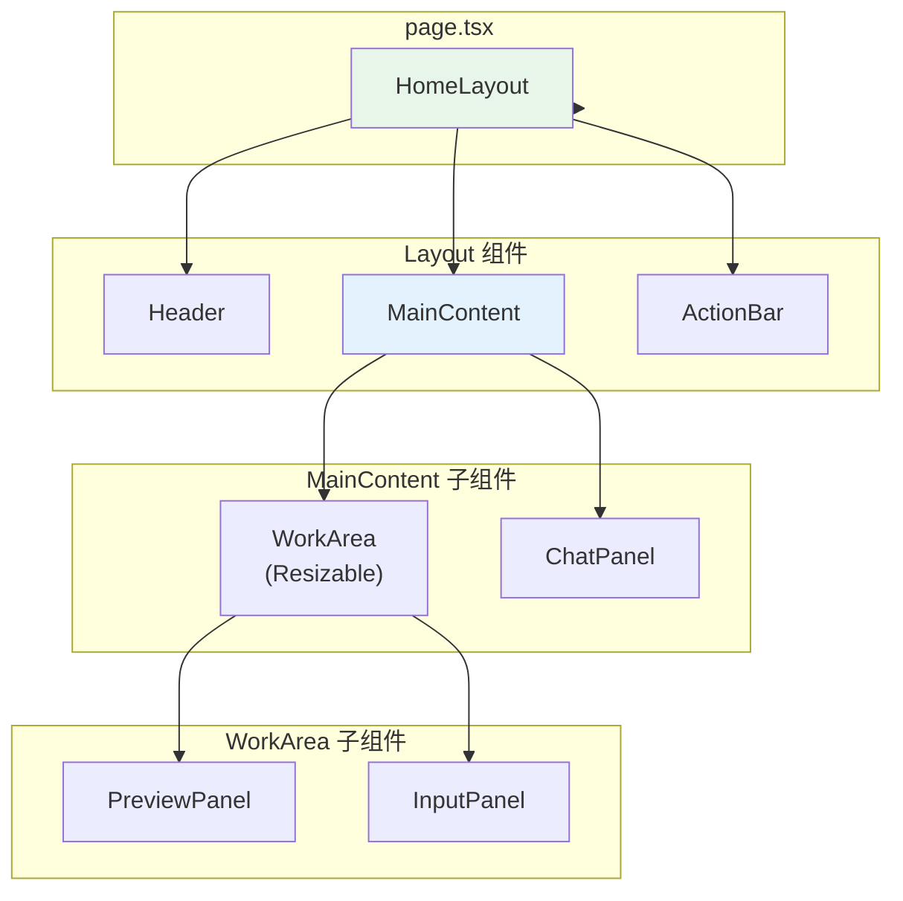

# 架构设计: 首页骨架屏重构

**项目**: vibex-homepage-skeleton-redesign  
**架构师**: Architect Agent  
**版本**: 1.0  
**日期**: 2026-03-14

---

## 1. 技术栈

| 技术 | 版本 | 用途 | 选择理由 |
|------|------|------|----------|
| React | 19.x | UI 框架 | 已有项目基础 |
| react-resizable-panels | 2.x | 区域拖拽 | 轻量、支持持久化 |
| CSS Modules | - | 样式方案 | 已有样式架构 |
| TypeScript | 5.x | 类型系统 | 已有项目基础 |

---

## 2. 架构图

### 2.1 骨架屏固定布局



### 2.2 区域拖拽调整



### 2.3 组件层级



---

## 3. API 定义

### 3.1 布局配置

```typescript
// types/layout-config.ts

interface SkeletonLayoutConfig {
  header: {
    height: number        // 固定 64px
    fixed: true
  }
  actionBar: {
    height: number        // 固定 56px
    fixed: true
  }
  workArea: {
    previewPanel: {
      defaultSize: number // 默认 50%
      minSize: number     // 最小 30%
      maxSize: number     // 最大 70%
    }
    inputPanel: {
      defaultSize: number // 默认 50%
      minSize: number     // 最小 30%
      maxSize: number     // 最大 70%
    }
  }
  chatPanel: {
    defaultWidth: number  // 默认 320px
    minWidth: number      // 最小 250px
    maxWidth: number      // 最大 400px
    collapsible: boolean  // 可折叠
  }
}

const DEFAULT_LAYOUT: SkeletonLayoutConfig = {
  header: { height: 64, fixed: true },
  actionBar: { height: 56, fixed: true },
  workArea: {
    previewPanel: { defaultSize: 50, minSize: 30, maxSize: 70 },
    inputPanel: { defaultSize: 50, minSize: 30, maxSize: 70 },
  },
  chatPanel: {
    defaultWidth: 320,
    minWidth: 250,
    maxWidth: 400,
    collapsible: true,
  },
}
```

### 3.2 布局 Store

```typescript
// stores/skeleton-layout-store.ts

import { create } from 'zustand'
import { persist } from 'zustand/middleware'

interface SkeletonLayoutState {
  // 面板大小 (百分比)
  previewPanelSize: number
  inputPanelSize: number
  
  // 对话面板宽度
  chatPanelWidth: number
  chatPanelCollapsed: boolean
  
  // 操作方法
  setPreviewPanelSize: (size: number) => void
  toggleChatPanel: () => void
  resetLayout: () => void
}

export const useSkeletonLayoutStore = create<SkeletonLayoutState>()(
  persist(
    (set) => ({
      previewPanelSize: 50,
      inputPanelSize: 50,
      chatPanelWidth: 320,
      chatPanelCollapsed: false,
      
      setPreviewPanelSize: (size) => set({
        previewPanelSize: size,
        inputPanelSize: 100 - size,
      }),
      
      toggleChatPanel: () => set((state) => ({
        chatPanelCollapsed: !state.chatPanelCollapsed,
      })),
      
      resetLayout: () => set({
        previewPanelSize: 50,
        inputPanelSize: 50,
        chatPanelWidth: 320,
        chatPanelCollapsed: false,
      }),
    }),
    {
      name: 'vibex-skeleton-layout',
    }
  )
)
```

### 3.3 组件接口

```typescript
// components/layout/HomeLayout.tsx

interface HomeLayoutProps {
  children?: React.ReactNode
}

export function HomeLayout({ children }: HomeLayoutProps): JSX.Element

// components/layout/Header.tsx

interface HeaderProps {
  title?: string
  showNav?: boolean
}

export function Header({ title, showNav = true }: HeaderProps): JSX.Element

// components/layout/ActionBar.tsx

interface ActionBarProps {
  onDiagnose?: () => void
  onOptimize?: () => void
  onClear?: () => void
  onHistory?: () => void
  showExamples?: boolean
}

export function ActionBar({
  onDiagnose,
  onOptimize,
  onClear,
  onHistory,
  showExamples = true,
}: ActionBarProps): JSX.Element

// components/layout/WorkArea.tsx

interface WorkAreaProps {
  // 面板大小 (从 store 读取)
  defaultPreviewSize?: number
  onPanelResize?: (previewSize: number) => void
}

export function WorkArea({
  defaultPreviewSize = 50,
  onPanelResize,
}: WorkAreaProps): JSX.Element
```

---

## 4. 数据模型

### 4.1 面板状态

```typescript
// types/panel-state.ts

interface PanelState {
  id: string
  type: 'preview' | 'input' | 'chat'
  size: number          // 百分比或像素
  minSize: number
  maxSize: number
  collapsed: boolean
  order: number         // 显示顺序
}

interface LayoutState {
  panels: PanelState[]
  lastModified: number
}
```

### 4.2 持久化数据

```typescript
// localStorage 结构
interface PersistedLayout {
  previewPanelSize: number   // 0-100
  chatPanelCollapsed: boolean
  version: number            // 配置版本
  savedAt: string            // ISO 时间戳
}
```

---

## 5. 模块划分

### 5.1 文件结构

```
src/
├── components/layout/
│   ├── HomeLayout.tsx           # 骨架屏主布局
│   ├── HomeLayout.module.css
│   ├── Header.tsx               # 固定头部
│   ├── Header.module.css
│   ├── ActionBar.tsx            # 固定操作栏
│   ├── ActionBar.module.css
│   ├── WorkArea.tsx             # 可拖拽工作区
│   ├── WorkArea.module.css
│   ├── PreviewPanel.tsx         # 预览面板
│   ├── InputPanel.tsx           # 录入面板
│   ├── ChatPanel.tsx            # 对话面板
│   └── index.ts
│
├── stores/
│   └── skeleton-layout-store.ts # 布局状态
│
├── hooks/
│   └── use-layout-persist.ts    # 布局持久化 Hook
│
├── types/
│   └── layout-config.ts
│
└── app/
    └── page.tsx                 # 首页 (重构)
```

### 5.2 模块职责

| 模块 | 职责 | 类型 |
|------|------|------|
| HomeLayout | 骨架屏容器 | 组件 |
| Header | 固定头部 | 组件 |
| ActionBar | 固定操作栏 | 组件 |
| WorkArea | 可拖拽工作区 | 组件 |
| PreviewPanel | 预览面板 | 组件 |
| InputPanel | 录入面板 | 组件 |
| ChatPanel | 对话面板 | 组件 |
| skeleton-layout-store | 布局状态管理 | Store |

---

## 6. 核心实现

### 6.1 HomeLayout 骨架组件

```typescript
// components/layout/HomeLayout.tsx

import { Panel, PanelGroup, PanelResizeHandle } from 'react-resizable-panels'
import { Header } from './Header'
import { ActionBar } from './ActionBar'
import { WorkArea } from './WorkArea'
import { ChatPanel } from './ChatPanel'
import { useSkeletonLayoutStore } from '@/stores/skeleton-layout-store'
import styles from './HomeLayout.module.css'

export function HomeLayout() {
  const { previewPanelSize, setPreviewPanelSize, chatPanelCollapsed } = useSkeletonLayoutStore()
  
  return (
    <div className={styles.skeleton}>
      {/* 固定 Header */}
      <Header title="VibeX" />
      
      {/* 主区域 */}
      <div className={styles.mainArea}>
        {/* 左侧工作区 */}
        <PanelGroup direction="horizontal" className={styles.workArea}>
          <Panel
            defaultSize={previewPanelSize}
            minSize={30}
            maxSize={70}
            onResize={setPreviewPanelSize}
          >
            <PreviewPanel />
          </Panel>
          
          <PanelResizeHandle className={styles.resizeHandle} />
          
          <Panel defaultSize={100 - previewPanelSize}>
            <InputPanel />
          </Panel>
        </PanelGroup>
        
        {/* 右侧对话面板 */}
        {!chatPanelCollapsed && (
          <ChatPanel />
        )}
      </div>
      
      {/* 固定操作栏 */}
      <ActionBar />
    </div>
  )
}
```

### 6.2 样式

```css
/* HomeLayout.module.css */

.skeleton {
  display: flex;
  flex-direction: column;
  height: 100vh;
  width: 100%;
  overflow: hidden;
}

.mainArea {
  flex: 1;
  display: flex;
  overflow: hidden;
}

.workArea {
  flex: 1;
  min-width: 400px;
}

.resizeHandle {
  width: 4px;
  background: rgba(255, 255, 255, 0.1);
  cursor: col-resize;
  transition: background 0.2s;
}

.resizeHandle:hover {
  background: rgba(59, 130, 246, 0.5);
}

/* Header.module.css */
.header {
  height: 64px;
  flex-shrink: 0;
  display: flex;
  align-items: center;
  padding: 0 24px;
  background: rgba(0, 0, 0, 0.3);
  border-bottom: 1px solid rgba(255, 255, 255, 0.1);
}

/* ActionBar.module.css */
.actionBar {
  height: 56px;
  flex-shrink: 0;
  display: flex;
  align-items: center;
  justify-content: center;
  gap: 12px;
  padding: 0 24px;
  background: rgba(0, 0, 0, 0.2);
  border-top: 1px solid rgba(255, 255, 255, 0.1);
}
```

### 6.3 诊断组件移除

```typescript
// app/page.tsx (修改)

// ❌ 移除重复的诊断组件
// 之前:
// <DiagnosisPanel onAnalyze={...} onOptimize={...} />

// 之后:
// 诊断功能已集成到 ActionBar 中，无需重复组件

// ActionBar.tsx
export function ActionBar({ onDiagnose, onOptimize, onClear, onHistory }: ActionBarProps) {
  return (
    <div className={styles.actionBar}>
      <button onClick={onDiagnose}>🔍 诊断</button>
      <button onClick={onOptimize}>✨ 优化</button>
      <button onClick={onClear}>🗑️ 清空</button>
      <button onClick={onHistory}>📜 历史</button>
    </div>
  )
}
```

---

## 7. 测试策略

### 7.1 组件测试

```typescript
// __tests__/components/HomeLayout.test.tsx
import { render, screen } from '@testing-library/react'
import { HomeLayout } from '@/components/layout/HomeLayout'

describe('HomeLayout', () => {
  it('renders fixed header', () => {
    render(<HomeLayout />)
    expect(screen.getByRole('banner')).toBeInTheDocument()
  })
  
  it('renders fixed action bar', () => {
    render(<HomeLayout />)
    expect(screen.getByRole('toolbar')).toBeInTheDocument()
  })
  
  it('renders resizable work area', () => {
    render(<HomeLayout />)
    expect(screen.getByTestId('work-area')).toBeInTheDocument()
  })
})

// __tests__/components/ActionBar.test.tsx
describe('ActionBar', () => {
  it('renders all action buttons', () => {
    const onDiagnose = jest.fn()
    render(<ActionBar onDiagnose={onDiagnose} />)
    
    expect(screen.getByText('诊断')).toBeInTheDocument()
    expect(screen.getByText('优化')).toBeInTheDocument()
    expect(screen.getByText('清空')).toBeInTheDocument()
  })
})
```

### 7.2 布局测试

```typescript
// __tests__/integration/layout.test.tsx
describe('Layout Persistence', () => {
  it('persists panel sizes', () => {
    const { result } = renderHook(() => useSkeletonLayoutStore())
    
    act(() => {
      result.current.setPreviewPanelSize(60)
    })
    
    // 刷新后保持
    const restored = useSkeletonLayoutStore.getState()
    expect(restored.previewPanelSize).toBe(60)
  })
})
```

### 7.3 覆盖率目标

| 模块 | 覆盖率目标 |
|------|-----------|
| HomeLayout | 80% |
| ActionBar | 85% |
| WorkArea | 80% |
| skeleton-layout-store | 90% |

---

## 8. 性能评估

### 8.1 性能指标

| 指标 | 目标值 |
|------|--------|
| 首屏渲染 | < 100ms |
| 面板拖拽响应 | < 16ms |
| localStorage 写入 | < 5ms |

### 8.2 性能优化

| 策略 | 实现 |
|------|------|
| 避免重渲染 | React.memo 子组件 |
| 拖拽节流 | onResize 使用 throttle |
| 持久化延迟 | debounce 写入 localStorage |

---

## 9. 风险评估

| 风险 | 概率 | 影响 | 缓解措施 |
|------|------|------|----------|
| react-resizable-panels 兼容性 | 低 | 中 | 备用自定义实现 |
| 响应式布局问题 | 中 | 低 | 设置最小宽度 |
| 状态丢失 | 低 | 中 | localStorage 持久化 |

---

## 10. 实施计划

| 阶段 | 内容 | 工时 |
|------|------|------|
| Phase 1 | 移除重复诊断组件 | 0.5h |
| Phase 2 | HomeLayout 骨架组件 | 1h |
| Phase 3 | Header + ActionBar | 0.5h |
| Phase 4 | WorkArea 拖拽 | 1.5h |
| Phase 5 | ChatPanel | 0.5h |
| Phase 6 | 测试验证 | 0.5h |

**总计**: 4.5h

---

## 11. 检查清单

- [x] 技术栈选型 (react-resizable-panels)
- [x] 架构图 (骨架布局 + 拖拽 + 组件层级)
- [x] API 定义 (布局配置 + Store + 组件接口)
- [x] 数据模型 (面板状态 + 持久化)
- [x] 核心实现 (HomeLayout + 样式 + 诊断移除)
- [x] 测试策略 (组件 + 布局)
- [x] 性能评估
- [x] 风险评估

---

**产出物**: `/root/.openclaw/vibex/docs/vibex-homepage-skeleton-redesign/architecture.md`