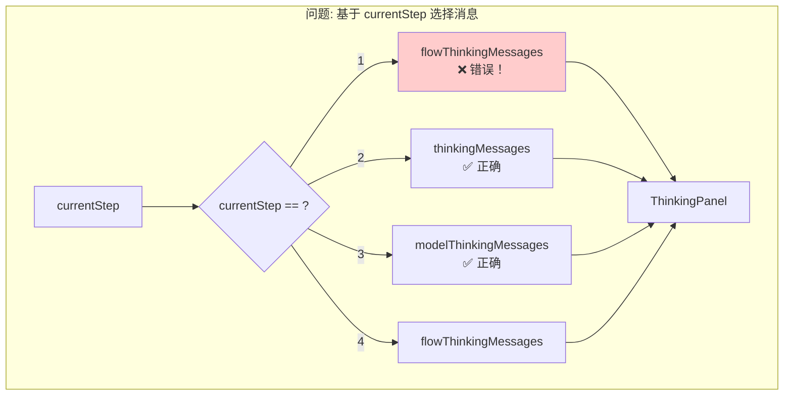
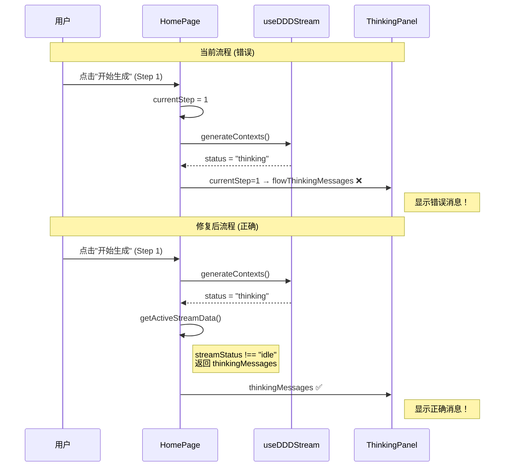
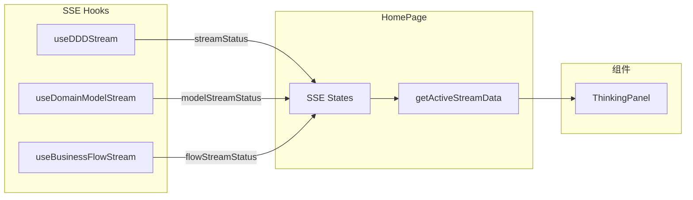
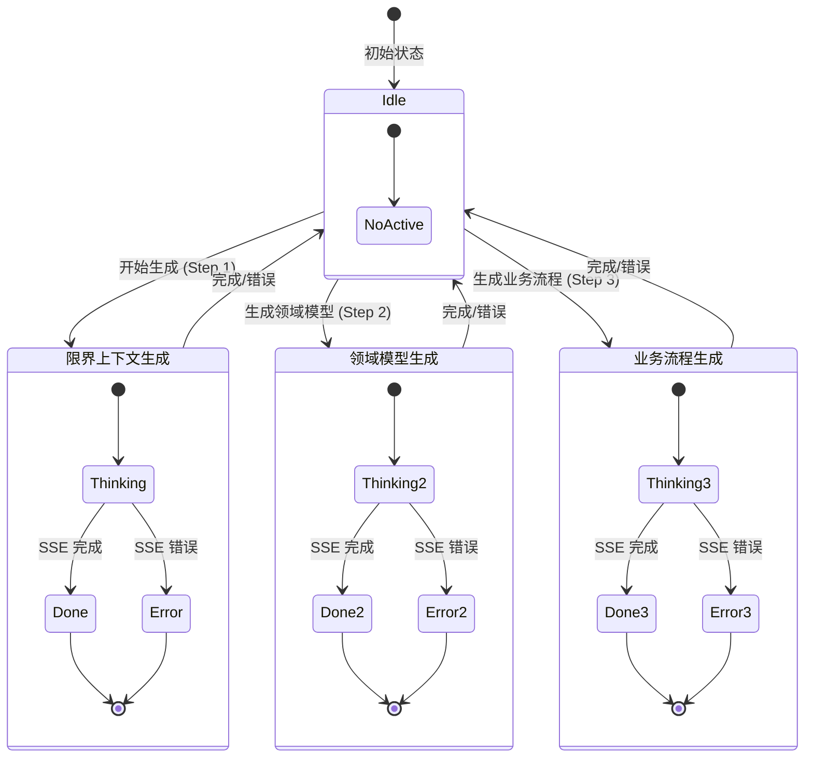

# 架构设计: 首页 AI 思考过程显示修复

**项目**: vibex-homepage-thinking-panel-fix-v2
**版本**: 1.0
**日期**: 2026-03-16
**作者**: Architect Agent

---

## 1. Tech Stack (技术栈选型)

### 1.1 核心技术栈

| 组件 | 选型 | 版本 | 理由 |
|------|------|------|------|
| **前端框架** | React | 18+ | 现有技术栈 |
| **状态管理** | Zustand | 现有 | SSE 状态管理 |
| **SSE Hooks** | 自定义 Hooks | 现有 | useDDDStream, useDomainModelStream, useBusinessFlowStream |
| **组件** | ThinkingPanel | 现有 | 无需修改 |

### 1.2 技术选型对比

| 方案 | 优点 | 缺点 | 推荐度 |
|------|------|------|--------|
| **方案 A: 基于 SSE 状态** | 根治问题，可扩展 | 需要重构逻辑 | ⭐⭐⭐⭐⭐ |
| 方案 B: 调整 currentStep 映射 | 改动最小 | 治标不治本 | ⭐⭐ |
| 方案 C: 新增状态管理 | 独立清晰 | 增加复杂度 | ⭐⭐⭐ |

**结论**: 采用 **方案 A** - 基于 SSE 实际状态选择消息，从根本上解决问题。

---

## 2. Architecture Diagram (架构图)

### 2.1 问题架构



### 2.2 修复后架构

```mermaid
graph TB
    subgraph "修复: 基于 SSE 状态选择消息"
        subgraph "SSE Hooks"
            HOOK_CTX[useDDDStream<br/>限界上下文]
            HOOK_MODEL[useDomainModelStream<br/>领域模型]
            HOOK_FLOW[useBusinessFlowStream<br/>业务流程]
        end
        
        subgraph "状态检测"
            CHECK{检测活跃状态<br/>status !== 'idle'}
            PRIORITY["优先级处理<br/>CTX > MODEL > FLOW"]
        end
        
        subgraph "数据输出"
            OUT[getActiveStreamData()]
            PANEL[ThinkingPanel]
        end
        
        HOOK_CTX --> CHECK
        HOOK_MODEL --> CHECK
        HOOK_FLOW --> CHECK
        
        CHECK --> PRIORITY
        PRIORITY --> OUT
        OUT --> PANEL
    end

    style CHECK fill:#ccffcc
    style PRIORITY fill:#ccffcc
```

### 2.3 数据流对比



### 2.4 模块依赖关系



---

## 3. API Definitions (接口定义)

### 3.1 ActiveStreamData 接口

```typescript
// src/components/homepage/HomePage.tsx

interface ActiveStreamData {
  /** 思考过程消息列表 */
  thinkingMessages: ThinkingStep[];
  
  /** 限界上下文数据 (仅限界上下文生成时有效) */
  contexts?: BoundedContext[];
  
  /** Mermaid 代码 */
  mermaidCode: string;
  
  /** SSE 状态 */
  status: 'idle' | 'thinking' | 'done' | 'error';
  
  /** 错误消息 */
  errorMessage: string | null;
  
  /** 中止函数 */
  onAbort: () => void;
}

/**
 * 获取当前活跃的 SSE 流数据
 * 优先级: 限界上下文 > 领域模型 > 业务流程
 */
function getActiveStreamData(): ActiveStreamData | null;
```

### 3.2 SSE Hook 状态定义

```typescript
// SSE Hook 返回的状态类型
type SSEStatus = 'idle' | 'thinking' | 'done' | 'error';

// useDDDStream 返回值
interface UseDDDStreamReturn {
  thinkingMessages: ThinkingStep[];
  boundedContexts: BoundedContext[];
  mermaidCode: string;
  status: SSEStatus;
  errorMessage: string | null;
  generateContexts: (text: string) => void;
  abort: () => void;
  reset: () => void;
}

// useDomainModelStream 返回值
interface UseDomainModelStreamReturn {
  thinkingMessages: ThinkingStep[];
  domainModels: DomainModel[];
  mermaidCode: string;
  status: SSEStatus;
  errorMessage: string | null;
  generateDomainModels: (text: string, contexts: BoundedContext[]) => void;
  abort: () => void;
  reset: () => void;
}

// useBusinessFlowStream 返回值
interface UseBusinessFlowStreamReturn {
  thinkingMessages: ThinkingStep[];
  businessFlow: BusinessFlow | null;
  mermaidCode: string;
  status: SSEStatus;
  errorMessage: string | null;
  generateBusinessFlow: (text: string, models: DomainModel[]) => void;
  abort: () => void;
  reset: () => void;
}
```

---

## 4. Data Model (数据模型)

### 4.1 状态机设计



### 4.2 状态优先级模型

```typescript
// 状态优先级矩阵
const SSE_PRIORITY = {
  // 优先级: 1 最高, 3 最低
  context: 1,   // useDDDStream - 限界上下文
  model: 2,     // useDomainModelStream - 领域模型
  flow: 3,      // useBusinessFlowStream - 业务流程
} as const;

// 状态检测逻辑
function getActiveStreamData(
  contextData: ContextStreamData,
  modelData: ModelStreamData,
  flowData: FlowStreamData
): ActiveStreamData | null {
  // 按优先级检测活跃状态
  if (contextData.status !== 'idle') {
    return {
      thinkingMessages: contextData.thinkingMessages,
      contexts: contextData.boundedContexts,
      mermaidCode: contextData.mermaidCode,
      status: contextData.status,
      errorMessage: contextData.errorMessage,
      onAbort: contextData.abort,
    };
  }
  
  if (modelData.status !== 'idle') {
    return {
      thinkingMessages: modelData.thinkingMessages,
      contexts: undefined,
      mermaidCode: modelData.mermaidCode,
      status: modelData.status,
      errorMessage: modelData.errorMessage,
      onAbort: modelData.abort,
    };
  }
  
  if (flowData.status !== 'idle') {
    return {
      thinkingMessages: flowData.thinkingMessages,
      contexts: undefined,
      mermaidCode: flowData.mermaidCode,
      status: flowData.status,
      errorMessage: flowData.errorMessage,
      onAbort: flowData.abort,
    };
  }
  
  // 所有状态为 idle，返回 null
  return null;
}
```

---

## 5. Implementation Details (实现细节)

### 5.1 getActiveStreamData 函数实现

```typescript
// src/components/homepage/HomePage.tsx

/**
 * 获取当前活跃的 SSE 流数据
 * 基于实际 SSE 状态而非 currentStep 选择消息
 * 
 * @returns 活跃的流数据，如果所有状态为 idle 则返回 null
 */
function getActiveStreamData(
  // 限界上下文数据
  contextThinking: ThinkingStep[],
  contextContexts: BoundedContext[],
  contextMermaid: string,
  contextStatus: SSEStatus,
  contextError: string | null,
  contextAbort: () => void,
  
  // 领域模型数据
  modelThinking: ThinkingStep[],
  modelMermaid: string,
  modelStatus: SSEStatus,
  modelError: string | null,
  modelAbort: () => void,
  
  // 业务流程数据
  flowThinking: ThinkingStep[],
  flowMermaid: string,
  flowStatus: SSEStatus,
  flowError: string | null,
  flowAbort: () => void
): ActiveStreamData | null {
  
  // 优先级 1: 限界上下文生成
  if (contextStatus !== 'idle') {
    return {
      thinkingMessages: contextThinking,
      contexts: contextContexts,
      mermaidCode: contextMermaid,
      status: contextStatus,
      errorMessage: contextError,
      onAbort: contextAbort,
    };
  }
  
  // 优先级 2: 领域模型生成
  if (modelStatus !== 'idle') {
    return {
      thinkingMessages: modelThinking,
      contexts: undefined,
      mermaidCode: modelMermaid,
      status: modelStatus,
      errorMessage: modelError,
      onAbort: modelAbort,
    };
  }
  
  // 优先级 3: 业务流程生成
  if (flowStatus !== 'idle') {
    return {
      thinkingMessages: flowThinking,
      contexts: undefined,
      mermaidCode: flowMermaid,
      status: flowStatus,
      errorMessage: flowError,
      onAbort: flowAbort,
    };
  }
  
  // 所有状态为 idle
  return null;
}
```

### 5.2 HomePage 组件修改

```tsx
// src/components/homepage/HomePage.tsx

export default function HomePage() {
  // ... 现有 hooks 调用 ...
  
  const {
    thinkingMessages,
    boundedContexts: streamContexts,
    mermaidCode: streamMermaidCode,
    status: streamStatus,
    errorMessage: streamError,
    generateContexts,
    abort: abortContexts,
  } = useDDDStream();

  const {
    thinkingMessages: modelThinkingMessages,
    domainModels: streamDomainModels,
    mermaidCode: modelMermaidCode,
    status: modelStreamStatus,
    errorMessage: modelStreamError,
    generateDomainModels,
    abort: abortModels,
  } = useDomainModelStream();

  const {
    thinkingMessages: flowThinkingMessages,
    businessFlow: streamBusinessFlow,
    mermaidCode: flowMermaidCode,
    status: flowStreamStatus,
    errorMessage: flowStreamError,
    generateBusinessFlow,
    abort: abortFlow,
  } = useBusinessFlowStream();

  // ✅ 新增: 获取活跃的 SSE 流数据
  const activeStream = useMemo(() => {
    return getActiveStreamData(
      // 限界上下文
      thinkingMessages,
      streamContexts,
      streamMermaidCode,
      streamStatus,
      streamError,
      abortContexts,
      
      // 领域模型
      modelThinkingMessages,
      modelMermaidCode,
      modelStreamStatus,
      modelStreamError,
      abortModels,
      
      // 业务流程
      flowThinkingMessages,
      flowMermaidCode,
      flowStreamStatus,
      flowStreamError,
      abortFlow
    );
  }, [
    thinkingMessages, streamContexts, streamMermaidCode, streamStatus, streamError,
    modelThinkingMessages, modelMermaidCode, modelStreamStatus, modelStreamError,
    flowThinkingMessages, flowMermaidCode, flowStreamStatus, flowStreamError,
  ]);

  // ... 其他代码 ...

  return (
    <div className={styles.container}>
      {/* ... 其他内容 ... */}
      
      <div className={styles.aiPanel}>
        {/* ✅ 修复: 基于 activeStream 渲染 ThinkingPanel */}
        {activeStream ? (
          <ThinkingPanel
            thinkingMessages={activeStream.thinkingMessages}
            contexts={activeStream.contexts}
            mermaidCode={activeStream.mermaidCode}
            status={activeStream.status}
            errorMessage={activeStream.errorMessage}
            onAbort={activeStream.onAbort}
            onRetry={() => {
              // 根据 activeStream 状态决定重试逻辑
              if (streamStatus === 'error') {
                generateContexts(requirementText);
              } else if (modelStreamStatus === 'error') {
                generateDomainModels(requirementText, boundedContexts);
              } else if (flowStreamStatus === 'error') {
                generateBusinessFlow(requirementText, domainModels);
              }
            }}
          />
        ) : (
          <div className={styles.aiHeader}>
            <h2>AI 辅助设计</h2>
            <p>输入需求开始生成</p>
          </div>
        )}
      </div>
    </div>
  );
}
```

### 5.3 修改前后对比

```tsx
// ❌ 修改前 (错误)
<ThinkingPanel
  thinkingMessages={
    currentStep === 2 ? thinkingMessages : 
    currentStep === 3 ? modelThinkingMessages : 
    flowThinkingMessages  // Step 1 会走这里，但这是业务流程的消息！
  }
  contexts={currentStep === 2 ? streamContexts : undefined}
  mermaidCode={
    currentStep === 2 ? streamMermaidCode : 
    currentStep === 3 ? modelMermaidCode : 
    flowMermaidCode
  }
  status={
    currentStep === 2 ? streamStatus : 
    currentStep === 3 ? modelStreamStatus : 
    flowStreamStatus
  }
  errorMessage={
    currentStep === 2 ? streamError : 
    currentStep === 3 ? modelStreamError : 
    flowStreamError
  }
  onAbort={
    currentStep === 2 ? abortContexts : 
    currentStep === 3 ? abortModels : 
    abortFlow
  }
/>

// ✅ 修改后 (正确)
{activeStream ? (
  <ThinkingPanel
    thinkingMessages={activeStream.thinkingMessages}
    contexts={activeStream.contexts}
    mermaidCode={activeStream.mermaidCode}
    status={activeStream.status}
    errorMessage={activeStream.errorMessage}
    onAbort={activeStream.onAbort}
  />
) : (
  <DefaultView />
)}
```

---

## 6. Testing Strategy (测试策略)

### 6.1 测试框架

| 测试类型 | 框架 | 工具 | 覆盖率目标 |
|----------|------|------|-----------|
| 单元测试 | Jest | @testing-library/react | ≥ 90% |
| 组件测试 | Jest | @testing-library/react | ≥ 85% |
| E2E 测试 | Playwright | - | 关键路径 100% |

### 6.2 核心测试用例

#### 6.2.1 getActiveStreamData 单元测试

```typescript
// __tests__/getActiveStreamData.test.ts

describe('getActiveStreamData', () => {
  const mockThinkingMessages = [{ step: 'test', content: 'thinking...' }];
  
  it('should return context data when contextStatus is thinking', () => {
    const result = getActiveStreamData(
      mockThinkingMessages, [], '', 'thinking', null, () => {},
      [], '', 'idle', null, () => {},
      [], '', 'idle', null, () => {}
    );
    
    expect(result).not.toBeNull();
    expect(result?.thinkingMessages).toEqual(mockThinkingMessages);
    expect(result?.status).toBe('thinking');
  });

  it('should return model data when only modelStatus is thinking', () => {
    const modelThinking = [{ step: 'model', content: 'generating...' }];
    
    const result = getActiveStreamData(
      [], [], '', 'idle', null, () => {},
      modelThinking, '', 'thinking', null, () => {},
      [], '', 'idle', null, () => {}
    );
    
    expect(result).not.toBeNull();
    expect(result?.thinkingMessages).toEqual(modelThinking);
  });

  it('should prioritize context over model', () => {
    const contextThinking = [{ step: 'ctx', content: 'context' }];
    const modelThinking = [{ step: 'model', content: 'model' }];
    
    const result = getActiveStreamData(
      contextThinking, [], '', 'thinking', null, () => {},
      modelThinking, '', 'thinking', null, () => {},
      [], '', 'idle', null, () => {}
    );
    
    expect(result?.thinkingMessages).toEqual(contextThinking);
  });

  it('should return null when all statuses are idle', () => {
    const result = getActiveStreamData(
      [], [], '', 'idle', null, () => {},
      [], [], '', 'idle', null, () => {},
      [], [], '', 'idle', null, () => {}
    );
    
    expect(result).toBeNull();
  });

  it('should return error message correctly', () => {
    const result = getActiveStreamData(
      [], [], '', 'error', 'API failed', () => {},
      [], '', 'idle', null, () => {},
      [], '', 'idle', null, () => {}
    );
    
    expect(result?.status).toBe('error');
    expect(result?.errorMessage).toBe('API failed');
  });
});
```

#### 6.2.2 HomePage 组件测试

```typescript
// __tests__/HomePage.thinkingPanel.test.tsx

import { render, screen, waitFor } from '@testing-library/react';
import userEvent from '@testing-library/user-event';
import HomePage from '@/components/homepage/HomePage';

// Mock hooks
jest.mock('@/hooks/useDDDStream', () => ({
  useDDDStream: () => ({
    thinkingMessages: [{ step: 'ctx', content: 'analyzing...' }],
    boundedContexts: [],
    mermaidCode: '',
    status: 'thinking',
    errorMessage: null,
    generateContexts: jest.fn(),
    abort: jest.fn(),
  }),
}));

jest.mock('@/hooks/useDomainModelStream', () => ({
  useDomainModelStream: () => ({
    thinkingMessages: [],
    domainModels: [],
    mermaidCode: '',
    status: 'idle',
    errorMessage: null,
    generateDomainModels: jest.fn(),
    abort: jest.fn(),
  }),
}));

jest.mock('@/hooks/useBusinessFlowStream', () => ({
  useBusinessFlowStream: () => ({
    thinkingMessages: [],
    businessFlow: null,
    mermaidCode: '',
    status: 'idle',
    errorMessage: null,
    generateBusinessFlow: jest.fn(),
    abort: jest.fn(),
  }),
}));

describe('HomePage ThinkingPanel', () => {
  it('should show context thinking messages when contextStatus is thinking', async () => {
    render(<HomePage />);
    
    // 验证显示限界上下文的消息
    expect(screen.getByText('analyzing...')).toBeInTheDocument();
  });

  it('should call correct abort function', async () => {
    const mockAbort = jest.fn();
    jest.mock('@/hooks/useDDDStream', () => ({
      useDDDStream: () => ({
        thinkingMessages: [{ step: 'ctx', content: 'analyzing...' }],
        status: 'thinking',
        abort: mockAbort,
      }),
    }));
    
    render(<HomePage />);
    
    const abortButton = screen.getByRole('button', { name: /abort/i });
    await userEvent.click(abortButton);
    
    expect(mockAbort).toHaveBeenCalled();
  });
});
```

#### 6.2.3 E2E 测试

```typescript
// e2e/thinking-panel.spec.ts

import { test, expect } from '@playwright/test';

test.describe('ThinkingPanel Display', () => {
  test('should show context thinking messages in Step 1', async ({ page }) => {
    await page.goto('/');
    
    // 输入需求
    await page.fill('[data-testid="requirement-input"]', '开发一个电商系统');
    
    // 点击开始生成
    await page.click('button:has-text("开始生成")');
    
    // 验证 AI 面板显示限界上下文的消息
    await expect(page.locator('.thinking-panel')).toBeVisible();
    
    // 验证显示正确的步骤名称（限界上下文相关的）
    await expect(page.locator('text=/分析需求|识别领域|定义上下文/')).toBeVisible();
  });

  test('should switch messages correctly between steps', async ({ page }) => {
    await page.goto('/');
    
    // Step 1: 限界上下文生成
    await page.fill('[data-testid="requirement-input"]', '电商系统');
    await page.click('button:has-text("开始生成")');
    
    await expect(page.locator('.thinking-panel')).toContainText('分析');
    
    // 等待完成
    await expect(page.locator('.step-complete')).toBeVisible({ timeout: 60000 });
    
    // Step 2: 领域模型生成
    await page.click('button:has-text("生成领域模型")');
    
    await expect(page.locator('.thinking-panel')).toContainText(/模型|实体/);
  });

  test('should show error message on API failure', async ({ page }) => {
    // Mock API 失败
    await page.route('**/api/ddd/bounded-context/stream', route => {
      route.abort('failed');
    });
    
    await page.goto('/');
    await page.fill('[data-testid="requirement-input"]', '测试');
    await page.click('button:has-text("开始生成")');
    
    await expect(page.locator('.error-message')).toBeVisible({ timeout: 10000 });
  });
});
```

### 6.3 测试覆盖率目标

| 模块 | 目标覆盖率 |
|------|-----------|
| getActiveStreamData | 100% |
| HomePage (ThinkingPanel 部分) | 90% |
| E2E 关键路径 | 100% |

---

## 7. Implementation Roadmap (实施路线图)

### Phase 1: 实现核心函数 (0.5h)

| 步骤 | 工时 | 产出物 |
|------|------|--------|
| 1.1 实现 getActiveStreamData | 0.5h | 函数代码 |
| 1.2 单元测试 | 0.5h | 测试用例 |

### Phase 2: 组件修改 (0.5h)

| 步骤 | 工时 | 产出物 |
|------|------|--------|
| 2.1 修改 HomePage | 0.5h | 组件代码 |
| 2.2 组件测试 | 0.5h | 测试用例 |

### Phase 3: 集成验证 (1h)

| 步骤 | 工时 | 内容 |
|------|------|------|
| 3.1 手动测试 | 0.5h | 功能验证 |
| 3.2 E2E 测试 | 0.5h | 自动化测试 |

**总工期**: 2.5h

---

## 8. 风险评估

| 风险 | 等级 | 影响 | 缓解措施 |
|------|------|------|----------|
| 多 SSE 同时活跃 | 🟢 低 | 消息混乱 | 优先级处理 |
| 状态检测遗漏 | 🟢 低 | 消息不显示 | 默认状态处理 |
| 回归影响其他步骤 | 🟡 中 | 功能异常 | 完整回归测试 |

---

## 9. Acceptance Criteria (验收标准)

### 9.1 功能验收

- [ ] AC1.1: Step 1 点击"开始生成"后显示限界上下文消息
- [ ] AC1.2: Step 2 点击"生成领域模型"后显示领域模型消息
- [ ] AC1.3: Step 3 点击"生成业务流程"后显示业务流程消息
- [ ] AC1.4: 所有 SSE 状态为 idle 时显示默认空状态

### 9.2 状态验收

- [ ] AC2.1: 限界上下文生成状态优先级最高
- [ ] AC2.2: 领域模型生成状态优先级次之
- [ ] AC2.3: 业务流程生成状态优先级最低

### 9.3 错误验收

- [ ] AC3.1: SSE 错误时显示 errorMessage
- [ ] AC3.2: 重试按钮绑定到正确的函数

### 9.4 验证命令

```bash
# 运行单元测试
npm test -- --testPathPattern="getActiveStreamData|HomePage"

# 运行 E2E 测试
npm run test:e2e -- --grep "ThinkingPanel"

# 构建检查
npm run build
```

---

## 10. References (参考文档)

| 文档 | 路径 |
|------|------|
| 需求分析 | `/root/.openclaw/vibex/docs/vibex-homepage-thinking-panel-fix-v2/analysis.md` |
| PRD | `/root/.openclaw/vibex/docs/prd/vibex-homepage-thinking-panel-fix-v2-prd.md` |

---

**产出物**: `/root/.openclaw/vibex/docs/vibex-homepage-thinking-panel-fix-v2/architecture.md`
**作者**: Architect Agent
**日期**: 2026-03-16