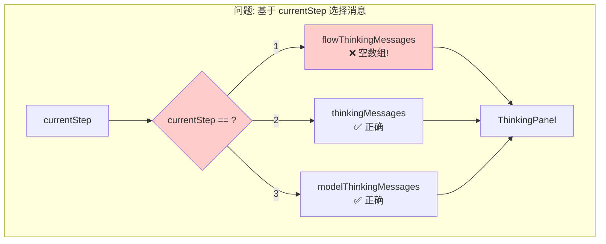
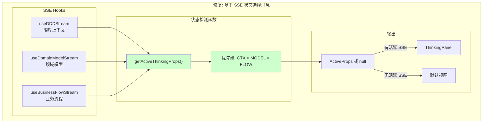
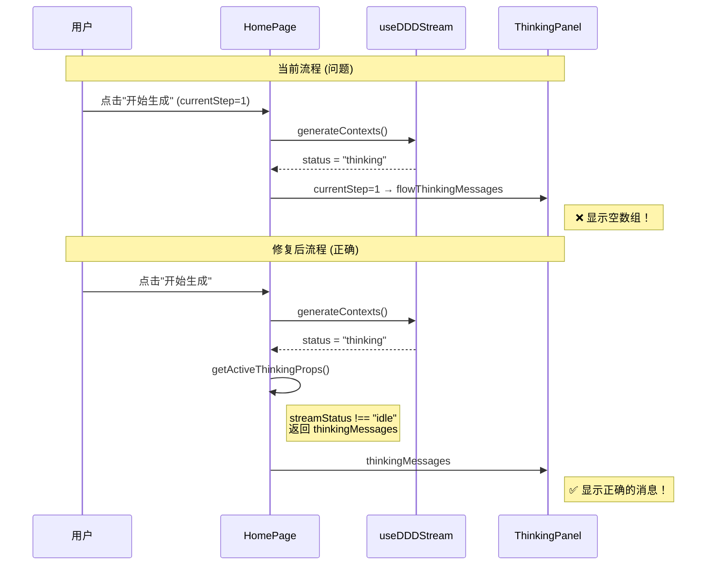
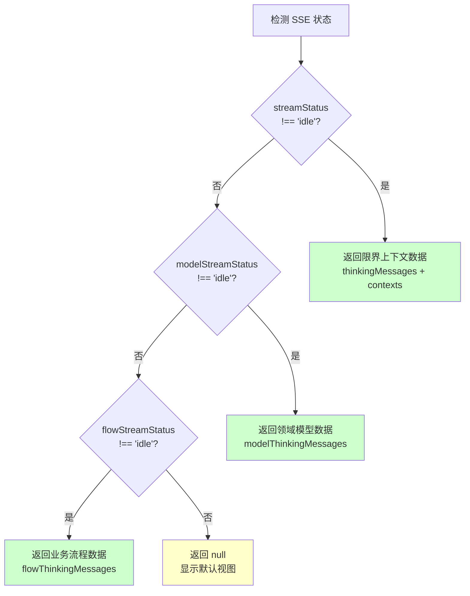

# 架构设计: 首页 ThinkingPanel 修复

**项目**: vibex-homepage-thinking-panel-fix
**版本**: 1.0
**日期**: 2026-03-16
**作者**: Architect Agent

---

## 1. Tech Stack (技术栈选型)

### 1.1 核心技术栈

| 组件 | 选型 | 版本 | 理由 |
|------|------|------|------|
| **前端框架** | React | 18+ | 现有技术栈 |
| **状态管理** | Zustand | 现有 | SSE 状态管理 |
| **SSE Hooks** | 自定义 Hooks | 现有 | useDDDStream, useDomainModelStream, useBusinessFlowStream |
| **组件** | ThinkingPanel | 现有 | 无需修改组件本身 |

### 1.2 技术选型对比

| 方案 | 优点 | 缺点 | 推荐度 |
|------|------|------|--------|
| **方案 A: 提取 getActiveThinkingProps** | 逻辑清晰、易维护、可扩展 | 需要新增函数 | ⭐⭐⭐⭐⭐ |
| 方案 B: 内联条件修改 | 改动最小 | 条件重复、可读性差 | ⭐⭐⭐ |

**结论**: 采用 **方案 A** - 提取 `getActiveThinkingProps` 函数，基于 SSE 实际状态选择消息。

---

## 2. Architecture Diagram (架构图)

### 2.1 问题架构



### 2.2 修复后架构



### 2.3 数据流对比



### 2.4 状态选择逻辑



---

## 3. API Definitions (接口定义)

### 3.1 ActiveThinkingProps 接口

```typescript
// src/components/homepage/HomePage.tsx

interface ActiveThinkingProps {
  /** 思考过程消息列表 */
  thinkingMessages: ThinkingStep[];
  
  /** 限界上下文数据 (仅限界上下文生成时有效) */
  contexts?: BoundedContext[];
  
  /** Mermaid 代码 */
  mermaidCode: string;
  
  /** SSE 状态 */
  status: 'idle' | 'thinking' | 'done' | 'error';
  
  /** 错误消息 */
  errorMessage: string | null;
  
  /** 中止函数 */
  onAbort: () => void;
  
  /** 重试函数 */
  onRetry: () => void;
}

/**
 * 获取当前活跃的思考面板 Props
 * 基于 SSE 状态而非 currentStep 选择
 * 优先级: 限界上下文 > 领域模型 > 业务流程
 */
function getActiveThinkingProps(): ActiveThinkingProps | null;
```

### 3.2 函数签名

```typescript
/**
 * 获取活跃 SSE 的思考面板属性
 * 
 * @param contextData - 限界上下文 SSE 数据
 * @param modelData - 领域模型 SSE 数据
 * @param flowData - 业务流程 SSE 数据
 * @returns 活跃的思考面板属性，如果所有 SSE 都空闲则返回 null
 */
function getActiveThinkingProps(
  // 限界上下文
  thinkingMessages: ThinkingStep[],
  contexts: BoundedContext[],
  mermaidCode: string,
  status: SSEStatus,
  errorMessage: string | null,
  onAbort: () => void,
  onRetry: () => void,
  
  // 领域模型
  modelThinkingMessages: ThinkingStep[],
  modelMermaidCode: string,
  modelStatus: SSEStatus,
  modelErrorMessage: string | null,
  onModelAbort: () => void,
  onModelRetry: () => void,
  
  // 业务流程
  flowThinkingMessages: ThinkingStep[],
  flowMermaidCode: string,
  flowStatus: SSEStatus,
  flowErrorMessage: string | null,
  onFlowAbort: () => void,
  onFlowRetry: () => void
): ActiveThinkingProps | null;
```

---

## 4. Data Model (数据模型)

### 4.1 状态映射

| SSE Hook | 状态字段 | 思考消息字段 | 数据字段 |
|----------|----------|-------------|----------|
| useDDDStream | streamStatus | thinkingMessages | boundedContexts, mermaidCode |
| useDomainModelStream | modelStreamStatus | modelThinkingMessages | domainModels, modelMermaidCode |
| useBusinessFlowStream | flowStreamStatus | flowThinkingMessages | businessFlow, flowMermaidCode |

### 4.2 状态优先级

```typescript
// 优先级定义
const SSE_PRIORITY = {
  context: 1,   // 限界上下文 - 最高优先级
  model: 2,     // 领域模型
  flow: 3,      // 业务流程 - 最低优先级
} as const;
```

### 4.3 ThinkingStep 数据结构

```typescript
interface ThinkingStep {
  step: string;        // 步骤标识
  content: string;     // 思考内容
  progress?: number;   // 进度百分比
}
```

---

## 5. Implementation Details (实现细节)

### 5.1 getActiveThinkingProps 实现

```typescript
// src/components/homepage/HomePage.tsx

/**
 * 获取当前活跃 SSE 的思考面板属性
 * 修复问题: 基于 SSE 状态而非 currentStep 选择消息
 */
const getActiveThinkingProps = useCallback((): ActiveThinkingProps | null => {
  // 优先级 1: 限界上下文生成
  if (streamStatus !== 'idle') {
    return {
      thinkingMessages,
      contexts: streamContexts,
      mermaidCode: streamMermaidCode,
      status: streamStatus,
      errorMessage: streamError,
      onAbort: abortContexts,
      onRetry: handleGenerate,
    };
  }
  
  // 优先级 2: 领域模型生成
  if (modelStreamStatus !== 'idle') {
    return {
      thinkingMessages: modelThinkingMessages,
      contexts: undefined,
      mermaidCode: modelMermaidCode,
      status: modelStreamStatus,
      errorMessage: modelStreamError,
      onAbort: abortModels,
      onRetry: handleGenerateDomainModel,
    };
  }
  
  // 优先级 3: 业务流程生成
  if (flowStreamStatus !== 'idle') {
    return {
      thinkingMessages: flowThinkingMessages,
      contexts: undefined,
      mermaidCode: flowMermaidCode,
      status: flowStreamStatus,
      errorMessage: flowStreamError,
      onAbort: abortFlow,
      onRetry: handleGenerateBusinessFlow,
    };
  }
  
  // 所有 SSE 都空闲
  return null;
}, [
  thinkingMessages, streamContexts, streamMermaidCode, streamStatus, streamError, abortContexts,
  modelThinkingMessages, modelMermaidCode, modelStreamStatus, modelStreamError, abortModels,
  flowThinkingMessages, flowMermaidCode, flowStreamStatus, flowStreamError, abortFlow,
  handleGenerate, handleGenerateDomainModel, handleGenerateBusinessFlow,
]);
```

### 5.2 HomePage 组件修改

```tsx
// src/components/homepage/HomePage.tsx

export default function HomePage() {
  // ... 现有 hooks ...
  
  const {
    thinkingMessages,
    boundedContexts: streamContexts,
    mermaidCode: streamMermaidCode,
    status: streamStatus,
    errorMessage: streamError,
    generateContexts,
    abort: abortContexts,
  } = useDDDStream();

  const {
    thinkingMessages: modelThinkingMessages,
    mermaidCode: modelMermaidCode,
    status: modelStreamStatus,
    errorMessage: modelStreamError,
    generateDomainModels,
    abort: abortModels,
  } = useDomainModelStream();

  const {
    thinkingMessages: flowThinkingMessages,
    mermaidCode: flowMermaidCode,
    status: flowStreamStatus,
    errorMessage: flowStreamError,
    generateBusinessFlow,
    abort: abortFlow,
  } = useBusinessFlowStream();

  // ✅ 新增: 获取活跃的思考面板属性
  const activeThinkingProps = getActiveThinkingProps();

  // ... 其他代码 ...

  return (
    <div className={styles.container}>
      {/* ... 左侧内容 ... */}
      
      <div className={styles.aiPanel}>
        {/* ✅ 修复: 基于 activeThinkingProps 渲染 */}
        {activeThinkingProps ? (
          <ThinkingPanel
            thinkingMessages={activeThinkingProps.thinkingMessages}
            contexts={activeThinkingProps.contexts}
            mermaidCode={activeThinkingProps.mermaidCode}
            status={activeThinkingProps.status}
            errorMessage={activeThinkingProps.errorMessage}
            onAbort={activeThinkingProps.onAbort}
            onRetry={activeThinkingProps.onRetry}
            onUseDefault={handleGenerate}
          />
        ) : (
          <div className={styles.aiHeader}>
            <h2>AI 设计助手</h2>
            <p>输入您的需求，AI 将帮您设计系统架构</p>
          </div>
        )}
      </div>
    </div>
  );
}
```

### 5.3 修改前后对比

```tsx
// ❌ 修改前 (错误)
<ThinkingPanel
  thinkingMessages={
    currentStep === 2 ? thinkingMessages : 
    currentStep === 3 ? modelThinkingMessages : 
    flowThinkingMessages  // Step 1 返回这个，但这是空的！
  }
  status={
    currentStep === 2 ? streamStatus : 
    currentStep === 3 ? modelStreamStatus : 
    flowStreamStatus
  }
  // ...
/>

// ✅ 修改后 (正确)
const activeThinkingProps = getActiveThinkingProps();

{activeThinkingProps ? (
  <ThinkingPanel {...activeThinkingProps} onUseDefault={handleGenerate} />
) : (
  <div className={styles.aiHeader}>...</div>
)}
```

---

## 6. Testing Strategy (测试策略)

### 6.1 测试框架

| 测试类型 | 框架 | 覆盖率目标 |
|----------|------|-----------|
| 单元测试 | Jest | ≥ 90% |
| 组件测试 | @testing-library/react | ≥ 85% |
| E2E 测试 | Playwright | 关键路径 100% |

### 6.2 核心测试用例

#### 6.2.1 getActiveThinkingProps 单元测试

```typescript
// __tests__/getActiveThinkingProps.test.ts

describe('getActiveThinkingProps', () => {
  const mockThinkingMessages = [{ step: 'analyze', content: 'analyzing...' }];

  it('should return context data when streamStatus is thinking', () => {
    const props = getActiveThinkingProps(
      mockThinkingMessages, [], '', 'thinking', null, jest.fn(), jest.fn(),
      [], '', 'idle', null, jest.fn(), jest.fn(),
      [], '', 'idle', null, jest.fn(), jest.fn()
    );

    expect(props).not.toBeNull();
    expect(props?.thinkingMessages).toEqual(mockThinkingMessages);
    expect(props?.status).toBe('thinking');
  });

  it('should prioritize context over model', () => {
    const contextThinking = [{ step: 'ctx', content: 'context' }];
    const modelThinking = [{ step: 'model', content: 'model' }];

    const props = getActiveThinkingProps(
      contextThinking, [], '', 'thinking', null, jest.fn(), jest.fn(),
      modelThinking, '', 'thinking', null, jest.fn(), jest.fn(),
      [], '', 'idle', null, jest.fn(), jest.fn()
    );

    expect(props?.thinkingMessages).toEqual(contextThinking);
  });

  it('should return null when all statuses are idle', () => {
    const props = getActiveThinkingProps(
      [], [], '', 'idle', null, jest.fn(), jest.fn(),
      [], '', 'idle', null, jest.fn(), jest.fn(),
      [], '', 'idle', null, jest.fn(), jest.fn()
    );

    expect(props).toBeNull();
  });

  it('should return error message correctly', () => {
    const props = getActiveThinkingProps(
      [], [], '', 'error', 'API failed', jest.fn(), jest.fn(),
      [], '', 'idle', null, jest.fn(), jest.fn(),
      [], '', 'idle', null, jest.fn(), jest.fn()
    );

    expect(props?.status).toBe('error');
    expect(props?.errorMessage).toBe('API failed');
  });
});
```

#### 6.2.2 E2E 测试

```typescript
// e2e/thinking-panel.spec.ts

import { test, expect } from '@playwright/test';

test.describe('ThinkingPanel Display Fix', () => {
  test('should show context thinking messages in Step 1', async ({ page }) => {
    await page.goto('/');
    
    // 输入需求
    await page.fill('[data-testid="requirement-input"]', '开发一个电商系统');
    
    // 点击开始生成
    await page.click('button:has-text("开始生成")');
    
    // 验证 AI 面板显示限界上下文消息
    await expect(page.locator('.thinking-panel')).toBeVisible();
    await expect(page.locator('text=/分析需求|识别领域|定义上下文/')).toBeVisible();
  });

  test('should switch messages correctly between steps', async ({ page }) => {
    await page.goto('/');
    
    // Step 1
    await page.fill('[data-testid="requirement-input"]', '电商系统');
    await page.click('button:has-text("开始生成")');
    
    await expect(page.locator('.thinking-panel')).toContainText(/分析|需求/);
    
    // 等待完成
    await expect(page.locator('.step-complete')).toBeVisible({ timeout: 60000 });
    
    // Step 2
    await page.click('button:has-text("生成领域模型")');
    
    await expect(page.locator('.thinking-panel')).toContainText(/模型|实体/);
  });
});
```

### 6.3 测试验证清单

```markdown
## 测试验证清单

### 正向测试 (≥2 案例)
- [ ] TC-01: Step 1 点击"开始生成" → 显示限界上下文思考消息
- [ ] TC-02: Step 2 点击"生成领域模型" → 显示领域模型思考消息

### 反向测试 (≥2 案例)
- [ ] TC-03: 所有 SSE 空闲 → 显示默认视图
- [ ] TC-04: SSE 错误 → 显示错误消息

### 边界测试 (≥1 案例)
- [ ] TC-05: 多 SSE 同时活跃 → 优先级正确处理
```

---

## 7. Implementation Roadmap (实施路线图)

### Phase 1: 实现核心函数 (0.5h)

| 步骤 | 工时 | 产出物 |
|------|------|--------|
| 1.1 实现 getActiveThinkingProps | 0.5h | 函数代码 |

### Phase 2: 组件修改 (0.5h)

| 步骤 | 工时 | 产出物 |
|------|------|--------|
| 2.1 修改 HomePage 渲染逻辑 | 0.5h | 组件代码 |

### Phase 3: 测试验证 (1h)

| 步骤 | 工时 | 内容 |
|------|------|------|
| 3.1 单元测试 | 0.5h | Jest 测试 |
| 3.2 E2E 测试 | 0.5h | Playwright 测试 |

**总工期**: 2h

---

## 8. 风险评估

| 风险 | 等级 | 影响 | 缓解措施 |
|------|------|------|----------|
| 多 SSE 同时活跃 | 🟢 低 | 消息混乱 | 优先级处理 |
| 回归影响其他步骤 | 🟡 中 | 功能异常 | 完整回归测试 |
| 样式问题 | 🟢 低 | UI 异常 | 响应式验证 |

---

## 9. Acceptance Criteria (验收标准)

### 9.1 功能验收

- [ ] AC1.1: `streamStatus !== 'idle'` 时显示 `thinkingMessages`
- [ ] AC1.2: `modelStreamStatus !== 'idle'` 时显示 `modelThinkingMessages`
- [ ] AC1.3: `flowStreamStatus !== 'idle'` 时显示 `flowThinkingMessages`
- [ ] AC1.4: 所有 SSE 空闲时显示默认视图

### 9.2 验收命令

```bash
# 运行测试
npm test -- --testPathPattern="getActiveThinkingProps|HomePage"

# E2E 测试
npm run test:e2e -- --grep "ThinkingPanel"

# 构建
npm run build
```

---

## 10. 关于 /confirm 页面

### 10.1 建议

**不建议删除 `/confirm` 页面**，原因：

1. **历史兼容**：可能有外部链接指向 `/confirm`
2. **功能差异**：`/confirm` 使用 `confirmationStore` 全局状态
3. **回退方案**：可作为 SSE 失败时的备选入口

### 10.2 后续行动

- 监控两个页面的使用量
- 在首页添加导航提示
- 根据数据决定是否下线

---

## 11. References (参考文档)

| 文档 | 路径 |
|------|------|
| 需求分析 | `/root/.openclaw/vibex/docs/vibex-homepage-thinking-panel-fix/analysis.md` |
| PRD | `/root/.openclaw/vibex/docs/prd/vibex-homepage-thinking-panel-fix-prd.md` |

---

**产出物**: `/root/.openclaw/vibex/docs/vibex-homepage-thinking-panel-fix/architecture.md`
**作者**: Architect Agent
**日期**: 2026-03-16