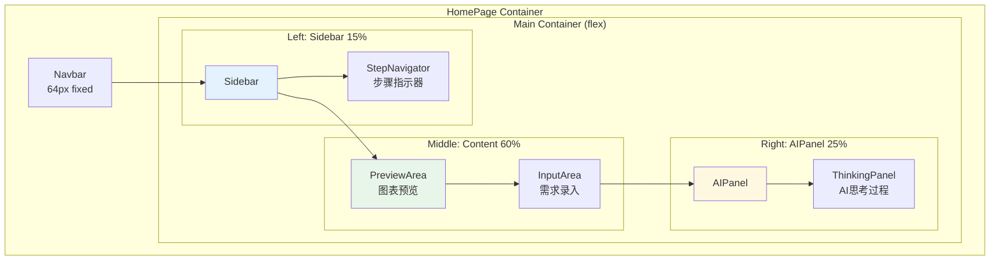
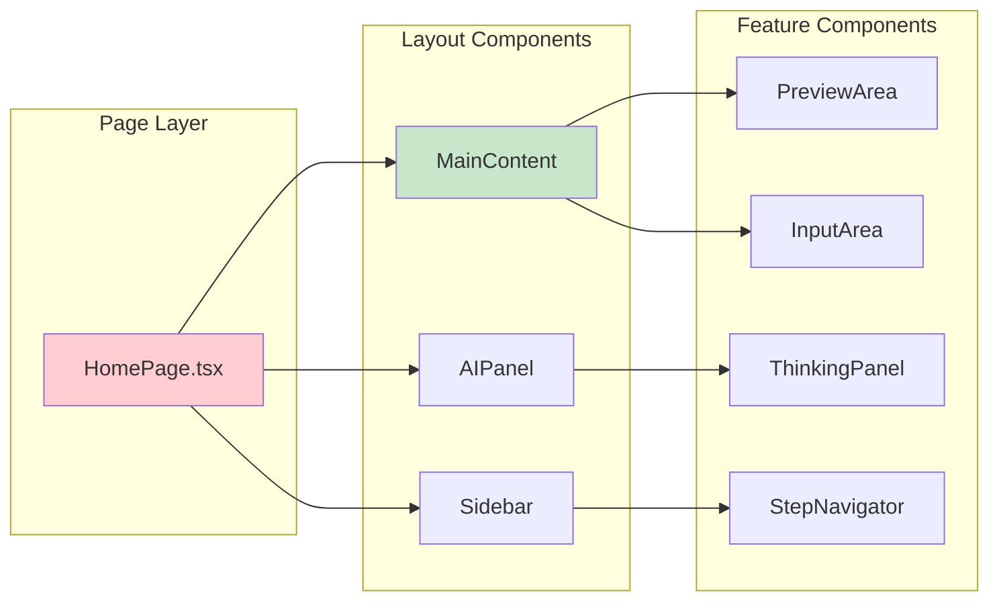
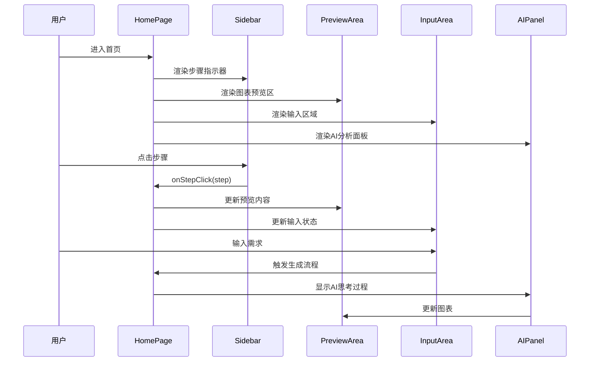
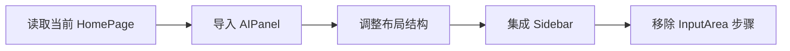
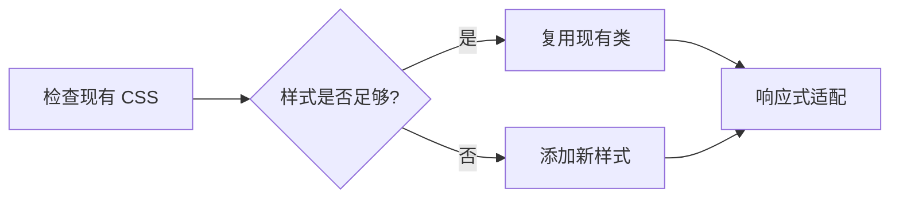
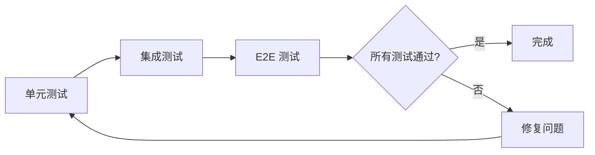

# Architecture: 首页三栏布局恢复

**项目**: vibex-homepage-three-column-layout
**架构师**: Architect Agent
**日期**: 2026-03-17
**状态**: ✅ 设计完成

---

## 1. Tech Stack (版本选择及理由)

### 1.1 现有技术栈

| 技术 | 版本 | 理由 |
|------|------|------|
| React | 19.2.3 | 已有，支持 Hooks |
| Next.js | 16.1.6 | 已有，App Router |
| CSS Modules | 内置 | 已有样式方案 |
| Framer Motion | 12.35.2 | 已有动画库 |

### 1.2 复用组件

| 组件 | 路径 | 状态 |
|------|------|------|
| Sidebar | `components/homepage/Sidebar/Sidebar.tsx` | ✅ 可复用 |
| MainContent | `components/homepage/MainContent.tsx` | ✅ 可复用 |
| AIPanel | `components/homepage/AIPanel/AIPanel.tsx` | ✅ 可复用 |
| ThinkingPanel | `components/homepage/ThinkingPanel/ThinkingPanel.tsx` | ✅ 可复用 |
| PreviewArea | `components/homepage/PreviewArea/PreviewArea.tsx` | ✅ 可复用 |
| InputArea | `components/homepage/InputArea/InputArea.tsx` | ⚠️ 需调整 |

---

## 2. Architecture Diagram (Mermaid)

### 2.1 目标布局架构



### 2.2 组件依赖关系



### 2.3 数据流架构



---

## 3. API Definitions (接口签名)

### 3.1 HomePage Props

```typescript
// src/components/homepage/HomePage.tsx

interface HomePageProps {
  // 无外部 props，使用内部状态
}

// 内部状态接口
interface HomePageState {
  currentStep: StepId;
  completedStep: StepId | null;
  mermaidCode: string;
  thinkingMessages: ThinkingMessage[];
  streamStatus: StreamStatus;
}

type StepId = 1 | 2 | 3 | 4 | 5;

type StreamStatus = 'idle' | 'streaming' | 'done' | 'error';

interface ThinkingMessage {
  id: string;
  type: 'thinking' | 'result' | 'error';
  content: string;
  timestamp: number;
}
```

### 3.2 Sidebar Props

```typescript
// src/components/homepage/Sidebar/Sidebar.tsx

interface SidebarProps {
  steps: StepConfig[];
  currentStep: StepId;
  completedStep: StepId | null;
  onStepClick: (step: StepId) => void;
}

interface StepConfig {
  id: StepId;
  title: string;
  description: string;
  icon?: React.ReactNode;
}
```

### 3.3 MainContent Props

```typescript
// src/components/homepage/MainContent.tsx

interface MainContentProps {
  layout?: 'horizontal' | 'vertical';  // 布局模式
  preview?: React.ReactNode;           // 预览组件
  input?: React.ReactNode;             // 输入组件
  mermaidCode?: string;                // Mermaid 代码
  currentStep?: StepId;                // 当前步骤
  onStepClick?: (step: StepId) => void;
  steps?: StepConfig[];
}
```

### 3.4 AIPanel Props

```typescript
// src/components/homepage/AIPanel/AIPanel.tsx

interface AIPanelProps {
  thinkingMessages: ThinkingMessage[];
  status: StreamStatus;
  isCollapsed?: boolean;
  onToggleCollapse?: () => void;
}
```

### 3.5 InputArea Props (调整后)

```typescript
// src/components/homepage/InputArea/InputArea.tsx

interface InputAreaProps {
  // 移除: steps, currentStep, onStepClick (已移到 Sidebar)
  
  value: string;
  onChange: (value: string) => void;
  onSubmit: () => void;
  isDisabled: boolean;
  placeholder?: string;
  examples?: string[];
}
```

---

## 4. Data Model (核心实体关系)

### 4.1 布局状态模型

```mermaid
erDiagram
    HomePage ||--|| LayoutState : manages
    LayoutState ||--|{ Step : tracks
    LayoutState ||--|| StreamStatus : monitors
    
    HomePage {
        string currentStep
        string completedStep
        string mermaidCode
        string[] thinkingMessages
        string streamStatus
    }
    
    LayoutState {
        string layout "horizontal"
        number sidebarWidth 15
        number contentWidth 60
        number aiPanelWidth 25
    }
    
    Step {
        string id PK
        string title
        string description
        boolean isCompleted
        boolean isCurrent
    }
    
    StreamStatus {
        string status "idle|streaming|done|error"
    }
```

### 4.2 步骤配置常量

```typescript
// src/components/homepage/constants.ts

export const STEPS: StepConfig[] = [
  { id: 1, title: '需求分析', description: '输入业务需求' },
  { id: 2, title: '上下文划分', description: '识别限界上下文' },
  { id: 3, title: '领域建模', description: '生成领域模型' },
  { id: 4, title: '业务流程', description: '设计业务流程' },
  { id: 5, title: '生成代码', description: '输出项目代码' },
];
```

---

## 5. Testing Strategy (测试契约)

### 5.1 测试框架

| 类型 | 框架 | 覆盖目标 |
|------|------|----------|
| Unit Tests | Jest + React Testing Library | 组件渲染 > 80% |
| Integration Tests | Jest | 布局集成 > 70% |
| E2E Tests | Playwright | 用户流程 > 90% |

### 5.2 核心测试用例

```typescript
// src/components/homepage/__tests__/HomePage.test.tsx

describe('HomePage Three-Column Layout', () => {
  // TC-001: 三栏布局宽度比例
  it('should render three-column layout with correct proportions', () => {
    render(<HomePage />);
    
    const sidebar = screen.getByTestId('sidebar');
    const content = screen.getByTestId('main-content');
    const aiPanel = screen.getByTestId('ai-panel');
    
    expect(sidebar).toHaveStyle({ width: '15%' });
    expect(content).toHaveStyle({ width: '60%' });
    expect(aiPanel).toHaveStyle({ width: '25%' });
  });

  // TC-002: 步骤指示器在左栏
  it('should render StepNavigator in Sidebar', () => {
    render(<HomePage />);
    
    const sidebar = screen.getByTestId('sidebar');
    const stepNavigator = within(sidebar).getByRole('navigation');
    
    expect(stepNavigator).toBeInTheDocument();
  });

  // TC-003: AI 分析面板在右栏
  it('should render AIPanel in right column', () => {
    render(<HomePage />);
    
    const aiPanel = screen.getByTestId('ai-panel');
    const thinkingPanel = within(aiPanel).getByTestId('thinking-panel');
    
    expect(thinkingPanel).toBeInTheDocument();
  });

  // TC-004: 步骤点击切换
  it('should switch steps on StepNavigator click', async () => {
    const { container } = render(<HomePage />);
    
    const step2 = screen.getByText('上下文划分');
    fireEvent.click(step2);
    
    await waitFor(() => {
      expect(screen.getByText('识别限界上下文')).toBeVisible();
    });
  });

  // TC-005: 响应式布局
  it('should adapt layout on window resize', () => {
    render(<HomePage />);
    
    // 模拟窗口宽度变化
    act(() => {
      window.innerWidth = 1200;
      window.dispatchEvent(new Event('resize'));
    });
    
    const mainContainer = screen.getByTestId('main-container');
    expect(mainContainer).toHaveClass('mainContainer');
  });
});
```

### 5.3 E2E 测试场景

```typescript
// tests/e2e/homepage-three-column.spec.ts

import { test, expect } from '@playwright/test';

test.describe('HomePage Three-Column Layout', () => {
  test('should display three columns with correct proportions', async ({ page }) => {
    await page.goto('/');
    
    // 等待页面加载
    await page.waitForSelector('[data-testid="main-container"]');
    
    // 检查三栏存在
    const sidebar = page.getByTestId('sidebar');
    const content = page.getByTestId('main-content');
    const aiPanel = page.getByTestId('ai-panel');
    
    await expect(sidebar).toBeVisible();
    await expect(content).toBeVisible();
    await expect(aiPanel).toBeVisible();
    
    // 检查宽度比例
    const containerWidth = await page.evaluate(() => {
      return document.querySelector('[data-testid="main-container"]')?.clientWidth || 0;
    });
    
    const sidebarWidth = await sidebar.evaluate(el => el.clientWidth);
    const contentWidth = await content.evaluate(el => el.clientWidth);
    const aiPanelWidth = await aiPanel.evaluate(el => el.clientWidth);
    
    // 允许 5% 误差
    expect(sidebarWidth / containerWidth).toBeCloseTo(0.15, 1);
    expect(contentWidth / containerWidth).toBeCloseTo(0.60, 1);
    expect(aiPanelWidth / containerWidth).toBeCloseTo(0.25, 1);
  });

  test('should switch steps via sidebar navigation', async ({ page }) => {
    await page.goto('/');
    
    // 点击第2步
    await page.click('text=上下文划分');
    
    // 验证步骤切换
    await expect(page.locator('[data-step="2"].active')).toBeVisible();
  });

  test('should show AI thinking process in right panel', async ({ page }) => {
    await page.goto('/');
    
    // 输入需求
    await page.fill('textarea', '电商订单管理系统');
    await page.click('button:has-text("生成")');
    
    // 验证 AI 面板显示思考过程
    await expect(page.getByTestId('thinking-panel')).toBeVisible();
  });
});
```

---

## 6. 实施路径

### Phase 1: 组件结构调整 (1.5h)



### Phase 2: CSS 样式调整 (1h)



### Phase 3: 测试验证 (1h)



---

## 7. 技术决策记录

### ADR-001: 使用现有 MainContent 组件

**Status**: Accepted

**Context**: 需要实现三栏布局，可以选择复用 MainContent 或自定义实现。

**Decision**: 
复用现有 `MainContent` 组件，通过 `layout="horizontal"` 启用三栏模式。

**Consequences**:
- ✅ 改动最小，风险低
- ✅ 组件已测试，稳定性好
- ⚠️ 需要额外集成 AIPanel

### ADR-002: 步骤指示器移至 Sidebar

**Status**: Accepted

**Context**: 步骤指示器当前在 InputArea 内部，需要移到独立左侧栏。

**Decision**: 
从 InputArea 移除步骤指示器相关代码，统一在 Sidebar 中渲染 StepNavigator。

**Consequences**:
- ✅ 职责分离，更清晰
- ✅ 步骤指示器独立可见
- ⚠️ InputArea 需要调整 props

### ADR-003: AIPanel 独立右侧栏

**Status**: Accepted

**Context**: AI 分析过程需要在右侧独立显示。

**Decision**: 
在 HomePage 中直接渲染 AIPanel 作为右栏，不通过 MainContent 嵌套。

**Consequences**:
- ✅ 布局更清晰
- ✅ AIPanel 独立控制
- ⚠️ 需要确保宽度比例

---

## 8. 验收检查清单

### 8.1 功能验收

- [ ] 三栏布局正确显示 (15%:60%:25%)
- [ ] 步骤指示器在左栏 Sidebar
- [ ] 预览区域在中栏上部
- [ ] 输入区域在中栏下部
- [ ] AI 分析面板在右栏

### 8.2 交互验收

- [ ] 点击步骤可切换
- [ ] 当前步骤高亮
- [ ] 已完成步骤有视觉区分
- [ ] AI 思考过程实时显示

### 8.3 回归验收

- [ ] 图表生成功能正常
- [ ] 需求录入功能正常
- [ ] 导航功能正常
- [ ] 登录功能正常

### 8.4 性能验收

- [ ] 页面加载时间 < 2s
- [ ] 布局切换无卡顿
- [ ] 无内存泄漏

---

## 9. 风险评估

| 风险 | 可能性 | 影响 | 缓解措施 |
|------|--------|------|----------|
| 布局错乱 | 🟡 中 | 高 | 响应式测试，多分辨率验证 |
| 功能丢失 | 🟢 低 | 高 | 回归测试覆盖所有功能点 |
| 组件兼容性 | 🟢 低 | 中 | 复用现有组件，减少新代码 |
| 性能下降 | 🟢 低 | 中 | 监控渲染时间 |

---

## 10. 产出物清单

| 文件 | 说明 | 状态 |
|------|------|------|
| `architecture.md` | 架构设计文档 | ✅ 本文档 |
| `HomePage.tsx` | 主页面组件 (待修改) | 待实施 |
| `homepage.module.css` | 样式文件 (可能微调) | 待实施 |
| `InputArea.tsx` | 输入组件 (移除步骤) | 待实施 |

---

**预估工时**: 4.5 小时

**完成标准**: 三栏布局正确显示，所有验收检查通过

---

*Generated by: Architect Agent*
*Date: 2026-03-17*