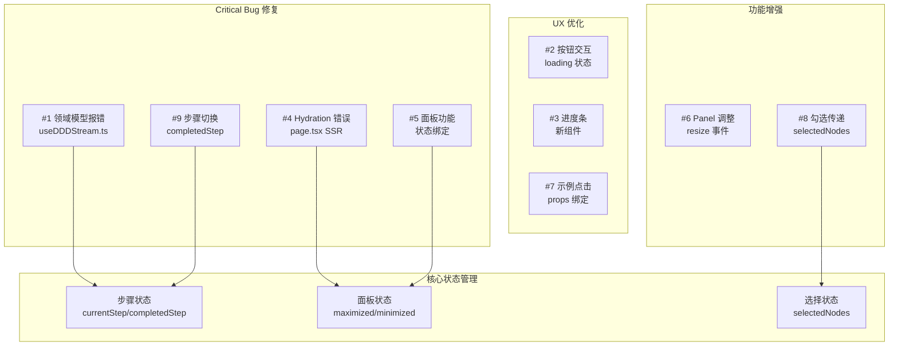
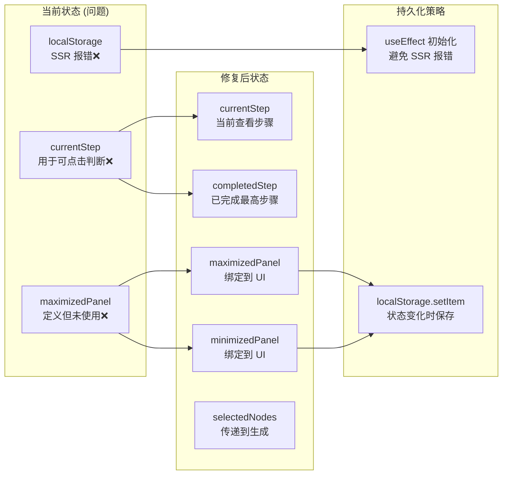
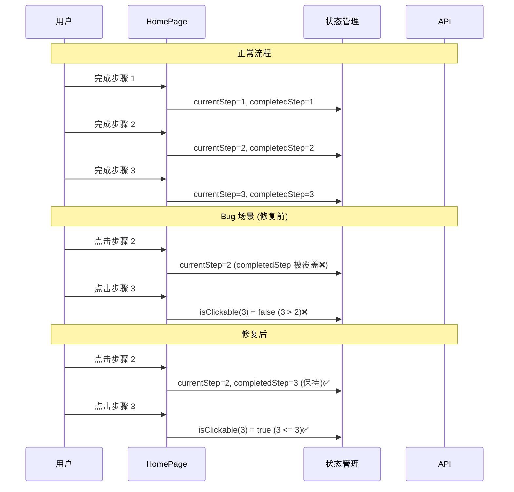

# 架构设计: 首页紧急修复

**项目**: vibex-homepage-urgent-fixes  
**架构师**: Architect Agent  
**日期**: 2026-03-14  
**状态**: ✅ 设计完成

---

## 1. Tech Stack

### 1.1 技术选型

| 技术 | 版本 | 选择理由 |
|------|------|----------|
| Next.js | 16.1.6 | 现有项目基础，App Router |
| React | 19.2.3 | 现有版本，并发渲染支持 |
| TypeScript | 5.x | 类型安全，现有项目已采用 |
| Zustand | ^4.x | 现有状态管理方案 |
| CSS Modules | 现有 | 样式隔离，复用现有方案 |

### 1.2 技术约束

| 约束 | 要求 |
|------|------|
| 兼容性 | 不破坏现有功能 |
| SSR 安全 | 所有状态初始化需检查运行环境 |
| 性能影响 | 最小化，仅修复 Bug |
| 包体积 | 不增加新依赖 |

---

## 2. Architecture Diagram

### 2.1 问题修复架构



### 2.2 状态管理重构



### 2.3 步骤切换流程



### 2.4 SSE 流解析修复

```mermaid
flowchart TB
    subgraph Before["修复前 (Bug)"]
        B1[buffer.split '\n']
        B2[lines 可能为 undefined]
        B3[lines.length 报错❌]
    end

    subgraph After["修复后"]
        A1[buffer?.split '\n' || \[\]]
        A2[确保 lines 是数组]
        A3[安全遍历✅]
    end

    B1 --> B2 --> B3
    A1 --> A2 --> A3

    subgraph ErrorHandling["错误处理"]
        E1[空 buffer 检查]
        E2[无效行跳过]
        E3[异常日志]
    end

    A2 --> E1
    E1 --> E2
    E2 --> E3
```

---

## 3. API Definitions

### 3.1 状态接口

#### 3.1.1 步骤状态

```typescript
// hooks/useStepState.ts

export interface StepState {
  // 当前查看的步骤
  currentStep: number;
  
  // 已完成的最高步骤 (新增)
  completedStep: number;
  
  // 是否正在处理
  isProcessing: boolean;
}

export interface StepActions {
  // 切换查看步骤 (不改变 completedStep)
  setCurrentStep: (step: number) => void;
  
  // 完成当前步骤 (同时更新 completedStep)
  completeStep: (step: number) => void;
  
  // 判断步骤是否可点击
  isStepClickable: (step: number) => boolean;
  
  // 获取步骤状态
  getStepStatus: (step: number) => 'completed' | 'current' | 'pending';
}

// 实现
export function useStepState(): StepState & StepActions {
  const [currentStep, setCurrentStep] = useState(1);
  const [completedStep, setCompletedStep] = useState(1);
  const [isProcessing, setIsProcessing] = useState(false);

  const completeStep = (step: number) => {
    setCurrentStep(step);
    setCompletedStep(Math.max(completedStep, step));
    setIsProcessing(false);
  };

  const isStepClickable = (step: number) => {
    return step <= completedStep;
  };

  const getStepStatus = (step: number) => {
    if (step < currentStep && step <= completedStep) return 'completed';
    if (step === currentStep) return 'current';
    return 'pending';
  };

  return {
    currentStep,
    completedStep,
    isProcessing,
    setCurrentStep,
    completeStep,
    isStepClickable,
    getStepStatus,
  };
}
```

#### 3.1.2 面板状态

```typescript
// hooks/usePanelState.ts

export interface PanelState {
  maximizedPanel: string | null;
  minimizedPanels: Set<string>;
}

export interface PanelActions {
  toggleMaximize: (panelId: string) => void;
  toggleMinimize: (panelId: string) => void;
  isMaximized: (panelId: string) => boolean;
  isMinimized: (panelId: string) => boolean;
}

export function usePanelState(): PanelState & PanelActions {
  // SSR 安全初始化
  const [maximizedPanel, setMaximizedPanel] = useState<string | null>(null);
  const [minimizedPanels, setMinimizedPanels] = useState<Set<string>>(new Set());
  const [isHydrated, setIsHydrated] = useState(false);

  // 客户端初始化 localStorage
  useEffect(() => {
    const stored = localStorage.getItem('vibex-panel-state');
    if (stored) {
      const parsed = JSON.parse(stored);
      setMaximizedPanel(parsed.maximizedPanel);
      setMinimizedPanels(new Set(parsed.minimizedPanels || []));
    }
    setIsHydrated(true);
  }, []);

  // 持久化
  useEffect(() => {
    if (isHydrated) {
      localStorage.setItem('vibex-panel-state', JSON.stringify({
        maximizedPanel,
        minimizedPanels: Array.from(minimizedPanels),
      }));
    }
  }, [maximizedPanel, minimizedPanels, isHydrated]);

  const toggleMaximize = (panelId: string) => {
    setMaximizedPanel(prev => prev === panelId ? null : panelId);
    setMinimizedPanels(prev => {
      const next = new Set(prev);
      next.delete(panelId);
      return next;
    });
  };

  const toggleMinimize = (panelId: string) => {
    setMinimizedPanels(prev => {
      const next = new Set(prev);
      if (next.has(panelId)) {
        next.delete(panelId);
      } else {
        next.add(panelId);
      }
      return next;
    });
    setMaximizedPanel(null);
  };

  const isMaximized = (panelId: string) => maximizedPanel === panelId;
  const isMinimized = (panelId: string) => minimizedPanels.has(panelId);

  return {
    maximizedPanel,
    minimizedPanels,
    toggleMaximize,
    toggleMinimize,
    isMaximized,
    isMinimized,
  };
}
```

#### 3.1.3 选择状态

```typescript
// hooks/useSelectionState.ts

export interface SelectionState {
  selectedNodes: Set<string>;
}

export interface SelectionActions {
  toggleNode: (nodeId: string) => void;
  selectAll: (nodeIds: string[]) => void;
  deselectAll: () => void;
  isSelected: (nodeId: string) => boolean;
  getSelectedIds: () => string[];
}

export function useSelectionState(): SelectionState & SelectionActions {
  // SSR 安全初始化
  const [selectedNodes, setSelectedNodes] = useState<Set<string>>(new Set());
  const [isHydrated, setIsHydrated] = useState(false);

  // 客户端初始化
  useEffect(() => {
    const stored = localStorage.getItem('vibex-selected-nodes');
    if (stored) {
      try {
        const parsed = JSON.parse(stored);
        setSelectedNodes(new Set(parsed));
      } catch {
        console.warn('Failed to parse selected nodes');
      }
    }
    setIsHydrated(true);
  }, []);

  // 持久化
  useEffect(() => {
    if (isHydrated) {
      localStorage.setItem('vibex-selected-nodes', 
        JSON.stringify(Array.from(selectedNodes))
      );
    }
  }, [selectedNodes, isHydrated]);

  const toggleNode = (nodeId: string) => {
    setSelectedNodes(prev => {
      const next = new Set(prev);
      if (next.has(nodeId)) {
        next.delete(nodeId);
      } else {
        next.add(nodeId);
      }
      return next;
    });
  };

  const selectAll = (nodeIds: string[]) => {
    setSelectedNodes(new Set(nodeIds));
  };

  const deselectAll = () => {
    setSelectedNodes(new Set());
  };

  const isSelected = (nodeId: string) => selectedNodes.has(nodeId);
  const getSelectedIds = () => Array.from(selectedNodes);

  return {
    selectedNodes,
    toggleNode,
    selectAll,
    deselectAll,
    isSelected,
    getSelectedIds,
  };
}
```

### 3.2 SSE 解析修复

```typescript
// hooks/useDDDStream.ts (修复)

export function useDDDStream() {
  const parseSSELines = useCallback((buffer: string): {
    lines: string[];
    remainingBuffer: string;
  } => {
    // 修复 1: 空值检查
    if (!buffer || typeof buffer !== 'string') {
      return { lines: [], remainingBuffer: '' };
    }

    // 修复 2: 确保返回数组
    const parts = buffer.split('\n');
    const remainingBuffer = parts.pop() || '';
    
    // 修复 3: 过滤空行
    const lines = parts.filter(line => line.trim().length > 0);

    return { lines, remainingBuffer };
  }, []);

  const processStream = useCallback(async (
    response: Response,
    onEvent: (event: SSEEvent) => void
  ) => {
    const reader = response.body?.getReader();
    if (!reader) return;

    const decoder = new TextDecoder();
    let buffer = '';

    try {
      while (true) {
        const { done, value } = await reader.read();
        if (done) break;

        buffer += decoder.decode(value, { stream: true });
        
        const { lines, remainingBuffer } = parseSSELines(buffer);
        buffer = remainingBuffer;

        // 修复 4: 安全遍历
        for (const line of lines) {
          try {
            if (line.startsWith('data: ')) {
              const data = line.slice(6);
              if (data.trim() === '[DONE]') continue;
              
              const parsed = JSON.parse(data);
              onEvent(parsed);
            }
          } catch (parseError) {
            console.warn('Failed to parse SSE line:', line, parseError);
            // 继续处理下一行，不中断整个流
          }
        }
      }
    } catch (error) {
      console.error('Stream processing error:', error);
      throw error;
    } finally {
      reader.releaseLock();
    }
  }, [parseSSELines]);

  return { processStream };
}
```

### 3.3 生成接口修复

```typescript
// services/generation.ts

export interface GenerateDomainModelParams {
  requirement: string;
  selectedContexts: BoundedContext[];  // 使用勾选的上下文
}

export interface GenerateBusinessFlowParams {
  requirement: string;
  selectedModels: DomainModel[];  // 使用勾选的模型
}

// 生成领域模型
export async function generateDomainModels(
  params: GenerateDomainModelParams,
  onEvent: (event: SSEEvent) => void
): Promise<void> {
  const response = await fetch('/api/v1/ddd/domain-model', {
    method: 'POST',
    headers: { 'Content-Type': 'application/json' },
    body: JSON.stringify({
      requirement: params.requirement,
      contextIds: params.selectedContexts.map(c => c.id),
    }),
  });

  if (!response.ok) {
    throw new Error(`API error: ${response.status}`);
  }

  // 使用修复后的 SSE 解析
  const { processStream } = useDDDStream();
  await processStream(response, onEvent);
}

// 生成业务流程
export async function generateBusinessFlows(
  params: GenerateBusinessFlowParams,
  onEvent: (event: SSEEvent) => void
): Promise<void> {
  const response = await fetch('/api/v1/ddd/business-flow', {
    method: 'POST',
    headers: { 'Content-Type': 'application/json' },
    body: JSON.stringify({
      requirement: params.requirement,
      modelIds: params.selectedModels.map(m => m.id),
    }),
  });

  if (!response.ok) {
    throw new Error(`API error: ${response.status}`);
  }

  const { processStream } = useDDDStream();
  await processStream(response, onEvent);
}
```

### 3.4 进度条组件

```typescript
// components/ProgressBar.tsx

export interface ProgressBarProps {
  progress: number;  // 0-100
  status: 'idle' | 'processing' | 'complete' | 'error';
  className?: string;
}

export function ProgressBar({ progress, status, className }: ProgressBarProps) {
  const clampedProgress = Math.min(100, Math.max(0, progress));

  return (
    <div className={`${styles.progressContainer} ${className}`}>
      <div 
        className={`${styles.progressBar} ${styles[status]}`}
        style={{ width: `${clampedProgress}%` }}
        role="progressbar"
        aria-valuenow={clampedProgress}
        aria-valuemin={0}
        aria-valuemax={100}
      />
      <span className={styles.progressText}>
        {status === 'processing' && `${Math.round(clampedProgress)}%`}
        {status === 'complete' && '完成'}
        {status === 'error' && '出错了'}
      </span>
    </div>
  );
}
```

---

## 4. Data Model

### 4.1 状态模型

```typescript
// types/state.ts

export interface HomePageState {
  // 步骤状态
  step: {
    currentStep: number;      // 当前查看步骤
    completedStep: number;    // 已完成最高步骤
    isProcessing: boolean;
  };

  // 面板状态
  panel: {
    maximizedPanel: string | null;
    minimizedPanels: Set<string>;
    panelSizes: Record<string, number>;
  };

  // 选择状态
  selection: {
    selectedNodes: Set<string>;
  };

  // 生成状态
  generation: {
    status: 'idle' | 'processing' | 'complete' | 'error';
    progress: number;
    error: string | null;
  };
}

// 持久化状态 (localStorage)
export interface PersistentState {
  panel: {
    maximizedPanel: string | null;
    minimizedPanels: string[];
  };
  selection: {
    selectedNodes: string[];
  };
}
```

### 4.2 步骤数据模型

```typescript
// types/step-data.ts

export interface StepData {
  1: {
    requirement: string;
    boundedContexts: BoundedContext[];
    selectedContextIds: string[];  // 新增：勾选的上下文
  };
  2: {
    domainModels: DomainModel[];
    selectedModelIds: string[];  // 新增：勾选的模型
  };
  3: {
    businessFlows: BusinessFlow[];
    selectedFlowIds: string[];  // 新增：勾选的流程
  };
  4: {
    pages: PageInfo[];
    selectedPageIds: string[];  // 新增：勾选的页面
  };
}
```

---

## 5. Testing Strategy

### 5.1 测试框架

| 层级 | 框架 | 用途 |
|------|------|------|
| 单元测试 | Vitest | Hook、工具函数 |
| 组件测试 | RTL | UI 交互 |
| E2E 测试 | Playwright | 完整流程 |

### 5.2 核心测试用例

#### 5.2.1 SSE 解析测试

```typescript
// __tests__/useDDDStream.test.ts

describe('useDDDStream', () => {
  describe('parseSSELines', () => {
    it('should handle undefined buffer', () => {
      const { lines, remainingBuffer } = parseSSELines(undefined as any);
      expect(lines).toEqual([]);
      expect(remainingBuffer).toBe('');
    });

    it('should handle null buffer', () => {
      const { lines, remainingBuffer } = parseSSELines(null as any);
      expect(lines).toEqual([]);
      expect(remainingBuffer).toBe('');
    });

    it('should handle empty buffer', () => {
      const { lines, remainingBuffer } = parseSSELines('');
      expect(lines).toEqual([]);
      expect(remainingBuffer).toBe('');
    });

    it('should parse valid buffer', () => {
      const buffer = 'data: {"type":"thinking"}\ndata: {"type":"done"}\n';
      const { lines, remainingBuffer } = parseSSELines(buffer);
      
      expect(lines).toHaveLength(2);
      expect(lines[0]).toBe('data: {"type":"thinking"}');
      expect(lines[1]).toBe('data: {"type":"done"}');
      expect(remainingBuffer).toBe('');
    });

    it('should handle incomplete line', () => {
      const buffer = 'data: {"type":"thin';
      const { lines, remainingBuffer } = parseSSELines(buffer);
      
      expect(lines).toEqual([]);
      expect(remainingBuffer).toBe('data: {"type":"thin');
    });
  });
});
```

#### 5.2.2 步骤状态测试

```typescript
// __tests__/useStepState.test.ts

describe('useStepState', () => {
  it('should start with step 1', () => {
    const { currentStep, completedStep } = useStepState();
    expect(currentStep).toBe(1);
    expect(completedStep).toBe(1);
  });

  it('should update completedStep when completing step', () => {
    const { completeStep, completedStep } = useStepState();
    
    act(() => completeStep(3));
    
    expect(completedStep()).toBe(3);
  });

  it('should allow clicking completed steps', () => {
    const { completeStep, isStepClickable, setCurrentStep } = useStepState();
    
    act(() => completeStep(3));
    act(() => setCurrentStep(2));
    
    // 步骤 3 应该仍然可点击
    expect(isStepClickable(3)).toBe(true);
  });

  it('should not allow clicking pending steps', () => {
    const { completeStep, isStepClickable } = useStepState();
    
    act(() => completeStep(2));
    
    // 步骤 3 不应该可点击
    expect(isStepClickable(3)).toBe(false);
  });
});
```

#### 5.2.3 面板状态测试

```typescript
// __tests__/usePanelState.test.ts

describe('usePanelState', () => {
  it('should toggle maximize', () => {
    const { toggleMaximize, isMaximized } = usePanelState();
    
    expect(isMaximized('preview')).toBe(false);
    
    act(() => toggleMaximize('preview'));
    expect(isMaximized('preview')).toBe(true);
    
    act(() => toggleMaximize('preview'));
    expect(isMaximized('preview')).toBe(false);
  });

  it('should toggle minimize', () => {
    const { toggleMinimize, isMinimized } = usePanelState();
    
    expect(isMinimized('preview')).toBe(false);
    
    act(() => toggleMinimize('preview'));
    expect(isMinimized('preview')).toBe(true);
    
    act(() => toggleMinimize('preview'));
    expect(isMinimized('preview')).toBe(false);
  });

  it('should minimize when maximizing another panel', () => {
    const { toggleMaximize, toggleMinimize, isMaximized, isMinimized } = usePanelState();
    
    act(() => toggleMinimize('preview'));
    act(() => toggleMaximize('preview'));
    
    // 最大化时应该取消最小化
    expect(isMinimized('preview')).toBe(false);
    expect(isMaximized('preview')).toBe(true);
  });
});
```

#### 5.2.4 SSR 安全测试

```typescript
// __tests__/ssr-safety.test.tsx

describe('SSR Safety', () => {
  it('should not throw during SSR', () => {
    // 模拟 SSR 环境
    const originalWindow = global.window;
    const originalLocalStorage = global.localStorage;
    
    delete (global as any).window;
    delete (global as any).localStorage;

    expect(() => {
      render(<HomePage />);
    }).not.toThrow();

    // 恢复
    global.window = originalWindow;
    global.localStorage = originalLocalStorage;
  });

  it('should initialize state after hydration', async () => {
    // 模拟 localStorage 数据
    localStorage.setItem('vibex-panel-state', JSON.stringify({
      maximizedPanel: 'preview',
      minimizedPanels: [],
    }));

    const { rerender } = render(<HomePage />);

    // 等待 hydration
    await waitFor(() => {
      expect(screen.getByTestId('preview-panel')).toHaveClass('maximized');
    });
  });
});
```

#### 5.2.5 集成测试

```typescript
// __tests__/integration/step-navigation.test.tsx

describe('Step Navigation', () => {
  it('should allow free navigation between completed steps', async () => {
    const user = userEvent.setup();
    render(<HomePage />);

    // 完成步骤 1-3
    await user.type(screen.getByLabelText(/需求/), '测试需求');
    await user.click(screen.getByRole('button', { name: /开始生成/i }));
    await waitFor(() => screen.getByText(/限界上下文/));
    
    await user.click(screen.getByRole('button', { name: /下一步/i }));
    await waitFor(() => screen.getByText(/领域模型/));
    
    await user.click(screen.getByRole('button', { name: /下一步/i }));
    await waitFor(() => screen.getByText(/业务流程/));

    // 回到步骤 2
    await user.click(screen.getByRole('button', { name: /步骤 2/i }));
    expect(screen.getByText(/领域模型/)).toBeVisible();

    // 应该能继续点击步骤 3
    const step3Button = screen.getByRole('button', { name: /步骤 3/i });
    expect(step3Button).not.toBeDisabled();
    
    await user.click(step3Button);
    expect(screen.getByText(/业务流程/)).toBeVisible();
  });
});
```

---

## 6. Security Considerations

### 6.1 输入验证

| 安全措施 | 说明 |
|----------|------|
| SSE 数据校验 | 验证 JSON 格式，防止注入 |
| localStorage 清理 | 异常数据时清空，防止污染 |
| 输入长度限制 | 需求文本限制最大长度 |

### 6.2 状态安全

| 安全措施 | 说明 |
|----------|------|
| SSR 检查 | 所有 localStorage 访问检查运行环境 |
| 状态隔离 | 各步骤选择状态独立管理 |
| 错误边界 | 捕获渲染错误，提供降级 UI |

---

## 7. Implementation Plan

### 7.1 开发阶段

| 阶段 | 任务 | 工期 | 负责人 |
|------|------|------|--------|
| 1 | #1 SSE 解析修复 | 1d | Dev |
| 2 | #4 SSR 安全修复 | 0.5d | Dev |
| 3 | #5 面板功能绑定 | 0.5d | Dev |
| 4 | #9 步骤切换修复 | 0.5d | Dev |
| 5 | #8 勾选传递实现 | 1d | Dev |
| 6 | #2 按钮状态优化 | 0.5d | Dev |
| 7 | #3 进度条组件 | 0.5d | Dev |
| 8 | #7 示例点击修复 | 0.5d | Dev |
| 9 | #6 Panel 调整 | 1d | Dev |
| 10 | 测试验证 | 1d | Tester |

**总计**: 7d

### 7.2 文件变更清单

```
hooks/
  useDDDStream.ts           # 修改: SSE 解析修复
  useStepState.ts           # 新增: 步骤状态 Hook
  usePanelState.ts          # 新增: 面板状态 Hook
  useSelectionState.ts      # 新增: 选择状态 Hook

app/
  page.tsx                  # 修改: 状态初始化、绑定

components/
  ProgressBar.tsx           # 新增: 进度条组件
  PanelHeader.tsx           # 新增: 面板控制按钮

services/
  generation.ts             # 修改: 勾选传递

__tests__/
  useDDDStream.test.ts      # 新增: SSE 解析测试
  useStepState.test.ts      # 新增: 步骤状态测试
  usePanelState.test.ts     # 新增: 面板状态测试
  ssr-safety.test.tsx       # 新增: SSR 安全测试
  integration/
    step-navigation.test.tsx # 新增: 步骤导航测试

docs/
  vibex-homepage-urgent-fixes/
    architecture.md         # 本文档
```

---

## 8. Checklist

- [x] 技术栈确认
- [x] 架构图绘制
- [x] 状态接口定义
- [x] SSE 解析修复方案
- [x] SSR 安全方案
- [x] 测试策略定义
- [x] 实施计划制定
- [x] 兼容现有架构

---

**产出物**: ✅ docs/vibex-homepage-urgent-fixes/architecture.md  
**下一步**: Coord 决策 → Dev 开发