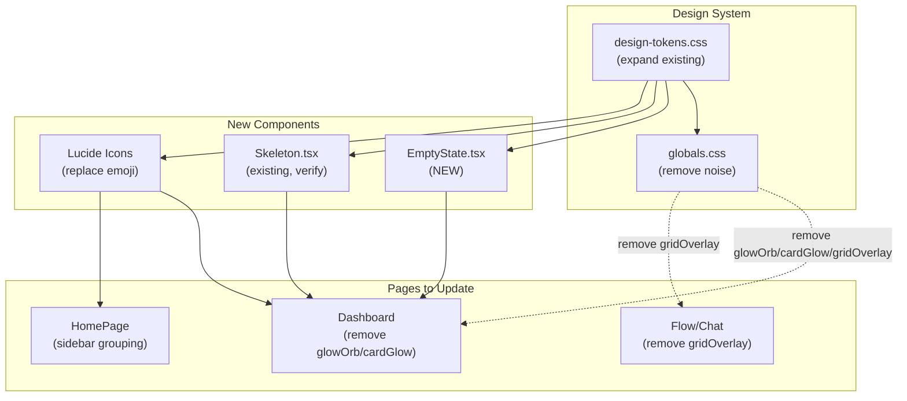

# Architecture: Vibex Homepage UI/UX Redesign

**Project**: `vibex-homepage-ux-redesign`  
**Architect**: architect  
**Date**: 2026-03-22  
**Status**: design-architecture

---

## 1. Context

### Current State Assessment

| Component | Status | Notes |
|-----------|--------|-------|
| `design-tokens.css` | ✅ Exists | Needs review/expansion |
| `Skeleton.tsx` | ✅ Exists | Needs verification |
| `EmptyState` | ❌ Missing | **New** |
| Lucide icons | ❌ Not used | Emoji still in use |
| `glowOrb` / `cardGlow` | ❌ Present | Dashboard + flow/chat pages |
| `gridOverlay` | ❌ Present | Dashboard + flow/chat pages |
| WCAG AA compliance | ❌ Not met | Contrast issues, no aria-label on emoji |
| `prefers-reduced-motion` | ❌ Not handled | ParticleBackground continuous animation |

### Goals
1. Clean visual noise (remove glowOrb, cardGlow, gridOverlay)
2. Establish cohesive design system (design-tokens.css already exists — expand it)
3. Replace emoji with accessible Lucide icons
4. Achieve WCAG AA accessibility (Lighthouse ≥ 90)
5. Add empty states and skeleton loaders

---

## 2. Tech Stack

| Component | Choice | Rationale |
|-----------|--------|-----------|
| Design system | CSS Variables (existing) | Already in place, minimal change |
| Icons | Lucide React | Lightweight, tree-shakeable, accessible by default |
| Accessibility | WCAG AA | Native HTML + aria attributes |
| Testing | Jest + Lighthouse CI | Existing infra |
| Build | Vite (existing) | No change |

**New dependency**: `lucide-react` (tree-shakeable, zero runtime cost if unused)

---

## 3. Architecture

### 3.1 Component Architecture



### 3.2 File Changes Map

| File | Change | Epic |
|------|--------|------|
| `src/styles/design-tokens.css` | Expand with color, spacing, typography tokens | Epic 1 |
| `src/components/ui/EmptyState.tsx` | **New** — reusable empty state | Epic 1 |
| `src/components/ui/Skeleton.tsx` | Verify & extend if needed | Epic 1 |
| `src/components/ui/index.ts` | Export EmptyState | Epic 1 |
| `src/app/dashboard/dashboard.module.css` | Remove glowOrb, cardGlow | Epic 2 |
| `src/app/flow/flow.module.css` | Remove gridOverlay | Epic 2 |
| `src/app/chat/chat.module.css` | Remove gridOverlay | Epic 2 |
| `src/components/layout/Sidebar.tsx` | Replace emoji → Lucide + aria-label + grouping | Epic 1/2/3 |
| `src/components/layout/Navbar.tsx` | Replace emoji → Lucide + aria-label | Epic 1/3 |
| `src/components/homepage/HomePage.tsx` | Sidebar grouping, layout width constraints | Epic 2 |
| `globals.css` | Remove visual noise, add :focus-visible global | Epic 2/3 |
| `package.json` | Add `lucide-react` | Epic 1 |

---

## 4. Design Decisions

### 4.1 Design Tokens (Expand Existing)

The existing `design-tokens.css` needs expansion. Key additions:

```css
/* === Color Palette (WCAG AA compliant) === */
:root {
  /* Primary — desaturated for accessibility */
  --color-primary: #3b82f6;          /* Blue 500, 5.9:1 on dark bg */
  --color-primary-hover: #60a5fa;   /* Blue 400 */
  
  /* Accent — keep cyan but ensure contrast */
  --color-accent: #00d4ff;          /* 8.2:1 on #0a0a0f — good */
  
  /* Neutral — WCAG AA compliant */
  --color-text-primary: #f0f0f5;    /* 14.5:1 on #0a0a0f */
  --color-text-secondary: #a0a0b0;  /* 4.6:1 on #0a0a0f — AA pass */
  --color-text-muted: #6b6b7b;      /* 3.1:1 — AA for large text only */
  
  /* Background — remove gradient noise */
  --color-bg-base: #0a0a0f;
  --color-bg-elevated: #12121a;
  --color-bg-card: #1a1a24;
  
  /* Semantic */
  --color-border: #2a2a3a;
  --color-focus-ring: #3b82f6;
  
  /* REMOVED — visual noise */
  /* --glowOrb, --cardGlow, neon gradients */
}

/* === Spacing (4px grid) === */
:root {
  --space-1: 4px;
  --space-2: 8px;
  --space-3: 12px;
  --space-4: 16px;
  --space-6: 24px;
  --space-8: 32px;
  --space-12: 48px;
}

/* === Typography === */
:root {
  --font-display: 600 32px/1.2 Inter, system-ui;
  --font-h1: 600 24px/1.3 Inter, system-ui;
  --font-h2: 500 18px/1.4 Inter, system-ui;
  --font-body: 400 14px/1.6 Inter, system-ui;
  --font-caption: 400 12px/1.5 Inter, system-ui;
  --letter-spacing-tight: -0.02em;
  --letter-spacing-normal: 0;
  --letter-spacing-wide: 0.04em;
}

/* === Radius === */
:root {
  --radius-sm: 6px;
  --radius-md: 12px;
  --radius-lg: 16px;
}

/* === Focus Visible (global) === */
:focus-visible {
  outline: 2px solid var(--color-focus-ring);
  outline-offset: 2px;
}
```

### 4.2 EmptyState Component

```tsx
// src/components/ui/EmptyState.tsx
interface EmptyStateProps {
  icon?: ReactNode;        // Lucide icon (default: Inbox)
  title: string;
  description?: string;
  action?: {
    label: string;
    onClick: () => void;
  };
}

export function EmptyState({ icon, title, description, action }: EmptyStateProps) {
  return (
    <div role="status" aria-live="polite" className={styles.container}>
      <div className={styles.icon}>{icon ?? <Inbox size={48} />}</div>
      <h3 className={styles.title}>{title}</h3>
      {description && <p className={styles.description}>{description}</p>}
      {action && (
        <button onClick={action.onClick} className={styles.action}>
          {action.label}
        </button>
      )}
    </div>
  );
}
```

### 4.3 Lucide Icon Migration

Replace emoji with Lucide React. Key mapping:

| Location | Old | New |
|----------|-----|-----|
| Sidebar nav | `◈` home | `<Home size={18} />` |
| Sidebar nav | `📊` stats | `<BarChart3 size={18} />` |
| Sidebar nav | `⚙` settings | `<Settings size={18} />` |
| Action buttons | `↗` external | `<ExternalLink size={16} />` |
| Status | `◫` panel | `<PanelRight size={16} />` |

Each icon button must have `aria-label`:
```tsx
<button
  onClick={onSettings}
  aria-label="打开设置"
  title="设置"
>
  <Settings size={18} aria-hidden="true" />
</button>
```

### 4.4 Visual Noise Removal

**`dashboard.module.css`** — Remove:
```css
/* DELETE these blocks */
.glowOrb { ... }
.cardGlow { ... }
.projectCard:hover .cardGlow { ... }
.statusactive .cardGlow { ... }
.statusdraft .cardGlow { ... }
```

**`flow.module.css` / `chat.module.css`** — Remove:
```css
/* DELETE */
.gridOverlay { ... }
```

**Replace with**: Simple solid background from design-tokens.

---

## 5. Testing Strategy

### 5.1 Test Framework
- **Unit**: Jest + RTL
- **Visual**: Lighthouse CI accessibility audits
- **E2E**: Cypress for interaction flows

### 5.2 Core Test Cases

| ID | Description | Method |
|----|-------------|--------|
| TC1 | EmptyState renders with title/action | RTL |
| TC2 | EmptyState has role="status" | RTL |
| TC3 | Lucide icons have aria-hidden, parent has aria-label | DOM query |
| TC4 | No glowOrb/cardGlow in dashboard CSS | CSS analysis |
| TC5 | All focusable elements have :focus-visible | Lighthouse |
| TC6 | prefers-reduced-motion disables animations | CSS media query check |
| TC7 | Lighthouse Accessibility ≥ 90 | Lighthouse CI |
| TC8 | npm test passes | CI |

### 5.3 Verification Commands

```bash
# Check no visual noise
grep -r "glowOrb\|cardGlow\|gridOverlay" src/  # Should return nothing

# Check Lucide usage
grep -r "lucide" src/components/layout/  # Should return results

# Check accessibility
npx lighthouse https://vibex.top --only-categories=accessibility --quiet

# Build
npm run build  # Must succeed
```

---

## 6. Implementation Phases

### Phase 1: Design System Foundation (P0)
| Task | Output |
|------|--------|
| Expand design-tokens.css | Full token set |
| Add lucide-react | New dependency |
| Create EmptyState component | Reusable component |
| Verify Skeleton.tsx | Working skeleton |

### Phase 2: Visual Noise Removal (P0)
| Task | Output |
|------|--------|
| Remove glowOrb/cardGlow from dashboard | Clean dashboard CSS |
| Remove gridOverlay from flow/chat | Clean pages |

### Phase 3: Icon & Accessibility (P1)
| Task | Output |
|------|--------|
| Replace emoji → Lucide in Sidebar | Accessible icons |
| Replace emoji → Lucide in Navbar | Accessible icons |
| Add :focus-visible global styles | Keyboard navigation |
| Add aria-labels to all icon buttons | WCAG AA |

### Phase 4: Content & Layout (P1)
| Task | Output |
|------|--------|
| Group Sidebar navigation (≥2 groups) | Clear hierarchy |
| Constrain homepage column widths | 220px/260px limits |
| Add EmptyState to Dashboard | User guidance |

### Phase 5: Advanced Accessibility (P2)
| Task | Output |
|------|--------|
| Fix all color contrast issues | Lighthouse ≥ 90 |
| Add keyboard navigation | Tab order |
| ParticleBackground prefers-reduced-motion | Motion safety |

---

## 7. Trade-offs

| Decision | Trade-off |
|----------|-----------|
| Replace emoji vs wrap with aria-label | ✅ Lucide is lighter + accessible by default; ⚠️ More code changes |
| Remove all visual effects vs reduce | ✅ Clean, maintainable; ⚠️ Loses "cyberpunk" identity |
| Global :focus-visible vs per-component | ✅ Consistency; ⚠️ May override some intentional styles |
| Design tokens as CSS vars vs inline | ✅ Themeable; ⚠️ Migration effort |

---

## 8. Verification Checklist

- [ ] `design-tokens.css` expanded with full token set
- [ ] `EmptyState.tsx` created and exported from ui/index.ts
- [ ] `Skeleton.tsx` verified working
- [ ] `lucide-react` added to package.json
- [ ] No `glowOrb`, `cardGlow`, `gridOverlay` in any CSS
- [ ] All emoji replaced with Lucide in Sidebar and Navbar
- [ ] Every icon button has `aria-label`
- [ ] Global `:focus-visible` in globals.css
- [ ] Sidebar has ≥ 2 navigation groups
- [ ] Homepage columns constrained (220px/260px)
- [ ] `npm test` passes
- [ ] `npm run build` succeeds
- [ ] Lighthouse Accessibility ≥ 90
