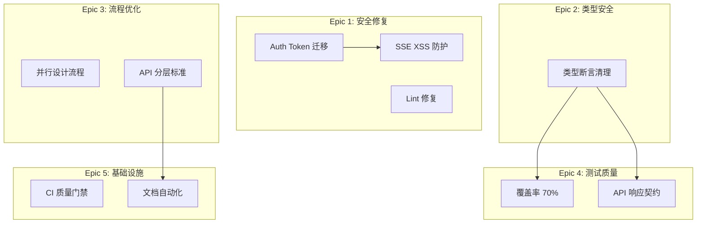

# Architecture: Agent 自检提案综合实施计划

**项目**: agent-proposal-20260319  
**版本**: 1.0  
**架构师**: Architect  
**日期**: 2026-03-19

---

## 1. Tech Stack

| 类别 | 技术选型 | 说明 |
|------|----------|------|
| 安全修复 | sessionStorage | XSS 风险降低 |
| 类型系统 | TypeScript strict | 类型安全提升 |
| 测试 | Jest + Playwright | 覆盖率 + E2E |
| CI/CD | GitHub Actions | 质量门禁 |

---

## 2. Epic 架构



---

## 3. Epic 1: 安全修复

### 3.1 Auth Token 迁移

```typescript
// Before
localStorage.setItem('auth_token', token);

// After
sessionStorage.setItem('auth_token', token);
```

### 3.2 Lint 修复

```bash
# 修复流程
npm run lint -- --fix  # 自动修复
npm run build          # 验证构建
```

### 3.3 SSE XSS 防护

```typescript
// 避免直接输出原始数据
console.error('Parse error:', sanitize(data));
```

---

## 4. Epic 2: 类型安全

### 4.1 类型断言清理策略

| 阶段 | 目标 | 工具 |
|------|------|------|
| Phase 1 | 识别所有 `as any` | grep |
| Phase 2 | 修复核心模块 | manual |
| Phase 3 | 完善类型定义 | TypeScript |

---

## 5. Epic 3: 流程优化

### 5.1 并行设计流程

```
Current:
Analyst → PM → Architect → Dev

Proposed:
Analyst → [并行] → Architect + PM → Dev
```

### 5.2 API 分层标准

```
BFF (API Routes)
    ↓
Domain Services
    ↓
Infrastructure
```

---

## 6. Epic 4: 测试质量

### 6.1 覆盖率目标

| 模块 | 当前 | 目标 |
|------|------|------|
| flowMachine.ts | <50% | ≥70% |
| API modules | <50% | ≥70% |
| PreviewCanvas | <50% | ≥70% |

---

## 7. Epic 5: 基础设施

### 7.1 CI 质量门禁

```yaml
# .github/workflows/quality-gate.yml
lint:
  runs: npm run lint
type-check:
  runs: npm run type-check
coverage:
  runs: npm run test -- --coverage
  with:
    threshold: 70
```

---

## 8. 优先级实施计划

| 优先级 | Story | 工作量 | 依赖 |
|--------|-------|--------|------|
| P0 | F1.1 Auth token | 1天 | 无 |
| P0 | F1.2 Lint | 0.5天 | 无 |
| P0 | F2.1 类型断言 | 2天 | 无 |
| P1 | F3.1 并行流程 | 0.5天 | 无 |
| P1 | F3.2 API 分层 | 1天 | 无 |

---

*Architecture - 2026-03-19*
