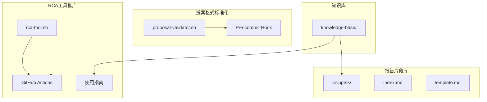

# Architecture: 分析师自检改进任务

**项目**: analyst-self-check-20260319  
**版本**: 1.0  
**架构师**: Architect  
**日期**: 2026-03-19

---

## 1. Tech Stack

| 类别 | 技术选型 | 说明 |
|------|----------|------|
| 验证脚本 | Bash | 跨平台兼容 |
| 模板系统 | Markdown | 零学习成本 |
| CI/CD | GitHub Actions | 现有基础设施 |
| 文档格式 | Markdown | 现有生态 |

---

## 2. Architecture Diagram



---

## 3. Epic 1: 提案格式标准化

### 3.1 验证脚本架构

```bash
proposal-validator.sh
├── check_header()      # 检查头部格式
├── check_structure()    # 检查结构完整性
├── check_sections()    # 检查必要章节
└── output_errors()    # 输出错误信息
```

### 3.2 验证规则

| 规则 | 检查内容 | 错误码 |
|------|----------|--------|
| 头部格式 | # PRD/Proposal Title | E001 |
| 执行摘要 | 执行摘要章节存在 | E002 |
| 问题定义 | 问题定义章节存在 | E003 |
| 解决方案 | 解决方案章节存在 | E004 |
| 验收标准 | 验收标准章节存在 | E005 |

---

## 4. Epic 2: 分析报告复用机制

### 4.1 片段库结构

```
knowledge-base/snippets/
├── index.md                    # 索引文件
├── template.md                 # 模板片段
├── problem-statements/        # 问题陈述模板
│   ├── bug-template.md
│   ├── feature-template.md
│   └── refactor-template.md
├── solutions/                 # 解决方案模板
│   ├── tech-choice.md
│   └── implementation.md
└── verification/              # 验收标准模板
    ├── unit-test.md
    └── e2e-test.md
```

### 4.2 索引格式

```markdown
# 片段库索引

## 按类型
- [问题陈述](problem-statements/)
- [解决方案](solutions/)
- [验收标准](verification/)

## 按关键词
- 性能 → solutions/performance.md
- 安全 → solutions/security.md
- 用户体验 → solutions/ux.md
```

---

## 5. Epic 3: RCA 工具推广

### 5.1 CI 集成

```yaml
# .github/workflows/rca-check.yml
name: RCA Check
on: [push, pull_request]
jobs:
  rca-check:
    runs-on: ubuntu-latest
    steps:
      - uses: actions/checkout@v3
      - name: Run RCA Tool
        run: |
          ./docs/knowledge-base/scripts/rca-tool.sh \
            "代码质量检查" ./src/
```

### 5.2 使用指南结构

```markdown
# RCA 工具使用指南

## 快速开始
## 命令行参数
## 模式库说明
## 报告解读
## 集成到 CI/CD
```

---

## 6. Testing Strategy

| Epic | 测试策略 | 覆盖率目标 |
|------|----------|------------|
| Epic 1 | 单元测试脚本函数 | 90% |
| Epic 2 | 片段完整性检查 | 100% |
| Epic 3 | CI 工作流测试 | 核心路径 |

---

## 7. 实施计划

| Epic | 任务 | 时间 |
|------|------|------|
| Epic 1 | 验证脚本 + Pre-commit | 2h |
| Epic 2 | 片段库 + 索引 | 4h |
| Epic 3 | CI 集成 + 文档 | 3h |

---

*Architecture - 2026-03-19*
