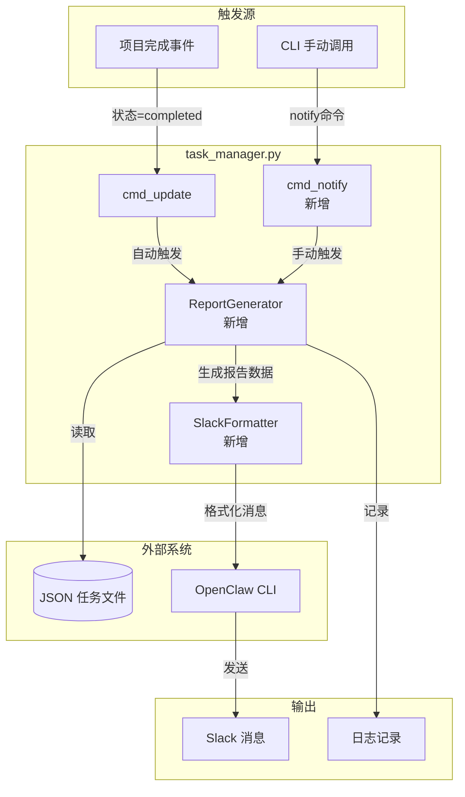
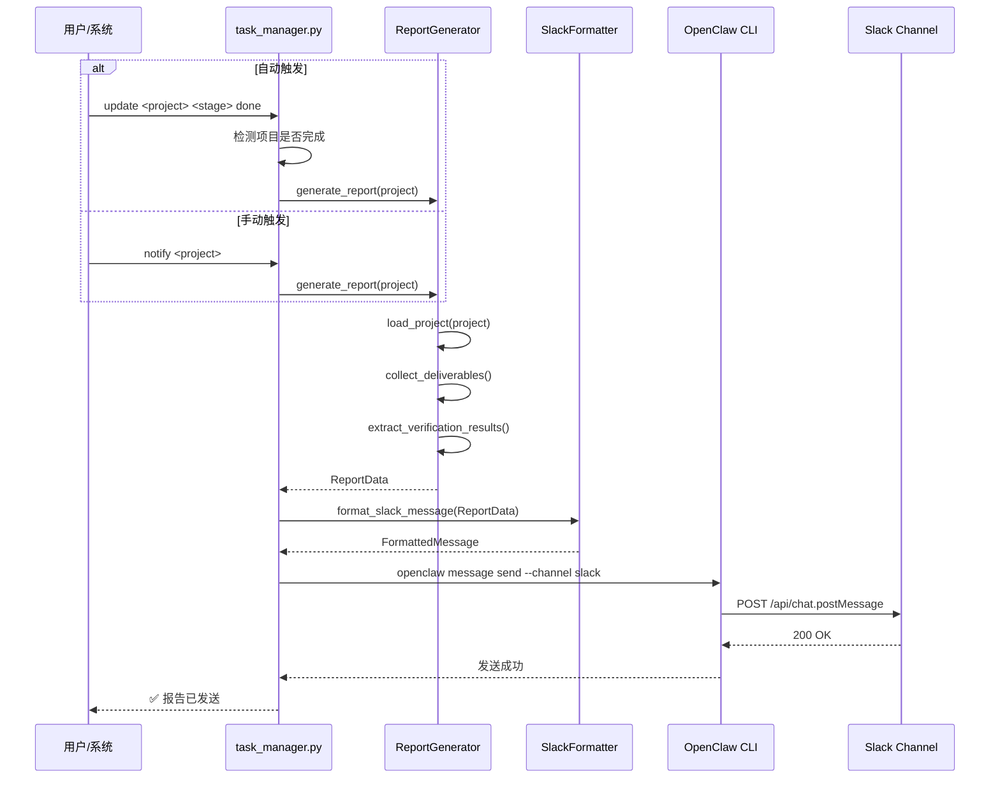
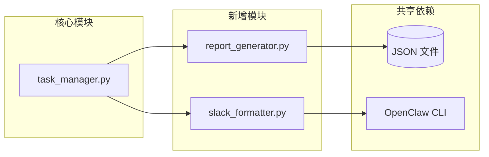
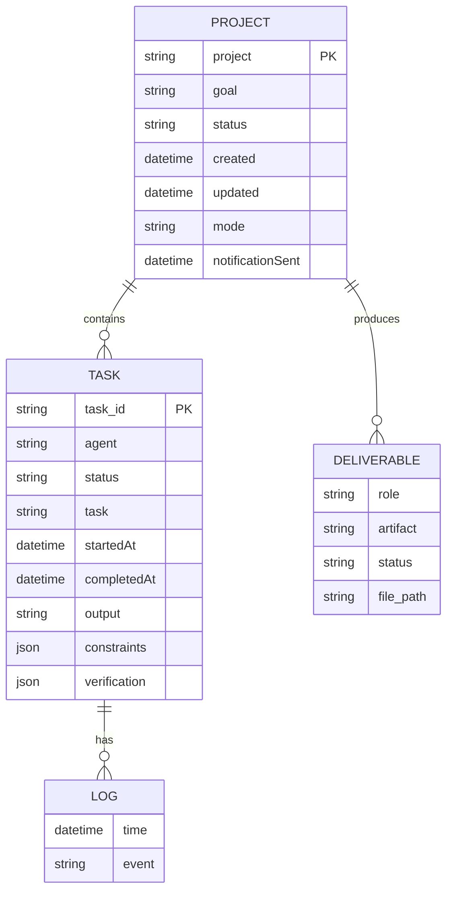

# 项目完成报告自动发送 Slack - 架构设计

**项目**: coord-workflow-improvement
**版本**: 1.0
**架构师**: architect
**工作目录**: /root/.openclaw/vibex

---

## 1. Tech Stack (技术栈)

### 1.1 核心技术选型

| 组件 | 技术选型 | 版本 | 选择理由 |
|------|----------|------|----------|
| 报告引擎 | Python | 3.10+ | 与现有 task_manager.py 保持一致，无额外依赖 |
| 消息格式化 | Python 字符串模板 | - | 轻量级，无需引入额外库 |
| Slack 集成 | OpenClaw CLI | 现有 | 复用现有消息发送能力，无需管理 Slack Token |
| 数据存储 | JSON 文件 | 现有 | 与 task_manager.py 一致，无额外存储层 |
| 测试框架 | pytest | 7.x | Python 标准测试框架，支持 fixture 和 parametrize |

### 1.2 无需引入的外部依赖

- **Slack SDK**: 已通过 OpenClaw CLI 抽象
- **数据库**: 继续使用 JSON 文件存储
- **消息队列**: 触发时机同步执行，无需队列

### 1.3 版本兼容性

```yaml
requires:
  python: ">=3.10"
  openclaw-cli: "current"
  task_manager.py: "current"
```

---

## 2. Architecture Diagram (架构图)

### 2.1 组件交互图



### 2.2 数据流图



### 2.3 模块依赖图



---

## 3. API Definitions (接口定义)

### 3.1 CLI 命令接口

#### 3.1.1 notify 子命令 (新增)

```bash
# 命令签名
python3 task_manager.py notify <project> [--dry-run] [--channel <channel_id>]

# 参数说明
# project: 项目名称 (必需)
# --dry-run: 仅生成报告，不发送消息 (可选)
# --channel: 指定 Slack 频道 ID，默认使用配置频道 (可选)

# 输出示例
🎉 项目完成报告

📦 项目: vibex-api-versioning
⏱️ 耗时: 2小时15分钟
📊 进度: 16/16 任务完成

📋 产出物清单:
  ✅ analyst - docs/vibex-api-versioning/analysis.md
  ✅ pm - docs/vibex-api-versioning/prd.md
  ✅ architect - docs/vibex-api-versioning/architecture.md
  ✅ dev - 代码变更 (5 files)
  ✅ tester - 测试通过
  ✅ reviewer - 审查通过

🔍 验证结果:
  • 测试: PASSED
  • 审查: APPROVED

✅ 已发送到 Slack 频道: #dev-updates
```

#### 3.1.2 report 子命令 (新增)

```bash
# 命令签名
python3 task_manager.py report <project> [--json]

# 参数说明
# project: 项目名称 (必需)
# --json: 输出 JSON 格式 (可选)

# JSON 输出示例
{
  "project": "vibex-api-versioning",
  "goal": "API 版本控制机制，引入 /api/v1/ 前缀",
  "status": "completed",
  "completion_time": "2026-03-15T10:30:00Z",
  "duration": "2h15m",
  "tasks": [
    {
      "id": "analyze-requirements",
      "agent": "analyst",
      "status": "done",
      "output": "docs/vibex-api-versioning/analysis.md"
    }
  ],
  "deliverables": [
    {"role": "analyst", "artifact": "docs/vibex-api-versioning/analysis.md", "status": "✅"},
    {"role": "pm", "artifact": "docs/vibex-api-versioning/prd.md", "status": "✅"},
    {"role": "architect", "artifact": "docs/vibex-api-versioning/architecture.md", "status": "✅"}
  ],
  "verification": {
    "test_status": "PASSED",
    "review_status": "APPROVED"
  }
}
```

### 3.2 Python 函数接口

#### 3.2.1 ReportGenerator 类

```python
# report_generator.py

from dataclasses import dataclass
from typing import Optional
from datetime import datetime

@dataclass
class TaskReport:
    """单个任务报告数据"""
    id: str
    agent: str
    status: str
    started_at: Optional[datetime]
    completed_at: Optional[datetime]
    output: str
    constraints: list[str]
    verification: dict

@dataclass
class DeliverableInfo:
    """产出物信息"""
    role: str
    artifact: str
    status: str  # "✅" | "❌" | "⏭️"
    file_path: Optional[str] = None

@dataclass
class VerificationResult:
    """验证结果"""
    test_status: str  # "PASSED" | "FAILED" | "SKIPPED" | "UNKNOWN"
    review_status: str  # "APPROVED" | "REJECTED" | "PENDING" | "UNKNOWN"
    details: dict

@dataclass
class ProjectReport:
    """项目完整报告数据"""
    project: str
    goal: str
    status: str
    created: datetime
    completed: Optional[datetime]
    duration: str  # "2h15m" 格式
    tasks: list[TaskReport]
    deliverables: list[DeliverableInfo]
    verification: VerificationResult


class ReportGenerator:
    """项目报告生成器"""

    def __init__(self, tasks_dir: str):
        """
        初始化报告生成器

        Args:
            tasks_dir: 任务文件存储目录
        """
        ...

    def generate(self, project: str) -> ProjectReport:
        """
        生成项目完整报告

        Args:
            project: 项目名称

        Returns:
            ProjectReport: 结构化报告数据

        Raises:
            ProjectNotFoundError: 项目不存在
            ProjectNotCompletedError: 项目未完成 (仅用于强制发送时)
        """
        ...

    def collect_deliverables(self, data: dict) -> list[DeliverableInfo]:
        """
        收集各角色产出物信息

        Args:
            data: 项目 JSON 数据

        Returns:
            list[DeliverableInfo]: 产出物列表
        """
        ...

    def extract_verification(self, data: dict) -> VerificationResult:
        """
        提取验证结果

        Args:
            data: 项目 JSON 数据

        Returns:
            VerificationResult: 验证结果
        """
        ...

    def calculate_duration(self, data: dict) -> str:
        """
        计算项目耗时

        Args:
            data: 项目 JSON 数据

        Returns:
            str: 格式化的耗时字符串 (如 "2h15m")
        """
        ...
```

#### 3.2.2 SlackFormatter 类

```python
# slack_formatter.py

from dataclasses import dataclass

@dataclass
class FormattedMessage:
    """格式化后的消息"""
    text: str  # 纯文本版本
    blocks: list[dict]  # Block Kit 格式 (可选)


class SlackFormatter:
    """Slack 消息格式化器"""

    def format_report(self, report: ProjectReport) -> FormattedMessage:
        """
        将报告格式化为 Slack 消息

        Args:
            report: 项目报告数据

        Returns:
            FormattedMessage: 格式化后的消息
        """
        ...

    def format_header(self, project: str, status: str) -> dict:
        """
        格式化消息头部

        Args:
            project: 项目名称
            status: 项目状态

        Returns:
            dict: Block Kit header block
        """
        ...

    def format_deliverables_section(self, deliverables: list[DeliverableInfo]) -> dict:
        """
        格式化产出物区块

        Args:
            deliverables: 产出物列表

        Returns:
            dict: Block Kit section block
        """
        ...

    def format_verification_section(self, verification: VerificationResult) -> dict:
        """
        格式化验证结果区块

        Args:
            verification: 验证结果

        Returns:
            dict: Block Kit section block
        """
        ...
```

#### 3.2.3 集成到 task_manager.py

```python
# task_manager.py 修改

def cmd_update(args):
    """Update stage/task status."""
    # ... 现有逻辑 ...

    # 新增: 项目完成时自动发送通知
    if is_dag(data) and data["status"] == "completed" and old_status != "completed":
        _send_completion_notification(project)


def cmd_notify(args):
    """发送项目完成通知到 Slack (新增)"""
    data = load_project(args.project)

    if data["status"] != "completed" and not args.force:
        print(f"⚠️ 项目 '{args.project}' 未完成 (status: {data['status']})")
        print("使用 --force 强制发送未完成项目的报告")
        return

    generator = ReportGenerator(TASKS_DIR)
    formatter = SlackFormatter()

    report = generator.generate(args.project)
    message = formatter.format_report(report)

    if args.dry_run:
        print("📋 生成的消息预览:")
        print(message.text)
        return

    # 使用 OpenClaw CLI 发送
    channel = args.channel or os.environ.get("SLACK_DEFAULT_CHANNEL", "C0AG6F5T05V")
    result = subprocess.run([
        "openclaw", "message", "send",
        "--channel", "slack",
        "--target", channel,
        "--message", message.text
    ], capture_output=True, text=True)

    if result.returncode == 0:
        print(f"✅ 项目完成报告已发送到 Slack")
    else:
        print(f"❌ 发送失败: {result.stderr}")


def _send_completion_notification(project: str):
    """项目完成时自动发送通知 (内部函数)"""
    try:
        generator = ReportGenerator(TASKS_DIR)
        formatter = SlackFormatter()

        report = generator.generate(project)
        message = formatter.format_report(report)

        channel = os.environ.get("SLACK_DEFAULT_CHANNEL", "C0AG6F5T05V")
        subprocess.run([
            "openclaw", "message", "send",
            "--channel", "slack",
            "--target", channel,
            "--message", message.text
        ], check=True, capture_output=True)

        # 记录已发送，防止重复
        _mark_notification_sent(project)

    except Exception as e:
        # 发送失败不影响主流程，仅记录日志
        print(f"⚠️ 项目完成通知发送失败: {e}", file=sys.stderr)


def _mark_notification_sent(project: str):
    """标记项目通知已发送"""
    # 在项目数据中添加 notificationSent 字段
    data = load_project(project)
    data["notificationSent"] = now_iso()
    save_project(project, data)
```

---

## 4. Data Model (数据模型)

### 4.1 现有数据结构扩展

```json
{
  "project": "vibex-api-versioning",
  "goal": "API 版本控制机制，引入 /api/v1/ 前缀",
  "created": "2026-03-15T08:00:00Z",
  "updated": "2026-03-15T10:30:00Z",
  "status": "completed",
  "mode": "dag",
  "workspace": "/root/.openclaw/vibex",

  "stages": {
    "analyze-requirements": {
      "agent": "analyst",
      "status": "done",
      "task": "需求分析：业务场景、技术方案、可行性评估",
      "startedAt": "2026-03-15T08:00:00Z",
      "completedAt": "2026-03-15T08:30:00Z",
      "output": "docs/vibex-api-versioning/analysis.md",
      "logs": [...],
      "constraints": [...],
      "verification": {...}
    }
  },

  "notificationSent": "2026-03-15T10:30:05Z"  // 新增字段
}
```

### 4.2 核心实体关系



### 4.3 产出物角色映射

```python
# 角色到产出物的映射关系
ROLE_ARTIFACTS = {
    "analyst": {
        "pattern": "docs/{project}/analysis.md",
        "description": "需求分析文档"
    },
    "pm": {
        "pattern": "docs/{project}/prd.md",
        "description": "PRD 文档"
    },
    "architect": {
        "pattern": "docs/{project}/architecture.md",
        "description": "架构设计文档"
    },
    "dev": {
        "pattern": None,  # 代码变更，无固定文件
        "description": "代码变更"
    },
    "tester": {
        "pattern": "screenshots/{project}/*.png",
        "description": "测试截图"
    },
    "reviewer": {
        "pattern": "reviews/{project}/*.md",
        "description": "审查报告"
    }
}
```

---

## 5. Testing Strategy (测试策略)

### 5.1 测试框架

| 项目 | 选择 | 理由 |
|------|------|------|
| 测试框架 | pytest | Python 生态标准，支持 fixture/parametrize/mark |
| Mock 库 | pytest-mock | 与 pytest 无缝集成 |
| 覆盖率 | pytest-cov | 内置覆盖率报告 |
| 目标覆盖率 | **> 80%** | 核心逻辑全覆盖 |

### 5.2 测试目录结构

```
tests/
├── unit/
│   ├── test_report_generator.py
│   ├── test_slack_formatter.py
│   └── test_task_manager_notify.py
├── integration/
│   ├── test_notify_integration.py
│   └── test_auto_notify.py
└── fixtures/
    ├── sample_project.json
    └── expected_report.json
```

### 5.3 核心测试用例

#### 5.3.1 报告生成测试

```python
# tests/unit/test_report_generator.py

import pytest
from report_generator import ReportGenerator, ProjectReport

class TestReportGenerator:

    @pytest.fixture
    def generator(self, tmp_path):
        return ReportGenerator(str(tmp_path))

    @pytest.fixture
    def sample_project(self, tmp_path):
        """创建示例项目数据"""
        project_data = {
            "project": "test-project",
            "goal": "测试项目",
            "status": "completed",
            "created": "2026-03-15T08:00:00Z",
            "updated": "2026-03-15T10:00:00Z",
            "mode": "dag",
            "stages": {
                "analyze": {
                    "agent": "analyst",
                    "status": "done",
                    "output": "docs/test-project/analysis.md"
                }
            }
        }
        # 写入文件
        ...
        return project_data

    def test_generate_returns_project_report(self, generator, sample_project):
        """测试生成返回正确的报告结构"""
        report = generator.generate("test-project")

        assert isinstance(report, ProjectReport)
        assert report.project == "test-project"
        assert report.status == "completed"
        assert len(report.tasks) > 0
        assert len(report.deliverables) > 0

    def test_collect_deliverables_includes_all_roles(self, generator, sample_project):
        """测试产出物包含所有角色"""
        deliverables = generator.collect_deliverables(sample_project)

        roles = {d.role for d in deliverables}
        expected_roles = {"analyst", "pm", "architect", "dev", "tester", "reviewer"}
        assert expected_roles.issubset(roles)

    def test_calculate_duration_correct_format(self, generator, sample_project):
        """测试耗时计算格式正确"""
        duration = generator.calculate_duration(sample_project)

        # 格式应为 "XhYm" 或 "Ym" 或 "Xh"
        assert "h" in duration or "m" in duration

    def test_generate_raises_for_nonexistent_project(self, generator):
        """测试项目不存在时抛出异常"""
        with pytest.raises(ProjectNotFoundError):
            generator.generate("nonexistent-project")


    def test_verification_extraction_from_tester_task(self, generator):
        """测试从 tester 任务提取验证结果"""
        data = {
            "stages": {
                "test-implementation": {
                    "agent": "tester",
                    "status": "done",
                    "output": "测试通过: 15/15"
                }
            }
        }

        verification = generator.extract_verification(data)

        assert verification.test_status == "PASSED"
```

#### 5.3.2 Slack 格式化测试

```python
# tests/unit/test_slack_formatter.py

import pytest
from slack_formatter import SlackFormatter, FormattedMessage
from report_generator import ProjectReport, DeliverableInfo, VerificationResult

class TestSlackFormatter:

    @pytest.fixture
    def formatter(self):
        return SlackFormatter()

    @pytest.fixture
    def sample_report(self):
        return ProjectReport(
            project="test-project",
            goal="测试项目目标",
            status="completed",
            created=datetime(2026, 3, 15, 8, 0),
            completed=datetime(2026, 3, 15, 10, 30),
            duration="2h30m",
            tasks=[...],
            deliverables=[
                DeliverableInfo(role="analyst", artifact="analysis.md", status="✅"),
                DeliverableInfo(role="pm", artifact="prd.md", status="✅"),
            ],
            verification=VerificationResult(
                test_status="PASSED",
                review_status="APPROVED",
                details={}
            )
        )

    def test_format_report_returns_formatted_message(self, formatter, sample_report):
        """测试格式化返回 FormattedMessage"""
        message = formatter.format_report(sample_report)

        assert isinstance(message, FormattedMessage)
        assert len(message.text) > 0

    def test_message_contains_project_name(self, formatter, sample_report):
        """测试消息包含项目名称"""
        message = formatter.format_report(sample_report)

        assert "test-project" in message.text

    def test_message_contains_deliverables(self, formatter, sample_report):
        """测试消息包含产出物清单"""
        message = formatter.format_report(sample_report)

        assert "📋 产出物清单" in message.text
        assert "analyst" in message.text
        assert "analysis.md" in message.text

    def test_message_contains_verification_results(self, formatter, sample_report):
        """测试消息包含验证结果"""
        message = formatter.format_report(sample_report)

        assert "🔍 验证结果" in message.text
        assert "PASSED" in message.text
        assert "APPROVED" in message.text

    def test_message_format_with_emoji(self, formatter, sample_report):
        """测试消息包含正确的 emoji"""
        message = formatter.format_report(sample_report)

        assert "🎉" in message.text  # 项目完成 emoji
        assert "📦" in message.text  # 项目图标
        assert "✅" in message.text  # 完成图标
```

#### 5.3.3 集成测试

```python
# tests/integration/test_notify_integration.py

import pytest
import subprocess
from unittest.mock import patch, MagicMock

class TestNotifyIntegration:

    def test_notify_command_sends_to_slack(self, tmp_path):
        """测试 notify 命令成功发送到 Slack"""
        # 创建测试项目
        project_file = tmp_path / "test-project.json"
        project_file.write_text(json.dumps({
            "project": "test-project",
            "status": "completed",
            "stages": {...}
        }))

        with patch('subprocess.run') as mock_run:
            mock_run.return_value = MagicMock(returncode=0)

            result = subprocess.run([
                "python3", "task_manager.py", "notify", "test-project"
            ], capture_output=True)

            assert result.returncode == 0
            # 验证调用了 openclaw message send
            assert any("openclaw" in str(call) for call in mock_run.call_args_list)

    def test_auto_notify_on_project_completion(self, tmp_path):
        """测试项目完成时自动发送通知"""
        # 设置项目，只剩一个任务 pending
        # 调用 update 将最后一个任务标记为 done
        # 验证自动触发了通知

    def test_notify_prevents_duplicate_sending(self, tmp_path):
        """测试防止重复发送"""
        # 创建已发送过通知的项目
        project_data = {
            "project": "test-project",
            "status": "completed",
            "notificationSent": "2026-03-15T10:00:00Z"
        }

        with patch('subprocess.run') as mock_run:
            result = subprocess.run([
                "python3", "task_manager.py", "notify", "test-project"
            ])

            # 应该提示已发送过，不再重复发送
            assert "已发送" in result.stdout or mock_run.call_count == 0

    def test_dry_run_does_not_send(self, tmp_path):
        """测试 --dry-run 不实际发送"""
        with patch('subprocess.run') as mock_run:
            result = subprocess.run([
                "python3", "task_manager.py", "notify", "test-project", "--dry-run"
            ])

            # 不应该调用 openclaw
            assert mock_run.call_count == 0
            assert "消息预览" in result.stdout
```

### 5.4 覆盖率要求

| 模块 | 最低覆盖率 | 关键路径 |
|------|-----------|----------|
| report_generator.py | 85% | 生成逻辑、产出物收集 |
| slack_formatter.py | 80% | 消息格式化 |
| task_manager.py (notify) | 80% | 命令解析、触发逻辑 |

### 5.5 运行测试

```bash
# 运行所有测试
pytest tests/

# 运行特定测试文件
pytest tests/unit/test_report_generator.py

# 运行并生成覆盖率报告
pytest --cov=report_generator --cov=slack_formatter --cov-report=html

# 运行集成测试
pytest tests/integration/ -v
```

---

## 6. 实施检查清单

### 6.1 开发前

- [ ] 确认 OpenClaw CLI 可用 (`openclaw message send --help`)
- [ ] 确认 Slack 频道 ID 正确
- [ ] 确认 task_manager.py 路径

### 6.2 开发中

- [ ] 创建 `report_generator.py`
- [ ] 创建 `slack_formatter.py`
- [ ] 修改 `task_manager.py` 添加 notify 命令
- [ ] 添加自动触发逻辑
- [ ] 编写单元测试
- [ ] 编写集成测试

### 6.3 开发后

- [ ] 所有测试通过 (`pytest --cov`)
- [ ] 手动测试 notify 命令
- [ ] 手动测试自动触发
- [ ] Code Review
- [ ] 文档更新

---

## 7. 风险与缓解

| 风险 | 影响 | 可能性 | 缓解措施 |
|------|------|--------|----------|
| Slack API 限流 | 消息发送失败 | 低 | 重试机制、延迟发送 |
| 项目数据损坏 | 报告生成失败 | 低 | 异常处理、日志记录 |
| 重复发送 | 用户收到多条消息 | 中 | notificationSent 标记 |
| 格式化错误 | 消息显示异常 | 低 | 模板测试、预览功能 |

---

**产出物**: `docs/coord-workflow-improvement/architecture.md`
**验证**: `test -f /root/.openclaw/vibex/docs/coord-workflow-improvement/architecture.md`