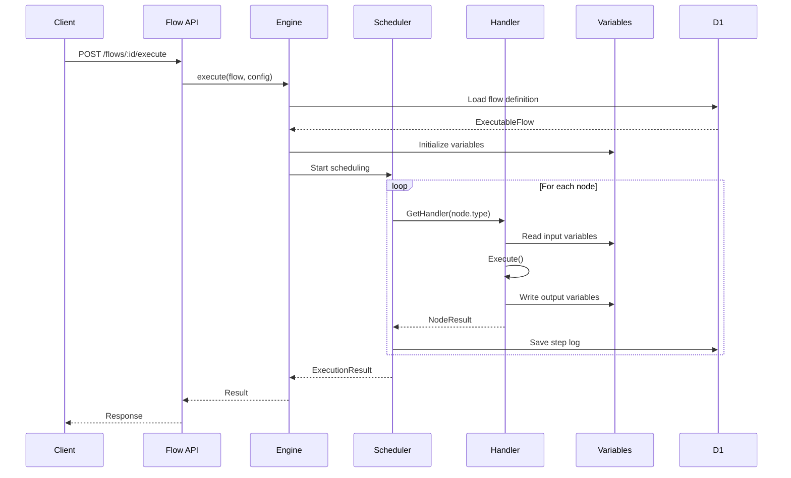
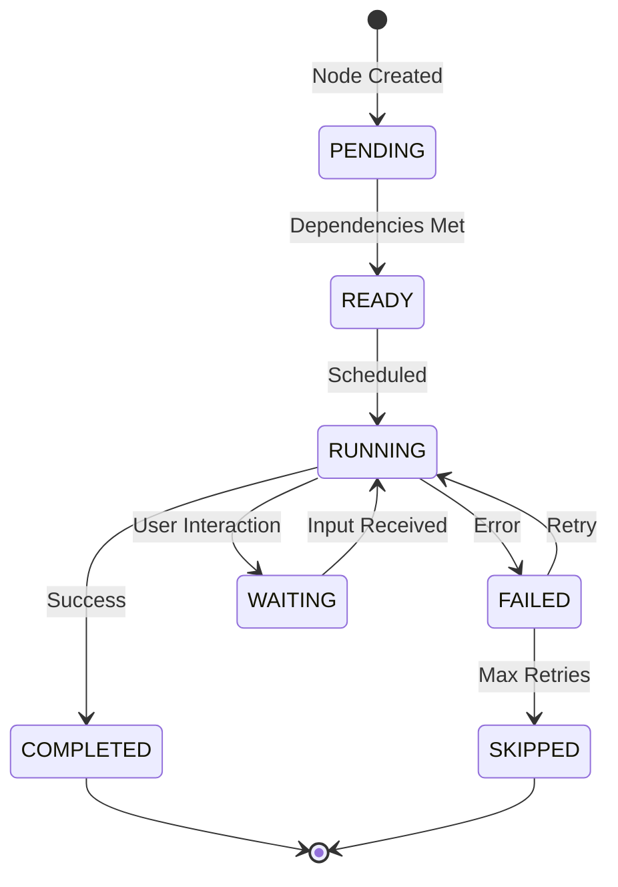

# 架构设计: 流程执行引擎 (Flow Execution Engine)

**项目**: vibex-flow-execution-impl  
**版本**: 1.0  
**日期**: 2026-03-04  
**架构师**: Architect Agent  
**上游文档**: [PRD](./prd.md)

---

## 1. Tech Stack (技术栈选型)

### 1.1 技术选型

| 组件 | 版本 | 选择理由 |
|------|------|----------|
| **Runtime** | Cloudflare Workers | 复用现有后端架构 |
| **Framework** | Hono 4.12+ | 现有框架，支持中间件 |
| **状态管理** | 内存 + D1 | 简单流程内存执行，持久化到 D1 |
| **代码生成** | 模板引擎 | 基于 PRD 现有模板扩展 |
| **类型系统** | TypeScript 5 | 现有类型定义已完善 |

### 1.2 ADR 决策记录

#### ADR-001: 执行模式架构

**决策**: 采用解释器模式 + 策略模式组合

**理由**:
- 解释器模式：解析流程图结构，执行节点
- 策略模式：不同节点类型有不同执行策略
- 符合 PRD 已有的类型定义

#### ADR-002: 变量管理方案

**决策**: 使用作用域链 + 快照机制

**理由**:
- 支持变量追踪（PRD 要求）
- 支持并行执行时的变量隔离
- 便于实现撤销/重做

#### ADR-003: 错误处理策略

**决策**: 分级错误处理 + 重试机制

**理由**:
- 可恢复错误：重试
- 不可恢复错误：终止流程
- 符合 PRD 的错误处理需求

---

## 2. Architecture Diagram (架构图)

### 2.1 系统架构图

```mermaid
graph TB
    subgraph "API Layer"
        API[Flow API Routes]
        EXEC[/api/flows/:id/execute]
        GEN[/api/flows/:id/generate-code]
    end
    
    subgraph "Core Engine"
        ENGINE[FlowExecutionEngine]
        PARSER[FlowParser]
        SCHEDULER[ExecutionScheduler]
        STATE[StateManager]
    end
    
    subgraph "Node Handlers"
        REGISTRY[HandlerRegistry]
        START[StartHandler]
        END[EndHandler]
        ACTION[ActionHandler]
        DECISION[DecisionHandler]
        API_CALL[ApiCallHandler]
        PARALLEL[ParallelHandler]
        WAIT[WaitHandler]
        USER[UserInteractionHandler]
        SUBFLOW[SubflowHandler]
        ERROR[ErrorHandler]
    end
    
    subgraph "Support Services"
        VARS[VariableManager]
        ERR[ErrorManager]
        LOG[ExecutionLogger]
        CODE[CodeGenerator]
    end
    
    subgraph "Data Layer"
        D1[(D1 Database)]
        CACHE[Execution Cache]
    end
    
    API --> EXEC & GEN
    EXEC --> ENGINE
    GEN --> CODE
    ENGINE --> PARSER & SCHEDULER & STATE
    SCHEDULER --> REGISTRY
    REGISTRY --> START & END & ACTION & DECISION & API_CALL & PARALLEL & WAIT & USER & SUBFLOW & ERROR
    ENGINE --> VARS & ERR & LOG
    STATE --> D1 & CACHE
```

### 2.2 执行流程时序图



### 2.3 节点执行状态机



---

## 3. API Definitions (接口设计)

### 3.1 执行流程 API

#### POST /api/flows/:id/execute

```typescript
// Request
interface ExecuteFlowRequest {
  mode: ExecutionMode;
  input?: Record<string, unknown>;
  config?: {
    startNodeId?: string;
    maxSteps?: number;
    timeout?: number;
    trackVariables?: boolean;
    simulateErrors?: boolean;
  };
}

// Response
interface ExecuteFlowResponse {
  success: boolean;
  executionId: string;
  result: ExecutionResult;
}

// 执行
POST /api/flows/flow-123/execute
{
  "mode": "simulation",
  "input": { "username": "test", "email": "test@example.com" },
  "config": { "trackVariables": true }
}
```

### 3.2 代码生成 API

#### POST /api/flows/:id/generate-code

```typescript
// Request
interface GenerateCodeRequest {
  language: 'typescript' | 'javascript' | 'python' | 'java';
  framework?: 'express' | 'fastapi' | 'spring' | 'none';
  includeTests?: boolean;
}

// Response
interface GenerateCodeResponse {
  code: string;
  dependencies: string[];
  testCode?: string;
}

// 执行
POST /api/flows/flow-123/generate-code
{
  "language": "typescript",
  "framework": "express",
  "includeTests": true
}
```

### 3.3 执行状态查询 API

#### GET /api/flows/:id/executions/:executionId

```typescript
// Response
interface ExecutionStatusResponse {
  executionId: string;
  flowId: string;
  status: ExecutionStatus;
  progress: {
    total: number;
    completed: number;
    failed: number;
    pending: number;
  };
  currentNodes: string[];
  variables: Record<string, unknown>;
  steps: ExecutionStep[];
  errors: Array<{ nodeId: string; error: string }>;
}
```

---

## 4. Data Model (数据模型)

### 4.1 核心类型扩展

```typescript
// 扩展现有 ExecutionNode
interface ExecutionNode {
  id: string;
  type: NodeType;
  label: string;
  description?: string;
  inputVariables?: string[];
  outputVariables?: string[];
  config?: NodeConfig;
  expectedDuration?: number;
  retryConfig?: RetryConfig;
  // 新增
  timeout?: number;
  onError?: 'continue' | 'stop' | 'retry';
  fallbackNodeId?: string;
}

// 节点类型定义
type NodeType = 
  | 'start' 
  | 'end' 
  | 'action' 
  | 'decision' 
  | 'parallel' 
  | 'api_call' 
  | 'wait' 
  | 'user_interaction' 
  | 'subflow' 
  | 'error' 
  | 'transform'
  | 'loop';

// 节点配置
interface NodeConfig {
  // Action 节点
  actionType?: 'http_request' | 'script' | 'ai_call' | 'database';
  actionConfig?: Record<string, unknown>;
  
  // Decision 节点
  conditions?: Array<{
    expression: string;
    targetNodeId: string;
  }>;
  defaultTarget?: string;
  
  // API Call 节点
  url?: string;
  method?: 'GET' | 'POST' | 'PUT' | 'DELETE';
  headers?: Record<string, string>;
  body?: unknown;
  
  // Parallel 节点
  branches?: string[][];
  joinType?: 'all' | 'any' | 'race';
  
  // Wait 节点
  duration?: number;
  until?: string;
  
  // User Interaction 节点
  prompt?: string;
  inputType?: 'text' | 'select' | 'multiselect' | 'file';
  options?: string[];
  
  // Subflow 节点
  subflowId?: string;
  inputMapping?: Record<string, string>;
  outputMapping?: Record<string, string>;
  
  // Transform 节点
  transformExpression?: string;
  
  // Loop 节点
  arrayVariable?: string;
  iterationVariable?: string;
  bodyNodes?: string[];
}

// 重试配置
interface RetryConfig {
  maxRetries: number;
  retryDelay: number;
  backoff?: 'fixed' | 'exponential';
}
```

### 4.2 D1 数据库 Schema

```sql
-- 执行记录表
CREATE TABLE IF NOT EXISTS FlowExecution (
  id TEXT PRIMARY KEY,
  flowId TEXT NOT NULL,
  status TEXT DEFAULT 'pending',
  mode TEXT NOT NULL,
  input JSON,
  output JSON,
  variables JSON,
  config JSON,
  startedAt TEXT,
  completedAt TEXT,
  createdAt TEXT DEFAULT (datetime('now')),
  createdBy TEXT,
  FOREIGN KEY (flowId) REFERENCES Flow(id)
);

-- 执行步骤日志表
CREATE TABLE IF NOT EXISTS ExecutionStep (
  id TEXT PRIMARY KEY,
  executionId TEXT NOT NULL,
  stepNumber INTEGER NOT NULL,
  nodeId TEXT NOT NULL,
  nodeType TEXT NOT NULL,
  nodeLabel TEXT,
  state TEXT NOT NULL,
  input JSON,
  output JSON,
  error TEXT,
  duration INTEGER,
  startedAt TEXT,
  completedAt TEXT,
  FOREIGN KEY (executionId) REFERENCES FlowExecution(id)
);

-- 变量历史表（用于追踪）
CREATE TABLE IF NOT EXISTS VariableHistory (
  id TEXT PRIMARY KEY,
  executionId TEXT NOT NULL,
  stepNumber INTEGER NOT NULL,
  variableName TEXT NOT NULL,
  oldValue JSON,
  newValue JSON,
  changedAt TEXT DEFAULT (datetime('now')),
  FOREIGN KEY (executionId) REFERENCES FlowExecution(id)
);

-- 索引
CREATE INDEX idx_execution_flow ON FlowExecution(flowId);
CREATE INDEX idx_execution_status ON FlowExecution(status);
CREATE INDEX idx_step_execution ON ExecutionStep(executionId);
CREATE INDEX idx_variable_execution ON VariableHistory(executionId);
```

---

## 5. Core Implementation (核心实现)

### 5.1 执行引擎核心类

```typescript
// vibex-backend/src/lib/flow-execution/engine.ts

import { ExecutableFlow, ExecutionResult, ExecutionConfig, ExecutionContext } from './types';
import { NodeHandlerRegistry } from './handlers';
import { VariableManager } from './variables';
import { ExecutionScheduler } from './scheduler';
import { ErrorManager } from './error-handler';
import { ExecutionLogger } from './logger';

export class FlowExecutionEngine {
  private handlerRegistry: NodeHandlerRegistry;
  private variableManager: VariableManager;
  private scheduler: ExecutionScheduler;
  private errorManager: ErrorManager;
  private logger: ExecutionLogger;

  constructor() {
    this.handlerRegistry = new NodeHandlerRegistry();
    this.variableManager = new VariableManager();
    this.scheduler = new ExecutionScheduler(this.handlerRegistry);
    this.errorManager = new ErrorManager();
    this.logger = new ExecutionLogger();
    
    this.registerHandlers();
  }

  /**
   * 执行流程
   */
  async execute(
    flow: ExecutableFlow, 
    config: ExecutionConfig,
    context: ExecutionContext
  ): Promise<ExecutionResult> {
    const executionId = this.generateExecutionId();
    
    try {
      // 1. 初始化执行上下文
      this.variableManager.initialize(flow.variables, config.input);
      
      // 2. 验证流程
      const validation = this.validateFlow(flow);
      if (!validation.valid) {
        return this.createErrorResult(executionId, validation.errors);
      }
      
      // 3. 开始执行
      const result = await this.scheduler.run(
        flow, 
        this.variableManager, 
        config, 
        context
      );
      
      // 4. 保存结果
      await this.logger.saveExecution(executionId, result);
      
      return result;
      
    } catch (error) {
      return this.errorManager.handleExecutionError(executionId, error);
    }
  }

  /**
   * 模拟执行
   */
  async simulate(flow: ExecutableFlow, config: ExecutionConfig): Promise<SimulationResult> {
    // 不实际执行，只分析执行路径
    const paths = this.analyzeExecutionPaths(flow);
    const variables = this.simulateVariableChanges(flow);
    
    return {
      mode: 'simulation',
      paths,
      variables,
      estimatedDuration: this.estimateDuration(flow),
      potentialErrors: this.identifyPotentialErrors(flow),
    };
  }

  /**
   * 验证流程
   */
  async validate(flow: ExecutableFlow): Promise<ValidationResult> {
    const errors: ValidationError[] = [];
    
    // 检查起始节点
    if (!flow.startNode || !flow.nodes.find(n => n.id === flow.startNode)) {
      errors.push({ type: 'missing_start', message: 'Missing start node' });
    }
    
    // 检查结束节点
    if (!flow.endNodes || flow.endNodes.length === 0) {
      errors.push({ type: 'missing_end', message: 'Missing end nodes' });
    }
    
    // 检查孤立节点
    const connectedNodes = new Set<string>();
    flow.edges.forEach(e => {
      connectedNodes.add(e.source);
      connectedNodes.add(e.target);
    });
    
    const isolatedNodes = flow.nodes.filter(n => !connectedNodes.has(n.id));
    if (isolatedNodes.length > 0) {
      errors.push({ 
        type: 'isolated_nodes', 
        message: `Isolated nodes: ${isolatedNodes.map(n => n.id).join(', ')}` 
      });
    }
    
    // 检查循环
    const cycles = this.detectCycles(flow);
    if (cycles.length > 0) {
      errors.push({ type: 'cycles', message: `Cycles detected: ${cycles.length}` });
    }
    
    return {
      valid: errors.length === 0,
      errors,
      warnings: this.generateWarnings(flow),
    };
  }

  /**
   * 生成代码
   */
  async generateCode(
    flow: ExecutableFlow, 
    language: string, 
    options: CodeGenOptions
  ): Promise<string> {
    const generator = this.getCodeGenerator(language);
    return generator.generate(flow, options);
  }

  private registerHandlers(): void {
    // 注册所有节点处理器
    this.handlerRegistry.register('start', new StartHandler());
    this.handlerRegistry.register('end', new EndHandler());
    this.handlerRegistry.register('action', new ActionHandler());
    this.handlerRegistry.register('decision', new DecisionHandler());
    this.handlerRegistry.register('api_call', new ApiCallHandler());
    this.handlerRegistry.register('parallel', new ParallelHandler());
    this.handlerRegistry.register('wait', new WaitHandler());
    this.handlerRegistry.register('user_interaction', new UserInteractionHandler());
    this.handlerRegistry.register('subflow', new SubflowHandler());
    this.handlerRegistry.register('error', new ErrorHandler());
    this.handlerRegistry.register('transform', new TransformHandler());
    this.handlerRegistry.register('loop', new LoopHandler());
  }
}
```

### 5.2 节点处理器接口

```typescript
// vibex-backend/src/lib/flow-execution/handlers/types.ts

export interface NodeHandler {
  type: string;
  
  /**
   * 执行节点
   */
  execute(
    node: ExecutionNode, 
    context: NodeExecutionContext
  ): Promise<NodeResult>;
  
  /**
   * 验证节点配置
   */
  validate(node: ExecutionNode): ValidationResult;
  
  /**
   * 获取下一步节点
   */
  getNextNodes(
    node: ExecutionNode, 
    result: NodeResult, 
    edges: ExecutionEdge[]
  ): string[];
}

export interface NodeExecutionContext {
  variables: VariableManager;
  services: ServiceRegistry;
  logger: ExecutionLogger;
  config: ExecutionConfig;
}

export interface NodeResult {
  success: boolean;
  output?: Record<string, unknown>;
  error?: string;
  nextNodeId?: string;
  wait?: {
    type: 'time' | 'user_input' | 'external';
    duration?: number;
    prompt?: string;
  };
}
```

### 5.3 示例：API Call 处理器

```typescript
// vibex-backend/src/lib/flow-execution/handlers/api-call.handler.ts

import { NodeHandler, NodeExecutionContext, NodeResult } from './types';

export class ApiCallHandler implements NodeHandler {
  type = 'api_call';

  async execute(
    node: ExecutionNode, 
    context: NodeExecutionContext
  ): Promise<NodeResult> {
    const { url, method, headers, body } = node.config || {};
    
    try {
      // 替换变量引用
      const resolvedUrl = context.variables.resolve(url);
      const resolvedBody = this.resolveVariables(body, context.variables);
      
      // 执行请求
      const response = await fetch(resolvedUrl, {
        method: method || 'GET',
        headers: headers || {},
        body: resolvedBody ? JSON.stringify(resolvedBody) : undefined,
      });
      
      const data = await response.json();
      
      // 保存输出变量
      if (node.outputVariables) {
        node.outputVariables.forEach(varName => {
          context.variables.set(varName, data[varName]);
        });
      }
      
      return {
        success: response.ok,
        output: { response: data, status: response.status },
      };
      
    } catch (error) {
      return {
        success: false,
        error: error instanceof Error ? error.message : 'API call failed',
      };
    }
  }

  validate(node: ExecutionNode): ValidationResult {
    const errors: string[] = [];
    
    if (!node.config?.url) {
      errors.push('API URL is required');
    }
    
    return {
      valid: errors.length === 0,
      errors,
    };
  }

  getNextNodes(
    node: ExecutionNode, 
    result: NodeResult, 
    edges: ExecutionEdge[]
  ): string[] {
    // 成功和失败可能有不同的下一个节点
    if (result.success) {
      return edges
        .filter(e => e.source === node.id && (!e.condition || e.condition === 'success'))
        .map(e => e.target);
    } else {
      return edges
        .filter(e => e.source === node.id && e.condition === 'error')
        .map(e => e.target);
    }
  }
}
```

---

## 6. Testing Strategy (测试策略)

### 6.1 测试框架

| 层级 | 框架 | 覆盖率目标 |
|------|------|-----------|
| 单元测试 | Jest | > 85% |
| 集成测试 | Jest + MSW | > 70% |
| E2E 测试 | Playwright | 关键流程 100% |

### 6.2 核心测试用例

```typescript
// __tests__/flow-execution/engine.test.ts

describe('FlowExecutionEngine', () => {
  describe('execute', () => {
    it('should execute simple sequential flow', async () => {
      const flow: ExecutableFlow = {
        id: 'flow-1',
        name: 'Simple Flow',
        nodes: [
          { id: 'start', type: 'start', label: 'Start' },
          { id: 'action', type: 'action', label: 'Do Something', config: { actionType: 'script' } },
          { id: 'end', type: 'end', label: 'End' },
        ],
        edges: [
          { id: 'e1', source: 'start', target: 'action' },
          { id: 'e2', source: 'action', target: 'end' },
        ],
        startNode: 'start',
        endNodes: ['end'],
      };
      
      const result = await engine.execute(flow, { mode: 'simulation' }, {});
      
      expect(result.success).toBe(true);
      expect(result.executedNodes).toEqual(['start', 'action', 'end']);
    });
    
    it('should handle decision branches correctly', async () => {
      const flow = createDecisionFlow();
      const result = await engine.execute(flow, { 
        mode: 'simulation',
        input: { value: 10 }
      }, {});
      
      expect(result.pathsTaken).toContain('greater_than_zero');
    });
    
    it('should execute parallel branches', async () => {
      const flow = createParallelFlow();
      const result = await engine.execute(flow, { mode: 'simulation' }, {});
      
      expect(result.executedNodes).toContain('branch_a');
      expect(result.executedNodes).toContain('branch_b');
    });
    
    it('should handle errors and retry', async () => {
      const flow = createFlowWithFailingNode();
      const result = await engine.execute(flow, { 
        mode: 'simulation',
        simulateErrors: true 
      }, {});
      
      expect(result.failedNodes.length).toBeGreaterThan(0);
    });
  });
  
  describe('validate', () => {
    it('should detect missing start node', async () => {
      const flow = createFlowWithoutStart();
      const result = await engine.validate(flow);
      
      expect(result.valid).toBe(false);
      expect(result.errors).toContainEqual(
        expect.objectContaining({ type: 'missing_start' })
      );
    });
    
    it('should detect cycles', async () => {
      const flow = createCyclicFlow();
      const result = await engine.validate(flow);
      
      expect(result.errors).toContainEqual(
        expect.objectContaining({ type: 'cycles' })
      );
    });
  });
  
  describe('generateCode', () => {
    it('should generate TypeScript code', async () => {
      const flow = createSimpleFlow();
      const code = await engine.generateCode(flow, 'typescript', {});
      
      expect(code).toContain('async function executeFlow');
      expect(code).toContain('const startNode');
    });
    
    it('should generate Python code', async () => {
      const flow = createSimpleFlow();
      const code = await engine.generateCode(flow, 'python', {});
      
      expect(code).toContain('async def execute_flow');
    });
  });
});
```

---

## 7. File Structure (文件结构)

```
vibex-backend/src/lib/flow-execution/
├── index.ts                    # 入口导出
├── engine.ts                   # FlowExecutionEngine 主类
├── types.ts                    # 类型定义 (复用 prompts/flow-execution.ts)
├── validation.ts               # 流程验证逻辑
├── path-analyzer.ts            # 执行路径分析
│
├── handlers/
│   ├── index.ts               # 处理器注册表
│   ├── types.ts               # 处理器接口
│   ├── base.handler.ts        # 基础处理器
│   ├── start.handler.ts       # Start 节点
│   ├── end.handler.ts         # End 节点
│   ├── action.handler.ts      # Action 节点
│   ├── decision.handler.ts    # Decision 节点
│   ├── api-call.handler.ts    # API Call 节点
│   ├── parallel.handler.ts    # Parallel 节点
│   ├── wait.handler.ts        # Wait 节点
│   ├── user-interaction.handler.ts
│   ├── subflow.handler.ts     # Subflow 节点
│   ├── error.handler.ts       # Error 节点
│   ├── transform.handler.ts   # Transform 节点
│   └── loop.handler.ts        # Loop 节点
│
├── scheduler.ts               # 执行调度器
├── variables.ts               # 变量管理器
├── error-handler.ts           # 错误处理管理器
├── logger.ts                  # 执行日志记录器
│
├── code-generator/
│   ├── index.ts               # 代码生成器入口
│   ├── typescript.generator.ts
│   ├── javascript.generator.ts
│   ├── python.generator.ts
│   └── java.generator.ts
│
└── __tests__/
    ├── engine.test.ts
    ├── handlers.test.ts
    ├── scheduler.test.ts
    └── code-generator.test.ts
```

---

## 8. 实施里程碑

### Phase 1: 核心引擎 (P0) - 3天

- [ ] 实现 FlowExecutionEngine 类
- [ ] 实现 NodeHandlerRegistry
- [ ] 实现基础节点处理器 (start, end, action)
- [ ] 实现 VariableManager
- [ ] 实现 API 端点

### Phase 2: 高级节点 (P1) - 2天

- [ ] 实现 decision 处理器
- [ ] 实现 api_call 处理器
- [ ] 实现 parallel 处理器
- [ ] 实现 wait/user_interaction 处理器

### Phase 3: 代码生成 (P1) - 2天

- [ ] 实现 TypeScript 代码生成器
- [ ] 实现 JavaScript/Python 代码生成器
- [ ] 实现代码生成 API

### Phase 4: 错误处理 (P2) - 1天

- [ ] 实现错误管理器
- [ ] 实现重试机制
- [ ] 实现执行日志

---

*文档版本: 1.0*  
*创建时间: 2026-03-04*  
*作者: Architect Agent*