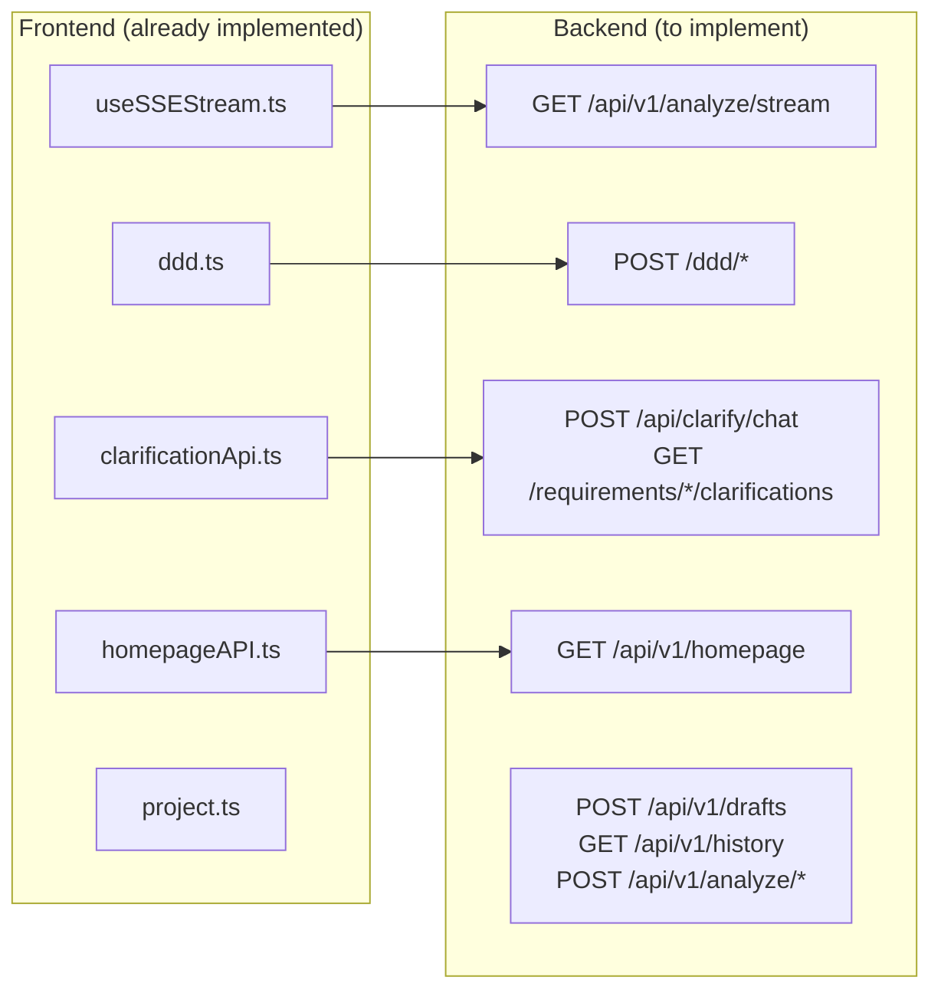

# Architecture: MVP Backend API Analysis & Implementation

**Project**: `mvp-backend-analysis`  
**Architect**: architect  
**Date**: 2026-03-22  
**Status**: design-architecture

---

## 1. Context

### Problem Statement
MVP homepage 6-step flow requires 12 API endpoints. Current state:

| Category | Count | Status |
|----------|-------|--------|
| Stable (known working) | 3 | ✅ `/projects` CRUD |
| Needs verification | 5 | ⚠️ DDD APIs, homepage, clarifications |
| Missing | 5 | ❌ SSE stream, clarify/chat, drafts, history, diagnose, optimize, regenerate |

### Goals
1. Verify existing APIs work correctly
2. Implement missing high-priority APIs
3. Define SSE event format
4. Establish fallback strategy for missing APIs

---

## 2. Tech Stack

| Component | Choice | Rationale |
|-----------|--------|-----------|
| Backend | Node.js + Express/Fastify | Existing infrastructure |
| SSE | Native `ReadableStream` / `EventEmitter` | No new dependencies |
| AI | Existing AI integration | Already in place |
| Verification | curl + Jest | Simple, no new infra |
| Frontend | TypeScript + axios | Already implemented |

---

## 3. Architecture

### 3.1 API Endpoint Map



### 3.2 SSE Event Format Specification

**Endpoint**: `GET /api/v1/analyze/stream?requirement=<text>`

**7 Event Types**:

```typescript
// 1. thinking — streaming reasoning text
event: thinking
data: {"content": "Analyzing requirements...", "delta": true}

// 2. step_context — bounded contexts generated
event: step_context
data: {"content": "...", "mermaidCode": "...", "confidence": 0.85}

// 3. step_model — domain models generated
event: step_model
data: {"content": "...", "mermaidCode": "...", "entities": [], "confidence": 0.80}

// 4. step_flow — business flow generated
event: step_flow
data: {"content": "...", "mermaidCode": "...", "confidence": 0.75}

// 5. step_components — component relationships
event: step_components
data: {"content": "...", "mermaidCode": "...", "confidence": 0.70}

// 6. done — stream complete
event: done
data: {"projectId": "proj_xxx", "summary": "..."}

// 7. error — stream failed
event: error
data: {"message": "AI service unavailable", "code": "AI_ERROR"}
```

**SSE Implementation** (Fastify):

```typescript
app.get('/api/v1/analyze/stream', async (req, reply) => {
  const { requirement } = req.query;
  if (!requirement) return reply.status(400).send({ error: 'requirement required' });

  reply.raw.setHeader('Content-Type', 'text/event-stream');
  reply.raw.setHeader('Cache-Control', 'no-cache');
  reply.raw.setHeader('Connection', 'keep-alive');

  // Stream events
  for (const event of generateEvents(requirement)) {
    reply.raw.write(`event: ${event.type}\ndata: ${JSON.stringify(event.data)}\n\n`);
    await sleep(100); // backpressure
  }
  reply.raw.write(`event: done\ndata: ${JSON.stringify({ projectId: 'proj_xxx' })}\n\n`);
  reply.raw.end();
});
```

### 3.3 Fallback Strategy

For APIs not yet implemented, frontend should gracefully degrade:

```typescript
// useSSEStream.ts fallback
async function connect(requirement: string) {
  try {
    // Try SSE first
    const es = new EventSource(`/api/v1/analyze/stream?requirement=${encodeURIComponent(requirement)}`);
    // ... handle events
  } catch (err) {
    // Fallback to REST POST
    const res = await fetch('/ddd/bounded-context', {
      method: 'POST',
      body: JSON.stringify({ requirement }),
    });
    const data = await res.json();
    onBoundedContext(data);
    onStepComplete('context');
  }
}
```

---

## 4. API Definitions

### 4.1 SSE Stream
```
GET /api/v1/analyze/stream?requirement=<string>
Response: text/event-stream (see §3.2)
```

### 4.2 DDD APIs
```
POST /ddd/bounded-context
Request:  { requirementText: string, projectId?: string }
Response: { boundedContexts: BoundedContext[], mermaidCode: string }

POST /ddd/domain-model
Request:  { requirementText: string, boundedContexts: BoundedContext[] }
Response: { domainModels: DomainModel[], mermaidCode: string, success: true }

POST /ddd/business-flow
Request:  { requirementText: string, domainModels: DomainModel[] }
Response: { businessFlow: BusinessFlow, mermaidCode: string, success: true }
```

### 4.3 Clarification APIs
```
POST /api/clarify/chat
Request:  { message: string, history: Message[], context?: string }
Response: { reply: string, quickReplies?: string[], completeness: number, suggestions?: string[], nextAction?: string }

GET /requirements/:requirementId/clarifications
Response: Clarification[]

PUT /clarifications/:clarificationId
Request:  { answer?: string, status?: 'answered' | 'skipped' }
Response: Clarification
```

### 4.4 Homepage API
```
GET /api/v1/homepage
Response: { theme: ThemeMode, userPreferences?: { theme: ThemeMode }, configs?: unknown[], lastUpdated?: string }
```

### 4.5 ActionBar APIs
```
POST /api/v1/drafts     — Save draft
GET  /api/v1/drafts     — List drafts
GET  /api/v1/history    — History records
POST /api/v1/analyze/diagnose   — Diagnosis
POST /api/v1/analyze/optimize   — Optimization
POST /api/v1/analyze/regenerate — Regeneration
```

---

## 5. Testing Strategy

### 5.1 Verification by Curl

```bash
# P0 APIs — must all return 200 (not 404/500)
curl -s -o /dev/null -w "%{http_code}" https://api.vibex.top/api/v1/homepage
curl -s -X POST -H "Content-Type: application/json" \
  -d '{"requirementText":"test"}' https://api.vibex.top/ddd/bounded-context \
  -w "\n%{http_code}"
curl -N -H "Accept: text/event-stream" \
  "https://api.vibex.top/api/v1/analyze/stream?requirement=test" \
  -w "\n%{http_code}" --max-time 5
curl -s -X POST -H "Content-Type: application/json" \
  -d '{"message":"test","history":[]}' https://api.vibex.top/api/clarify/chat \
  -w "\n%{http_code}"
```

### 5.2 Automated Test Script

```bash
#!/bin/bash
# verify-backend-apis.sh
BASE="https://api.vibex.top"

echo "=== Backend API Verification ==="

check_api() {
  local name="$1"; local method="$2"; local url="$3"; local expected="$4"
  local code=$(curl -s -o /dev/null -w "%{http_code}" -X "$method" "$url")
  if [ "$code" = "$expected" ]; then
    echo "✅ $name ($code)"
  else
    echo "❌ $name: expected $expected, got $code"
  fi
}

check_api "homepage" "GET" "$BASE/api/v1/homepage" "200"
check_api "clarify/chat" "POST" "$BASE/api/clarify/chat" "200"
check_api "bounded-context" "POST" "$BASE/ddd/bounded-context" "200"

echo "=== SSE Stream ==="
curl -N -H "Accept: text/event-stream" "$BASE/api/v1/analyze/stream?requirement=test" \
  --max-time 5 2>/dev/null | head -5 && echo "✅ SSE stream responds" || echo "❌ SSE stream failed"
```

### 5.3 Frontend Integration Tests

```typescript
// e2e/backend-apis.test.ts
describe('Backend API Verification', () => {
  it('homepage API returns 200', async () => {
    const res = await fetch('/api/v1/homepage');
    expect(res.ok).toBe(true);
  });

  it('SSE stream emits step_context event', async () => {
    const events = await streamSSE('/api/v1/analyze/stream?requirement=test');
    expect(events).toContainEqual(expect.objectContaining({ type: 'step_context' }));
  });

  it('clarify/chat returns reply', async () => {
    const res = await fetch('/api/clarify/chat', {
      method: 'POST',
      body: JSON.stringify({ message: 'test', history: [] }),
    });
    const data = await res.json();
    expect(data).toHaveProperty('reply');
  });
});
```

---

## 6. Implementation Phases

### Phase 1: Verify & Fix (P0)
| Task | Agent | Description |
|------|-------|-------------|
| Verify DDD APIs | dev | curl test each `/ddd/*` endpoint |
| Fix homepage API 500 | dev | Fix backend returning 500 on `/api/v1/homepage` |
| Implement SSE stream | dev | `GET /api/v1/analyze/stream` |
| Implement clarify/chat | dev | `POST /api/clarify/chat` |

### Phase 2: Complete Clarification (P1)
| Task | Agent | Description |
|------|-------|-------------|
| Verify clarification CRUD | dev | curl test GET/PUT clarifications |
| SSE event type completeness | dev | All 7 event types implemented |

### Phase 3: ActionBar APIs (P2)
| Task | Agent | Description |
|------|-------|-------------|
| Drafts API | dev | POST/GET `/api/v1/drafts` |
| History API | dev | GET `/api/v1/history` |
| Diagnose/Optimize/Regenerate | dev | POST `/api/v1/analyze/*` |

---

## 7. Trade-offs

| Decision | Trade-off |
|----------|-----------|
| SSE vs WebSocket | ✅ Simpler, HTTP-only; ⚠️ No bidirectional |
| Backend mock for missing APIs | ✅ Frontend can develop; ⚠️ May diverge from real behavior |
| Single endpoint SSE vs chained REST | ✅ Better UX (streaming); ⚠️ More complex backend |
| API path inconsistency (/ddd vs /api/v1) | ⚠️ Confusing; ✅ Keep for now (backward compat) |

---

## 8. Verification Checklist

- [ ] `GET /api/v1/homepage` returns 200 (not 500)
- [ ] `POST /ddd/bounded-context` returns 200 + valid JSON
- [ ] `POST /ddd/domain-model` returns 200 + valid JSON
- [ ] `POST /ddd/business-flow` returns 200 + valid JSON
- [ ] `GET /api/v1/analyze/stream` SSE endpoint exists (not 404)
- [ ] SSE stream emits all 7 event types
- [ ] `POST /api/clarify/chat` returns 200 + reply field
- [ ] Frontend 6-step flow can complete end-to-end
- [ ] All API responses include proper error format
