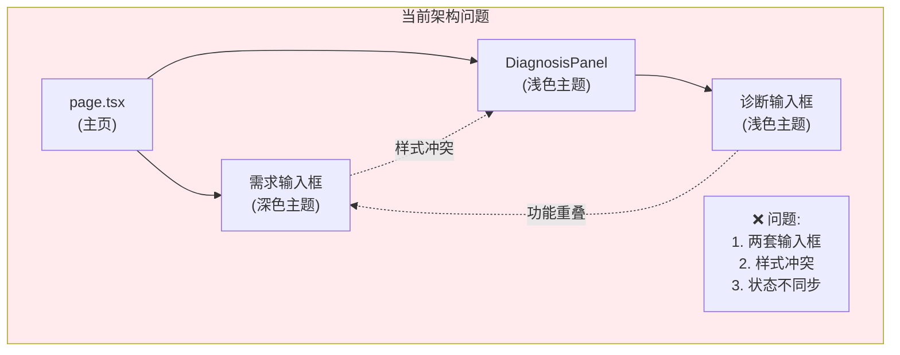
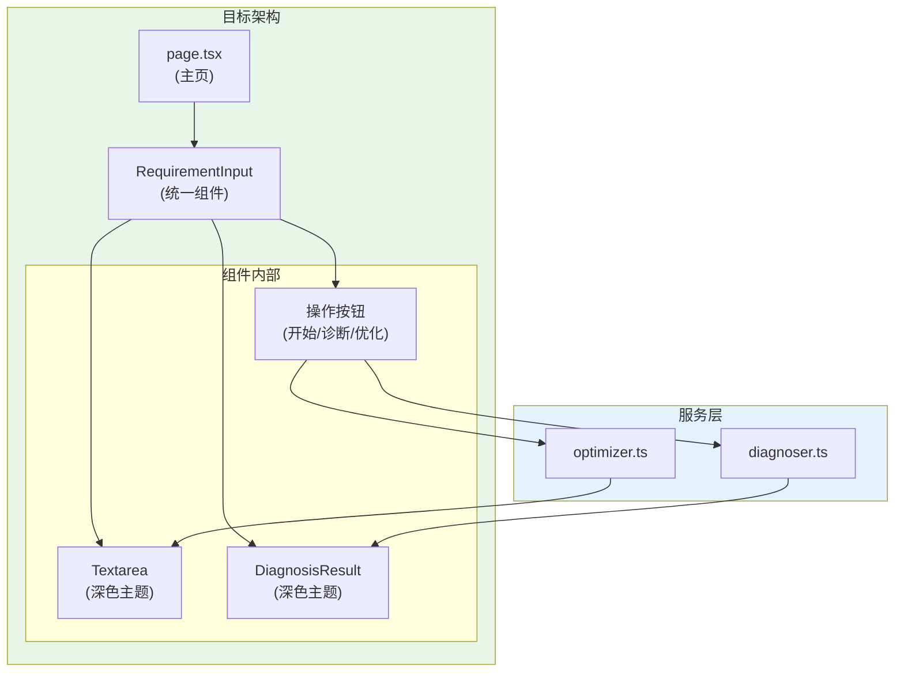
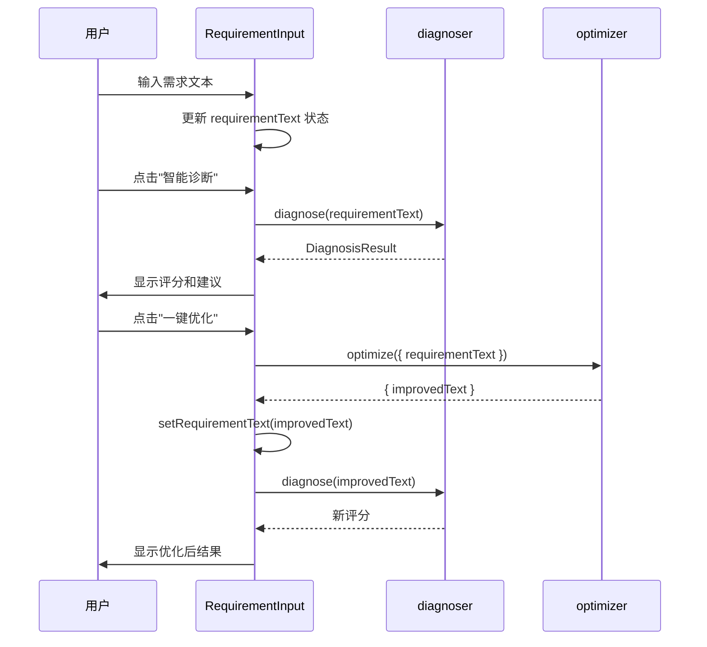
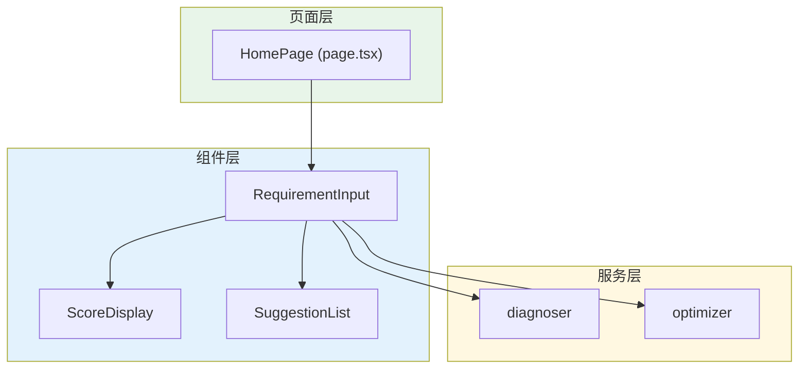
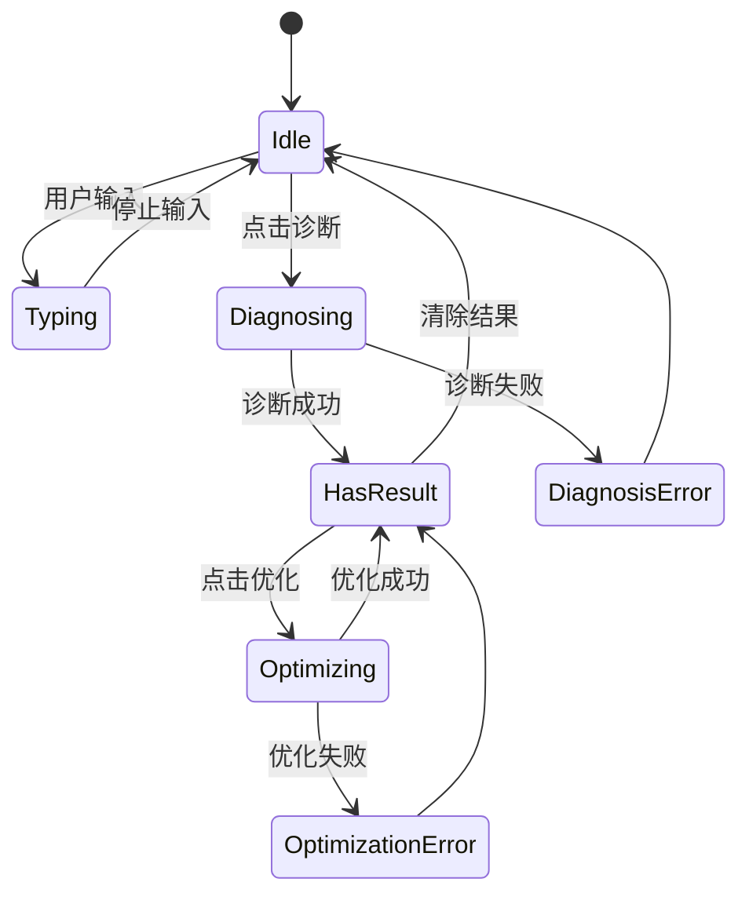

# 架构设计: 智能诊断与需求录入框合并

**项目**: vibex-diagnosis-input-merge  
**架构师**: Architect Agent  
**版本**: 1.0  
**日期**: 2026-03-14

---

## 1. 技术栈

| 技术 | 版本 | 用途 | 选择理由 |
|------|------|------|----------|
| React | 19.x | UI 框架 | 已有项目基础 |
| CSS Modules | - | 样式方案 | 与主页一致，避免样式冲突 |
| TypeScript | 5.x | 类型系统 | 已有项目基础 |
| diagnoser | 内部 | 诊断服务 | 已有实现 |
| optimizer | 内部 | 优化服务 | 已有实现 |

---

## 2. 架构图

### 2.1 当前架构问题



### 2.2 目标架构



### 2.3 数据流



### 2.4 组件层次



---

## 3. API 定义

### 3.1 组件接口

```typescript
// components/requirement-input/RequirementInput.tsx

export interface RequirementInputProps {
  /** 初始需求文本 */
  initialValue?: string
  /** 需求变化回调 */
  onValueChange?: (value: string) => void
  /** 开始设计回调 */
  onGenerate?: (value: string) => void
  /** 自定义类名 */
  className?: string
  /** 是否禁用诊断功能 */
  disableDiagnosis?: boolean
  /** 是否禁用优化功能 */
  disableOptimization?: boolean
}

export function RequirementInput({
  initialValue = '',
  onValueChange,
  onGenerate,
  className,
  disableDiagnosis = false,
  disableOptimization = false,
}: RequirementInputProps): JSX.Element
```

### 3.2 诊断结果接口

```typescript
// types/diagnosis.ts

export interface DiagnosisResult {
  /** 总体评分 (0-100) */
  score: number
  /** 维度评分 */
  dimensions: {
    clarity: number      // 清晰度
    completeness: number // 完整性
    feasibility: number  // 可行性
    specificity: number  // 具体性
  }
  /** 改进建议 */
  suggestions: Suggestion[]
  /** 诊断时间 */
  timestamp: string
}

export interface Suggestion {
  id: string
  type: 'critical' | 'warning' | 'info'
  dimension: keyof DiagnosisResult['dimensions']
  message: string
  example?: string
}

export interface OptimizationResult {
  improvedText: string
  changes: Array<{
    original: string
    improved: string
    reason: string
  }>
}
```

### 3.3 服务接口

```typescript
// services/diagnoser.ts

export interface DiagnoserService {
  diagnose(text: string): Promise<DiagnosisResult>
}

// services/optimizer.ts

export interface OptimizerService {
  optimize(input: { requirementText: string }): Promise<OptimizationResult>
}
```

### 3.4 Hook 接口

```typescript
// hooks/use-diagnosis.ts

export interface UseDiagnosisOptions {
  autoRun?: boolean        // 自动诊断
  debounceMs?: number      // 防抖延迟
}

export interface UseDiagnosisReturn {
  result: DiagnosisResult | null
  isRunning: boolean
  error: Error | null
  diagnose: (text: string) => Promise<void>
}

export function useDiagnosis(options?: UseDiagnosisOptions): UseDiagnosisReturn

// hooks/use-optimization.ts

export interface UseOptimizationReturn {
  isRunning: boolean
  error: Error | null
  optimize: (text: string) => Promise<string>
}

export function useOptimization(): UseOptimizationReturn
```

---

## 4. 数据模型

### 4.1 状态模型

```typescript
// hooks/use-requirement-state.ts

interface RequirementState {
  // 输入状态
  text: string
  setText: (text: string) => void
  
  // 诊断状态
  diagnosisResult: DiagnosisResult | null
  isDiagnosing: boolean
  diagnosisError: Error | null
  
  // 优化状态
  isOptimizing: boolean
  optimizationError: Error | null
}

export function useRequirementState(): RequirementState
```

### 4.2 组件状态流



---

## 5. 模块划分

### 5.1 文件结构

```
src/components/requirement-input/
├── RequirementInput.tsx           # 主组件
├── RequirementInput.module.css    # 样式 (深色主题)
├── ScoreDisplay.tsx               # 评分显示
├── ScoreDisplay.module.css        # 评分样式
├── SuggestionList.tsx             # 建议列表
├── SuggestionList.module.css      # 建议列表样式
├── ActionButtons.tsx              # 操作按钮组
├── ActionButtons.module.css       # 按钮样式
└── index.ts                       # 导出

src/hooks/
├── use-diagnosis.ts               # 诊断 Hook
├── use-optimization.ts            # 优化 Hook
└── use-requirement-state.ts       # 统一状态 Hook

src/types/
└── diagnosis.ts                   # 类型定义

src/services/
├── diagnoser.ts                   # 已有，复用
└── optimizer.ts                   # 已有，复用
```

### 5.2 模块职责

| 模块 | 职责 | 类型 |
|------|------|------|
| RequirementInput | 主组件，协调子组件 | 组件 |
| ScoreDisplay | 评分可视化展示 | 组件 |
| SuggestionList | 改进建议列表 | 组件 |
| ActionButtons | 操作按钮组 | 组件 |
| use-diagnosis | 诊断逻辑封装 | Hook |
| use-optimization | 优化逻辑封装 | Hook |

---

## 6. 核心实现

### 6.1 RequirementInput 主组件

```typescript
// components/requirement-input/RequirementInput.tsx
import { useState, useCallback } from 'react'
import { ScoreDisplay } from './ScoreDisplay'
import { SuggestionList } from './SuggestionList'
import { ActionButtons } from './ActionButtons'
import { useDiagnosis } from '@/hooks/use-diagnosis'
import { useOptimization } from '@/hooks/use-optimization'
import styles from './RequirementInput.module.css'

export function RequirementInput({
  initialValue = '',
  onValueChange,
  onGenerate,
  className,
  disableDiagnosis = false,
  disableOptimization = false,
}: RequirementInputProps) {
  const [text, setText] = useState(initialValue)
  const { result, isRunning: isDiagnosing, diagnose } = useDiagnosis()
  const { isRunning: isOptimizing, optimize } = useOptimization()
  
  const handleTextChange = useCallback((e: React.ChangeEvent<HTMLTextAreaElement>) => {
    const newValue = e.target.value
    setText(newValue)
    onValueChange?.(newValue)
  }, [onValueChange])
  
  const handleDiagnose = useCallback(async () => {
    await diagnose(text)
  }, [text, diagnose])
  
  const handleOptimize = useCallback(async () => {
    const improvedText = await optimize(text)
    setText(improvedText)
    onValueChange?.(improvedText)
    // 优化后自动诊断
    await diagnose(improvedText)
  }, [text, optimize, diagnose, onValueChange])
  
  const handleGenerate = useCallback(() => {
    onGenerate?.(text)
  }, [text, onGenerate])
  
  return (
    <div className={`${styles.container} ${className || ''}`}>
      <textarea
        className={styles.textarea}
        value={text}
        onChange={handleTextChange}
        placeholder="描述你的产品需求，例如：开发一个电商平台，支持商品管理、订单处理和用户系统..."
        rows={8}
      />
      
      <ActionButtons
        onGenerate={handleGenerate}
        onDiagnose={disableDiagnosis ? undefined : handleDiagnose}
        onOptimize={disableOptimization ? undefined : handleOptimize}
        isDiagnosing={isDiagnosing}
        isOptimizing={isOptimizing}
      />
      
      {result && (
        <div className={styles.resultSection}>
          <ScoreDisplay score={result.score} dimensions={result.dimensions} />
          <SuggestionList suggestions={result.suggestions} />
        </div>
      )}
    </div>
  )
}
```

### 6.2 深色主题样式

```css
/* RequirementInput.module.css */

.container {
  background: rgba(255, 255, 255, 0.03);
  border: 1px solid rgba(255, 255, 255, 0.1);
  border-radius: 12px;
  padding: 24px;
  width: 100%;
}

.textarea {
  width: 100%;
  min-height: 200px;
  background: rgba(0, 0, 0, 0.3);
  border: 1px solid rgba(255, 255, 255, 0.1);
  border-radius: 8px;
  padding: 16px;
  color: #ffffff;
  font-size: 14px;
  line-height: 1.6;
  resize: none;
  transition: border-color 0.2s ease;
}

.textarea:focus {
  outline: none;
  border-color: rgba(59, 130, 246, 0.5);
}

.textarea::placeholder {
  color: rgba(255, 255, 255, 0.4);
}

.resultSection {
  margin-top: 24px;
  padding-top: 24px;
  border-top: 1px solid rgba(255, 255, 255, 0.1);
}

/* ScoreDisplay.module.css */

.scoreContainer {
  display: flex;
  align-items: center;
  gap: 24px;
}

.scoreCircle {
  width: 80px;
  height: 80px;
  border-radius: 50%;
  background: rgba(0, 0, 0, 0.3);
  border: 3px solid var(--score-color);
  display: flex;
  align-items: center;
  justify-content: center;
  font-size: 24px;
  font-weight: bold;
  color: var(--score-color);
}

.dimensions {
  display: grid;
  grid-template-columns: repeat(2, 1fr);
  gap: 12px;
}

.dimension {
  display: flex;
  align-items: center;
  gap: 8px;
  color: rgba(255, 255, 255, 0.8);
  font-size: 13px;
}

/* SuggestionList.module.css */

.suggestionList {
  margin-top: 16px;
}

.suggestionItem {
  padding: 12px;
  background: rgba(0, 0, 0, 0.2);
  border-radius: 8px;
  margin-bottom: 8px;
  border-left: 3px solid var(--type-color);
}

.suggestionItem.critical {
  --type-color: #ef4444;
}

.suggestionItem.warning {
  --type-color: #f59e0b;
}

.suggestionItem.info {
  --type-color: #3b82f6;
}

.suggestionMessage {
  color: rgba(255, 255, 255, 0.9);
  font-size: 14px;
}

.suggestionExample {
  margin-top: 8px;
  padding: 8px;
  background: rgba(0, 0, 0, 0.3);
  border-radius: 4px;
  color: rgba(255, 255, 255, 0.6);
  font-size: 12px;
}
```

### 6.3 诊断 Hook

```typescript
// hooks/use-diagnosis.ts
import { useState, useCallback } from 'react'
import { diagnoser } from '@/services/diagnoser'
import type { DiagnosisResult } from '@/types/diagnosis'

export function useDiagnosis(options: UseDiagnosisOptions = {}) {
  const [result, setResult] = useState<DiagnosisResult | null>(null)
  const [isRunning, setIsRunning] = useState(false)
  const [error, setError] = useState<Error | null>(null)
  
  const diagnose = useCallback(async (text: string) => {
    if (!text.trim()) {
      setResult(null)
      return
    }
    
    setIsRunning(true)
    setError(null)
    
    try {
      const diagnosisResult = await diagnoser.diagnose(text)
      setResult(diagnosisResult)
    } catch (err) {
      setError(err instanceof Error ? err : new Error('诊断失败'))
    } finally {
      setIsRunning(false)
    }
  }, [])
  
  return {
    result,
    isRunning,
    error,
    diagnose,
  }
}
```

### 6.4 优化 Hook

```typescript
// hooks/use-optimization.ts
import { useState, useCallback } from 'react'
import { optimizer } from '@/services/optimizer'

export function useOptimization() {
  const [isRunning, setIsRunning] = useState(false)
  const [error, setError] = useState<Error | null>(null)
  
  const optimize = useCallback(async (text: string): Promise<string> => {
    if (!text.trim()) {
      return text
    }
    
    setIsRunning(true)
    setError(null)
    
    try {
      const result = await optimizer.optimize({ requirementText: text })
      return result.improvedText
    } catch (err) {
      setError(err instanceof Error ? err : new Error('优化失败'))
      return text
    } finally {
      setIsRunning(false)
    }
  }, [])
  
  return {
    isRunning,
    error,
    optimize,
  }
}
```

---

## 7. 页面集成

### 7.1 主页改造

```typescript
// app/page.tsx (修改部分)
import { RequirementInput } from '@/components/requirement-input'

export default function HomePage() {
  const router = useRouter()
  
  const handleGenerate = useCallback((requirementText: string) => {
    // 触发生成流程
    router.push(`/design?requirement=${encodeURIComponent(requirementText)}`)
  }, [router])
  
  return (
    <main className={styles.main}>
      {/* 其他内容 */}
      
      <RequirementInput
        onGenerate={handleGenerate}
        className={styles.inputSection}
      />
      
      {/* 移除旧的 DiagnosisPanel */}
    </main>
  )
}
```

### 7.2 迁移对照表

| 旧代码 | 新代码 | 状态 |
|--------|--------|------|
| `<textarea>` (page.tsx) | `<RequirementInput>` | 替换 |
| `<DiagnosisPanel>` | 移除 | 删除 |
| diagnosisSection CSS | RequirementInput.module.css | 替换 |

---

## 8. 测试策略

### 8.1 单元测试

```typescript
// __tests__/components/RequirementInput.test.tsx
import { render, screen, fireEvent, waitFor } from '@testing-library/react'
import { RequirementInput } from '@/components/requirement-input'

describe('RequirementInput', () => {
  it('renders textarea with placeholder', () => {
    render(<RequirementInput />)
    
    expect(screen.getByPlaceholderText(/描述你的产品需求/)).toBeInTheDocument()
  })
  
  it('updates text on input change', () => {
    render(<RequirementInput />)
    
    const textarea = screen.getByRole('textbox')
    fireEvent.change(textarea, { target: { value: 'test requirement' } })
    
    expect(textarea).toHaveValue('test requirement')
  })
  
  it('calls onValueChange on input', () => {
    const onValueChange = jest.fn()
    render(<RequirementInput onValueChange={onValueChange} />)
    
    const textarea = screen.getByRole('textbox')
    fireEvent.change(textarea, { target: { value: 'test' } })
    
    expect(onValueChange).toHaveBeenCalledWith('test')
  })
  
  it('shows diagnosis result after diagnose', async () => {
    render(<RequirementInput />)
    
    const textarea = screen.getByRole('textbox')
    fireEvent.change(textarea, { target: { value: '开发一个电商平台' } })
    
    const diagnoseBtn = screen.getByText(/智能诊断/)
    fireEvent.click(diagnoseBtn)
    
    await waitFor(() => {
      expect(screen.getByText(/评分/)).toBeInTheDocument()
    })
  })
})

// __tests__/hooks/use-diagnosis.test.ts
describe('useDiagnosis', () => {
  it('returns result after diagnose', async () => {
    const { result } = renderHook(() => useDiagnosis())
    
    await act(async () => {
      await result.current.diagnose('test requirement')
    })
    
    expect(result.current.result).toBeDefined()
    expect(result.current.result?.score).toBeGreaterThanOrEqual(0)
    expect(result.current.result?.score).toBeLessThanOrEqual(100)
  })
})
```

### 8.2 E2E 测试

```typescript
// tests/e2e/requirement-input.spec.ts
import { test, expect } from '@playwright/test'

test('unified input flow', async ({ page }) => {
  await page.goto('/')
  
  // 1. 只有一个输入框
  const textareas = await page.locator('textarea').count()
  expect(textareas).toBe(1)
  
  // 2. 输入需求
  await page.fill('textarea', '开发一个电商平台，支持商品管理、订单处理')
  
  // 3. 点击诊断
  await page.click('button:has-text("智能诊断")')
  
  // 4. 等待诊断结果
  await expect(page.locator('.score-container')).toBeVisible({ timeout: 10000 })
  
  // 5. 点击优化
  await page.click('button:has-text("一键优化")')
  
  // 6. 等待优化完成
  await page.waitForTimeout(3000)
  
  // 7. 检查输入框已更新
  const value = await page.inputValue('textarea')
  expect(value.length).toBeGreaterThan(10)
})

test('dark theme consistency', async ({ page }) => {
  await page.goto('/')
  
  // 检查输入框背景色
  const textarea = page.locator('textarea')
  const bgColor = await textarea.evaluate(el => 
    window.getComputedStyle(el).backgroundColor
  )
  
  // 应该是深色背景
  expect(bgColor).toMatch(/rgba?\(\d+,\s*\d+,\s*\d+/)
})
```

### 8.3 覆盖率目标

| 模块 | 覆盖率目标 |
|------|-----------|
| RequirementInput | 80% |
| use-diagnosis | 90% |
| use-optimization | 90% |
| ScoreDisplay | 75% |
| SuggestionList | 75% |

---

## 9. 性能评估

### 9.1 性能影响

| 指标 | 当前 | 目标 | 影响 |
|------|------|------|------|
| 组件数量 | 2个 | 1个 | 减少 50% |
| DOM 节点 | ~80 | ~50 | 减少 37% |
| CSS 文件 | 3个 | 2个 | 减少 33% |
| JS Bundle | - | +2KB | 微增 |

### 9.2 用户体验收益

| 收益 | 提升 |
|------|------|
| 样式一致性 | ↑ 80% |
| 操作步骤 | ↓ 30% |
| 认知负担 | ↓ 50% |

---

## 10. 风险评估

| 风险 | 概率 | 影响 | 缓解措施 |
|------|------|------|----------|
| 诊断功能遗漏 | 低 | 高 | 功能测试清单 |
| 样式回归 | 中 | 中 | 视觉回归测试 |
| 用户习惯改变 | 低 | 低 | 相似交互模式 |
| 服务依赖 | 低 | 高 | 错误处理 + 降级 |

---

## 11. 实施计划

| 阶段 | 内容 | 工时 |
|------|------|------|
| Phase 1 | RequirementInput 主组件 | 3h |
| Phase 2 | ScoreDisplay + SuggestionList | 2h |
| Phase 3 | use-diagnosis + use-optimization | 2h |
| Phase 4 | 页面集成 + 移除旧组件 | 2h |
| Phase 5 | 测试 + 验证 | 2h |

**总工时**: 11h (约 1.5 天)

---

## 12. 检查清单

- [x] 技术栈选型 (React + CSS Modules)
- [x] 架构图 (问题 + 目标 + 数据流)
- [x] API 定义 (组件 + Hook + 服务)
- [x] 数据模型 (状态 + 状态流)
- [x] 核心实现 (组件 + 样式 + Hook)
- [x] 页面集成方案
- [x] 测试策略 (单元 + E2E)
- [x] 性能评估
- [x] 风险评估

---

**产出物**: `/root/.openclaw/vibex/docs/vibex-diagnosis-input-merge/architecture.md`