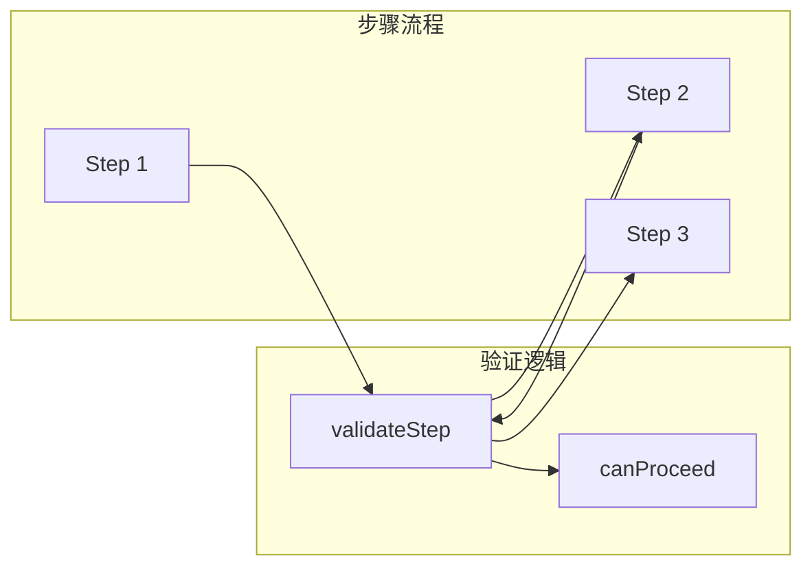

# Architecture: Step 验证逻辑修复

**项目**: vibex-fix-step-validation  
**版本**: 1.0  
**架构师**: Architect  
**日期**: 2026-03-19

---

## 1. 问题概述

修复 Step 验证逻辑的测试回归，确保功能正确性。

---

## 2. Tech Stack

| 类别 | 工具 | 说明 |
|------|------|------|
| 测试框架 | Jest | 单元测试 |
| 测试库 | React Testing Library | 组件测试 |
| 状态管理 | useState | 步骤状态 |

---

## 3. 架构图

---

## 4. 修复范围

| 文件 | 修复内容 |
|------|----------|
| StepValidation.ts | 验证条件修复 |
| useStepNavigation.ts | 状态转换逻辑 |
| *.test.tsx | 补充测试用例 |

---

## 5. 测试策略

| 测试场景 | 预期行为 |
|----------|----------|
| Step 1→2 验证通过 | 可正常跳转 |
| Step 2→3 验证通过 | 可正常跳转 |
| 空输入验证 | 显示错误提示 |

---

## 6. 验收标准

| 标准 | 验证方式 |
|------|----------|
| Step 验证测试全通过 | npm test |
| 手动验证流程正常 | E2E 测试 |
| 边界条件处理正确 | 边界测试 |

---

## 7. 工作量

**1天**

---

*Architecture - 2026-03-19*
