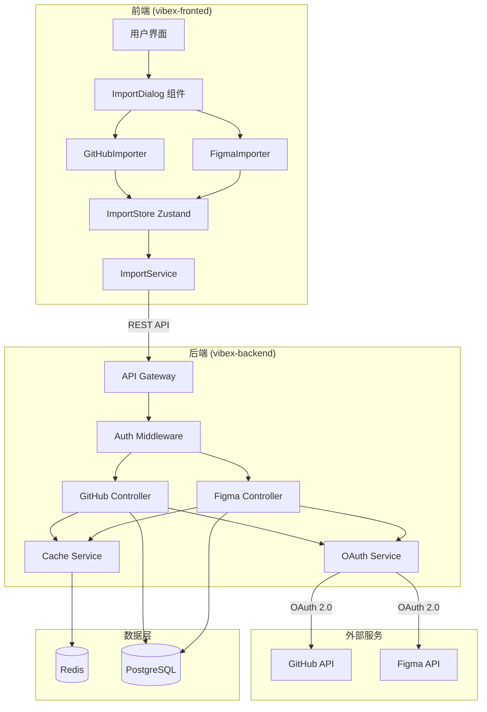
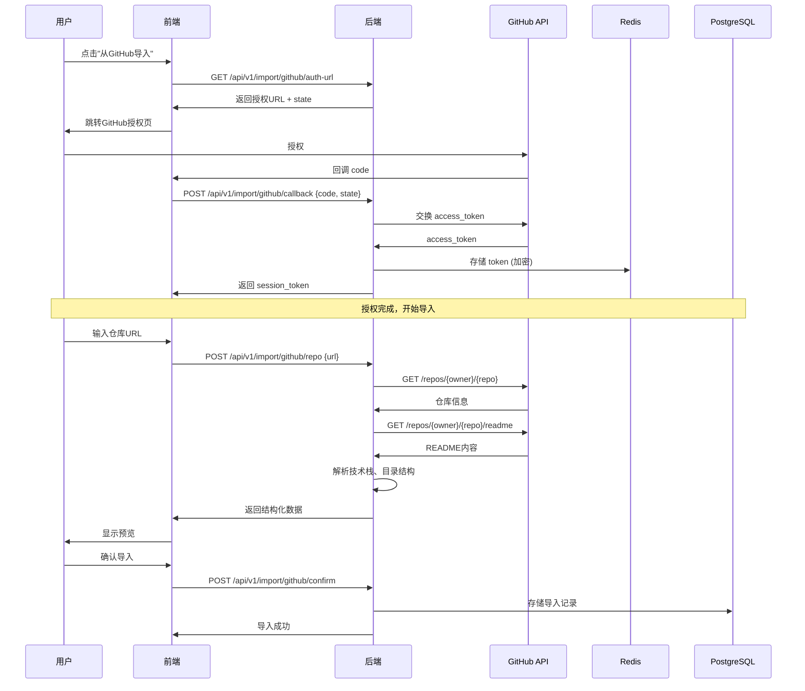
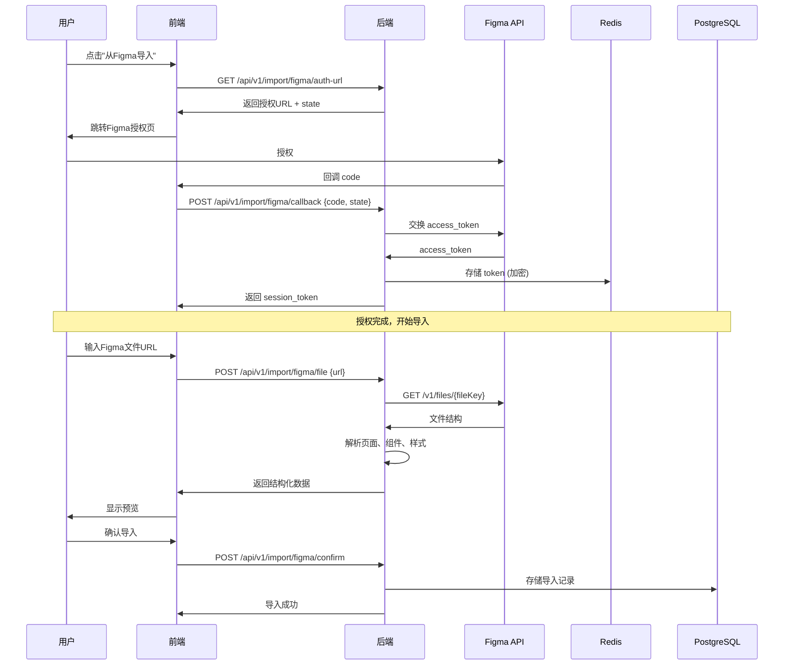
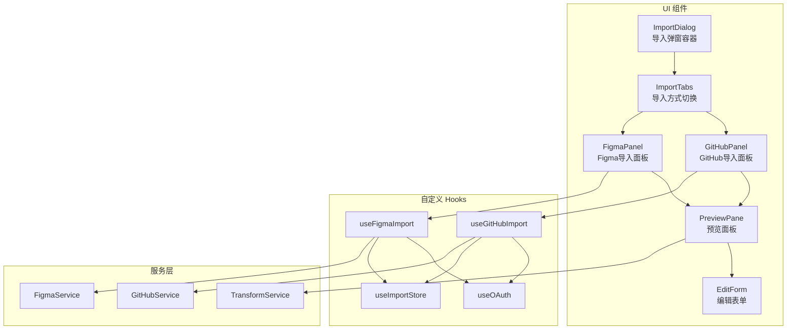
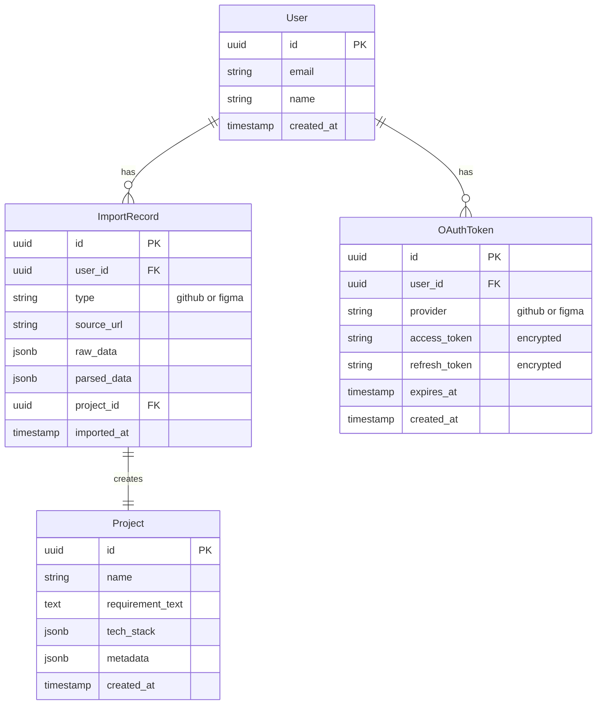

# 架构设计：GitHub/Figma 一键导入功能

**项目**: vibex-github-figma-import  
**架构师**: Architect Agent  
**日期**: 2026-03-14  
**状态**: ✅ 已完成

---

## 1. Tech Stack (技术栈)

### 1.1 前端技术栈

| 技术 | 版本 | 用途 | 选择理由 |
|------|------|------|----------|
| React | 18.x | UI 框架 | 现有项目基础，组件化开发 |
| TypeScript | 5.x | 类型安全 | 现有项目基础，API 类型定义 |
| React Query | 5.x | 数据获取 | 现有项目已集成，缓存管理 |
| Zustand | 4.x | 状态管理 | 现有项目已集成，轻量级 |
| OAuth 2.0 PKCE | - | 授权流程 | 安全性高，无需服务端存储 secret |

### 1.2 后端技术栈

| 技术 | 版本 | 用途 | 选择理由 |
|------|------|------|----------|
| Node.js | 20.x | 运行时 | 现有后端基础 |
| Express | 4.x | API 框架 | 现有项目基础 |
| JWT | - | Token 管理 | 无状态认证 |
| Redis | 7.x | 缓存/会话 | OAuth state 存储，请求缓存 |
| PostgreSQL | 15.x | 数据存储 | 现有数据库，存储导入记录 |

### 1.3 外部 API

| API | 版本 | 用途 | 限制 |
|------|------|------|------|
| GitHub REST API | v3 | 仓库信息获取 | 5000 req/hr (auth) |
| Figma REST API | v1 | 设计稿信息获取 | 按计划限制 |

---

## 2. Architecture Diagram (架构图)

### 2.1 整体架构



### 2.2 GitHub 导入流程



### 2.3 Figma 导入流程



### 2.4 组件架构



---

## 3. API Definitions (API 定义)

### 3.1 GitHub API

#### 3.1.1 获取授权 URL

```typescript
GET /api/v1/import/github/auth-url

Response 200:
{
  "success": true,
  "data": {
    "authUrl": "https://github.com/login/oauth/authorize?client_id=xxx&state=xxx",
    "state": "random_state_string"
  }
}
```

#### 3.1.2 OAuth 回调

```typescript
POST /api/v1/import/github/callback

Request:
{
  "code": "github_auth_code",
  "state": "state_string"
}

Response 200:
{
  "success": true,
  "data": {
    "sessionToken": "jwt_token",
    "expiresIn": 3600
  }
}
```

#### 3.1.3 导入仓库

```typescript
POST /api/v1/import/github/repo

Headers:
  Authorization: Bearer <session_token>

Request:
{
  "url": "https://github.com/owner/repo"
}

Response 200:
{
  "success": true,
  "data": {
    "repoInfo": {
      "name": "repo-name",
      "fullName": "owner/repo",
      "description": "Repository description",
      "language": "TypeScript",
      "stars": 100
    },
    "readme": "# Project Name\n...",
    "techStack": {
      "frontend": ["React", "TypeScript"],
      "backend": ["Node.js", "Express"],
      "dependencies": ["axios", "zustand"]
    },
    "structure": {
      "type": "tree",
      "name": "root",
      "children": [
        { "type": "file", "name": "package.json" },
        { "type": "directory", "name": "src", "children": [...] }
      ]
    }
  }
}
```

#### 3.1.4 确认导入

```typescript
POST /api/v1/import/github/confirm

Headers:
  Authorization: Bearer <session_token>

Request:
{
  "repoUrl": "https://github.com/owner/repo",
  "requirementText": "用户编辑后的需求文本",
  "techStack": ["React", "TypeScript"]
}

Response 200:
{
  "success": true,
  "data": {
    "importId": "uuid",
    "projectId": "uuid"
  }
}
```

### 3.2 Figma API

#### 3.2.1 获取授权 URL

```typescript
GET /api/v1/import/figma/auth-url

Response 200:
{
  "success": true,
  "data": {
    "authUrl": "https://www.figma.com/oauth?client_id=xxx&state=xxx",
    "state": "random_state_string"
  }
}
```

#### 3.2.2 OAuth 回调

```typescript
POST /api/v1/import/figma/callback

Request:
{
  "code": "figma_auth_code",
  "state": "state_string"
}

Response 200:
{
  "success": true,
  "data": {
    "sessionToken": "jwt_token",
    "expiresIn": 3600
  }
}
```

#### 3.2.3 导入文件

```typescript
POST /api/v1/import/figma/file

Headers:
  Authorization: Bearer <session_token>

Request:
{
  "url": "https://www.figma.com/file/xxx/Project-Name"
}

Response 200:
{
  "success": true,
  "data": {
    "fileInfo": {
      "name": "Project Name",
      "key": "file_key",
      "lastModified": "2026-03-14T00:00:00Z"
    },
    "pages": [
      {
        "id": "page_id",
        "name": "Home Page",
        "children": [...]
      }
    ],
    "components": [
      {
        "id": "comp_id",
        "name": "Button",
        "type": "COMPONENT"
      }
    ],
    "styles": {
      "colors": [
        { "name": "Primary", "value": "#1890ff" }
      ],
      "typography": [
        { "name": "Heading1", "fontSize": 32, "fontWeight": "bold" }
      ]
    }
  }
}
```

#### 3.2.4 确认导入

```typescript
POST /api/v1/import/figma/confirm

Headers:
  Authorization: Bearer <session_token>

Request:
{
  "fileUrl": "https://www.figma.com/file/xxx/Project-Name",
  "requirementText": "用户编辑后的需求文本",
  "selectedPages": ["page_id_1", "page_id_2"]
}

Response 200:
{
  "success": true,
  "data": {
    "importId": "uuid",
    "projectId": "uuid"
  }
}
```

### 3.3 通用 API

#### 3.3.1 获取导入历史

```typescript
GET /api/v1/import/history

Headers:
  Authorization: Bearer <user_token>

Query:
  - type: "github" | "figma" | "all"
  - limit: number (default: 10)
  - offset: number (default: 0)

Response 200:
{
  "success": true,
  "data": {
    "items": [
      {
        "id": "uuid",
        "type": "github",
        "source": "owner/repo",
        "importedAt": "2026-03-14T00:00:00Z",
        "projectId": "uuid"
      }
    ],
    "total": 100,
    "hasMore": true
  }
}
```

---

## 4. Data Model (数据模型)

### 4.1 核心实体



### 4.2 数据库 Schema

```sql
-- OAuth Token 表
CREATE TABLE oauth_tokens (
    id UUID PRIMARY KEY DEFAULT gen_random_uuid(),
    user_id UUID NOT NULL REFERENCES users(id) ON DELETE CASCADE,
    provider VARCHAR(20) NOT NULL CHECK (provider IN ('github', 'figma')),
    access_token TEXT NOT NULL, -- AES-256 加密
    refresh_token TEXT, -- AES-256 加密
    expires_at TIMESTAMPTZ,
    created_at TIMESTAMPTZ DEFAULT NOW(),
    updated_at TIMESTAMPTZ DEFAULT NOW(),
    UNIQUE(user_id, provider)
);

-- 导入记录表
CREATE TABLE import_records (
    id UUID PRIMARY KEY DEFAULT gen_random_uuid(),
    user_id UUID NOT NULL REFERENCES users(id) ON DELETE CASCADE,
    type VARCHAR(20) NOT NULL CHECK (type IN ('github', 'figma')),
    source_url TEXT NOT NULL,
    raw_data JSONB, -- 原始 API 响应
    parsed_data JSONB, -- 解析后的结构化数据
    project_id UUID REFERENCES projects(id) ON DELETE SET NULL,
    imported_at TIMESTAMPTZ DEFAULT NOW(),
    created_at TIMESTAMPTZ DEFAULT NOW()
);

-- 索引
CREATE INDEX idx_oauth_tokens_user_provider ON oauth_tokens(user_id, provider);
CREATE INDEX idx_import_records_user ON import_records(user_id);
CREATE INDEX idx_import_records_type ON import_records(type);
CREATE INDEX idx_import_records_imported_at ON import_records(imported_at DESC);
```

### 4.3 Redis 缓存结构

```
# OAuth State (短期，5分钟)
oauth:state:{state} -> { user_id, provider, created_at }
TTL: 300s

# 临时 Token (中期，1小时)
oauth:temp_token:{session_token} -> { access_token, provider, expires_at }
TTL: 3600s

# API 响应缓存 (短期，10分钟)
cache:github:repo:{owner}:{repo} -> { repo_data, readme, tech_stack }
TTL: 600s

cache:figma:file:{file_key} -> { file_data, pages, components }
TTL: 600s
```

---

## 5. Testing Strategy (测试策略)

### 5.1 测试框架

| 类型 | 框架 | 用途 |
|------|------|------|
| 单元测试 | Jest | 服务层逻辑、工具函数 |
| 集成测试 | Jest + Supertest | API 端点测试 |
| E2E 测试 | Playwright | 用户流程测试 |
| Mock | MSW | API Mock |

### 5.2 覆盖率要求

| 模块 | 覆盖率要求 | 说明 |
|------|-----------|------|
| OAuthService | > 90% | 安全关键模块 |
| GitHubService | > 85% | 核心业务逻辑 |
| FigmaService | > 85% | 核心业务逻辑 |
| TransformService | > 80% | 数据转换逻辑 |
| API Controllers | > 80% | 端点覆盖 |
| 整体 | > 80% | 项目整体 |

### 5.3 核心测试用例

#### 5.3.1 单元测试

```typescript
// OAuthService.test.ts
describe('OAuthService', () => {
  it('should generate valid GitHub auth URL', () => {
    const result = OAuthService.generateAuthUrl('github');
    expect(result.authUrl).toContain('github.com/login/oauth/authorize');
    expect(result.state).toMatch(/^[a-f0-9]{32}$/);
  });

  it('should validate state and prevent CSRF', async () => {
    const state = 'valid_state';
    await Redis.set(`oauth:state:${state}`, JSON.stringify({ provider: 'github' }));
    
    await expect(OAuthService.validateState(state)).resolves.toBeTruthy();
    await expect(OAuthService.validateState('invalid')).rejects.toThrow('Invalid state');
  });

  it('should encrypt and decrypt tokens securely', () => {
    const token = 'gho_xxxxx';
    const encrypted = OAuthService.encryptToken(token);
    const decrypted = OAuthService.decryptToken(encrypted);
    
    expect(encrypted).not.toBe(token);
    expect(decrypted).toBe(token);
  });
});

// GitHubService.test.ts
describe('GitHubService', () => {
  it('should parse GitHub URL correctly', () => {
    const result = GitHubService.parseRepoUrl('https://github.com/owner/repo');
    expect(result).toEqual({ owner: 'owner', repo: 'repo' });
  });

  it('should throw error for invalid URL', () => {
    expect(() => GitHubService.parseRepoUrl('invalid-url')).toThrow('Invalid GitHub URL');
  });

  it('should extract tech stack from package.json', () => {
    const pkgJson = {
      dependencies: { react: '^18.0.0', typescript: '^5.0.0' },
      devDependencies: { jest: '^29.0.0' }
    };
    const result = GitHubService.extractTechStack(pkgJson);
    
    expect(result.frontend).toContain('React');
    expect(result.frontend).toContain('TypeScript');
  });
});

// FigmaService.test.ts
describe('FigmaService', () => {
  it('should parse Figma URL correctly', () => {
    const result = FigmaService.parseFileUrl('https://www.figma.com/file/abc123/Project-Name');
    expect(result).toEqual({ fileKey: 'abc123', fileName: 'Project-Name' });
  });

  it('should extract components from file data', () => {
    const fileData = {
      document: {
        children: [
          { id: '1', name: 'Button', type: 'COMPONENT' },
          { id: '2', name: 'Card', type: 'COMPONENT_SET' }
        ]
      }
    };
    const result = FigmaService.extractComponents(fileData);
    
    expect(result).toHaveLength(2);
    expect(result[0].name).toBe('Button');
  });
});
```

#### 5.3.2 集成测试

```typescript
// github-import.test.ts
describe('GitHub Import API', () => {
  it('POST /api/v1/import/github/repo should return repo data', async () => {
    const response = await request(app)
      .post('/api/v1/import/github/repo')
      .set('Authorization', `Bearer ${validToken}`)
      .send({ url: 'https://github.com/owner/repo' });

    expect(response.status).toBe(200);
    expect(response.body.success).toBe(true);
    expect(response.body.data.repoInfo.name).toBeDefined();
    expect(response.body.data.techStack).toBeDefined();
  });

  it('should return 401 without auth token', async () => {
    const response = await request(app)
      .post('/api/v1/import/github/repo')
      .send({ url: 'https://github.com/owner/repo' });

    expect(response.status).toBe(401);
  });

  it('should return 400 for invalid URL', async () => {
    const response = await request(app)
      .post('/api/v1/import/github/repo')
      .set('Authorization', `Bearer ${validToken}`)
      .send({ url: 'invalid-url' });

    expect(response.status).toBe(400);
  });
});
```

#### 5.3.3 E2E 测试

```typescript
// import-flow.spec.ts
describe('Import Flow', () => {
  test('GitHub import end-to-end', async ({ page }) => {
    await page.goto('/');
    
    // 打开导入弹窗
    await page.click('[data-testid="import-button"]');
    
    // 选择 GitHub 导入
    await page.click('[data-testid="github-tab"]');
    
    // Mock OAuth 流程
    await page.route('**/api/v1/import/github/auth-url', route => {
      route.fulfill({
        status: 200,
        body: JSON.stringify({
          success: true,
          data: { authUrl: 'http://mock-oauth', state: 'test-state' }
        })
      });
    });
    
    // 输入仓库 URL
    await page.fill('[data-testid="repo-url-input"]', 'https://github.com/facebook/react');
    
    // Mock 仓库数据
    await page.route('**/api/v1/import/github/repo', route => {
      route.fulfill({
        status: 200,
        body: JSON.stringify({
          success: true,
          data: {
            repoInfo: { name: 'react', fullName: 'facebook/react' },
            readme: '# React\n...',
            techStack: { frontend: ['React'] }
          }
        })
      });
    });
    
    // 验证预览显示
    await expect(page.locator('[data-testid="preview-pane"]')).toBeVisible();
    
    // 确认导入
    await page.click('[data-testid="confirm-import"]');
    
    // 验证成功提示
    await expect(page.locator('[data-testid="success-message"]')).toBeVisible();
  });
});
```

### 5.4 测试命令

```bash
# 单元测试
npm run test:unit

# 集成测试
npm run test:integration

# E2E 测试
npm run test:e2e

# 覆盖率报告
npm run test:coverage

# 全部测试
npm run test:all
```

---

## 6. 安全设计

### 6.1 OAuth 安全

| 安全措施 | 实现方式 |
|----------|----------|
| State 参数防 CSRF | 随机生成 32 位 state，Redis 存储验证 |
| PKCE 流程 | 代码交换密钥，防止授权码劫持 |
| Token 加密存储 | AES-256-GCM 加密，密钥由环境变量管理 |
| 最小权限原则 | GitHub: repo, Figma: file_read |
| Token 刷新 | 支持刷新令牌，自动续期 |

### 6.2 API 安全

| 安全措施 | 实现方式 |
|----------|----------|
| 认证中间件 | JWT 验证，拒绝未授权请求 |
| 速率限制 | 每用户 100 req/min |
| 输入验证 | Zod schema 验证所有输入 |
| 错误脱敏 | 不暴露敏感信息 |

---

## 7. 性能优化

### 7.1 缓存策略

| 数据类型 | 缓存位置 | TTL |
|----------|----------|-----|
| 仓库信息 | Redis | 10 分钟 |
| Figma 文件 | Redis | 10 分钟 |
| OAuth State | Redis | 5 分钟 |
| 临时 Token | Redis | 1 小时 |

### 7.2 请求优化

- GitHub API: 批量请求，减少调用次数
- Figma API: 分页加载大文件
- 前端: React Query 缓存，避免重复请求

---

## 8. 实施路径

| 阶段 | 任务 | 工时 | 依赖 |
|------|------|------|------|
| P1 | OAuth 流程 (GitHub + Figma) | 2d | - |
| P2 | GitHub 导入核心功能 | 2d | P1 |
| P3 | Figma 导入核心功能 | 2d | P1 |
| P4 | 数据转换与预览 | 1d | P2, P3 |
| P5 | 测试与安全加固 | 1d | P4 |

**总计**: 8 天

---

## 9. 风险与缓解

| 风险 | 概率 | 影响 | 缓解措施 |
|------|------|------|----------|
| API 限流 | 中 | 高 | 实现请求队列，用户友好提示 |
| OAuth 流程复杂 | 低 | 中 | 使用成熟库，参考现有实现 |
| 大文件解析慢 | 中 | 中 | 异步处理，进度提示 |
| Token 泄露 | 低 | 高 | 加密存储，定期轮换 |

---

**产出物**: ✅ docs/vibex-github-figma-import/architecture.md  
**下一步**: Coord 评审决策 → 开发阶段