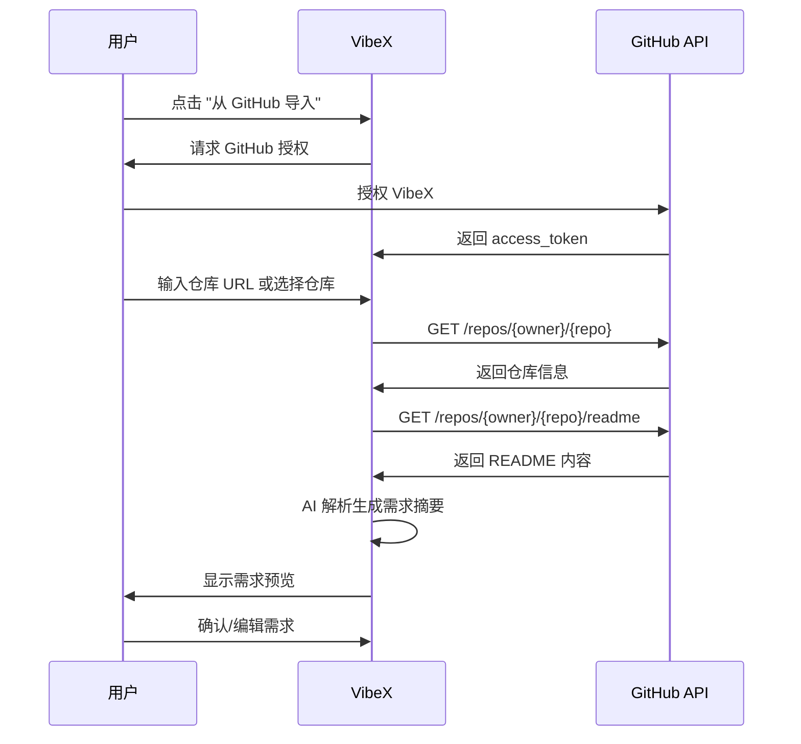
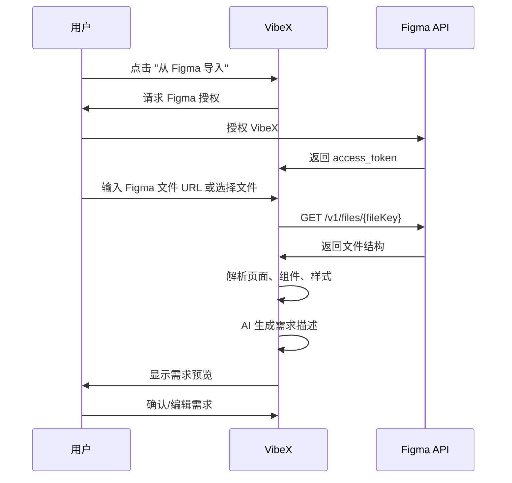

# 需求分析：GitHub/Figma 一键导入功能

**项目**: vibex-github-figma-import  
**分析师**: Analyst Agent  
**日期**: 2026-03-14  
**状态**: ✅ 已完成

---

## 1. 执行摘要

GitHub/Figma 一键导入功能允许用户直接从 GitHub 仓库或 Figma 设计稿导入项目需求，减少手动输入成本，提升用户转化率。经过 API 可行性调研，**两个平台均提供完善的 REST API 支持**，功能实现可行。

**核心价值**:
- 降低用户输入门槛，预计提升转化率 20-30%
- 复用已有项目资产，加速需求定义
- 增强产品差异化竞争力

---

## 2. 问题定义

### 2.1 当前痛点

| 痛点 | 影响 | 用户场景 |
|------|------|----------|
| 需求输入门槛高 | 用户流失 | 新用户不知道如何描述项目需求 |
| 信息不完整 | 生成质量下降 | 用户遗漏关键技术细节 |
| 重复劳动 | 体验差 | 已有 GitHub 仓库/Figma 设计的用户需要手动复制 |

### 2.2 目标用户

| 用户类型 | 占比 | 主要需求 |
|----------|------|----------|
| 开发者 | 60% | 从 GitHub 仓库导入项目需求 |
| 设计师/PM | 30% | 从 Figma 设计稿导入界面需求 |
| 混合用户 | 10% | 同时使用两种导入方式 |

---

## 3. API 可行性分析

### 3.1 GitHub API

| 能力 | API 端点 | 认证方式 | 限制 |
|------|----------|----------|------|
| 获取仓库信息 | `GET /repos/{owner}/{repo}` | OAuth2 / PAT | 5000 req/hr |
| 获取 README | `GET /repos/{owner}/{repo}/readme` | OAuth2 / PAT | 5000 req/hr |
| 获取目录内容 | `GET /repos/{owner}/{repo}/contents/{path}` | OAuth2 / PAT | 5000 req/hr |
| 获取 package.json | `GET /repos/{owner}/{repo}/contents/package.json` | OAuth2 / PAT | 5000 req/hr |

**可行性**: ✅ 完全可行

**关键提取内容**:
- 仓库描述、语言、Star 数
- README 内容（项目介绍、功能说明）
- package.json（技术栈、依赖）
- 目录结构（项目结构推断）

### 3.2 Figma API

| 能力 | API 端点 | 认证方式 | 限制 |
|------|----------|----------|------|
| 获取文件 | `GET /v1/files/{fileKey}` | OAuth2 / PAT | 根据计划 |
| 获取图片 | `GET /v1/images/{fileKey}` | OAuth2 / PAT | 根据计划 |
| 获取组件 | `GET /v1/files/{fileKey}/components` | OAuth2 / PAT | 根据计划 |
| 获取样式 | `GET /v1/files/{fileKey}/styles` | OAuth2 / PAT | 根据计划 |

**可行性**: ✅ 完全可行

**关键提取内容**:
- 页面结构（页面名称、层级关系）
- 组件列表（组件名称、类型）
- 样式信息（颜色、字体、间距）
- 框架尺寸（设计稿尺寸）

### 3.3 API 对比总结

| 维度 | GitHub API | Figma API |
|------|-----------|-----------|
| 文档质量 | ⭐⭐⭐⭐⭐ 优秀 | ⭐⭐⭐⭐⭐ 优秀 |
| OAuth2 支持 | ✅ 支持 | ✅ 支持 |
| 免费额度 | 5000 req/hr | 根据计划 |
| 返回格式 | JSON | JSON |
| 流行度 | 极高 | 高 |

---

## 4. 用户场景分析

### 4.1 GitHub 导入场景



**适用场景**:
1. 已有 GitHub 仓库，希望生成项目文档
2. 想要基于现有代码库继续开发
3. 需要快速了解开源项目结构

### 4.2 Figma 导入场景



**适用场景**:
1. 设计师已有 Figma 设计稿，希望生成开发需求
2. PM 收到设计稿，需要转化为开发任务
3. 快速原型迭代，设计到代码一体化

### 4.3 场景选择决策树

```
用户需求来源？
├── 有代码/GitHub 仓库 → GitHub 导入
│   └── 提取：README、技术栈、目录结构
├── 有 Figma 设计稿 → Figma 导入
│   └── 提取：页面结构、组件、样式
└── 从零开始 → 手动输入
    └── 使用智能模板推荐
```

---

## 5. 竞品分析

### 5.1 类似功能产品

| 产品 | 功能 | 优点 | 缺点 |
|------|------|------|------|
| v0.dev | GitHub 仓库导入 | 一键导入，生成预览 | 仅支持前端，无 Figma |
| Locofy | Figma → 代码 | 设计稿转代码质量高 | 无 GitHub 支持 |
| Builder.io | Figma + GitHub | 双向支持 | 价格较高 |
| Cursor | GitHub 集成 | 深度代码理解 | 无 Figma 支持 |

### 5.2 差异化机会

| 差异点 | VibeX 优势 |
|--------|-----------|
| 一站式导入 | 同时支持 GitHub + Figma，无需切换工具 |
| AI 需求理解 | 导入后 AI 自动生成结构化需求 |
| 需求驱动 | 从需求角度理解项目，而非纯代码生成 |
| 免费额度 | 免费用户可使用基础导入功能 |

---

## 6. 功能需求

### 6.1 GitHub 导入 (F1)

| 功能点 | 描述 | 优先级 |
|--------|------|--------|
| F1.1 仓库 URL 解析 | 解析 `github.com/owner/repo` 格式 URL | P0 |
| F1.2 OAuth 授权 | GitHub OAuth2 授权流程 | P0 |
| F1.3 README 提取 | 提取并解析 README.md 内容 | P0 |
| F1.4 技术栈识别 | 从 package.json/go.mod 等识别技术栈 | P1 |
| F1.5 目录结构展示 | 展示项目目录结构 | P2 |
| F1.6 多仓库选择 | 用户选择多个仓库导入 | P2 |

### 6.2 Figma 导入 (F2)

| 功能点 | 描述 | 优先级 |
|--------|------|--------|
| F2.1 文件 URL 解析 | 解析 Figma 文件 URL | P0 |
| F2.2 OAuth 授权 | Figma OAuth2 授权流程 | P0 |
| F2.3 页面结构提取 | 提取文件中的页面和层级 | P0 |
| F2.4 组件列表提取 | 提取文件中的组件信息 | P1 |
| F2.5 样式信息提取 | 提取颜色、字体等样式 | P1 |
| F2.6 预览图生成 | 生成设计稿缩略图预览 | P2 |

### 6.3 通用功能 (F3)

| 功能点 | 描述 | 优先级 |
|--------|------|--------|
| F3.1 导入预览 | 导入前预览提取的内容 | P0 |
| F3.2 内容编辑 | 导入后可编辑需求内容 | P0 |
| F3.3 导入历史 | 记录导入历史，支持重新导入 | P2 |

---

## 7. 非功能需求

### 7.1 性能要求

| 指标 | 目标值 |
|------|--------|
| GitHub 导入响应时间 | < 3s（不含网络） |
| Figma 导入响应时间 | < 5s（不含网络） |
| 并发导入数 | 100 用户/分钟 |

### 7.2 安全要求

| 要求 | 说明 |
|------|------|
| Token 加密存储 | OAuth token 加密存储，不暴露给前端 |
| 最小权限原则 | 仅请求必要的 API 权限 |
| 数据隔离 | 用户导入数据与其他用户隔离 |
| 审计日志 | 记录所有 API 调用日志 |

### 7.3 可用性要求

| 要求 | 说明 |
|------|------|
| 错误处理 | 友好的错误提示，支持重试 |
| 离线提示 | 网络断开时提示用户 |
| 进度展示 | 显示导入进度 |

---

## 8. 风险评估

### 8.1 技术风险

| 风险 | 概率 | 影响 | 缓解措施 |
|------|------|------|----------|
| API 限流 | 中 | 高 | 实现请求队列，缓存常用数据 |
| OAuth 流程复杂 | 低 | 中 | 参考现有实现，使用成熟库 |
| 数据格式变化 | 低 | 中 | 版本化 API 调用，错误监控 |

### 8.2 业务风险

| 风险 | 概率 | 影响 | 缓解措施 |
|------|------|------|----------|
| 用户使用率低 | 中 | 高 | 用户教育，引导提示 |
| 数据质量问题 | 中 | 中 | AI 内容清洗，用户可编辑 |

---

## 9. 推荐方案

### 9.1 实施路径

| 阶段 | 功能 | 工期估算 |
|------|------|----------|
| MVP | F1.1, F1.2, F1.3 + F2.1, F2.2, F2.3 + F3.1, F3.2 | 2 周 |
| 增强 | F1.4, F2.4, F2.5 | 1 周 |
| 完善 | F1.5, F1.6, F2.6, F3.3 | 1 周 |

### 9.2 技术方案建议

**前端**:
- 使用现有 `services/api/client.ts` 模式封装导入 API
- 新建 `services/import/` 目录存放导入逻辑
- 使用 React Query 管理导入状态

**后端**:
- 新建 `/api/v1/import/github` 和 `/api/v1/import/figma` 端点
- 使用 OAuth2 标准流程
- 实现 Token 安全存储

---

## 10. 验收标准

### 10.1 功能验收

| 验收项 | 测试方法 | 通过标准 |
|--------|----------|----------|
| GitHub URL 解析 | 输入有效 GitHub URL | 正确解析 owner/repo |
| GitHub OAuth | 点击授权按钮 | 跳转 GitHub 授权页 |
| GitHub README 提取 | 选择有 README 的仓库 | 显示 README 内容 |
| Figma URL 解析 | 输入有效 Figma URL | 正确解析 fileKey |
| Figma OAuth | 点击授权按钮 | 跳转 Figma 授权页 |
| Figma 页面提取 | 选择有内容的文件 | 显示页面结构 |
| 内容编辑 | 修改导入内容 | 内容可编辑保存 |

### 10.2 非功能验收

| 验收项 | 测试方法 | 通过标准 |
|--------|----------|----------|
| 响应时间 | 模拟导入操作 | < 3s (GitHub) / < 5s (Figma) |
| 错误处理 | 模拟网络错误 | 显示友好错误提示 |
| 安全审计 | 检查 Token 存储 | Token 加密存储 |

---

## 11. 下一步行动

1. **PM**: 基于 this 文档编写 PRD（功能点细化）
2. **Architect**: 设计技术架构（API 端点、数据流、组件设计）
3. **Coord**: 评审方案，决定是否进入开发阶段

---

**产出物**: ✅ docs/vibex-github-figma-import/requirements-analysis.md  
**下一步**: PM 编写 PRD → Architect 设计架构 → Coord 决策