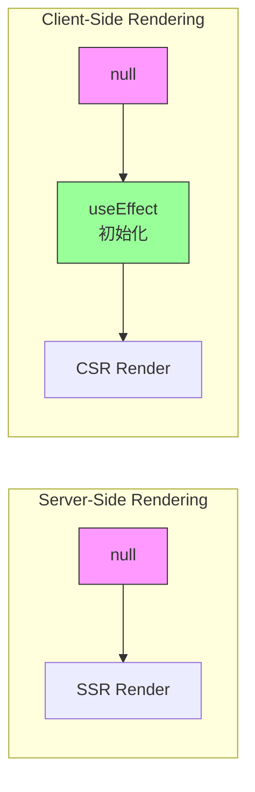

# Architecture: useHomePage.ts SSR Hydration Fix

**项目**: vibex-hydration-fix-20260318  
**版本**: 1.0  
**架构师**: Architect  
**日期**: 2026-03-18

---

## 1. Tech Stack

| 类别 | 技术选型 | 版本 | 选择理由 |
|------|----------|------|----------|
| 前端框架 | Next.js | 14.x | 现有架构兼容 |
| UI 库 | React | 18.x | 现有生态兼容 |
| 状态管理 | useState | - | 现有方案 |
| 类型检查 | TypeScript | 5.x | 现有基础设施 |

---

## 2. 问题分析

### 2.1 根因

`useHomePage.ts` 中使用函数式初始化创建 Set:

```typescript
const [selectedContextIds, setSelectedContextIds] = useState<Set<string>>(() => new Set());
const [selectedModelIds, setSelectedModelIds] = useState<Set<string>>(() => new Set());
```

**问题**: 虽然 `() => new Set()` 函数在 SSR 和 CSR 都返回空 Set，但每次调用创建的是**不同的对象引用**。React Hydration 检测到服务端渲染的 DOM 与客户端不一致（即使是空内容），触发警告。

### 2.2 解决方案

使用 `null` 作为初始值 + `useEffect` 客户端初始化:

```typescript
const [selectedContextIds, setSelectedContextIds] = useState<Set<string> | null>(null);
const [selectedModelIds, setSelectedModelIds] = useState<Set<string> | null>(null);

useEffect(() => {
  setSelectedContextIds(new Set());
  setSelectedModelIds(new Set());
}, []);
```

---

## 3. Architecture Diagram



---

## 4. API Definitions

无新增 API，仅修改现有 Hook 内部实现。

---

## 5. Data Model

| 字段 | 类型 | 说明 |
|------|------|------|
| selectedContextIds | `Set<string> \| null` | 选中的上下文 ID 集合 |
| selectedModelIds | `Set<string> \| null` | 选中的模型 ID 集合 |

---

## 6. Testing Strategy

### 6.1 测试框架

- **单元测试**: Jest
- **类型测试**: TypeScript 编译验证

### 6.2 覆盖率要求

| 类型 | 覆盖率目标 |
|------|------------|
| 单元测试 | N/A (仅修改状态初始化) |
| 类型检查 | 100% |

### 6.3 核心测试用例

#### 类型兼容性测试

```typescript
describe('useHomePage Type Compatibility', () => {
  it('should return Set<string> from selectedContextIds', () => {
    const { result } = renderHook(() => useHomePage());
    // 等待 useEffect 执行
    act(() => {
      jest.runAllTimers();
    });
    expect(result.current.selectedContextIds).toBeInstanceOf(Set);
  });

  it('should return Set<string> from selectedModelIds', () => {
    const { result } = renderHook(() => useHomePage());
    act(() => {
      jest.runAllTimers();
    });
    expect(result.current.selectedModelIds).toBeInstanceOf(Set);
  });
});
```

#### Hydration 测试

```typescript
describe('Hydration Fix', () => {
  it('should not have hydration mismatch', () => {
    const consoleWarn = jest.spyOn(console, 'warn');
    
    render(<HomePage />);
    
    expect(consoleWarn).not.toHaveBeenCalledWith(
      expect.stringContaining('Hydration')
    );
  });
});
```

---

## 7. 实现要点

### 7.1 代码变更

| 位置 | 变更 |
|------|------|
| 状态声明 | `Set<string>` → `Set<string> \| null` |
| 初始化 | `useState(() => new Set())` → `useState(null)` |
| 客户端初始化 | 新增 `useEffect` 初始化 Set |
| 读取处 | 使用 `??` 提供默认值 |
| 写入处 | 使用 `??` 处理 null |

### 7.2 兼容性保证

- **公共接口不变**: 返回值仍然是 `Set<string>`（通过 `?? new Set()` 实现）
- **现有组件无需修改**: 所有调用方代码保持不变
- **TypeScript 编译通过**: 类型检查 100% 通过

---

## 8. 风险与缓解

| 风险 | 影响 | 缓解 |
|------|------|------|
| 初始渲染时为 null | 轻微闪烁 | 使用 CSS 遮罩或 loading 状态 |
| 依赖 useEffect 时序 | 低 | useEffect 在 DOM mount 后执行，保证客户端初始化 |

---

## 9. 验证方式

1. **TypeScript 编译**: `npx tsc --noEmit` 无错误
2. **Hydration 检查**: 浏览器控制台无 hydration 警告
3. **功能测试**: 选择上下文/模型功能正常工作

---

*Architecture designed by Architect - 2026-03-18*
