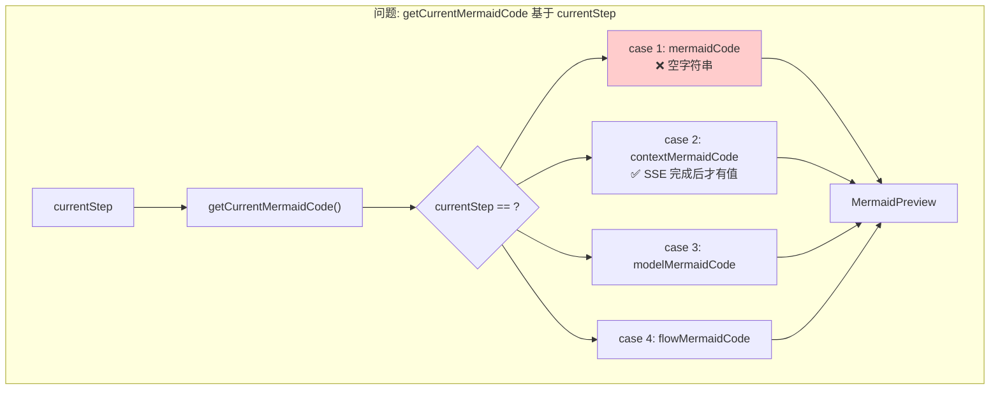
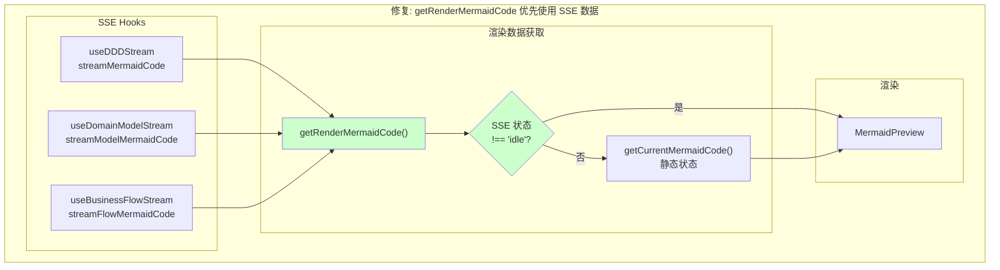
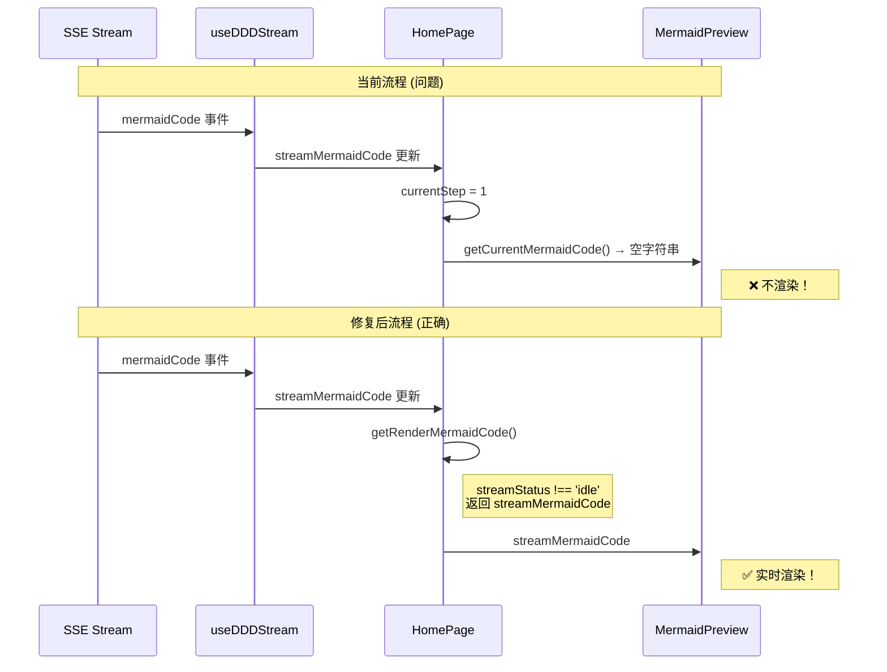
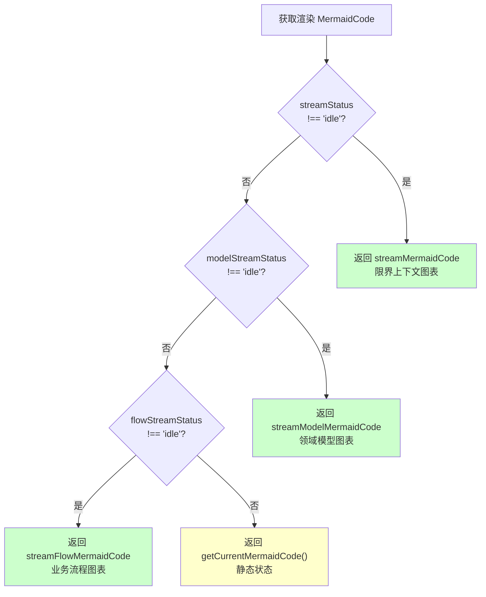

# 架构设计: Mermaid 实时渲染 Bug 修复

**项目**: vibex-mermaid-render-bug
**版本**: 1.0
**日期**: 2026-03-16
**作者**: Architect Agent

---

## 1. Tech Stack (技术栈选型)

### 1.1 核心技术栈

| 组件 | 选型 | 版本 | 理由 |
|------|------|------|------|
| **渲染组件** | MermaidPreview | 现有 | 无需修改组件本身 |
| **状态管理** | Zustand + SSE Hooks | 现有 | 保持一致性 |
| **SSE Hooks** | useDDDStream 等 | 现有 | 提供流式数据 |
| **React 优化** | useCallback/useMemo | 现有 | 性能优化 |

### 1.2 技术选型对比

| 方案 | 优点 | 缺点 | 推荐度 |
|------|------|------|--------|
| **方案 A: 新增 getRenderMermaidCode** | 职责分离、易测试、可维护 | 多一个函数 | ⭐⭐⭐⭐⭐ |
| 方案 B: 修改 getCurrentMermaidCode | 改动最小 | 逻辑混合、职责不清 | ⭐⭐⭐⭐ |

**结论**: 采用 **方案 A** - 新增 `getRenderMermaidCode()` 函数，优先使用 SSE 流式数据。

---

## 2. Architecture Diagram (架构图)

### 2.1 问题架构



### 2.2 修复后架构



### 2.3 数据流对比



### 2.4 渲染决策流程



---

## 3. API Definitions (接口定义)

### 3.1 getRenderMermaidCode 函数签名

```typescript
// src/components/homepage/HomePage.tsx

/**
 * 获取用于实时渲染的 Mermaid 代码
 * 
 * 优先使用 SSE 流式返回的 mermaidCode，
 * 仅在所有 SSE 空闲时回退到静态状态。
 * 
 * @returns Mermaid 代码字符串，如果没有则返回空字符串
 */
function getRenderMermaidCode(): string;

/**
 * 参数说明（通过闭包访问组件状态）
 * 
 * @param streamStatus - 限界上下文 SSE 状态
 * @param streamMermaidCode - 限界上下文流式 Mermaid 代码
 * @param modelStreamStatus - 领域模型 SSE 状态
 * @param streamModelMermaidCode - 领域模型流式 Mermaid 代码
 * @param flowStreamStatus - 业务流程 SSE 状态
 * @param streamFlowMermaidCode - 业务流程流式 Mermaid 代码
 * @param currentStep - 当前步骤
 * @param mermaidCode - 步骤 1 静态 Mermaid 代码
 * @param contextMermaidCode - 步骤 2 静态 Mermaid 代码
 * @param modelMermaidCode - 步骤 3 静态 Mermaid 代码
 * @param flowMermaidCode - 步骤 4 静态 Mermaid 代码
 */
```

### 3.2 返回类型

```typescript
// 返回值类型
type MermaidCode = string;

// 空值处理
// 当所有 SSE 空闲且静态状态为空时，返回空字符串 ''
// 空字符串将触发预览区显示空状态 UI
```

---

## 4. Data Model (数据模型)

### 4.1 数据来源映射

| 数据源 | 状态字段 | MermaidCode 字段 | 说明 |
|--------|----------|-----------------|------|
| useDDDStream | streamStatus | streamMermaidCode | 限界上下文 SSE |
| useDomainModelStream | modelStreamStatus | streamModelMermaidCode | 领域模型 SSE |
| useBusinessFlowStream | flowStreamStatus | streamFlowMermaidCode | 业务流程 SSE |

### 4.2 状态优先级

```typescript
// 渲染数据优先级
const RENDER_PRIORITY = {
  streamContext: 1,    // 最高优先级
  streamModel: 2,
  streamFlow: 3,
  staticState: 4,      // 最低优先级（回退）
} as const;
```

### 4.3 SSE 状态定义

```typescript
type SSEStatus = 'idle' | 'thinking' | 'done' | 'error';

// idle: 初始状态，无活跃 SSE
// thinking: SSE 连接中，正在接收数据
// done: SSE 完成，数据已接收完毕
// error: SSE 出错
```

---

## 5. Implementation Details (实现细节)

### 5.1 getRenderMermaidCode 实现

```typescript
// src/components/homepage/HomePage.tsx

/**
 * 获取用于实时渲染的 Mermaid 代码
 * 修复问题: 优先使用 SSE 流式数据，而非静态状态
 */
const getRenderMermaidCode = useCallback((): string => {
  // 优先级 1: 限界上下文 SSE
  if (streamStatus !== 'idle' && streamMermaidCode) {
    return streamMermaidCode;
  }
  
  // 优先级 2: 领域模型 SSE
  if (modelStreamStatus !== 'idle' && streamModelMermaidCode) {
    return streamModelMermaidCode;
  }
  
  // 优先级 3: 业务流程 SSE
  if (flowStreamStatus !== 'idle' && streamFlowMermaidCode) {
    return streamFlowMermaidCode;
  }
  
  // 回退: 使用静态状态
  return getCurrentMermaidCode();
}, [
  streamStatus,
  streamMermaidCode,
  modelStreamStatus,
  streamModelMermaidCode,
  flowStreamStatus,
  streamFlowMermaidCode,
  getCurrentMermaidCode,
]);
```

### 5.2 HomePage 渲染逻辑修改

```tsx
// src/components/homepage/HomePage.tsx

export default function HomePage() {
  // ... 现有 hooks ...
  
  const {
    mermaidCode: streamMermaidCode,
    status: streamStatus,
    // ...
  } = useDDDStream();

  const {
    mermaidCode: streamModelMermaidCode,
    status: modelStreamStatus,
    // ...
  } = useDomainModelStream();

  const {
    mermaidCode: streamFlowMermaidCode,
    status: flowStreamStatus,
    // ...
  } = useBusinessFlowStream();

  // ✅ 新增: 获取实时渲染用的 MermaidCode
  const renderMermaidCode = getRenderMermaidCode();

  // ... 其他代码 ...

  return (
    <div className={styles.container}>
      {/* ... 其他内容 ... */}
      
      <div className={styles.previewArea}>
        {/* ✅ 修复: 使用 getRenderMermaidCode() */}
        {renderMermaidCode ? (
          <MermaidPreview
            code={renderMermaidCode}
            className={styles.mermaidPreview}
            onError={handleMermaidError}
          />
        ) : (
          <div className={styles.previewEmpty}>
            <div className={styles.previewEmptyIcon}>📊</div>
            <p>输入需求后，这里将实时显示生成的图表</p>
          </div>
        )}
      </div>
    </div>
  );
}
```

### 5.3 修改前后对比

```tsx
// ❌ 修改前 (问题)
{getCurrentMermaidCode() ? (
  <MermaidPreview code={getCurrentMermaidCode()} ... />
) : (
  <div className={styles.previewEmpty}>...</div>
)}

// getCurrentMermaidCode 在 currentStep === 1 时返回空字符串
// 即使 streamMermaidCode 有值也不会渲染

// ✅ 修改后 (正确)
const renderMermaidCode = getRenderMermaidCode();

{renderMermaidCode ? (
  <MermaidPreview code={renderMermaidCode} ... />
) : (
  <div className={styles.previewEmpty}>...</div>
)}

// getRenderMermaidCode 优先检查 SSE 状态
// streamStatus !== 'idle' 时返回 streamMermaidCode
// 实时渲染生效
```

### 5.4 与 getCurrentMermaidCode 的关系

```typescript
// 保留 getCurrentMermaidCode 函数
// 用于 SSE 完成后的静态状态展示
const getCurrentMermaidCode = useCallback((): string => {
  switch (currentStep) {
    case 1: return mermaidCode;
    case 2: return contextMermaidCode;
    case 3: return modelMermaidCode;
    case 4: return flowMermaidCode;
    default: return '';
  }
}, [currentStep, mermaidCode, contextMermaidCode, modelMermaidCode, flowMermaidCode]);

// getRenderMermaidCode 调用 getCurrentMermaidCode 作为回退
const getRenderMermaidCode = useCallback((): string => {
  // SSE 优先
  if (streamStatus !== 'idle' && streamMermaidCode) return streamMermaidCode;
  if (modelStreamStatus !== 'idle' && streamModelMermaidCode) return streamModelMermaidCode;
  if (flowStreamStatus !== 'idle' && streamFlowMermaidCode) return streamFlowMermaidCode;
  
  // 回退到静态状态
  return getCurrentMermaidCode();
}, [...dependencies, getCurrentMermaidCode]);
```

---

## 6. Testing Strategy (测试策略)

### 6.1 测试框架

| 测试类型 | 框架 | 覆盖率目标 |
|----------|------|-----------|
| 单元测试 | Jest | ≥ 90% |
| 组件测试 | @testing-library/react | ≥ 85% |
| E2E 测试 | Playwright | 关键路径 100% |

### 6.2 核心测试用例

#### 6.2.1 getRenderMermaidCode 单元测试

```typescript
// __tests__/getRenderMermaidCode.test.ts

describe('getRenderMermaidCode', () => {
  const mockMermaidCode = 'graph TD\n  A --> B';

  it('should return streamMermaidCode when streamStatus is thinking', () => {
    const result = getRenderMermaidCode(
      'thinking', mockMermaidCode,
      'idle', '',
      'idle', '',
      () => ''
    );

    expect(result).toBe(mockMermaidCode);
  });

  it('should prioritize streamContext over streamModel', () => {
    const contextCode = 'graph TD\n  Context';
    const modelCode = 'graph TD\n  Model';

    const result = getRenderMermaidCode(
      'thinking', contextCode,
      'thinking', modelCode,
      'idle', '',
      () => ''
    );

    expect(result).toBe(contextCode);
  });

  it('should fallback to getCurrentMermaidCode when all SSE are idle', () => {
    const staticCode = 'graph TD\n  Static';

    const result = getRenderMermaidCode(
      'idle', '',
      'idle', '',
      'idle', '',
      () => staticCode
    );

    expect(result).toBe(staticCode);
  });

  it('should return empty string when no data available', () => {
    const result = getRenderMermaidCode(
      'idle', '',
      'idle', '',
      'idle', '',
      () => ''
    );

    expect(result).toBe('');
  });
});
```

#### 6.2.2 E2E 测试

```typescript
// e2e/mermaid-render.spec.ts

import { test, expect } from '@playwright/test';

test.describe('Mermaid Real-time Rendering', () => {
  test('should render mermaid during SSE streaming', async ({ page }) => {
    await page.goto('/');
    
    // 输入需求
    await page.fill('[data-testid="requirement-input"]', '开发一个电商系统');
    
    // 点击开始生成
    await page.click('button:has-text("开始生成")');
    
    // 验证预览区显示 mermaid 图表（不等待完成）
    await expect(page.locator('.mermaid-preview')).toBeVisible({ timeout: 5000 });
    
    // 验证图表内容
    await expect(page.locator('.mermaid')).toBeVisible();
  });

  test('should switch mermaid correctly between steps', async ({ page }) => {
    await page.goto('/');
    
    // Step 1: 限界上下文
    await page.fill('[data-testid="requirement-input"]', '电商系统');
    await page.click('button:has-text("开始生成")');
    
    await expect(page.locator('.mermaid')).toBeVisible();
    
    // 等待完成
    await page.locator('.step-complete').waitFor({ timeout: 60000 });
    
    // Step 2: 领域模型
    await page.click('button:has-text("生成领域模型")');
    
    await expect(page.locator('.mermaid')).toBeVisible();
  });

  test('should show empty state when no mermaid code', async ({ page }) => {
    await page.goto('/');
    
    // 验证空状态显示
    await expect(page.locator('.preview-empty')).toBeVisible();
    await expect(page.locator('text=实时显示生成的图表')).toBeVisible();
  });
});
```

### 6.3 测试验证清单

```markdown
## 测试验证清单

### 正向测试 (≥2 案例)
- [ ] TC-01: SSE thinking 状态 → 返回 streamMermaidCode
- [ ] TC-02: SSE done 状态 → 返回静态 mermaidCode

### 反向测试 (≥2 案例)
- [ ] TC-03: 所有 SSE idle → 返回静态 mermaidCode
- [ ] TC-04: SSE thinking 但 mermaidCode 为空 → 继续检查下一优先级

### 边界测试 (≥1 案例)
- [ ] TC-05: 多 SSE 同时活跃 → 按优先级返回
```

---

## 7. Implementation Roadmap (实施路线图)

### Phase 1: 实现核心函数 (0.5h)

| 步骤 | 工时 | 产出物 |
|------|------|--------|
| 1.1 实现 getRenderMermaidCode | 0.5h | 函数代码 |

### Phase 2: 组件修改 (0.5h)

| 步骤 | 工时 | 产出物 |
|------|------|--------|
| 2.1 修改 HomePage 渲染逻辑 | 0.5h | 组件代码 |

### Phase 3: 测试验证 (1h)

| 步骤 | 工时 | 内容 |
|------|------|------|
| 3.1 单元测试 | 0.5h | Jest 测试 |
| 3.2 E2E 测试 | 0.5h | Playwright 测试 |

**总工期**: 2h

---

## 8. 风险评估

| 风险 | 等级 | 影响 | 缓解措施 |
|------|------|------|----------|
| SSE 状态竞争 | 🟢 低 | 渲染闪烁 | 优先级逻辑明确 |
| 空值处理 | 🟢 低 | 白屏 | 添加空值检查 |
| 回归问题 | 🟡 中 | 功能异常 | 完整测试三个场景 |

---

## 9. Acceptance Criteria (验收标准)

### 9.1 功能验收

- [ ] AC1.1: `streamStatus !== 'idle'` 时返回 `streamMermaidCode`
- [ ] AC1.2: `modelStreamStatus !== 'idle'` 时返回 `streamModelMermaidCode`
- [ ] AC1.3: `flowStreamStatus !== 'idle'` 时返回 `streamFlowMermaidCode`
- [ ] AC1.4: 所有 SSE idle 时返回 `getCurrentMermaidCode()`

### 9.2 验证命令

```bash
# 运行测试
npm test -- --testPathPattern="getRenderMermaidCode|HomePage"

# E2E 测试
npm run test:e2e -- --grep "Mermaid"

# 构建
npm run build
```

---

## 10. Related Components (关联组件)

### 10.1 不受影响的组件

| 组件 | 文件 | 说明 |
|------|------|------|
| ThinkingPanel | ThinkingPanel.tsx | 使用独立的 SSE 状态 |
| /confirm 页面 | confirm/page.tsx | 直接使用 streamMermaidCode |

### 10.2 可能需要检查的组件

| 组件 | 文件 | 说明 |
|------|------|------|
| PreviewCanvas | PreviewCanvas.tsx | 类似逻辑，需验证 |

---

## 11. References (参考文档)

| 文档 | 路径 |
|------|------|
| 需求分析 | `/root/.openclaw/vibex/docs/vibex-mermaid-render-bug/analysis.md` |
| PRD | `/root/.openclaw/vibex/docs/prd/vibex-mermaid-render-bug-prd.md` |

---

**产出物**: `/root/.openclaw/vibex/docs/vibex-mermaid-render-bug/architecture.md`
**作者**: Architect Agent
**日期**: 2026-03-16