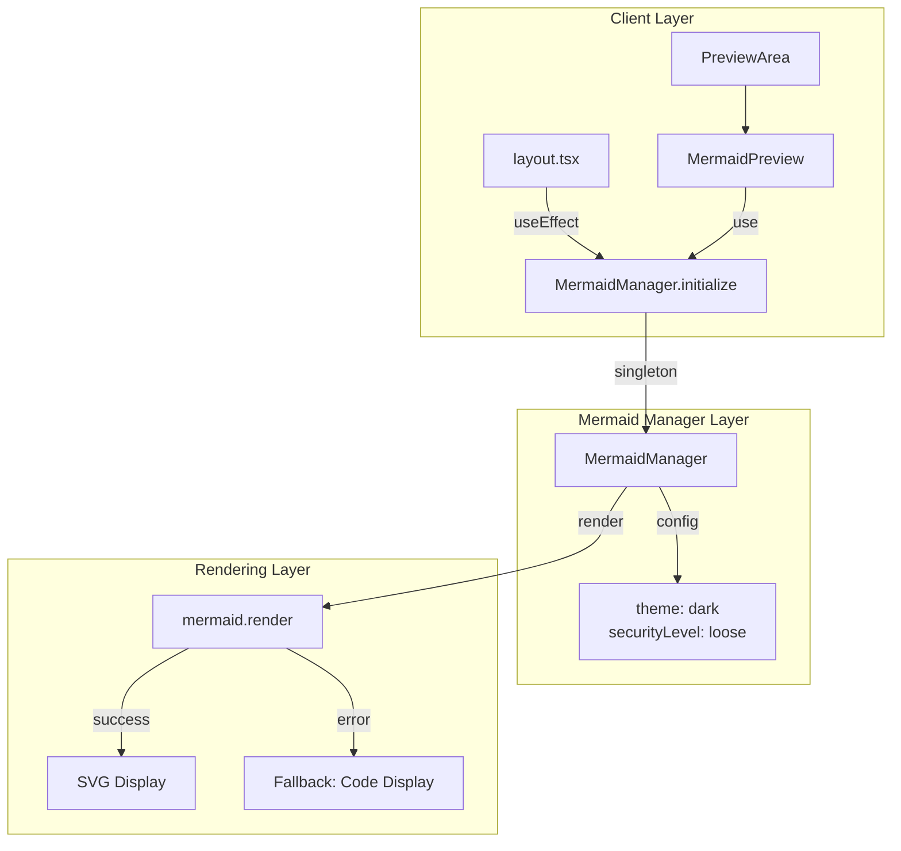

# Architecture: vibex-mermaid-render-fix

> **状态**: 建设中 | **版本**: v1.0 | **Architect**: Architect Agent
> **目标**: 修复首页点击分析后 Mermaid 图未渲染问题

---

## 1. 架构总览

### 问题分析

| 问题 | 根因 | 影响 |
|------|------|------|
| Mermaid 图表未渲染 | 双组件竞争 (MermaidPreview vs MermaidRenderer) | 用户无法看到分析结果 |
| 初始化时序不确定 | 渲染在 initialize 之前调用 | 间歇性失败 |
| 缺少错误处理 | 无降级方案 | 失败后无反馈 |

### 解决方案架构



---

## 2. 模块划分

### 2.1 MermaidManager (核心模块)

| 职责 | 说明 |
|------|------|
| 单例管理 | 保证全局只有一个 MermaidManager 实例 |
| 初始化控制 | 确保 initialize() 仅执行一次 |
| 渲染代理 | 封装 mermaid.render()，统一错误处理 |
| 配置统一 | 集中管理 theme/securityLevel 配置 |

```typescript
// src/lib/mermaid/MermaidManager.ts
export class MermaidManager {
  private static instance: MermaidManager;
  private initialized = false;
  private initPromise: Promise<void> | null = null;

  static getInstance(): MermaidManager {
    if (!MermaidManager.instance) {
      MermaidManager.instance = new MermaidManager();
    }
    return MermaidManager.instance;
  }

  async initialize(): Promise<void> {
    if (this.initialized) return;
    if (this.initPromise) return this.initPromise;

    this.initPromise = this.doInitialize();
    await this.initPromise;
    this.initialized = true;
  }

  private async doInitialize(): Promise<void> {
    await mermaid.initialize({
      theme: 'dark',
      securityLevel: 'loose',
      startOnLoad: false,
    });
  }

  async render(code: string): Promise<string> {
    if (!this.initialized) {
      await this.initialize();
    }
    return mermaid.render(`mermaid-${Date.now()}`, code);
  }
}
```

### 2.2 MermaidPreview 组件

| 职责 | 说明 |
|------|------|
| 渲染调用 | 使用 MermaidManager.render() |
| 状态管理 | loading/success/error 状态 |
| 降级显示 | 错误时显示原始代码 |
| 错误消息 | 提供具体的错误原因 |

---

## 3. 接口定义

### 3.1 MermaidManager API

```typescript
interface IMermaidManager {
  // 获取单例
  getInstance(): MermaidManager;

  // 初始化（幂等）
  initialize(): Promise<void>;

  // 渲染图表
  render(code: string): Promise<string>;

  // 检查初始化状态
  isInitialized(): boolean;
}
```

### 3.2 MermaidPreview Props

```typescript
interface MermaidPreviewProps {
  code: string;              // Mermaid 图表代码
  className?: string;         // 额外样式类
  onError?: (error: Error) => void;  // 错误回调
}
```

---

## 4. 数据模型

### 4.1 渲染状态

```typescript
type RenderState = 
  | { status: 'idle' }
  | { status: 'loading' }
  | { status: 'success', svg: string }
  | { status: 'error', message: string, fallbackCode: string };
```

### 4.2 错误类型

```typescript
enum MermaidErrorType {
  SYNTAX_ERROR = '语法错误',
  INITIALIZE_FAILED = '初始化失败',
  RENDER_FAILED = '渲染失败',
  UNKNOWN = '未知错误'
}
```

---

## 5. 技术选型

| 选型 | 决定 | 理由 |
|------|------|------|
| 单例模式 | MermaidManager.getInstance() | 避免重复初始化 |
| 预初始化 | layout.tsx useEffect | 启动时静默加载，减少用户等待 |
| 降级方案 | details 折叠原始代码 | 始终有内容可看 |
| 配置 | theme='dark', securityLevel='loose' | 与现有 dark mode 一致 |

---

## 6. 性能影响评估

| 指标 | 影响 | 缓解措施 |
|------|------|----------|
| 首屏加载 | +50-100ms (预初始化) | useEffect 静默执行，不阻塞 UI |
| 内存占用 | 无明显增加 | 单例模式复用 |
| 渲染性能 | 无变化 | 复用原有 mermaid 渲染 |

---

## 7. 安全考量

- **securityLevel: 'loose'** 允许 SVG 执行脚本，但仅在受控环境（首页分析结果）
- 代码来源：后端生成的用户不可控的 DDD 分析结果
- 风险等级：低

---

## 8. 兼容性

| 依赖 | 版本 | 状态 |
|------|------|------|
| mermaid | 11.13.0 | 锁定 |
| React | 18.x | 兼容 |
| Next.js | 14.x | 兼容 |

---

*Architect Agent | 2026-03-20*
