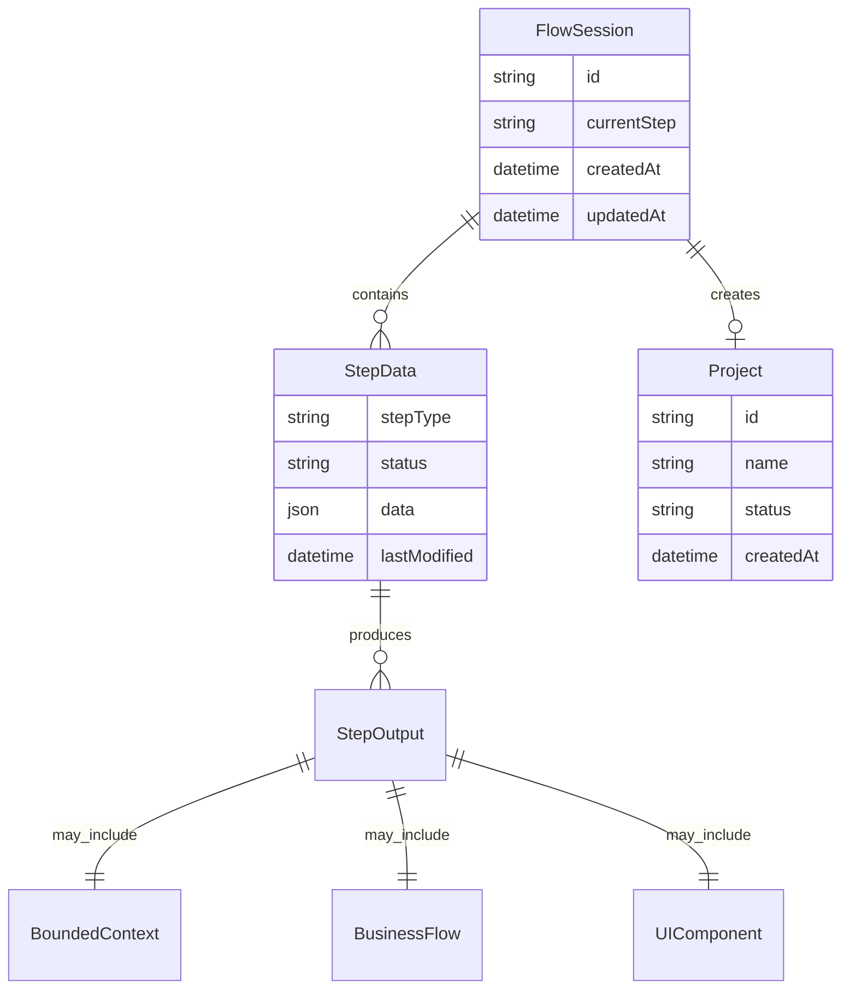

# Architecture: VibeX 新流程实现

**项目**: vibex-new-process-impl-20260318  
**版本**: 1.0  
**架构师**: Architect  
**日期**: 2026-03-18

---

## 1. Tech Stack

| 类别 | 技术选型 | 版本 | 选择理由 |
|------|----------|------|----------|
| 前端框架 | Next.js | 14.x | 现有架构兼容，App Router 支持 |
| UI 库 | React | 18.x | 现有生态兼容 |
| 状态管理 | Zustand | 3.x | 轻量级，比 Context 更适合复杂状态 |
| 状态机 | XState | 5.x | 严格的状态转换规则，确保流程可靠 |
| 不可变更新 | Immer | 10.x | 简化不可变数据结构操作 |
| 持久化 | localStorage + API | - | 现有方案复用 |
| 样式 | CSS Modules | - | 现有架构兼容 |
| 测试 | Jest + React Testing Library | - | 现有测试基础设施 |

### 版本选择理由

- **Zustand 3.x**: 比 4.x 更稳定，与现有项目依赖一致
- **XState 5.x**: 最新稳定版，TypeScript 支持好，适合复杂流程状态管理
- **Immer 10.x**: 与 Zustand 集成良好，简化状态更新逻辑

---

## 2. Architecture Diagram

```mermaid
flowchart TB
    subgraph Client["前端 (Next.js)"]
        FC[FlowContainer<br/>流程容器]
        SI[StepIndicator<br/>步骤指示器]
        
        subgraph Steps["步骤组件"]
            RS[RequirementStep<br/>需求录入]
            BS[BoundedContextStep<br/>限界上下文]
            BF[BusinessFlowStep<br/>业务流程]
            UC[UIComponentStep<br/>UI组件]
            PC[ProjectCreationStep<br/>项目创建]
        end
        
        subgraph State["状态管理"]
            SM[状态机<br/>XState]
            STORE[Zustand Store]
            PERSIST[持久化层]
        end
    end
    
    subgraph API["后端 API"]
        ANALYZE[/analyze]
        BOUNDED[/bounded-context]
        BUSINESS[/business-flow]
        UI[/ui-component]
        PROJECT[/create-project]
    end
    
    FC --> SI
    SI --> Steps
    Steps --> SM
    SM --> STORE
    STORE --> PERSIST
    PERSIST -.->|localStorage| Client
    
    RS --> ANALYZE
    BS --> BOUNDED
    BF --> BUSINESS
    UC --> UI
    PC --> PROJECT
    
    ANALYZE -.->|HTTP| API
    BOUNDED -.->|HTTP| API
    BUSINESS -.->|HTTP| API
    UI -.->|HTTP| API
    PROJECT -.->|HTTP| API
```

### 模块划分

| 模块 | 职责 | 位置 |
|------|------|------|
| FlowContainer | 5步流程外层容器，布局管理 | `src/app/flow/components/` |
| StepIndicator | 步骤进度指示器 | `src/app/flow/components/` |
| StepNavigator | 步骤导航控制 | `src/app/flow/components/common/` |
| flowMachine | XState 状态机 | `src/app/flow/machines/` |
| flowStore | Zustand 状态存储 | `src/app/flow/stores/` |
| flowApi | API 调用封装 | `src/app/flow/services/` |
| flowTypes | 类型定义 | `src/app/flow/types/` |

---

## 3. API Definitions

### 3.1 现有 API（复用）

| API | 方法 | 用途 |
|-----|------|------|
| `/api/analyze` | POST | 需求分析 |

### 3.2 新增 API

| API | 方法 | 用途 |
|-----|------|------|
| `/api/flow/bounded-context` | POST | 限界上下文识别 |
| `/api/flow/business-flow` | POST | 业务流程生成 |
| `/api/flow/ui-component` | POST | UI组件方案生成 |
| `/api/flow/project` | POST | 项目创建 |

### 接口签名

```typescript
// POST /api/flow/bounded-context
interface BoundedContextRequest {
  requirement: string;
}

interface BoundedContextResponse {
  contexts: Array<{
    id: string;
    name: string;
    description: string;
    dependencies: string[];
  }>;
}

// POST /api/flow/business-flow
interface BusinessFlowRequest {
  requirement: string;
  contexts: string[];
}

interface BusinessFlowResponse {
  flow: {
    nodes: FlowNode[];
    edges: FlowEdge[];
  };
}

interface FlowNode {
  id: string;
  label: string;
  type: 'start' | 'process' | 'decision' | 'end';
  position: { x: number; y: number };
}

interface FlowEdge {
  id: string;
  source: string;
  target: string;
  label?: string;
}

// POST /api/flow/ui-component
interface UIComponentRequest {
  requirement: string;
  contexts: string[];
  businessFlow: BusinessFlowResponse['flow'];
}

interface UIComponentResponse {
  components: Array<{
    id: string;
    name: string;
    description: string;
    props: Record<string, unknown>;
  }>;
}

// POST /api/flow/project
interface ProjectCreationRequest {
  requirement: string;
  contexts: string[];
  businessFlow: BusinessFlowResponse['flow'];
  components: UIComponentResponse['components'];
}

interface ProjectCreationResponse {
  projectId: string;
  status: 'created' | 'pending';
}
```

---

## 4. Data Model

### 4.1 流程状态

```typescript
interface FlowState {
  currentStep: StepType;
  steps: {
    [key in StepType]: StepData;
  };
  canNavigateBack: boolean;
  canNavigateForward: boolean;
}

type StepType = 'requirement' | 'bounded-context' | 'business-flow' | 'ui-component' | 'project';

interface StepData {
  status: StepStatus;
  data: StepOutput | null;
  lastModified: string;
  isValid: boolean;
}

type StepStatus = 'pending' | 'in-progress' | 'completed' | 'modified';
```

### 4.2 状态机状态

```typescript
type FlowMachineContext = {
  currentStep: StepType;
  stepData: Record<StepType, StepOutput>;
  errors: Record<StepType, string>;
};

type FlowMachineEvents =
  | { type: 'NEXT'; output: StepOutput }
  | { type: 'BACK' }
  | { type: 'GOTO'; step: StepType }
  | { type: 'REGENERATE'; step: StepType }
  | { type: 'UPDATE'; step: StepType; data: StepOutput }
  | { type: 'UNDO' }
  | { type: 'REDO' };
```

### 4.3 实体关系



---

## 5. Testing Strategy

### 5.1 测试框架

- **单元测试**: Jest
- **集成测试**: React Testing Library + Jest
- **E2E 测试**: Playwright（现有基础设施）

### 5.2 覆盖率要求

| 类型 | 覆盖率目标 |
|------|------------|
| 单元测试 | > 80% |
| 集成测试 | 核心路径覆盖 |
| E2E 测试 | 5步流程端到端 |

### 5.3 核心测试用例

#### 状态机测试

```typescript
describe('FlowMachine', () => {
  it('should transition from requirement to bounded-context', () => {
    const nextState = flowMachine.transition('requirement', { 
      type: 'NEXT', 
      output: mockRequirementOutput 
    });
    expect(nextState.value).toBe('bounded-context');
  });

  it('should allow going back to previous step', () => {
    const backState = flowMachine.transition('bounded-context', { 
      type: 'BACK' 
    });
    expect(backState.value).toBe('requirement');
  });

  it('should not allow skipping steps', () => {
    expect(() => {
      flowMachine.transition('requirement', { 
        type: 'GOTO', 
        step: 'business-flow' 
      });
    }).toThrow();
  });
});
```

#### 组件测试

```typescript
describe('StepIndicator', () => {
  it('should render 5 steps', () => {
    render(<StepIndicator currentStep={0} steps={5} />);
    expect(screen.getAllByRole('step')).toHaveLength(5);
  });

  it('should highlight current step', () => {
    render(<StepIndicator currentStep={2} steps={5} />);
    expect(screen.getByRole('step', { name: /3/i })).toHaveClass('active');
  });
});
```

#### 持久化测试

```typescript
describe('Flow Persistence', () => {
  it('should save flow state to localStorage', () => {
    const store = useFlowStore.getState();
    store.setStepData('requirement', mockData);
    
    const saved = localStorage.getItem('flow-state');
    expect(JSON.parse(saved)).toEqual(expect.objectContaining({
      requirement: mockData
    }));
  });

  it('should restore flow state on page reload', () => {
    localStorage.setItem('flow-state', JSON.stringify(mockFlowState));
    
    // Reload page
    window.location.reload();
    
    expect(useFlowStore.getState().currentStep).toBe('requirement');
  });
});
```

### 5.4 验收测试矩阵

| Epic | 功能点 | 测试策略 | 优先级 |
|------|--------|----------|--------|
| Epic 1 | 流程容器 | 单元测试 | P0 |
| Epic 1 | 步骤指示器 | 单元测试 | P0 |
| Epic 1 | 步骤导航 | 状态机测试 | P0 |
| Epic 2 | 需求录入 | 集成测试 | P0 |
| Epic 3 | 限界上下文 | 集成测试 | P0 |
| Epic 4 | 业务流程 | 集成测试 + E2E | P0 |
| Epic 5 | 项目创建 | E2E | P0 |

---

## 6. 性能考虑

| 指标 | 目标 | 实现方式 |
|------|------|----------|
| 单步加载 | ≤ 2s | 代码分割，按需加载步骤组件 |
| 页面切换 | ≤ 100ms | 客户端状态缓存 |
| 内存占用 | < 50MB | 及时清理已离开步骤的数据 |
| AI 生成 | ≤ 30s | 流式响应 + 加载状态 |

---

## 7. 安全考虑

- 输入验证：所有用户输入在前后端双重验证
- XSS 防护：React 默认防护 + DOMPurify
- API 鉴权：继承现有认证机制

---

## 8. 兼容性

| 浏览器 | 最低版本 |
|--------|----------|
| Chrome | 90+ |
| Firefox | 88+ |
| Safari | 14+ |
| Edge | 90+ |

---

*Architecture designed by Architect - 2026-03-18*
