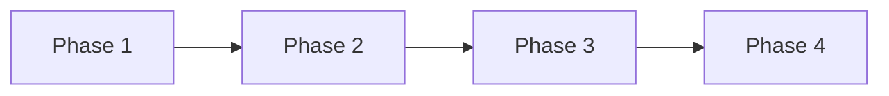

# Implementation Plan: 用户引导流程重新设计

**项目**: vibex-onboarding-redesign  
**版本**: 1.0  
**日期**: 2026-03-19

---

## 1. 执行概览

| 属性 | 值 |
|------|-----|
| **项目** | vibex-onboarding-redesign |
| **目标** | 优化用户引导流程，提升新用户转化率 |
| **完成标准** | 引导完成率提升 20% |
| **工作量** | 2 周 |

---

## 2. Phase 划分

### Phase 1: 基础架构 (Week 1, Day 1-2)

**目标**: 建立引导流程基础组件

| 任务 | 功能点 | 负责人 | 预估工时 |
|------|--------|--------|----------|
| T1.1 | 创建 OnboardingFlow 组件骨架 | Dev | 4h |
| T1.2 | 实现进度指示器 | Dev | 2h |
| T1.3 | 配置 Zustand 状态管理 | Dev | 2h |

**验收标准**:
- `expect(componentExists('OnboardingFlow')).toBe(true)`
- `expect(hasProgressIndicator).toBe(true)`

---

### Phase 2: 引导步骤开发 (Week 1, Day 3-5)

**目标**: 实现 5 个引导步骤

| 任务 | 功能点 | 负责人 | 预估工时 |
|------|--------|--------|----------|
| T2.1 | WelcomeStep 组件 | Dev | 4h |
| T2.2 | ProfileStep 组件 | Dev | 4h |
| T2.3 | PreferenceStep 组件 | Dev | 4h |
| T2.4 | TeamStep 组件 | Dev | 4h |
| T2.5 | CompleteStep 组件 | Dev | 2h |

**验收标准**:
- `expect(stepCount).toBe(5)`
- `expect(allStepsRender).toBe(true)`

---

### Phase 3: 状态与持久化 (Week 2, Day 1-2)

**目标**: 实现状态管理和进度保存

| 任务 | 功能点 | 负责人 | 预估工时 |
|------|--------|--------|----------|
| T3.1 | useOnboarding Hook 开发 | Dev | 4h |
| T3.2 | localStorage 进度保存 | Dev | 2h |
| T3.3 | 跳过功能实现 | Dev | 2h |

**验收标准**:
- `expect(progressSaved).toBe(true)`
- `expect(canSkipOnboarding).toBe(true)`

---

### Phase 4: 集成与测试 (Week 2, Day 3-5)

**目标**: 集成测试和部署

| 任务 | 功能点 | 负责人 | 预估工时 |
|------|--------|--------|----------|
| T4.1 | E2E 测试 | Tester | 4h |
| T4.2 | 性能测试 | Tester | 2h |
| T4.3 | Bug 修复 | Dev | 4h |
| T4.4 | 部署上线 | Dev | 2h |

**验收标准**:
- `expect(e2eTestsPass).toBe(true)`
- `expect(loadingTime).toBeLessThan(2000)`

---

## 3. 依赖关系

---

## 4. 风险评估

| 风险 | 影响 | 缓解 |
|------|------|------|
| 现有功能回归 | 高 | 完整回归测试 |
| 移动端适配 | 中 | 使用响应式设计 |
| 性能问题 | 中 | 代码分割懒加载 |

---

## 5. 验收标准

| Phase | 验收标准 |
|-------|----------|
| Phase 1 | 基础组件存在，进度指示器可用 |
| Phase 2 | 5 个步骤全部渲染 |
| Phase 3 | 进度保存和跳过功能正常 |
| Phase 4 | E2E 测试通过，性能达标 |

---

## 6. DoD

- [ ] OnboardingFlow 组件正常渲染
- [ ] 5 个引导步骤完成
- [ ] 进度保存功能可用
- [ ] 跳过功能可用
- [ ] E2E 测试通过
- [ ] 引导完成率提升 20%

---

*Implementation Plan - 2026-03-19*
