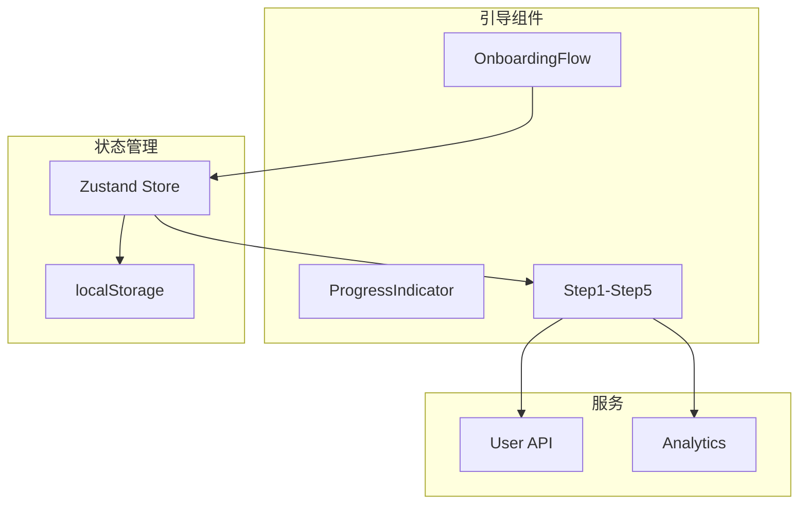

# Architecture: 用户引导流程重新设计

**项目**: vibex-onboarding-redesign  
**版本**: 1.0  
**日期**: 2026-03-19

---

## 1. Tech Stack

| 类别 | 技术选型 | 说明 |
|------|----------|------|
| 前端框架 | Next.js | 现有架构 |
| 状态管理 | Zustand | 引导状态 |
| 样式 | CSS Modules | 现有基础设施 |

---

## 2. Architecture Diagram



---

## 3. 组件结构

```
src/components/onboarding/
├── OnboardingFlow.tsx      # 主容器
├── ProgressIndicator.tsx   # 进度指示器
├── steps/
│   ├── WelcomeStep.tsx
│   ├── ProfileStep.tsx
│   ├── PreferenceStep.tsx
│   ├── TeamStep.tsx
│   └── CompleteStep.tsx
├── hooks/
│   └── useOnboarding.ts
└── styles/
    └── onboarding.module.css
```

---

## 4. 状态设计

```typescript
interface OnboardingState {
  currentStep: number;
  totalSteps: number;
  progress: number;
  isCompleted: boolean;
  userPreferences: Record<string, unknown>;
}
```

---

## 5. 验收标准

| 标准 | 验证方式 |
|------|----------|
| 步骤 ≤ 5 | 代码检查 |
| 进度指示器可见 | UI 测试 |
| 进度保存 | 刷新测试 |

---

*Architecture - 2026-03-19*
