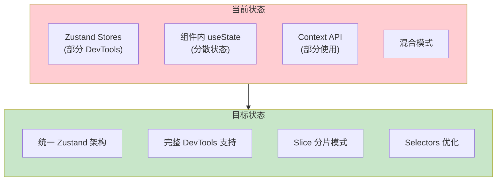
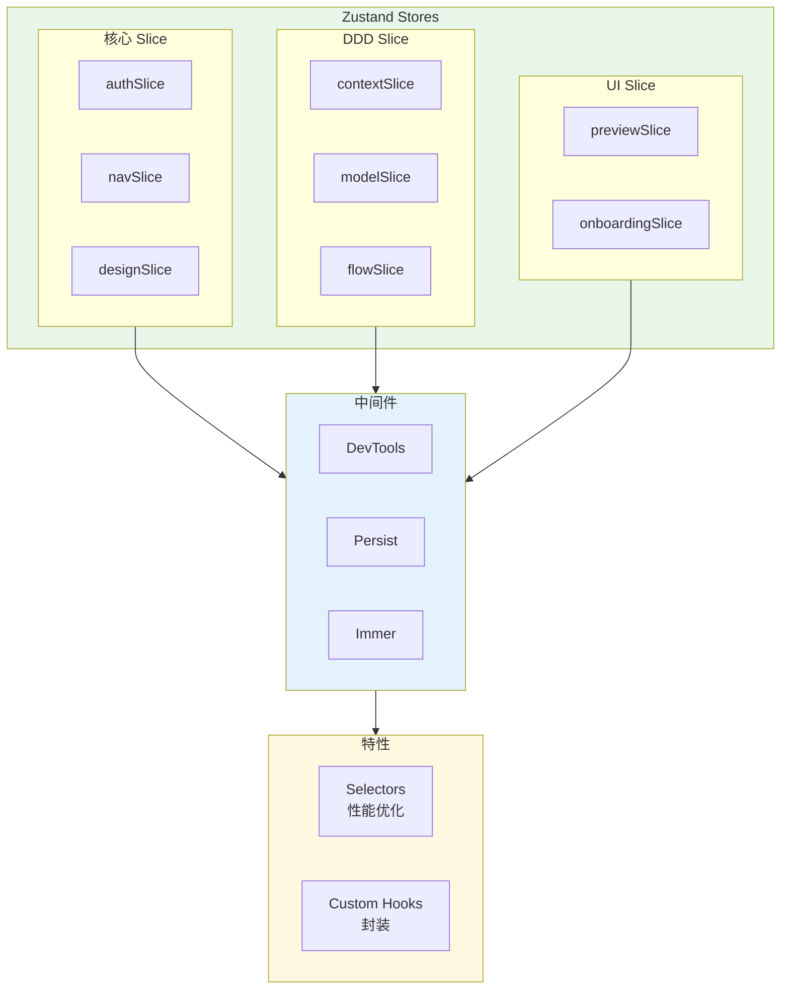
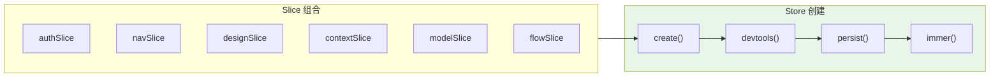
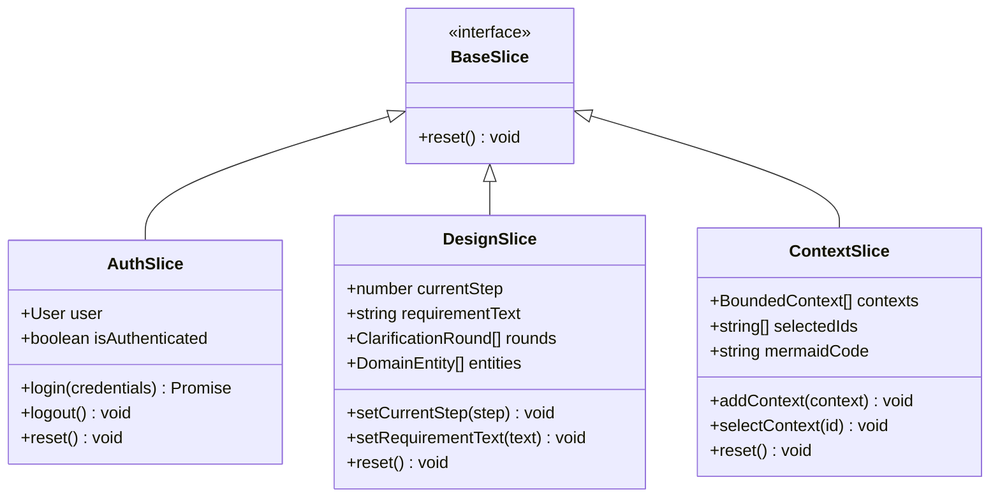

# 架构设计: 状态管理统一迁移 (AR1)

> **项目**: vibex-p1-impl-20260314  
> **架构师**: Architect Agent  
> **版本**: 1.0  
> **日期**: 2026-03-14

---

## 1. 技术栈

| 技术 | 版本 | 用途 | 选择理由 |
|------|------|------|----------|
| Zustand | 4.x | 状态管理 | 已有项目基础 |
| TypeScript | 5.x | 类型系统 | 已有项目基础 |
| Zustand DevTools | - | 调试工具 | 已有中间件 |
| IndexedDB | - | 状态持久化 | 进度保存 |

---

## 2. 架构图

### 2.1 当前状态 vs 目标状态



### 2.2 目标架构



### 2.3 Slice 组合架构



---

## 3. API 定义

### 3.1 Store 创建接口

```typescript
// stores/utils/createStore.ts

import { create, StateCreator, StoreApi, UseBoundStore } from 'zustand'
import { devtools, persist, DevtoolsOptions } from 'zustand/middleware'

export interface CreateStoreOptions<T> {
  name: string                  // Store 名称 (用于 DevTools)
  persist?: boolean             // 是否持久化
  persistKey?: string           // 持久化键名
  devtools?: DevtoolsOptions    // DevTools 配置
}

export function createStore<T extends object>(
  slice: StateCreator<T, [], []>,
  options: CreateStoreOptions<T>
): UseBoundStore<StoreApi<T>> {
  let store = create<T>()(slice)
  
  // 应用 DevTools
  if (process.env.NODE_ENV === 'development') {
    store = create<T>()(
      devtools(slice, { 
        name: options.name,
        ...options.devtools 
      })
    )
  }
  
  // 应用持久化
  if (options.persist) {
    store = create<T>()(
      persist(slice, {
        name: options.persistKey || options.name,
      })
    )
  }
  
  return store
}
```

### 3.2 Slice 标准接口

```typescript
// stores/types.ts

export interface BaseSlice {
  // 每个 Slice 必须有的方法
  reset: () => void
}

export interface SliceCreator<T extends BaseSlice> {
  (set: SetState<T>, get: GetState<T>): T
}

// 状态更新类型
export type SetState<T> = (
  partial: T | Partial<T> | ((state: T) => T | Partial<T>),
  replace?: boolean
) => void

export type GetState<T> = () => T
```

### 3.3 统一导出接口

```typescript
// stores/index.ts

// ==================== Auth Store ====================
export { useAuthStore, authActions } from './authStore'
export type { User } from './authStore'

// ==================== Navigation Store ====================
export { useNavigationStore } from './navigationStore'
export type { NavItem, ProjectContext, BreadcrumbItem, NavigationState } from './navigationStore'
export { 
  selectCurrentGlobalNav,
  selectCurrentProjectNav,
  selectBreadcrumbs 
} from './navigationStore'

// ==================== Design Store ====================
export { useDesignStore } from './designStore'
export type { DesignStep, ClarificationRound, DomainEntity, BusinessFlow, UIComponent, UIPage, PrototypeData } from './designStore'
export {
  selectCurrentStep,
  selectRequirementText,
  selectClarificationRounds,
  selectDomainEntities,
  selectBusinessFlows,
  selectUIPages,
  selectPrototype
} from './designStore'

// ==================== DDD Slices ====================
export { useContextStore } from './contextSlice'
export { useModelStore } from './modelSlice'
export { useFlowStore } from './flowSlice'

// ==================== UI Slices ====================
export { usePreviewStore } from './previewStore'
export { useOnboardingStore } from './onboarding/onboardingStore'
export { useTemplateStore } from './templateStore'

// ==================== Store Utilities ====================
export { createStore } from './utils/createStore'
export type { CreateStoreOptions, BaseSlice, SliceCreator } from './types'
```

### 3.4 Selector 接口

```typescript
// stores/selectors/index.ts

// 组合 Selector - 跨 Store 查询
export const selectDDDProgress = (state: RootState) => ({
  contexts: selectBoundedContexts(state),
  models: selectDomainModels(state),
  flow: selectBusinessFlow(state),
})

// 派生 Selector - 计算属性
export const selectIsDDDComplete = createSelector(
  [selectBoundedContexts, selectDomainModels, selectBusinessFlow],
  (contexts, models, flow) => 
    contexts.length > 0 && models.length > 0 && flow !== null
)
```

---

## 4. 数据模型

### 4.1 Slice 结构



### 4.2 DevTools 配置矩阵

| Store | DevTools | Persist | 说明 |
|-------|----------|---------|------|
| authStore | ✅ | ✅ | 用户认证状态 |
| navigationStore | ✅ | ❌ | 导航状态 |
| designStore | ✅ | ✅ | 设计流程状态 |
| contextSlice | ✅ | ✅ | 限界上下文 |
| modelSlice | ✅ | ✅ | 领域模型 |
| flowSlice | ✅ | ✅ | 业务流程 |
| previewStore | ✅ | ❌ | 预览状态 |
| onboardingStore | ✅ | ✅ | 引导状态 |
| templateStore | ✅ | ❌ | 模板状态 |

---

## 5. 模块划分

### 5.1 文件结构

```
src/stores/
├── index.ts                    # 统一导出 (修改)
├── types.ts                    # 类型定义 (新增)
│
├── slices/                     # Slice 模块 (新增)
│   ├── authSlice.ts            # 认证 Slice
│   ├── navSlice.ts             # 导航 Slice
│   ├── designSlice.ts          # 设计 Slice
│   ├── contextSlice.ts         # 限界上下文 Slice
│   ├── modelSlice.ts           # 领域模型 Slice
│   ├── flowSlice.ts            # 业务流程 Slice
│   └── index.ts                # Slice 导出
│
├── utils/                      # 工具函数 (新增)
│   ├── createStore.ts          # Store 创建工具
│   ├── selectors.ts            # Selector 工具
│   └── index.ts
│
├── selectors/                  # 组合 Selectors (新增)
│   ├── dddSelectors.ts         # DDD 相关
│   ├── navSelectors.ts         # 导航相关
│   └── index.ts
│
├── hooks/                      # Custom Hooks (新增)
│   ├── useDDDProgress.ts       # DDD 进度 Hook
│   ├── useAuth.ts              # 认证 Hook
│   └── index.ts
│
├── __tests__/                  # 测试
│   ├── stores.test.ts
│   └── selectors.test.ts
│
└── [现有文件保持]
```

### 5.2 模块职责

| 模块 | 职责 | 修改类型 |
|------|------|----------|
| `slices/*` | Slice 定义和状态逻辑 | 新增 |
| `utils/createStore` | Store 创建工具函数 | 新增 |
| `selectors/*` | 组合和派生 Selectors | 新增 |
| `hooks/*` | 封装常用状态操作 | 新增 |
| `index.ts` | 统一导出 | 修改 |
| 现有 Store | 添加 DevTools | 修改 |

---

## 6. 核心实现

### 6.1 Store 创建工具

```typescript
// stores/utils/createStore.ts

import { create, StateCreator, StoreApi, UseBoundStore } from 'zustand'
import { devtools, persist, PersistOptions, DevtoolsOptions } from 'zustand/middleware'

export interface CreateStoreOptions<T> {
  name: string
  persist?: PersistOptions<T>
  devtools?: DevtoolsOptions
}

export function createStore<T extends object>(
  slice: StateCreator<T, [], []>,
  options: CreateStoreOptions<T>
): UseBoundStore<StoreApi<T>> {
  // 基础 store
  let store = create<T>()(slice)
  
  // 开发环境应用 DevTools
  if (process.env.NODE_ENV === 'development' || options.devtools) {
    store = create<T>()(
      devtools(slice, {
        name: options.name,
        enabled: true,
        ...options.devtools,
      })
    )
  }
  
  // 持久化
  if (options.persist) {
    store = create<T>()(
      persist(slice, {
        name: options.name,
        ...options.persist,
      })
    )
  }
  
  return store
}
```

### 6.2 Slice 示例: ContextSlice

```typescript
// stores/slices/contextSlice.ts

import { create } from 'zustand'
import { devtools, persist } from 'zustand/middleware'
import type { BoundedContext } from '@/types'

export interface ContextState {
  contexts: BoundedContext[]
  selectedIds: string[]
  mermaidCode: string
  isPanelOpen: boolean
}

export interface ContextActions {
  addContext: (context: BoundedContext) => void
  updateContext: (id: string, updates: Partial<BoundedContext>) => void
  removeContext: (id: string) => void
  selectContext: (id: string) => void
  deselectContext: (id: string) => void
  setMermaidCode: (code: string) => void
  togglePanel: () => void
  reset: () => void
}

const initialState: ContextState = {
  contexts: [],
  selectedIds: [],
  mermaidCode: '',
  isPanelOpen: false,
}

export const useContextStore = create<ContextState & ContextActions>()(
  devtools(
    persist(
      (set, get) => ({
        ...initialState,
        
        addContext: (context) => set(
          (state) => ({ contexts: [...state.contexts, context] }),
          false,
          'addContext'
        ),
        
        updateContext: (id, updates) => set(
          (state) => ({
            contexts: state.contexts.map((c) =>
              c.id === id ? { ...c, ...updates } : c
            ),
          }),
          false,
          'updateContext'
        ),
        
        removeContext: (id) => set(
          (state) => ({
            contexts: state.contexts.filter((c) => c.id !== id),
            selectedIds: state.selectedIds.filter((sid) => sid !== id),
          }),
          false,
          'removeContext'
        ),
        
        selectContext: (id) => set(
          (state) => ({
            selectedIds: state.selectedIds.includes(id)
              ? state.selectedIds
              : [...state.selectedIds, id],
          }),
          false,
          'selectContext'
        ),
        
        deselectContext: (id) => set(
          (state) => ({
            selectedIds: state.selectedIds.filter((sid) => sid !== id),
          }),
          false,
          'deselectContext'
        ),
        
        setMermaidCode: (code) => set({ mermaidCode: code }, false, 'setMermaidCode'),
        
        togglePanel: () => set(
          (state) => ({ isPanelOpen: !state.isPanelOpen }),
          false,
          'togglePanel'
        ),
        
        reset: () => set(initialState, false, 'reset'),
      }),
      { name: 'vibex-context-store' }
    ),
    { name: 'ContextStore' }
  )
)

// Selectors
export const selectBoundedContexts = (state: ContextState) => state.contexts
export const selectSelectedContexts = (state: ContextState) =>
  state.contexts.filter((c) => state.selectedIds.includes(c.id))
export const selectCoreContexts = (state: ContextState) =>
  state.contexts.filter((c) => c.type === 'core')
export const selectSupportingContexts = (state: ContextState) =>
  state.contexts.filter((c) => c.type === 'supporting')
export const selectContextMermaidCode = (state: ContextState) => state.mermaidCode
export const selectIsContextPanelOpen = (state: ContextState) => state.isPanelOpen
```

### 6.3 useState 迁移指南

```typescript
// ❌ 迁移前：组件内 useState
function PageTree() {
  const [nodes, setNodes] = useState([])
  const [selectedNode, setSelectedNode] = useState(null)
  
  // 状态分散，不可调试
}

// ✅ 迁移后：Zustand Store
// stores/slices/pageTreeSlice.ts
export const usePageTreeStore = create<PageTreeState>()(
  devtools(
    (set) => ({
      nodes: [],
      selectedNode: null,
      setNodes: (nodes) => set({ nodes }, false, 'setNodes'),
      selectNode: (node) => set({ selectedNode: node }, false, 'selectNode'),
      reset: () => set({ nodes: [], selectedNode: null }, false, 'reset'),
    }),
    { name: 'PageTreeStore' }
  )
)

// 组件使用
function PageTree() {
  const nodes = usePageTreeStore((s) => s.nodes)
  const setNodes = usePageTreeStore((s) => s.setNodes)
  
  // 状态集中，可调试
}
```

---

## 7. 测试策略

### 7.1 测试用例

```typescript
// __tests__/stores/contextSlice.test.ts
import { useContextStore } from '@/stores/slices/contextSlice'

describe('ContextSlice', () => {
  beforeEach(() => {
    useContextStore.getState().reset()
  })
  
  it('adds context correctly', () => {
    const context: BoundedContext = {
      id: 'ctx-1',
      name: 'User Management',
      type: 'core',
      description: 'User auth and profile',
    }
    
    useContextStore.getState().addContext(context)
    
    expect(useContextStore.getState().contexts).toHaveLength(1)
    expect(useContextStore.getState().contexts[0].name).toBe('User Management')
  })
  
  it('selects context correctly', () => {
    useContextStore.getState().addContext({ id: '1', name: 'Test', type: 'core' })
    useContextStore.getState().selectContext('1')
    
    expect(useContextStore.getState().selectedIds).toContain('1')
  })
  
  it('resets to initial state', () => {
    useContextStore.getState().addContext({ id: '1', name: 'Test', type: 'core' })
    useContextStore.getState().reset()
    
    expect(useContextStore.getState().contexts).toHaveLength(0)
  })
})

// __tests__/selectors/dddSelectors.test.ts
import { selectIsDDDComplete } from '@/stores/selectors/dddSelectors'

describe('DDD Selectors', () => {
  it('returns false when contexts empty', () => {
    const state = {
      contexts: [],
      models: [],
      flow: null,
    }
    
    expect(selectIsDDDComplete(state)).toBe(false)
  })
  
  it('returns true when all complete', () => {
    const state = {
      contexts: [{ id: '1', name: 'Test' }],
      models: [{ id: 'm1', name: 'Entity' }],
      flow: { id: 'f1', name: 'Order Flow' },
    }
    
    expect(selectIsDDDComplete(state)).toBe(true)
  })
})
```

### 7.2 覆盖率目标

| 模块 | 覆盖率目标 |
|------|-----------|
| Slice 文件 | 90% |
| Selectors | 95% |
| Hooks | 85% |
| Utils | 90% |

---

## 8. 迁移计划

### 8.1 阶段划分

| 阶段 | 内容 | 工时 |
|------|------|------|
| Phase 1 | Slice 标准化 + DevTools 配置 | 2 天 |
| Phase 2 | useState 迁移 | 3 天 |
| Phase 3 | DevTools 完善 + 测试 | 1 天 |

### 8.2 迁移检查清单

**Phase 1: Slice 标准化**
- [ ] 创建 `createStore` 工具函数
- [ ] 为 5 个缺失 DevTools 的 Store 添加配置
- [ ] 统一 Slice 结构
- [ ] 添加 Selectors

**Phase 2: useState 迁移**
- [ ] 识别组件内可提取的 useState
- [ ] 创建对应 Slice
- [ ] 渐进式迁移组件

**Phase 3: DevTools 完善**
- [ ] 所有 Store 支持 DevTools
- [ ] 状态快照导出
- [ ] 时间旅行调试配置

---

## 9. 风险评估

| 风险 | 概率 | 影响 | 缓解措施 |
|------|------|------|----------|
| 迁移期间状态不一致 | 中 | 高 | 渐进式迁移 + E2E 测试 |
| 性能回退 | 低 | 中 | Benchmark 前后对比 |
| DevTools 不工作 | 低 | 低 | 开发环境验证 |

---

## 10. 架构收益

| 维度 | 收益 |
|------|------|
| 调试效率 | DevTools 全局可见 ↑ 80% |
| 类型安全 | 100% TypeScript 推断 |
| 性能 | 按需订阅减少渲染 |
| 维护成本 | 统一模式 ↓ 40% |

---

## 11. 检查清单

- [x] 技术栈选型 (Zustand + DevTools)
- [x] 架构图 (当前 vs 目标 + Slice 组合)
- [x] API 定义 (Store 创建 + Slice 接口 + Selectors)
- [x] 数据模型 (Slice 结构 + DevTools 配置矩阵)
- [x] 核心实现 (createStore + ContextSlice 示例)
- [x] 测试策略 (Slice + Selectors + 覆盖率)
- [x] 迁移计划 (3 阶段 + 检查清单)
- [x] 风险评估
- [x] 架构收益评估

---

**产出物**: `/root/.openclaw/vibex/docs/vibex-p1-impl-20260314/ar1-state-migration-architecture.md`