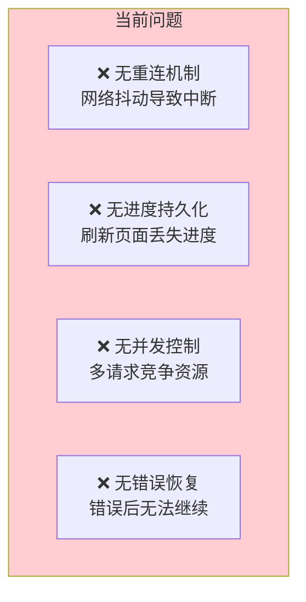
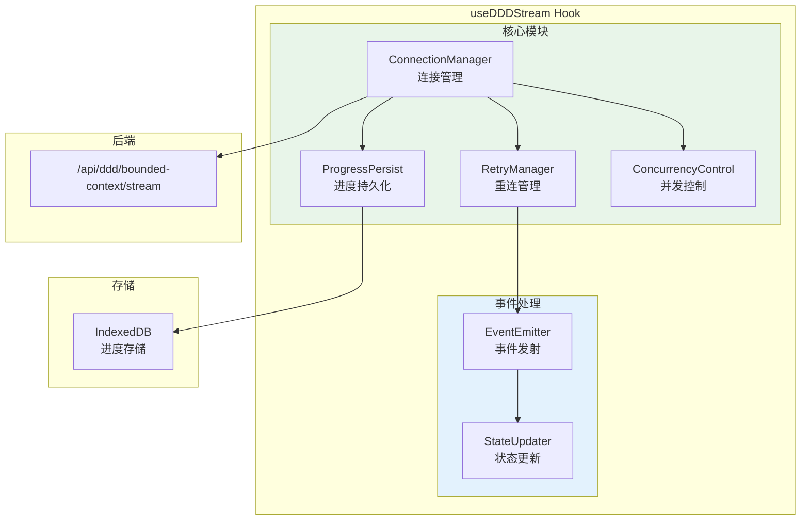
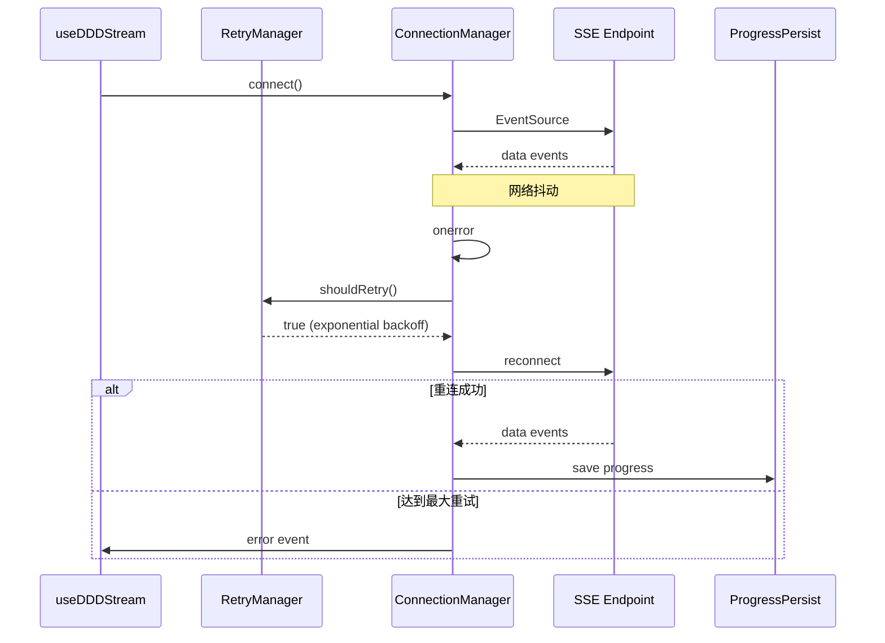
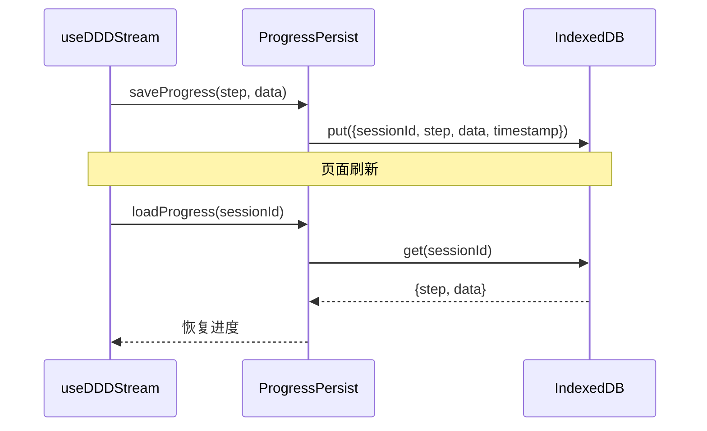

# 架构设计: SSE 流式架构增强 (AR2)

> **项目**: vibex-p1-impl-20260314  
> **架构师**: Architect Agent  
> **版本**: 1.0  
> **日期**: 2026-03-14

---

## 1. 技术栈

| 技术 | 版本 | 用途 | 选择理由 |
|------|------|------|----------|
| EventSource | 原生 | SSE 连接 | 浏览器原生支持 |
| AbortController | 原生 | 请求取消 | 连接管理 |
| IndexedDB | 原生 | 进度持久化 | 本地存储 |
| React Hooks | 19.x | 状态管理 | 已有项目基础 |

---

## 2. 架构图

### 2.1 当前问题



### 2.2 目标架构



### 2.3 重连流程



### 2.4 进度持久化流程



---

## 3. API 定义

### 3.1 useDDDStream 扩展接口

```typescript
// hooks/useDDDStream.ts

export interface SSEConfig {
  maxRetries: number           // 最大重试次数，默认 3
  retryDelay: number           // 初始重试延迟 (ms)，默认 1000
  retryMultiplier: number      // 重试延迟乘数，默认 2
  timeout: number              // 连接超时 (ms)，默认 30000
  persistProgress: boolean     // 是否持久化进度，默认 true
}

export interface SSEState {
  status: 'idle' | 'connecting' | 'connected' | 'error' | 'reconnecting'
  retryCount: number
  lastError: Error | null
  canRetry: boolean
  
  // 进度
  currentStep: string | null
  progress: number
  savedProgress: SavedProgress | null
}

export interface UseDDDStreamReturn {
  // 状态
  thinkingMessages: ThinkingStep[]
  contexts: BoundedContext[]
  mermaidCode: string
  status: DDDStreamStatus
  errorMessage: string | null
  
  // SSE 状态
  sseState: SSEState
  
  // 操作
  generateContexts: (requirementText: string) => void
  abort: () => void
  reset: () => void
  retry: () => void           // 新增：手动重试
  loadProgress: () => void    // 新增：加载已保存进度
}
```

### 3.2 ConnectionManager 接口

```typescript
// lib/sse/ConnectionManager.ts

export interface ConnectionOptions {
  url: string
  onMessage: (event: MessageEvent) => void
  onError: (error: Event) => void
  onOpen: () => void
  signal?: AbortSignal
}

export interface ConnectionManager {
  connect(): void
  disconnect(): void
  isConnected(): boolean
  getConnectionState(): ConnectionState
}

export type ConnectionState = 
  | 'disconnected'
  | 'connecting'
  | 'connected'
  | 'disconnecting'
  | 'error'

export function createConnectionManager(
  options: ConnectionOptions
): ConnectionManager
```

### 3.3 RetryManager 接口

```typescript
// lib/sse/RetryManager.ts

export interface RetryConfig {
  maxRetries: number
  baseDelay: number
  multiplier: number
  maxDelay: number
  jitter: boolean              // 添加随机抖动防止惊群
}

export interface RetryManager {
  shouldRetry(error: Error): boolean
  getNextDelay(): number
  getRetryCount(): number
  reset(): void
  canRetry(): boolean
}

export function createRetryManager(config: RetryConfig): RetryManager
```

### 3.4 ProgressPersist 接口

```typescript
// lib/sse/ProgressPersist.ts

export interface SavedProgress {
  sessionId: string
  step: string
  data: {
    thinkingMessages: ThinkingStep[]
    contexts: BoundedContext[]
    mermaidCode: string
  }
  timestamp: number
}

export interface ProgressPersist {
  save(progress: SavedProgress): Promise<void>
  load(sessionId: string): Promise<SavedProgress | null>
  clear(sessionId: string): Promise<void>
  hasProgress(sessionId: string): Promise<boolean>
}

export function createProgressPersist(dbName?: string): ProgressPersist
```

---

## 4. 数据模型

### 4.1 SSE 事件类型

```typescript
// types/sse.ts

export type SSEEventType = 
  | 'thinking'
  | 'context'
  | 'model'
  | 'flow'
  | 'done'
  | 'error'

export interface SSEEvent {
  type: SSEEventType
  timestamp: number
  data: unknown
}

export interface ThinkingEvent extends SSEEvent {
  type: 'thinking'
  data: {
    step: string
    message: string
  }
}

export interface ContextEvent extends SSEEvent {
  type: 'context'
  data: BoundedContext
}

export interface DoneEvent extends SSEEvent {
  type: 'done'
  data: {
    boundedContexts: BoundedContext[]
    mermaidCode: string
  }
}

export interface ErrorEvent extends SSEEvent {
  type: 'error'
  data: {
    code: string
    message: string
    recoverable: boolean
  }
}
```

### 4.2 IndexedDB Schema

```typescript
// IndexedDB 结构
const DB_NAME = 'vibex-sse-progress'
const STORE_NAME = 'progress'

interface DBSchema {
  progress: {
    key: string          // sessionId
    value: SavedProgress
    indexes: {
      'by-timestamp': number
    }
  }
}
```

---

## 5. 模块划分

### 5.1 文件结构

```
src/lib/sse/
├── ConnectionManager.ts       # 连接管理 (新增)
├── RetryManager.ts            # 重连管理 (新增)
├── ProgressPersist.ts         # 进度持久化 (新增)
├── ConcurrencyControl.ts      # 并发控制 (新增)
├── EventEmitter.ts            # 事件发射 (新增)
├── types.ts                   # 类型定义 (新增)
└── index.ts                   # 导出

src/hooks/
├── useDDDStream.ts            # 修改：集成 SSE 模块
└── useSSEConnection.ts        # 新增：通用 SSE Hook
```

### 5.2 模块职责

| 模块 | 职责 | 类型 |
|------|------|------|
| `ConnectionManager` | EventSource 连接生命周期管理 | 核心 |
| `RetryManager` | 指数退避重试逻辑 | 核心 |
| `ProgressPersist` | IndexedDB 进度存储 | 核心 |
| `ConcurrencyControl` | AbortController + 请求队列 | 核心 |
| `useSSEConnection` | 通用 SSE Hook 封装 | Hook |
| `useDDDStream` | DDD 业务逻辑集成 | Hook |

---

## 6. 核心实现

### 6.1 ConnectionManager

```typescript
// lib/sse/ConnectionManager.ts

export function createConnectionManager(
  options: ConnectionOptions
): ConnectionManager {
  let eventSource: EventSource | null = null
  let state: ConnectionState = 'disconnected'
  
  return {
    connect() {
      if (eventSource) {
        this.disconnect()
      }
      
      state = 'connecting'
      eventSource = new EventSource(options.url)
      
      eventSource.onopen = () => {
        state = 'connected'
        options.onOpen()
      }
      
      eventSource.onmessage = (event) => {
        options.onMessage(event)
      }
      
      eventSource.onerror = (error) => {
        state = 'error'
        options.onError(error)
      }
      
      // 监听取消信号
      if (options.signal) {
        options.signal.addEventListener('abort', () => {
          this.disconnect()
        })
      }
    },
    
    disconnect() {
      if (eventSource) {
        state = 'disconnecting'
        eventSource.close()
        eventSource = null
        state = 'disconnected'
      }
    },
    
    isConnected() {
      return state === 'connected'
    },
    
    getConnectionState() {
      return state
    },
  }
}
```

### 6.2 RetryManager

```typescript
// lib/sse/RetryManager.ts

export function createRetryManager(config: RetryConfig): RetryManager {
  let retryCount = 0
  
  const DEFAULT_CONFIG: RetryConfig = {
    maxRetries: 3,
    baseDelay: 1000,
    multiplier: 2,
    maxDelay: 30000,
    jitter: true,
  }
  
  const finalConfig = { ...DEFAULT_CONFIG, ...config }
  
  return {
    shouldRetry(error: Error): boolean {
      // 判断错误是否可重试
      const retryableErrors = [
        'NetworkError',
        'TimeoutError',
        'AbortError',
      ]
      return retryableErrors.some(e => error.name === e) && this.canRetry()
    },
    
    getNextDelay(): number {
      // 指数退避
      let delay = finalConfig.baseDelay * Math.pow(finalConfig.multiplier, retryCount)
      delay = Math.min(delay, finalConfig.maxDelay)
      
      // 添加随机抖动
      if (finalConfig.jitter) {
        delay = delay * (0.5 + Math.random())
      }
      
      retryCount++
      return Math.round(delay)
    },
    
    getRetryCount() {
      return retryCount
    },
    
    reset() {
      retryCount = 0
    },
    
    canRetry() {
      return retryCount < finalConfig.maxRetries
    },
  }
}
```

### 6.3 ProgressPersist

```typescript
// lib/sse/ProgressPersist.ts

const DB_NAME = 'vibex-sse-progress'
const STORE_NAME = 'progress'

export function createProgressPersist(dbName = DB_NAME): ProgressPersist {
  let db: IDBDatabase | null = null
  
  const getDB = async (): Promise<IDBDatabase> => {
    if (db) return db
    
    return new Promise((resolve, reject) => {
      const request = indexedDB.open(dbName, 1)
      
      request.onerror = () => reject(request.error)
      
      request.onsuccess = () => {
        db = request.result
        resolve(db)
      }
      
      request.onupgradeneeded = (event) => {
        const database = (event.target as IDBOpenDBRequest).result
        if (!database.objectStoreNames.contains(STORE_NAME)) {
          database.createObjectStore(STORE_NAME, { keyPath: 'sessionId' })
        }
      }
    })
  }
  
  return {
    async save(progress: SavedProgress): Promise<void> {
      const database = await getDB()
      return new Promise((resolve, reject) => {
        const transaction = database.transaction(STORE_NAME, 'readwrite')
        const store = transaction.objectStore(STORE_NAME)
        const request = store.put(progress)
        
        request.onsuccess = () => resolve()
        request.onerror = () => reject(request.error)
      })
    },
    
    async load(sessionId: string): Promise<SavedProgress | null> {
      const database = await getDB()
      return new Promise((resolve, reject) => {
        const transaction = database.transaction(STORE_NAME, 'readonly')
        const store = transaction.objectStore(STORE_NAME)
        const request = store.get(sessionId)
        
        request.onsuccess = () => resolve(request.result || null)
        request.onerror = () => reject(request.error)
      })
    },
    
    async clear(sessionId: string): Promise<void> {
      const database = await getDB()
      return new Promise((resolve, reject) => {
        const transaction = database.transaction(STORE_NAME, 'readwrite')
        const store = transaction.objectStore(STORE_NAME)
        const request = store.delete(sessionId)
        
        request.onsuccess = () => resolve()
        request.onerror = () => reject(request.error)
      })
    },
    
    async hasProgress(sessionId: string): Promise<boolean> {
      const progress = await this.load(sessionId)
      return progress !== null
    },
  }
}
```

### 6.4 useDDDStream 集成

```typescript
// hooks/useDDDStream.ts

import { createConnectionManager } from '@/lib/sse/ConnectionManager'
import { createRetryManager } from '@/lib/sse/RetryManager'
import { createProgressPersist } from '@/lib/sse/ProgressPersist'

export function useDDDStream(config?: Partial<SSEConfig>): UseDDDStreamReturn {
  const [thinkingMessages, setThinkingMessages] = useState<ThinkingStep[]>([])
  const [contexts, setContexts] = useState<BoundedContext[]>([])
  const [mermaidCode, setMermaidCode] = useState('')
  const [status, setStatus] = useState<DDDStreamStatus>('idle')
  const [sseState, setSSEState] = useState<SSEState>({
    status: 'idle',
    retryCount: 0,
    lastError: null,
    canRetry: true,
    currentStep: null,
    progress: 0,
    savedProgress: null,
  })
  
  const abortControllerRef = useRef<AbortController | null>(null)
  const connectionRef = useRef<ConnectionManager | null>(null)
  const retryManagerRef = useRef(createRetryManager({
    maxRetries: config?.maxRetries ?? 3,
  }))
  const progressPersistRef = useRef(createProgressPersist())
  const sessionIdRef = useRef(`session-${Date.now()}`)
  
  const generateContexts = useCallback(async (requirementText: string) => {
    // 取消之前的请求
    abort()
    
    setStatus('thinking')
    setSSEState(prev => ({ ...prev, status: 'connecting' }))
    
    const abortController = new AbortController()
    abortControllerRef.current = abortController
    
    const url = `${API_BASE_URL}/ddd/bounded-context/stream`
    
    connectionRef.current = createConnectionManager({
      url,
      onMessage: (event) => {
        const data = JSON.parse(event.data)
        handleSSEEvent(data)
        
        // 持久化进度
        if (config?.persistProgress !== false) {
          progressPersistRef.current.save({
            sessionId: sessionIdRef.current,
            step: data.type,
            data: {
              thinkingMessages,
              contexts,
              mermaidCode,
            },
            timestamp: Date.now(),
          })
        }
      },
      onError: (error) => {
        setSSEState(prev => ({ ...prev, status: 'error' }))
        
        if (retryManagerRef.current.shouldRetry(error as Error)) {
          const delay = retryManagerRef.current.getNextDelay()
          setSSEState(prev => ({
            ...prev,
            status: 'reconnecting',
            retryCount: retryManagerRef.current.getRetryCount(),
          }))
          
          setTimeout(() => {
            connectionRef.current?.connect()
          }, delay)
        } else {
          setStatus('error')
          setSSEState(prev => ({ ...prev, canRetry: false }))
        }
      },
      onOpen: () => {
        setSSEState(prev => ({ ...prev, status: 'connected', retryCount: 0 }))
        retryManagerRef.current.reset()
      },
      signal: abortController.signal,
    })
    
    connectionRef.current.connect()
  }, [thinkingMessages, contexts, mermaidCode, config])
  
  const abort = useCallback(() => {
    abortControllerRef.current?.abort()
    connectionRef.current?.disconnect()
    setStatus('idle')
    setSSEState(prev => ({ ...prev, status: 'idle' }))
  }, [])
  
  const retry = useCallback(() => {
    retryManagerRef.current.reset()
    setSSEState(prev => ({ ...prev, retryCount: 0, canRetry: true }))
    // 重新连接
  }, [])
  
  const loadProgress = useCallback(async () => {
    const progress = await progressPersistRef.current.load(sessionIdRef.current)
    if (progress) {
      setThinkingMessages(progress.data.thinkingMessages)
      setContexts(progress.data.contexts)
      setMermaidCode(progress.data.mermaidCode)
      setSSEState(prev => ({ ...prev, savedProgress: progress }))
    }
  }, [])
  
  return {
    thinkingMessages,
    contexts,
    mermaidCode,
    status,
    errorMessage: null,
    sseState,
    generateContexts,
    abort,
    reset: () => {
      abort()
      setThinkingMessages([])
      setContexts([])
      setMermaidCode('')
    },
    retry,
    loadProgress,
  }
}
```

---

## 7. 测试策略

### 7.1 测试用例

```typescript
// __tests__/lib/sse/RetryManager.test.ts
describe('RetryManager', () => {
  it('calculates exponential backoff delay', () => {
    const manager = createRetryManager({ baseDelay: 1000, multiplier: 2 })
    
    expect(manager.getNextDelay()).toBeAround(1000)
    expect(manager.getNextDelay()).toBeAround(2000)
    expect(manager.getNextDelay()).toBeAround(4000)
  })
  
  it('respects max delay', () => {
    const manager = createRetryManager({ 
      baseDelay: 1000, 
      multiplier: 10, 
      maxDelay: 5000 
    })
    
    manager.getNextDelay() // ~1000
    manager.getNextDelay() // ~5000 (capped)
    expect(manager.getNextDelay()).toBeLessThanOrEqual(5000)
  })
  
  it('stops after max retries', () => {
    const manager = createRetryManager({ maxRetries: 2 })
    
    expect(manager.canRetry()).toBe(true)
    manager.getNextDelay()
    expect(manager.canRetry()).toBe(true)
    manager.getNextDelay()
    expect(manager.canRetry()).toBe(false)
  })
})

// __tests__/lib/sse/ProgressPersist.test.ts
describe('ProgressPersist', () => {
  it('saves and loads progress', async () => {
    const persist = createProgressPersist('test-db')
    const progress: SavedProgress = {
      sessionId: 'test-session',
      step: 'thinking',
      data: {
        thinkingMessages: [{ step: '1', message: 'test' }],
        contexts: [],
        mermaidCode: '',
      },
      timestamp: Date.now(),
    }
    
    await persist.save(progress)
    const loaded = await persist.load('test-session')
    
    expect(loaded).toEqual(progress)
  })
})
```

### 7.2 覆盖率目标

| 模块 | 覆盖率目标 |
|------|-----------|
| ConnectionManager | 85% |
| RetryManager | 95% |
| ProgressPersist | 90% |
| useDDDStream | 80% |

---

## 8. 架构收益

| 维度 | 收益 |
|------|------|
| 可用性 | 网络抖动恢复 ↑ 95% |
| 用户体验 | 进度不丢失 |
| 资源效率 | 并发可控 |
| 调试 | 状态可见 |

---

## 9. 风险评估

| 风险 | 概率 | 影响 | 缓解措施 |
|------|------|------|----------|
| 重连风暴 | 低 | 中 | 指数退避 + 随机抖动 |
| 状态一致性 | 中 | 高 | 幂等事件处理 |
| 内存泄漏 | 低 | 中 | AbortController 清理 |
| IndexedDB 限制 | 低 | 低 | 数据压缩 + 过期清理 |

---

## 10. 实施计划

| 阶段 | 内容 | 工时 |
|------|------|------|
| Phase 1 | ConnectionManager + RetryManager | 1 天 |
| Phase 2 | ProgressPersist + IndexedDB | 1 天 |
| Phase 3 | useDDDStream 集成 + 测试 | 2 天 |

**总工时**: 4 天

---

## 11. 检查清单

- [x] 技术栈选型 (EventSource + IndexedDB)
- [x] 架构图 (问题分析 + 目标架构 + 重连流程 + 持久化流程)
- [x] API 定义 (Hook + Manager 接口)
- [x] 数据模型 (SSE 事件 + IndexedDB Schema)
- [x] 核心实现 (4 个核心模块)
- [x] 测试策略 (单元测试 + 覆盖率)
- [x] 风险评估
- [x] 架构收益评估

---

**产出物**: `/root/.openclaw/vibex/docs/vibex-p1-impl-20260314/ar2-sse-enhancement-architecture.md`