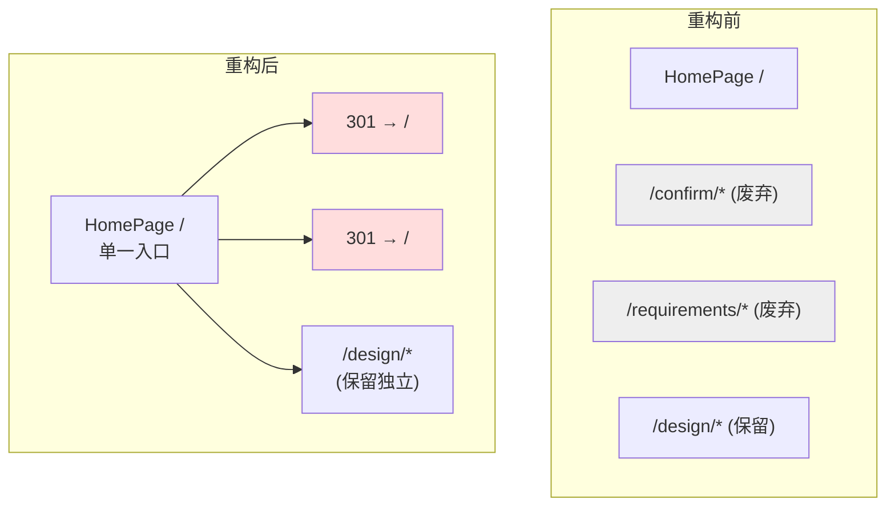
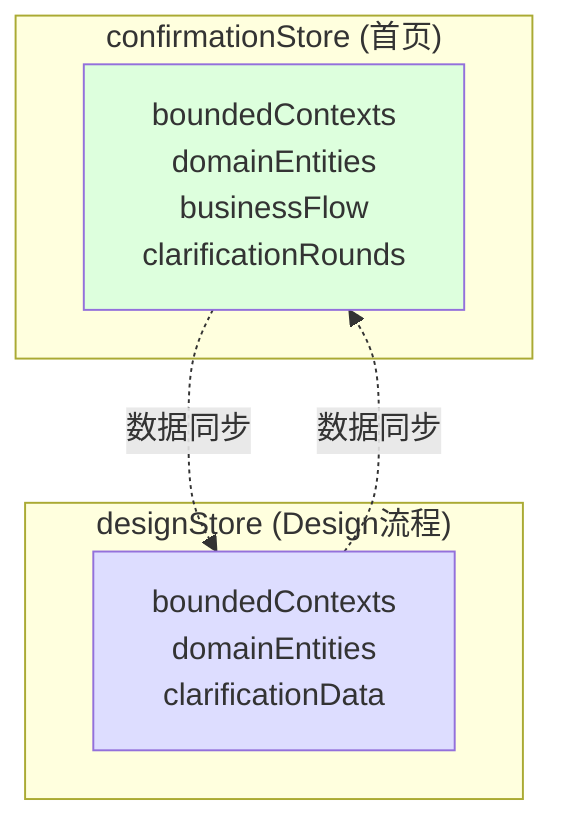
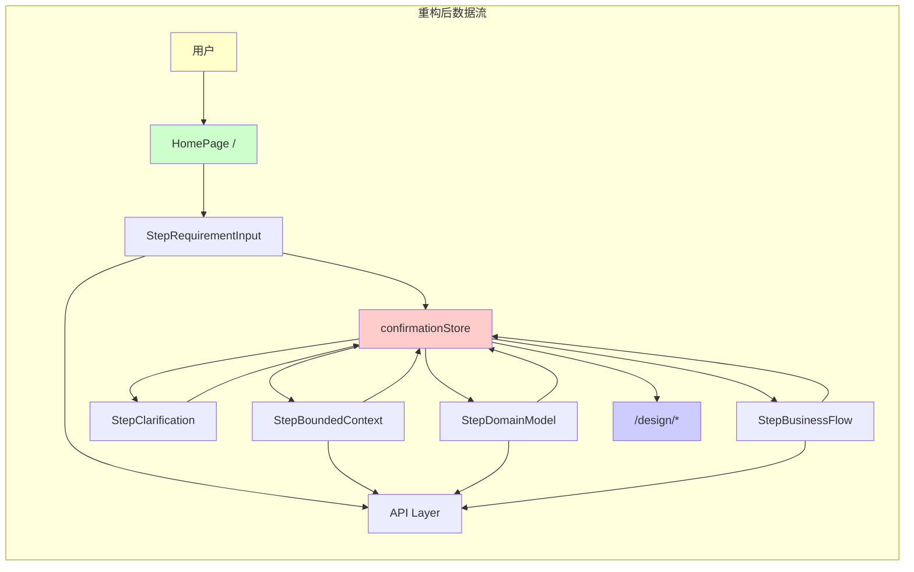

# 架构设计: VibeX 页面结构整合重构

**项目**: vibex-page-structure-consolidation  
**架构师**: Architect Agent  
**日期**: 2026-03-21

---

## 1. 问题概述

| 问题 | 四套并行页面流程（`/`、`/confirm/*`、`/design/*`、`/requirements/*`）共用 Store 但 UI 分散 |
|------|------|
| 根因 | 历史演进，从未统一整合 |
| 目标 | 消除冗余，统一为 Homepage 单一入口 |

---

## 2. 整体架构



---

## 3. Epic 1: 路由重定向架构

### 3.1 Next.js Middleware 实现

```typescript
// middleware.ts
import { NextResponse } from 'next/server';
import type { NextRequest } from 'next/server';

export function middleware(request: NextRequest) {
  const pathname = request.nextUrl.pathname;

  // 重定向规则
  const redirects: Array<[RegExp, string]> = [
    [/\/confirm\//, '/'],
    [/\/requirements\//, '/'],
  ];

  for (const [pattern, destination] of redirects) {
    if (pattern.test(pathname)) {
      return NextResponse.redirect(new URL(destination, request.url), 301);
    }
  }

  return NextResponse.next();
}

export const config = {
  matcher: ['/confirm/:path*', '/requirements/:path*'],
};
```

### 3.2 导航栏更新

```typescript
// components/layout/NavBar.tsx
// 移除 /confirm 和 /requirements 入口
const navLinks = [
  { href: '/', label: '首页', exact: true },
  { href: '/design/clarification', label: '设计' },
  // /confirm/* 和 /requirements/* 已废弃，移除
];
```

### 3.3 Deprecation 注释

```typescript
// src/app/confirm/context/page.tsx
/**
 * @deprecated 此路由已废弃，请访问首页 /
 * 重定向配置: middleware.ts → 301 → /
 * 预计删除版本: v2.0
 */
```

---

## 4. Epic 2: Homepage 流程强化架构

### 4.1 现有 Homepage 步骤 vs 待覆盖流程

| Homepage 现有步骤 | 对应旧流程 | 覆盖状态 |
|-----------------|-----------|----------|
| StepRequirementInput | /requirements/* | ✅ 需确认 |
| StepBoundedContext | /confirm/*, /design/* | ✅ 需确认 |
| StepDomainModel | /confirm/*, /design/* | ✅ 需确认 |
| StepBusinessFlow | /confirm/*, /design/* | ✅ 需确认 |
| (无) | /design/clarification | ⚠️ 评估 |
| (无) | /design/ui-generation | ⚠️ 评估 |

### 4.2 确认评估方案

```typescript
// specs/assessment-clarification.md 结论
type AssessmentResult = 'MIGRATE' | 'KEEP' | 'REMOVE';

interface FeatureAssessment {
  feature: string;
  result: AssessmentResult;
  reason: string;
  migrationEffort: 'low' | 'medium' | 'high';
}

// 评估函数
function assessFeature(feature: string): FeatureAssessment {
  if (feature === 'design-clarification') {
    return {
      result: 'KEEP', // 设计澄清是 /design 独特功能，保留独立路由
      reason: 'Clarification 是 AI 辅助澄清，有独特交互模式',
      migrationEffort: 'high',
    };
  }
  // ...
}
```

---

## 5. Epic 3: Design 步骤合并架构

### 5.1 状态管理统一



**架构决策**: 保持 `confirmationStore` 和 `designStore` 独立，仅通过同步桥共享数据。

### 5.2 Clarification 迁移

```typescript
// src/components/homepage/steps/StepClarification.tsx
// 新增步骤：插入在 StepBoundedContext 和 StepDomainModel 之间

interface StepClarificationProps {
  onComplete: (clarification: ClarificationRound[]) => void;
  onSkip: () => void;
}

export function StepClarification({ onComplete, onSkip }: StepClarificationProps) {
  const { rounds, addRound, acceptRound } = useConfirmationStore();
  
  return (
    <div className={styles.step}>
      <StepNavigator ... />
      <ClarificationPanel rounds={rounds} onAdd={addRound} />
      <div className={styles.actions}>
        <Button onClick={onSkip}>跳过</Button>
        <Button onClick={() => onComplete(rounds)} variant="primary">
          完成澄清
        </Button>
      </div>
    </div>
  );
}
```

---

## 6. Epic 4: 废弃代码清理架构

### 6.1 删除检查清单

```bash
# Phase 1: 确认无外部引用
grep -r "from.*confirm" src/ --include="*.ts" --include="*.tsx"
grep -r "from.*requirements" src/ --include="*.ts" --include="*.tsx"
grep -r "/confirm" . --include="*.ts" --include="*.tsx" --include="*.md"
grep -r "/requirements" . --include="*.ts" --include="*.tsx" --include="*.md"

# Phase 2: 删除目录
rm -rf src/app/confirm/
rm -rf src/app/requirements/

# Phase 3: 验证构建
npm run build  # 必须成功
npm test      # 必须全部通过
```

### 6.2 废弃组件清理

```typescript
// 待删除组件列表
const deprecatedComponents = [
  'ConfirmationSteps.tsx',
  'LegacyRequirementsList.tsx',
  'RequirementsForm.tsx',
];

// 每个组件删除前检查
deprecatedComponents.forEach((comp) => {
  const usage = grepImports(comp); // 必须为 0
  if (usage > 0) {
    throw new Error(`Cannot delete ${comp}: still imported ${usage} times`);
  }
  fs.unlinkSync(comp);
});
```

---

## 7. 数据流架构



---

## 8. 技术决策

| 决策 | 选项 | 选择 | 理由 |
|------|------|------|------|
| 重定向方式 | Middleware | ✅ | Next.js 14 原生支持，性能好 |
| 重定向码 | 301 | ✅ | 永久重定向，SEO 友好 |
| 状态存储 | 双 Store 独立 | ✅ | 避免破坏性变更 |
| 清理时机 | Epic 4 独立 | ✅ | 重定向验证后再清理 |
| /design 保留 | 独立路由 | ✅ | design 有独特价值 |

---

## 9. 风险控制

| 风险 | 缓解措施 |
|------|----------|
| 删除有隐藏依赖的文件 | grep 全面检查 + npm test |
| Design 合并后状态不一致 | 同步桥 + 单元测试 |
| 重定向循环 | Middleware 精确匹配 |
| 用户书签失效 | 301 + 页面内提示 |

---

*Generated by: Architect Agent*


## 10. API 规格

> 基于现有 `src/services/api/modules/` 和 `src/services/api/schemas/` 构建的完整 API 契约

### 10.1 通用规范

| 规范 | 内容 |
|------|------|
| Base URL | `/api` |
| 认证 | Bearer Token (`Authorization: Bearer <token>`) |
| 错误格式 | `{ success: false, error: string, code: string }` |
| 成功格式 | `{ success: true, data: T }` |
| 错误码 | `AUTH_001`(未认证), `VALIDATION_001`(参数错误), `SERVER_001`(服务器错误) |
| 分页格式 | `{ items: T[], total: number, page: number, pageSize: number }` |

---

### 10.2 Clarification API (需求澄清)

#### 10.2.1 REST API

| 方法 | 端点 | 描述 | 请求体 | 响应 |
|------|------|------|--------|------|
| GET | `/clarifications/:requirementId` | 获取澄清列表 | - | `Clarification[]` |
| POST | `/clarifications/:requirementId/:clarificationId/answer` | 回答澄清 | `{ answer: string }` | `Clarification` |
| POST | `/clarifications/:requirementId/:clarificationId/skip` | 跳过澄清 | - | `Clarification` |

#### 10.2.2 SSE API (对话式澄清)

| 方法 | 端点 | 描述 |
|------|------|------|
| POST | `/clarify/chat` | 流式对话澄清 |

**请求**:

```json
{
  "message": "用户输入的需求描述",
  "history": [
    { "role": "user", "content": "上一轮用户输入" },
    { "role": "assistant", "content": "上一轮AI回复" }
  ],
  "context": {
    "requirementId": "uuid",
    "projectType": "management|ecommerce|blog|custom"
  }
}
```

**SSE 响应**:

```
event: thinking
data: {"type":"thinking","content":"正在分析需求..."}

event: clarification
data: {"type":"clarification","question":"需要澄清:目标用户是谁?","priority":"high"}

event: suggestion
data: {"type":"suggestion","quickReplies":["管理员","普通用户","访客"]}

event: complete
data: {"type":"complete","completeness":65,"nextAction":"gather_more_info"}
```

---

### 10.3 Bounded Context API (限界上下文)

| 方法 | 端点 | 描述 | 请求体 | 响应 |
|------|------|------|--------|------|
| GET | `/bounded-contexts` | 获取上下文列表 | `?requirementId=` | `BoundedContext[]` |
| GET | `/bounded-contexts/:id` | 获取单个上下文 | - | `BoundedContext` |
| POST | `/bounded-contexts` | 创建上下文 | `BoundedContextInput` | `BoundedContext` |
| PUT | `/bounded-contexts/:id` | 更新上下文 | `Partial<BoundedContextInput>` | `BoundedContext` |
| DELETE | `/bounded-contexts/:id` | 删除上下文 | - | `SuccessResponse` |

**BoundedContextInput Schema**:

```typescript
export const BoundedContextSchema = z.object({
  id: z.string().uuid(),
  name: z.string().min(1).max(100),
  description: z.string().max(500),
  entities: z.array(z.string()),
  responsibilities: z.string(),
  allowedTypes: z.array(z.string()),
  createdAt: z.string().datetime(),
  updatedAt: z.string().datetime(),
});

export const CreateBoundedContextInputSchema = BoundedContextSchema.omit({ id: true, createdAt: true, updatedAt: true });
export type BoundedContext = z.infer<typeof BoundedContextSchema>;
export type CreateBoundedContextInput = z.infer<typeof CreateBoundedContextInputSchema>;
```

---

### 10.4 Domain Model API (领域模型)

| 方法 | 端点 | 描述 | 请求体 | 响应 |
|------|------|------|--------|------|
| GET | `/domain-entities` | 获取实体列表 | `?requirementId=` | `DomainEntity[]` |
| GET | `/domain-entities/:id` | 获取单个实体 | - | `DomainEntity` |
| POST | `/domain-entities` | 创建实体 | `DomainEntityInput` | `DomainEntity` |
| PUT | `/domain-entities/:id` | 更新实体 | `Partial<DomainEntityInput>` | `DomainEntity` |
| DELETE | `/domain-entities/:id` | 删除实体 | `?requirementId=` | `SuccessResponse` |

**DomainEntityInput Schema**:

```typescript
export const DomainEntitySchema = z.object({
  id: z.string().uuid(),
  name: z.string().min(1).max(50),
  type: z.enum(['aggregate', 'entity', 'value-object', 'domain-event']),
  boundedContextId: z.string().uuid(),
  attributes: z.array(z.object({
    name: z.string(),
    type: z.string(),
    required: z.boolean(),
    description: z.string().optional(),
  })),
  relationships: z.array(z.object({
    target: z.string(),
    type: z.enum(['association', 'aggregation', 'composition', 'inheritance']),
    description: z.string().optional(),
  })),
  createdAt: z.string().datetime(),
  updatedAt: z.string().datetime(),
});

export const CreateDomainEntityInputSchema = DomainEntitySchema.omit({ id: true, createdAt: true, updatedAt: true });
```

---

### 10.5 Business Flow API (业务流程)

| 方法 | 端点 | 描述 | 请求体 | 响应 |
|------|------|------|--------|------|
| GET | `/flows` | 获取流程列表 | `?requirementId=` | `FlowData[]` |
| GET | `/flows/:id` | 获取单个流程 | - | `FlowData` |
| POST | `/flows` | 创建流程 | `FlowDataInput` | `FlowData` |
| PUT | `/flows/:id` | 更新流程 | `Partial<FlowDataInput>` | `FlowData` |
| DELETE | `/flows/:id` | 删除流程 | - | `SuccessResponse` |
| POST | `/flows/generate` | AI 生成流程 | `{ description: string }` | `FlowData` (SSE) |

**FlowDataInput Schema**:

```typescript
export const FlowNodeSchema = z.object({
  id: z.string(),
  action: z.string(),
  actor: z.string(),
  result: z.string(),
  conditions: z.array(z.string()).optional(),
  metadata: z.record(z.unknown()).optional(),
});

export const FlowDataSchema = z.object({
  id: z.string().uuid(),
  requirementId: z.string(),
  name: z.string(),
  nodes: z.array(FlowNodeSchema),
  edges: z.array(z.object({
    from: z.string(),
    to: z.string(),
    label: z.string().optional(),
  })),
  mermaidCode: z.string().optional(),
  createdAt: z.string().datetime(),
  updatedAt: z.string().datetime(),
});

export type FlowData = z.infer<typeof FlowDataSchema>;
export type FlowNode = z.infer<typeof FlowNodeSchema>;
```

**Flow SSE 生成响应**:

```
event: thinking
data: {"type":"thinking","content":"正在分析业务流程..."}

event: node
data: {"type":"node","node":{"id":"1","action":"用户登录","actor":"用户","result":"登录成功"}}

event: edge
data: {"type":"edge","edge":{"from":"1","to":"2","label":"登录成功"}}

event: complete
data: {"type":"complete","flowId":"uuid","mermaidCode":"graph TD\nA-->B"}
```

---

### 10.6 Requirements API (需求)

| 方法 | 端点 | 描述 | 请求体 | 响应 |
|------|------|------|--------|------|
| GET | `/requirements` | 获取需求列表 | `?page=&pageSize=` | `PaginatedResponse<Requirement>` |
| GET | `/requirements/:id` | 获取单个需求 | - | `Requirement` |
| POST | `/requirements` | 创建需求 | `RequirementInput` | `Requirement` |
| PUT | `/requirements/:id` | 更新需求 | `Partial<RequirementInput>` | `Requirement` |
| DELETE | `/requirements/:id` | 删除需求 | - | `SuccessResponse` |

**RequirementInput Schema**:

```typescript
export const RequirementSchema = z.object({
  id: z.string().uuid(),
  title: z.string().min(1).max(200),
  description: z.string(),
  projectId: z.string().uuid(),
  status: z.enum(['draft', 'clarifying', 'confirmed', 'implemented', 'deployed']),
  priority: z.enum(['critical', 'high', 'medium', 'low']),
  createdBy: z.string().uuid(),
  createdAt: z.string().datetime(),
  updatedAt: z.string().datetime(),
  clarifications: z.array(z.string()).optional(),
  boundedContexts: z.array(z.string()).optional(),
  entities: z.array(z.string()).optional(),
  flows: z.array(z.string()).optional(),
});

export const CreateRequirementInputSchema = RequirementSchema.omit({
  id: true, createdAt: true, updatedAt: true, createdBy: true
});
```

---

### 10.7 错误码完整定义

| 错误码 | HTTP Status | 描述 | 处理建议 |
|--------|-------------|------|----------|
| `AUTH_001` | 401 | 未认证或 Token 过期 | 跳转登录页 |
| `AUTH_002` | 403 | 无权限访问该资源 | 提示权限不足 |
| `VALIDATION_001` | 400 | 请求参数格式错误 | 显示具体字段错误 |
| `VALIDATION_002` | 400 | 必填字段缺失 | 高亮缺失字段 |
| `NOT_FOUND_001` | 404 | 资源不存在 | 提示资源不存在 |
| `NOT_FOUND_002` | 404 | 关联资源不存在 | 提示关联 ID |
| `CONFLICT_001` | 409 | 资源已存在 | 提示重复 |
| `SERVER_001` | 500 | 服务器内部错误 | 显示友好错误 |
| `SERVER_002` | 503 | 服务暂时不可用 | 显示重试提示 |

**错误响应格式**:

```json
{
  "success": false,
  "error": "用户不存在",
  "code": "NOT_FOUND_001",
  "details": {
    "field": "userId",
    "value": "invalid-uuid"
  }
}
```

---

*Generated by: Architect Agent*
