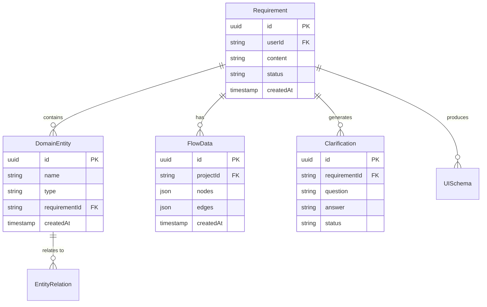

# API 规格补充说明

**项目**: vibex-page-structure-consolidation  
**文档类型**: API 规格详细说明（补充 PRD 缺失）  
**基于**: `src/services/api/` 现有实现 + `docs/api-contract.yaml`  
**日期**: 2026-03-21

---

## 1. 背景与目的

PRD 中的 API 部分仅有端点列表，缺少完整的 request/response schema 定义。本文档补充所有与 **Homepage 五步流程** 相关的 API 详细规格，包含：

- 请求/响应 JSON Schema
- 错误码定义
- SSE 流式接口详细事件格式
- TypeScript 类型引用路径

> **说明**：核心 API（认证、项目管理等）已在 `docs/api-contract.yaml` 中定义，本文聚焦 **Homepage 分析流程** 专用 API。

---

## 2. 通用规范

### 2.1 基础配置

| 项目 | 值 |
|------|-----|
| Base URL | `/api` |
| 认证方式 | Bearer Token (`Authorization: Bearer <token>`) |
| Content-Type | `application/json` |
| 编码 | UTF-8 |

### 2.2 响应包装格式

所有 REST 响应均为统一包装格式：

```typescript
// 成功响应
{
  success: true,
  data: T,           // 实际数据字段（如 requirement, requirements, domainEntities）
  timestamp: string  // ISO 8601 时间戳
}

// 失败响应
{
  success: false,
  error: string,     // 人类可读错误消息
  code: string,      // 错误码（见 2.3）
  details?: object   // 可选：字段级错误详情
}
```

### 2.3 错误码

| 错误码 | HTTP Status | 说明 |
|--------|-------------|------|
| `AUTH_001` | 401 | 未认证或 Token 过期 |
| `AUTH_002` | 403 | 无权限访问该资源 |
| `VALIDATION_001` | 400 | 请求参数格式错误 |
| `VALIDATION_002` | 400 | 必填字段缺失 |
| `NOT_FOUND_001` | 404 | 资源不存在 |
| `NOT_FOUND_002` | 404 | 关联资源不存在（如 requirementId 不存在） |
| `CONFLICT_001` | 409 | 资源已存在（创建时唯一键冲突） |
| `SERVER_001` | 500 | 服务器内部错误 |
| `SERVER_002` | 503 | 服务暂时不可用（上游依赖故障） |

---

## 3. Requirements API（需求管理）

### 3.1 获取需求列表

```
GET /api/requirements
```

**Query Parameters**:

| 参数 | 类型 | 必填 | 说明 |
|------|------|------|------|
| `userId` | `string` (uuid) | 是 | 用户 ID |
| `page` | `number` | 否 | 页码，默认 1 |
| `pageSize` | `number` | 否 | 每页数量，默认 20 |

**成功响应** (`200 OK`):

```json
{
  "success": true,
  "data": {
    "requirements": [
      {
        "id": "550e8400-e29b-41d4-a716-446655440000",
        "userId": "user-uuid",
        "content": "我要一个电商平台",
        "templateId": null,
        "status": "completed",
        "analysisResult": null,
        "createdAt": "2026-03-21T00:00:00.000Z",
        "updatedAt": "2026-03-21T01:00:00.000Z"
      }
    ],
    "total": 42,
    "page": 1,
    "pageSize": 20
  }
}
```

### 3.2 获取单个需求

```
GET /api/requirements/{requirementId}
```

**Path Parameters**:

| 参数 | 类型 | 必填 | 说明 |
|------|------|------|------|
| `requirementId` | `string` (uuid) | 是 | 需求 ID |

**成功响应** (`200 OK`):

```json
{
  "success": true,
  "data": {
    "requirement": {
      "id": "550e8400-e29b-41d4-a716-446655440000",
      "userId": "user-uuid",
      "content": "我要一个电商平台",
      "templateId": null,
      "status": "completed",
      "analysisResult": {
        "requirementId": "550e8400-e29b-41d4-a716-446655440000",
        "domains": [],
        "relations": [],
        "uiSchema": null,
        "confidence": 0.92,
        "analyzedAt": "2026-03-21T01:00:00.000Z"
      },
      "createdAt": "2026-03-21T00:00:00.000Z",
      "updatedAt": "2026-03-21T01:00:00.000Z"
    }
  }
}
```

### 3.3 创建需求

```
POST /api/requirements
```

**Request Body**:

```json
{
  "content": "我要一个电商平台，支持商品展示、购物车、订单管理",
  "templateId": "tpl-e-commerce-001",
  "userId": "user-uuid"
}
```

| 字段 | 类型 | 必填 | 说明 |
|------|------|------|------|
| `content` | `string` | 是 | 需求描述，1-5000 字符 |
| `templateId` | `string` | 否 | 模板 ID |
| `userId` | `string` (uuid) | 是 | 用户 ID |

**成功响应** (`201 Created`):

```json
{
  "success": true,
  "data": {
    "requirement": {
      "id": "550e8400-e29b-41d4-a716-446655440000",
      "userId": "user-uuid",
      "content": "我要一个电商平台，支持商品展示、购物车、订单管理",
      "templateId": "tpl-e-commerce-001",
      "status": "draft",
      "analysisResult": null,
      "createdAt": "2026-03-21T00:00:00.000Z",
      "updatedAt": "2026-03-21T00:00:00.000Z"
    }
  }
}
```

### 3.4 更新需求

```
PUT /api/requirements/{requirementId}
```

**Request Body** (Partial):

```json
{
  "content": "更新后的需求描述",
  "status": "clarifying"
}
```

**成功响应** (`200 OK`): 同 3.2 结构

### 3.5 删除需求

```
DELETE /api/requirements/{requirementId}?userId={userId}
```

**成功响应** (`200 OK`):

```json
{
  "success": true
}
```

### 3.6 触发需求分析

```
POST /api/requirements/{requirementId}/analyze
```

触发 AI 后端对需求进行完整分析，生成领域实体、关系和 UI Schema。

**成功响应** (`200 OK`):

```json
{
  "success": true,
  "data": {
    "requirement": {
      "id": "550e8400-e29b-41d4-a716-446655440000",
      "status": "completed",
      "analysisResult": {
        "requirementId": "550e8400-e29b-41d4-a716-446655440000",
        "domains": [
          {
            "id": "dom-001",
            "name": "ProductCatalog",
            "entities": ["Product", "Category", "Brand"],
            "description": "商品目录管理"
          }
        ],
        "relations": [],
        "uiSchema": null,
        "confidence": 0.92,
        "analyzedAt": "2026-03-21T01:00:00.000Z"
      }
    }
  }
}
```

### 3.7 重新分析

```
POST /api/requirements/{requirementId}/reanalyze
```

**Request Body** (可选):

```json
{
  "context": {
    "focus": "optimize_for_mobile"
  }
}
```

**成功响应**: 同 3.6

### 3.8 获取分析结果

```
GET /api/requirements/{requirementId}/analysis
```

**成功响应** (`200 OK`):

```json
{
  "success": true,
  "data": {
    "analysisResult": {
      "requirementId": "550e8400-e29b-41d4-a716-446655440000",
      "domains": [],
      "relations": [],
      "uiSchema": null,
      "confidence": 0.92,
      "analyzedAt": "2026-03-21T01:00:00.000Z"
    }
  }
}
```

---

## 4. Clarification API（需求澄清）

Clarification 属于 Design 流程核心功能，评估结论为 **KEEP**（保留 `/design/clarification` 独立路由），但 Homepage 需要支持数据互通。

### 4.1 获取澄清列表

```
GET /api/requirements/{requirementId}/clarifications
```

**成功响应** (`200 OK`):

```json
{
  "success": true,
  "data": {
    "clarifications": [
      {
        "id": "clar-001",
        "requirementId": "550e8400-e29b-41d4-a716-446655440000",
        "question": "需要支持哪些支付方式？",
        "answer": "支付宝和微信支付",
        "status": "answered",
        "priority": "high",
        "createdAt": "2026-03-21T00:30:00.000Z"
      }
    ]
  }
}
```

### 4.2 回答澄清

```
PUT /api/clarifications/{clarificationId}
```

**Request Body**:

```json
{
  "answer": "支付宝和微信支付"
}
```

**成功响应** (`200 OK`):

```json
{
  "success": true,
  "data": {
    "clarification": {
      "id": "clar-001",
      "requirementId": "550e8400-e29b-41d4-a716-446655440000",
      "question": "需要支持哪些支付方式？",
      "answer": "支付宝和微信支付",
      "status": "answered",
      "priority": "high",
      "createdAt": "2026-03-21T00:30:00.000Z"
    }
  }
}
```

### 4.3 跳过澄清

```
PUT /api/clarifications/{clarificationId}
```

**Request Body**:

```json
{
  "status": "skipped"
}
```

**成功响应** (`200 OK`): 同 4.2

---

## 5. Domain Entity API（领域实体）

### 5.1 获取领域实体列表

```
GET /api/domain-entities?requirementId={requirementId}
```

**成功响应** (`200 OK`):

```json
{
  "success": true,
  "data": {
    "domainEntities": [
      {
        "id": "ent-001",
        "name": "Product",
        "type": "entity",
        "attributes": [
          { "name": "id", "type": "string", "required": true },
          { "name": "name", "type": "string", "required": true },
          { "name": "price", "type": "number", "required": true },
          { "name": "description", "type": "string", "required": false }
        ],
        "relations": [
          { "target": "Category", "type": "association", "description": "属于分类" }
        ],
        "requirementId": "550e8400-e29b-41d4-a716-446655440000",
        "createdAt": "2026-03-21T00:45:00.000Z",
        "updatedAt": "2026-03-21T00:45:00.000Z"
      }
    ]
  }
}
```

### 5.2 创建领域实体

```
POST /api/requirements/{requirementId}/domains
```

**Request Body**:

```json
{
  "name": "Product",
  "type": "entity",
  "attributes": [
    { "name": "id", "type": "string", "required": true },
    { "name": "name", "type": "string", "required": true }
  ],
  "relations": []
}
```

**成功响应** (`201 Created`):

```json
{
  "success": true,
  "data": {
    "domain": {
      "id": "ent-001",
      "name": "Product",
      "type": "entity",
      "attributes": [],
      "relations": [],
      "requirementId": "550e8400-e29b-41d4-a716-446655440000",
      "createdAt": "2026-03-21T00:45:00.000Z",
      "updatedAt": "2026-03-21T00:45:00.000Z"
    }
  }
}
```

### 5.3 更新领域实体

```
PUT /api/domains/{entityId}
```

**Request Body** (Partial):

```json
{
  "name": "UpdatedProduct",
  "attributes": [
    { "name": "id", "type": "string", "required": true },
    { "name": "name", "type": "string", "required": true },
    { "name": "stock", "type": "number", "required": false }
  ]
}
```

### 5.4 删除领域实体

```
DELETE /api/domains/{entityId}
```

---

## 6. Flow API（业务流程）

### 6.1 获取流程

```
GET /api/flows/{flowId}
```

**成功响应** (`200 OK`):

```json
{
  "success": true,
  "data": {
    "id": "flow-001",
    "name": "用户下单流程",
    "nodes": [
      {
        "id": "node-1",
        "type": "custom",
        "position": { "x": 100, "y": 200 },
        "data": {
          "label": "选择商品",
          "actor": "用户",
          "action": "选择商品并加入购物车",
          "result": "商品进入购物车"
        }
      }
    ],
    "edges": [
      {
        "id": "edge-1",
        "source": "node-1",
        "target": "node-2",
        "label": "加入成功"
      }
    ],
    "projectId": "proj-001",
    "createdAt": "2026-03-21T00:50:00.000Z",
    "updatedAt": "2026-03-21T00:50:00.000Z"
  }
}
```

> **注意**：前端使用 `reactflow` 的 `Node` / `Edge` 类型，与架构文档中的 Mermaid 格式不同。API 层需兼容 ReactFlow 格式。

### 6.2 更新流程

```
PUT /api/flows/{flowId}
```

**Request Body** (Partial):

```json
{
  "nodes": [...],
  "edges": [...],
  "name": "更新后的流程名"
}
```

### 6.3 AI 生成流程

```
POST /api/flows/generate
```

触发 AI 生成业务流程图。

**Request Body**:

```json
{
  "description": "用户注册、下单、支付的完整电商流程"
}
```

**成功响应** (`200 OK`):

```json
{
  "success": true,
  "data": {
    "id": "flow-ai-001",
    "name": "AI生成流程",
    "nodes": [...],
    "edges": [...],
    "projectId": "proj-001",
    "createdAt": "2026-03-21T01:00:00.000Z"
  }
}
```

### 6.4 删除流程

```
DELETE /api/flows/{flowId}
```

---

## 7. UI Schema API（UI 生成）

UI Generation 属于 Design 流程核心功能，评估结论为 **KEEP**（保留 `/design/ui-generation` 独立路由）。

### 7.1 获取 UI Schema

```
GET /api/requirements/{requirementId}/ui-schema
```

**成功响应** (`200 OK`):

```json
{
  "success": true,
  "data": {
    "uiSchema": {
      "version": "1.0",
      "pages": [
        {
          "id": "page-001",
          "name": "商品列表页",
          "route": "/products",
          "components": [
            {
              "id": "comp-001",
              "type": "list",
              "props": {
                "dataSource": "products",
                "layout": "grid",
                "columns": 3
              }
            }
          ],
          "layout": {
            "type": "single",
            "sections": [
              { "id": "sec-001", "components": ["comp-001"], "ratio": 1 }
            ]
          }
        }
      ],
      "theme": {
        "colors": {
          "primary": "#3B82F6",
          "secondary": "#8B5CF6",
          "background": "#FFFFFF",
          "surface": "#F9FAFB",
          "text": "#111827",
          "border": "#E5E7EB"
        },
        "typography": {
          "fontFamily": "Inter, system-ui, sans-serif",
          "fontSize": { "sm": "14px", "base": "16px", "lg": "18px" },
          "fontWeight": { "normal": 400, "medium": 500, "bold": 700 },
          "lineHeight": { "tight": 1.25, "normal": 1.5 }
        },
        "spacing": { "unit": 4, "scale": [0, 4, 8, 16, 24, 32, 48, 64] },
        "responsive": {
          "breakpoints": { "sm": 640, "md": 768, "lg": 1024, "xl": 1280 }
        }
      }
    }
  }
}
```

---

## 8. SSE 流式接口（可选）

### 8.1 澄清对话流

```
POST /api/clarify/chat
```

**Request Body**:

```json
{
  "message": "我要一个电商平台",
  "history": [],
  "context": {
    "requirementId": "550e8400-e29b-41d4-a716-446655440000",
    "projectType": "ecommerce"
  }
}
```

**SSE 响应事件流**:

```
event: thinking
data: {"type":"thinking","content":"正在分析需求..."}

event: clarification
data: {"type":"clarification","question":"需要支持哪些支付方式？","priority":"high","id":"clar-001"}

event: suggestion
data: {"type":"suggestion","quickReplies":["支付宝","微信支付","银行卡","全部支持"]}

event: complete
data: {"type":"complete","completeness":65,"nextAction":"gather_more_info"}
```

---

## 9. 数据模型关系图



---

## 10. API 与 Homepage 步骤映射

| Homepage 步骤 | 调用的 API | 关键操作 |
|---------------|-----------|----------|
| **Step 1: 需求输入** | `POST /requirements` | 创建需求 |
| **Step 1: 需求输入** | `POST /requirements/:id/analyze` | 触发分析 |
| **Step 2: 限界上下文** | `GET /domain-entities` | 获取上下文列表 |
| **Step 2: 限界上下文** | `POST /requirements/:id/domains` | 创建上下文 |
| **Step 3: 澄清（可选）** | `GET /requirements/:id/clarifications` | 获取澄清问题 |
| **Step 3: 澄清（可选）** | `PUT /clarifications/:id` | 回答/跳过澄清 |
| **Step 4: 领域模型** | `GET /domain-entities` | 获取实体列表 |
| **Step 4: 领域模型** | `PUT /domains/:id` | 更新实体 |
| **Step 5: 业务流程** | `GET /flows/:id` | 获取流程 |
| **Step 5: 业务流程** | `POST /flows/generate` | AI 生成流程 |
| **Design 步骤（保留）** | `GET /requirements/:id/ui-schema` | 获取 UI Schema |

---

*补充人: Architect Agent | 2026-03-21*
