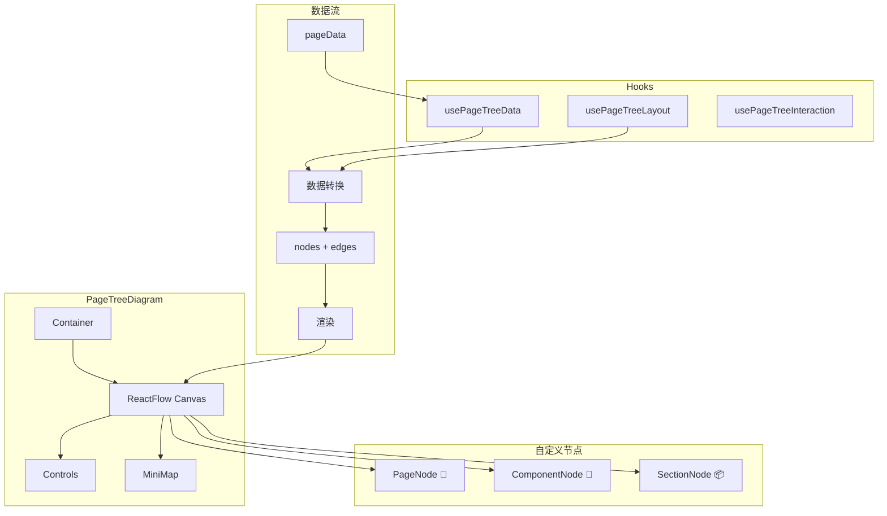
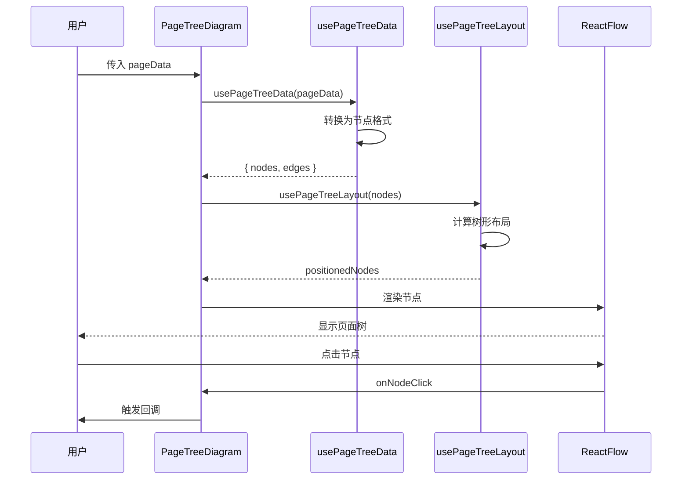
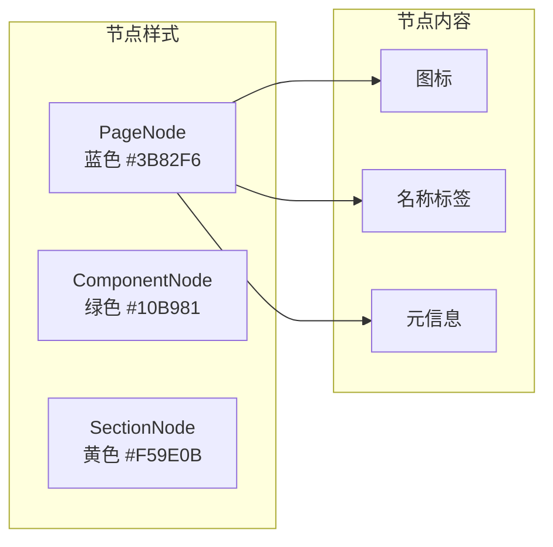

# 页面树节点组件图架构设计

**项目**: vibex-page-tree-diagram  
**版本**: v1.0  
**日期**: 2026-03-14  
**架构师**: architect

---

## 1. Tech Stack

### 技术选型

| 组件 | 选择 | 版本 | 理由 |
|------|------|------|------|
| 流程图库 | ReactFlow | ^11.11.4 | 已安装，性能优秀 |
| 语言 | TypeScript | 5.x | 类型安全 |
| 样式 | CSS Modules | - | 局部作用域 |
| 数据转换 | 自研 Hook | - | 灵活可控 |

---

## 2. Architecture Diagram

### 2.1 组件架构



### 2.2 数据流转



### 2.3 节点类型设计



---

## 3. API Definitions

### 3.1 主组件 Props

```typescript
// components/PageTreeDiagram/index.tsx
import { ReactFlowProvider } from 'reactflow'
import type { Node, Edge } from 'reactflow'

export interface PageData {
  id: string
  name: string
  type: 'page' | 'component' | 'section'
  path: string
  children?: PageData[]
  meta?: Record<string, unknown>
}

export interface PageTreeDiagramProps {
  /** 页面树数据 */
  data: PageData[]
  
  /** 选中的节点 ID */
  selectedId?: string
  
  /** 节点点击回调 */
  onNodeClick?: (node: PageData) => void
  
  /** 画布高度 */
  height?: number | string
  
  /** 是否显示小地图 */
  showMinimap?: boolean
  
  /** 是否显示控制按钮 */
  showControls?: boolean
  
  /** 自定义样式类名 */
  className?: string
}

export function PageTreeDiagram({
  data,
  selectedId,
  onNodeClick,
  height = 600,
  showMinimap = true,
  showControls = true,
  className,
}: PageTreeDiagramProps) {
  const { nodes, edges } = usePageTreeData(data)
  const positionedNodes = usePageTreeLayout(nodes)
  
  const handleNodeClick = (_: React.MouseEvent, node: Node) => {
    const pageData = data.find(p => p.id === node.id)
    if (pageData) {
      onNodeClick?.(pageData)
    }
  }

  return (
    <div 
      className={`page-tree-diagram ${className || ''}`}
      style={{ height }}
    >
      <ReactFlowProvider>
        <ReactFlow
          nodes={positionedNodes}
          edges={edges}
          onNodeClick={handleNodeClick}
          fitView
          nodesDraggable={false}
          nodesConnectable={false}
          elementsSelectable
        >
          {showControls && <Controls />}
          {showMinimap && <MiniMap />}
        </ReactFlow>
      </ReactFlowProvider>
    </div>
  )
}
```

### 3.2 usePageTreeData Hook

```typescript
// hooks/usePageTreeData.ts
import { useMemo } from 'react'
import type { Node, Edge } from 'reactflow'
import type { PageData } from '@/components/PageTreeDiagram'

interface UsePageTreeDataReturn {
  nodes: Node[]
  edges: Edge[]
}

export function usePageTreeData(data: PageData[]): UsePageTreeDataReturn {
  return useMemo(() => {
    const nodes: Node[] = []
    const edges: Edge[] = []
    
    const traverse = (items: PageData[], parentId?: string) => {
      items.forEach((item, index) => {
        // 创建节点
        nodes.push({
          id: item.id,
          type: item.type === 'page' ? 'pageNode' : 
                item.type === 'component' ? 'componentNode' : 'sectionNode',
          data: {
            name: item.name,
            path: item.path,
            meta: item.meta,
          },
          position: { x: 0, y: 0 }, // 布局 Hook 会计算
        })
        
        // 创建边
        if (parentId) {
          edges.push({
            id: `edge-${parentId}-${item.id}`,
            source: parentId,
            target: item.id,
            type: 'smoothstep',
            animated: false,
          })
        }
        
        // 递归处理子节点
        if (item.children?.length) {
          traverse(item.children, item.id)
        }
      })
    }
    
    traverse(data)
    
    return { nodes, edges }
  }, [data])
}
```

### 3.3 usePageTreeLayout Hook

```typescript
// hooks/usePageTreeLayout.ts
import { useMemo } from 'react'
import type { Node } from 'reactflow'

const NODE_WIDTH = 200
const NODE_HEIGHT = 60
const HORIZONTAL_GAP = 50
const VERTICAL_GAP = 30

export function usePageTreeLayout(nodes: Node[]): Node[] {
  return useMemo(() => {
    if (nodes.length === 0) return nodes
    
    // 构建树形结构索引
    const nodeMap = new Map<string, Node>()
    const childrenMap = new Map<string, string[]>()
    let rootId: string | null = null
    
    nodes.forEach(node => {
      nodeMap.set(node.id, node)
    })
    
    // 计算每个节点的子节点
    nodes.forEach(node => {
      const parentId = node.id.split('/').slice(0, -1).join('/') || null
      if (parentId && nodeMap.has(parentId)) {
        const children = childrenMap.get(parentId) || []
        children.push(node.id)
        childrenMap.set(parentId, children)
      } else if (!parentId) {
        rootId = node.id
      }
    })
    
    // 如果没有明确的根节点，使用第一个节点
    if (!rootId && nodes.length > 0) {
      rootId = nodes[0].id
    }
    
    // 计算布局
    const positionedNodes: Node[] = []
    let currentY = 0
    
    const layoutNode = (nodeId: string, depth: number): number => {
      const node = nodeMap.get(nodeId)
      if (!node) return 0
      
      const children = childrenMap.get(nodeId) || []
      let height = NODE_HEIGHT
      
      if (children.length > 0) {
        // 有子节点：子节点在下方
        let childHeight = 0
        children.forEach(childId => {
          childHeight += layoutNode(childId, depth + 1)
        })
        height = Math.max(NODE_HEIGHT, childHeight)
      }
      
      const x = depth * (NODE_WIDTH + HORIZONTAL_GAP)
      const y = currentY
      currentY += height + VERTICAL_GAP
      
      positionedNodes.push({
        ...node,
        position: { x, y },
      })
      
      return height
    }
    
    if (rootId) {
      layoutNode(rootId, 0)
    }
    
    return positionedNodes
  }, [nodes])
}
```

### 3.4 自定义节点

```typescript
// components/PageTreeDiagram/nodes/PageNode.tsx
import { memo } from 'react'
import { Handle, Position } from 'reactflow'
import styles from './PageNode.module.css'

interface PageNodeProps {
  data: {
    name: string
    path: string
    meta?: Record<string, unknown>
  }
  selected?: boolean
}

export const PageNode = memo(({ data, selected }: PageNodeProps) => {
  return (
    <div className={`${styles.container} ${selected ? styles.selected : ''}`}>
      <Handle type="target" position={Position.Left} />
      
      <div className={styles.header}>
        <span className={styles.icon}>📄</span>
        <span className={styles.name}>{data.name}</span>
      </div>
      
      <div className={styles.path}>{data.path}</div>
      
      <Handle type="source" position={Position.Right} />
    </div>
  )
})

PageNode.displayName = 'PageNode'
```

```css
/* components/PageTreeDiagram/nodes/PageNode.module.css */
.container {
  background: #ffffff;
  border: 2px solid #3b82f6;
  border-radius: 8px;
  padding: 8px 12px;
  min-width: 180px;
  box-shadow: 0 2px 4px rgba(0, 0, 0, 0.1);
}

.container.selected {
  border-color: #1d4ed8;
  box-shadow: 0 0 0 2px rgba(59, 130, 246, 0.3);
}

.header {
  display: flex;
  align-items: center;
  gap: 8px;
}

.icon {
  font-size: 16px;
}

.name {
  font-weight: 600;
  color: #1e40af;
}

.path {
  font-size: 11px;
  color: #6b7280;
  margin-top: 4px;
}
```

```typescript
// components/PageTreeDiagram/nodes/ComponentNode.tsx
import { memo } from 'react'
import { Handle, Position } from 'reactflow'
import styles from './ComponentNode.module.css'

export const ComponentNode = memo(({ data, selected }) => {
  return (
    <div className={`${styles.container} ${selected ? styles.selected : ''}`}>
      <Handle type="target" position={Position.Left} />
      
      <div className={styles.header}>
        <span className={styles.icon}>🧩</span>
        <span className={styles.name}>{data.name}</span>
      </div>
      
      <Handle type="source" position={Position.Right} />
    </div>
  )
})

ComponentNode.displayName = 'ComponentNode'
```

```typescript
// components/PageTreeDiagram/nodes/SectionNode.tsx
import { memo } from 'react'
import { Handle, Position } from 'reactflow'
import styles from './SectionNode.module.css'

export const SectionNode = memo(({ data, selected }) => {
  return (
    <div className={`${styles.container} ${selected ? styles.selected : ''}`}>
      <Handle type="target" position={Position.Left} />
      
      <div className={styles.header}>
        <span className={styles.icon}>📦</span>
        <span className={styles.name}>{data.name}</span>
      </div>
      
      <Handle type="source" position={Position.Right} />
    </div>
  )
})

SectionNode.displayName = 'SectionNode'
```

---

## 4. Data Model

### 4.1 页面数据结构

```typescript
// types/page-tree.ts

/** 页面树节点 */
interface PageTreeNode {
  /** 节点唯一标识 */
  id: string
  
  /** 节点名称 */
  name: string
  
  /** 节点类型 */
  type: 'page' | 'component' | 'section'
  
  /** 路由路径 */
  path: string
  
  /** 子节点 */
  children?: PageTreeNode[]
  
  /** 扩展元数据 */
  meta?: {
    /** 是否为首页 */
    isHome?: boolean
    
    /** 是否需要登录 */
    requiresAuth?: boolean
    
    /** 最后更新时间 */
    updatedAt?: string
    
    /** 其他自定义字段 */
    [key: string]: unknown
  }
}

/** ReactFlow 节点数据 */
interface PageNodeData {
  name: string
  path: string
  meta?: Record<string, unknown>
}

/** 布局计算结果 */
interface LayoutResult {
  nodeId: string
  x: number
  y: number
  width: number
  height: number
  depth: number
}
```

---

## 5. Testing Strategy

### 5.1 单元测试

```typescript
// __tests__/hooks/usePageTreeData.test.ts
import { describe, it, expect } from 'vitest'
import { renderHook } from '@testing-library/react'
import { usePageTreeData } from '@/hooks/usePageTreeData'

describe('usePageTreeData', () => {
  it('should convert page data to nodes and edges', () => {
    const data = [
      {
        id: 'page-1',
        name: 'Home',
        type: 'page' as const,
        path: '/',
        children: [
          {
            id: 'comp-1',
            name: 'Header',
            type: 'component' as const,
            path: '/components/Header',
          },
        ],
      },
    ]

    const { result } = renderHook(() => usePageTreeData(data))

    expect(result.current.nodes).toHaveLength(2)
    expect(result.current.edges).toHaveLength(1)
    expect(result.current.edges[0].source).toBe('page-1')
    expect(result.current.edges[0].target).toBe('comp-1')
  })

  it('should create correct node types', () => {
    const data = [
      { id: '1', name: 'Page', type: 'page', path: '/page' },
      { id: '2', name: 'Component', type: 'component', path: '/comp' },
      { id: '3', name: 'Section', type: 'section', path: '/section' },
    ]

    const { result } = renderHook(() => usePageTreeData(data))

    expect(result.current.nodes[0].type).toBe('pageNode')
    expect(result.current.nodes[1].type).toBe('componentNode')
    expect(result.current.nodes[2].type).toBe('sectionNode')
  })
})
```

### 5.2 组件测试

```typescript
// __tests__/components/PageTreeDiagram.test.tsx
import { render, screen } from '@testing-library/react'
import { PageTreeDiagram } from '@/components/PageTreeDiagram'

const mockData = [
  {
    id: 'page-1',
    name: 'Dashboard',
    type: 'page' as const,
    path: '/dashboard',
    children: [
      {
        id: 'comp-1',
        name: 'Header',
        type: 'component' as const,
        path: '/components/Header',
      },
    ],
  },
]

describe('PageTreeDiagram', () => {
  it('should render nodes', () => {
    render(<PageTreeDiagram data={mockData} />)
    
    expect(screen.getByText('Dashboard')).toBeInTheDocument()
    expect(screen.getByText('Header')).toBeInTheDocument()
  })

  it('should show minimap by default', () => {
    const { container } = render(<PageTreeDiagram data={mockData} />)
    
    expect(container.querySelector('.react-flow__minimap')).toBeInTheDocument()
  })

  it('should hide minimap when showMinimap is false', () => {
    const { container } = render(
      <PageTreeDiagram data={mockData} showMinimap={false} />
    )
    
    expect(container.querySelector('.react-flow__minimap')).not.toBeInTheDocument()
  })
})
```

---

## 6. 实施计划

### Phase 1: 核心组件 (2h)

- [ ] 创建 PageTreeDiagram 主组件
- [ ] 创建 PageNode/ComponentNode/SectionNode
- [ ] CSS 样式

### Phase 2: Hooks (1.5h)

- [ ] 实现 usePageTreeData
- [ ] 实现 usePageTreeLayout
- [ ] 单元测试

### Phase 3: 集成测试 (1h)

- [ ] 组件测试
- [ ] 视觉验证
- [ ] 性能测试

---

## 7. 验收标准

| 标准 | 指标 | 验证方式 |
|------|------|---------|
| 节点渲染 | Page/Component/Section 3种类型 | 组件测试 |
| 布局计算 | 树形布局正确 | 视觉检查 |
| 交互支持 | 点击/缩放/平移 | E2E 测试 |
| 性能 | 100+ 节点 < 500ms | 性能测试 |

---

## 8. 风险评估

| 风险 | 等级 | 缓解措施 |
|------|------|---------|
| 节点过多性能问题 | 低 | 虚拟化渲染 |
| 样式冲突 | 低 | CSS Modules |
| 数据格式不匹配 | 中 | 数据验证 |

---

## 9. 检查清单

- [x] 技术栈选型 (ReactFlow 11.11.4)
- [x] 架构图 (组件 + 数据流 + 节点类型)
- [x] API 定义 (Props + Hooks + Nodes)
- [x] 数据模型 (PageTreeNode)
- [x] 核心实现代码
- [x] 测试策略 (单元 + 组件)
- [x] 实施计划 (3 phases, 4.5h)

---

**产出物**: `docs/vibex-page-tree-diagram/architecture.md`