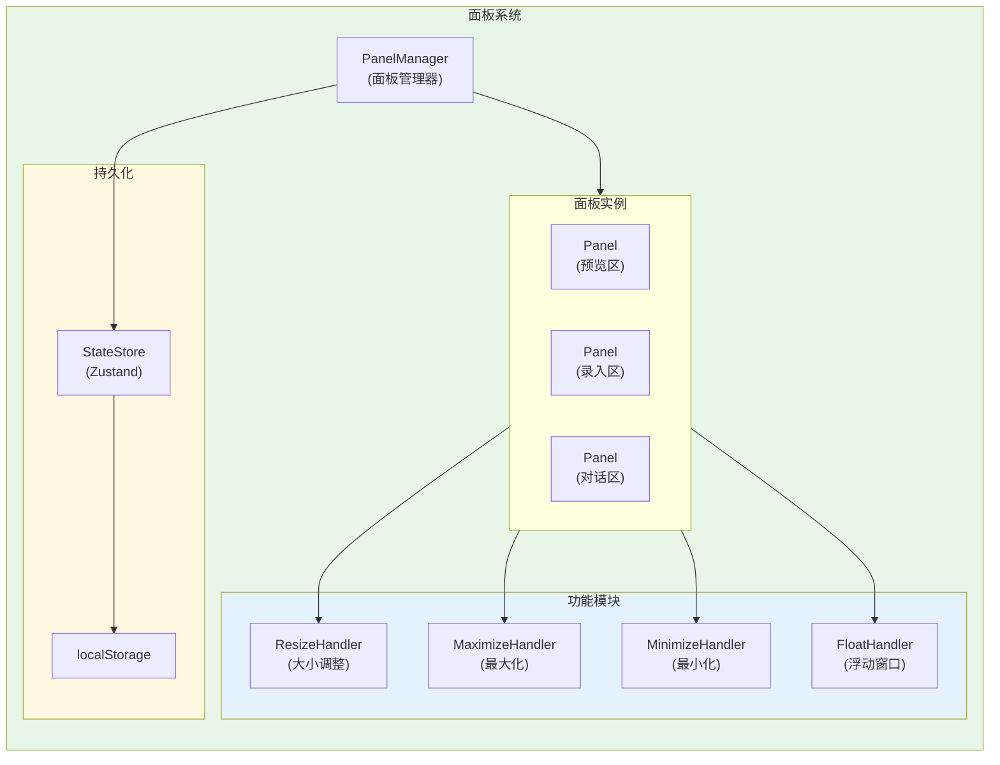
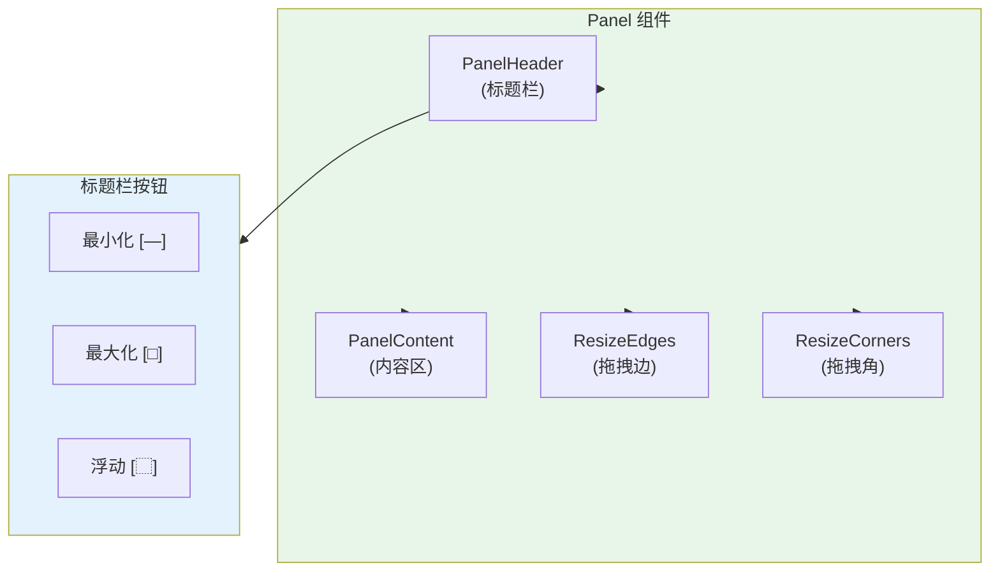
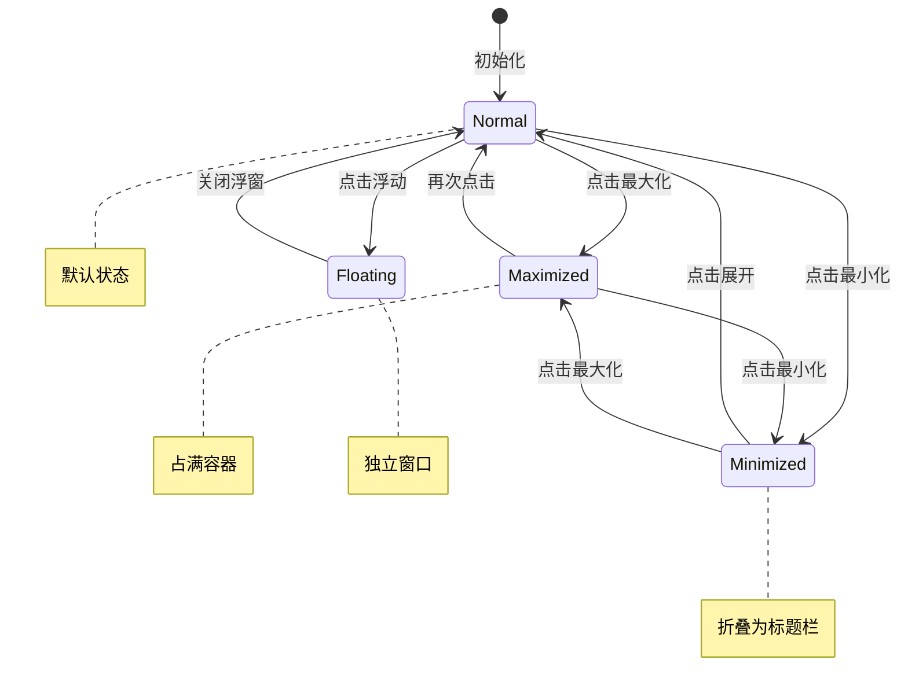
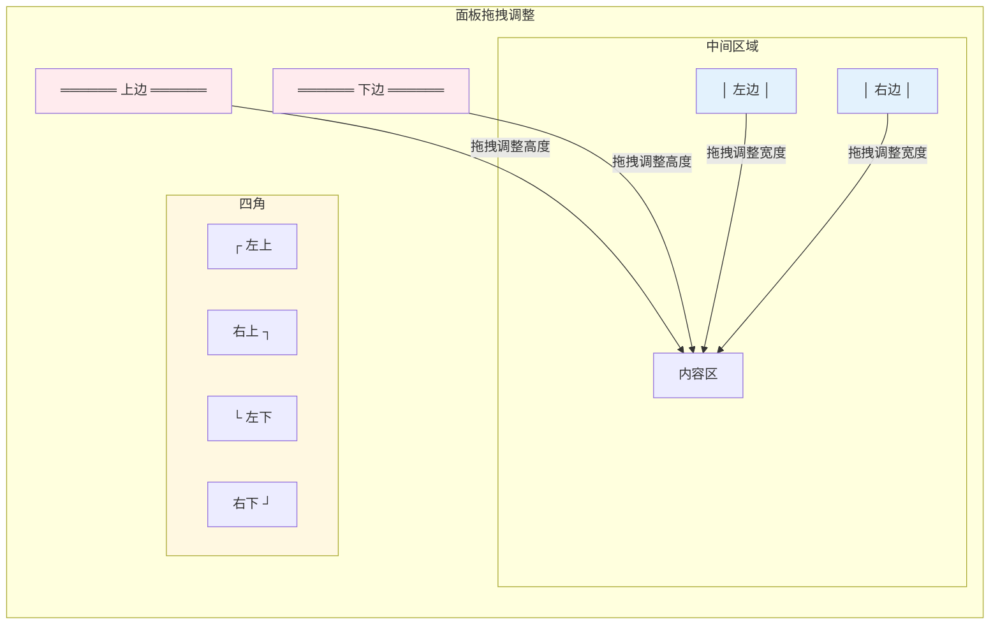

# 架构设计: 面板系统重构

**项目**: vibex-panel-system  
**架构师**: Architect Agent  
**版本**: 1.0  
**日期**: 2026-03-14

---

## 1. 技术栈

| 技术 | 版本 | 用途 | 选择理由 |
|------|------|------|----------|
| React | 19.x | UI 框架 | 已有项目基础 |
| react-resizable-panels | 2.x | 基础布局 | 已安装，支持拖拽 |
| Zustand | 4.x | 状态管理 | 已有项目基础 |
| CSS Modules | - | 样式方案 | 已有样式架构 |
| TypeScript | 5.x | 类型系统 | 已有项目基础 |

---

## 2. 架构图

### 2.1 面板系统架构



### 2.2 单面板结构



### 2.3 面板状态流转



### 2.4 拖拽调整示意



---

## 3. API 定义

### 3.1 Panel 组件接口

```typescript
// components/panel/Panel.tsx

interface PanelProps {
  /** 面板唯一标识 */
  id: string
  /** 面板标题 */
  title: string
  /** 初始大小 */
  defaultSize?: {
    width: number | string   // 像素或百分比
    height: number | string
  }
  /** 最小尺寸 */
  minSize?: {
    width: number   // 像素
    height: number
  }
  /** 最大尺寸 */
  maxSize?: {
    width: number
    height: number
  }
  /** 是否可调整大小 */
  resizable?: boolean
  /** 是否可最大化 */
  maximizable?: boolean
  /** 是否可最小化 */
  minimizable?: boolean
  /** 是否可浮动 */
  floatable?: boolean
  /** 初始状态 */
  initialState?: 'normal' | 'maximized' | 'minimized'
  /** 子组件 */
  children: React.ReactNode
  /** 自定义类名 */
  className?: string
}

export function Panel({
  id,
  title,
  defaultSize,
  minSize = { width: 100, height: 80 },
  maxSize,
  resizable = true,
  maximizable = true,
  minimizable = true,
  floatable = true,
  initialState = 'normal',
  children,
  className,
}: PanelProps): JSX.Element
```

### 3.2 PanelHeader 组件

```typescript
// components/panel/PanelHeader.tsx

interface PanelHeaderProps {
  title: string
  state: 'normal' | 'maximized' | 'minimized' | 'floating'
  maximizable: boolean
  minimizable: boolean
  floatable: boolean
  onMaximize: () => void
  onMinimize: () => void
  onFloat: () => void
  onRestore: () => void
}

export function PanelHeader({
  title,
  state,
  maximizable,
  minimizable,
  floatable,
  onMaximize,
  onMinimize,
  onFloat,
  onRestore,
}: PanelHeaderProps): JSX.Element
```

### 3.3 面板状态 Store

```typescript
// stores/panel-store.ts

import { create } from 'zustand'
import { persist } from 'zustand/middleware'

interface PanelState {
  id: string
  state: 'normal' | 'maximized' | 'minimized' | 'floating'
  size: {
    width: number
    height: number
  }
  position?: {
    x: number
    y: number
  }
}

interface PanelStore {
  // 面板状态映射
  panels: Map<string, PanelState>
  
  // 操作方法
  getPanel: (id: string) => PanelState | undefined
  setPanelState: (id: string, state: PanelState['state']) => void
  setPanelSize: (id: string, size: { width: number; height: number }) => void
  setPanelPosition: (id: string, position: { x: number; y: number }) => void
  resetPanel: (id: string) => void
  resetAll: () => void
}

export const usePanelStore = create<PanelStore>()(
  persist(
    (set, get) => ({
      panels: new Map(),
      
      getPanel: (id) => get().panels.get(id),
      
      setPanelState: (id, state) => set((prev) => {
        const panels = new Map(prev.panels)
        const panel = panels.get(id)
        if (panel) {
          panels.set(id, { ...panel, state })
        }
        return { panels }
      }),
      
      setPanelSize: (id, size) => set((prev) => {
        const panels = new Map(prev.panels)
        const panel = panels.get(id)
        if (panel) {
          panels.set(id, { ...panel, size })
        }
        return { panels }
      }),
      
      setPanelPosition: (id, position) => set((prev) => {
        const panels = new Map(prev.panels)
        const panel = panels.get(id)
        if (panel) {
          panels.set(id, { ...panel, position })
        }
        return { panels }
      }),
      
      resetPanel: (id) => set((prev) => {
        const panels = new Map(prev.panels)
        panels.delete(id)
        return { panels }
      }),
      
      resetAll: () => set({ panels: new Map() }),
    }),
    {
      name: 'vibex-panel-state',
      // 自定义序列化 Map
      storage: {
        getItem: (name) => {
          const str = localStorage.getItem(name)
          if (!str) return null
          const data = JSON.parse(str)
          return {
            ...data,
            state: {
              ...data.state,
              panels: new Map(Object.entries(data.state?.panels || {})),
            },
          }
        },
        setItem: (name, value) => {
          const data = {
            ...value,
            state: {
              ...value.state,
              panels: Object.fromEntries(value.state?.panels || []),
            },
          }
          localStorage.setItem(name, JSON.stringify(data))
        },
        removeItem: (name) => localStorage.removeItem(name),
      },
    }
  )
)
```

### 3.4 拖拽 Hook

```typescript
// hooks/use-panel-resize.ts

interface UsePanelResizeOptions {
  panelId: string
  minWidth: number
  minHeight: number
  maxWidth?: number
  maxHeight?: number
  onResize?: (size: { width: number; height: number }) => void
}

interface ResizeDirection {
  top: boolean
  right: boolean
  bottom: boolean
  left: boolean
}

export function usePanelResize(options: UsePanelResizeOptions) {
  const { panelId, minWidth, minHeight, maxWidth, maxHeight, onResize } = options
  const { setPanelSize } = usePanelStore()
  
  const [isResizing, setIsResizing] = useState(false)
  const [direction, setDirection] = useState<ResizeDirection | null>(null)
  
  const startResize = useCallback((
    e: React.MouseEvent,
    dir: ResizeDirection
  ) => {
    e.preventDefault()
    setIsResizing(true)
    setDirection(dir)
  }, [])
  
  const handleMouseMove = useCallback((e: MouseEvent) => {
    if (!isResizing || !direction) return
    
    // 计算新尺寸
    const delta = { x: e.movementX, y: e.movementY }
    const newSize = calculateNewSize(delta, direction, {
      minWidth, minHeight, maxWidth, maxHeight
    })
    
    setPanelSize(panelId, newSize)
    onResize?.(newSize)
  }, [isResizing, direction, panelId, minWidth, minHeight, maxWidth, maxHeight, setPanelSize, onResize])
  
  const handleMouseUp = useCallback(() => {
    setIsResizing(false)
    setDirection(null)
  }, [])
  
  useEffect(() => {
    if (isResizing) {
      document.addEventListener('mousemove', handleMouseMove)
      document.addEventListener('mouseup', handleMouseUp)
      return () => {
        document.removeEventListener('mousemove', handleMouseMove)
        document.removeEventListener('mouseup', handleMouseUp)
      }
    }
  }, [isResizing, handleMouseMove, handleMouseUp])
  
  return {
    isResizing,
    startResize,
  }
}
```

---

## 4. 数据模型

### 4.1 面板状态模型

```typescript
// types/panel-state.ts

type PanelState = 'normal' | 'maximized' | 'minimized' | 'floating'

interface PanelConfig {
  id: string
  title: string
  initialState: PanelState
  defaultSize: {
    width: number | string
    height: number | string
  }
  minSize: {
    width: number
    height: number
  }
  maxSize?: {
    width: number
    height: number
  }
  features: {
    resizable: boolean
    maximizable: boolean
    minimizable: boolean
    floatable: boolean
  }
}

interface PanelSnapshot {
  id: string
  state: PanelState
  size: { width: number; height: number }
  position?: { x: number; y: number }
  zIndex?: number
  savedAt: string
}
```

### 4.2 浮动窗口模型

```typescript
// types/floating-window.ts

interface FloatingWindow {
  id: string
  panelId: string
  title: string
  position: { x: number; y: number }
  size: { width: number; height: number }
  zIndex: number
  isDragging: boolean
}

interface FloatingWindowStore {
  windows: Map<string, FloatingWindow>
  topZIndex: number
  
  openWindow: (panelId: string, title: string) => void
  closeWindow: (id: string) => void
  moveWindow: (id: string, position: { x: number; y: number }) => void
  bringToFront: (id: string) => void
}
```

---

## 5. 模块划分

### 5.1 文件结构

```
src/
├── components/panel/
│   ├── Panel.tsx               # 面板容器组件
│   ├── Panel.module.css
│   ├── PanelHeader.tsx         # 标题栏
│   ├── PanelHeader.module.css
│   ├── PanelContent.tsx        # 内容区
│   ├── ResizeHandle.tsx        # 拖拽手柄
│   ├── ResizeHandle.module.css
│   ├── FloatingWindow.tsx      # 浮动窗口
│   ├── FloatingWindow.module.css
│   └── index.ts
│
├── stores/
│   ├── panel-store.ts          # 面板状态
│   └── floating-window-store.ts # 浮动窗口状态
│
├── hooks/
│   ├── use-panel-resize.ts     # 拖拽调整
│   ├── use-panel-state.ts      # 面板状态
│   └── use-floating-drag.ts     # 浮动窗口拖拽
│
├── types/
│   ├── panel-state.ts
│   └── floating-window.ts
│
└── utils/
    └── panel-helpers.ts        # 工具函数
```

### 5.2 模块职责

| 模块 | 职责 | 类型 |
|------|------|------|
| Panel | 面板容器，协调子组件 | 组件 |
| PanelHeader | 标题栏 + 操作按钮 | 组件 |
| PanelContent | 内容区包装 | 组件 |
| ResizeHandle | 拖拽手柄 | 组件 |
| FloatingWindow | 浮动窗口容器 | 组件 |
| panel-store | 面板状态管理 | Store |
| floating-window-store | 浮动窗口管理 | Store |
| use-panel-resize | 拖拽逻辑 | Hook |

---

## 6. 核心实现

### 6.1 Panel 组件

```typescript
// components/panel/Panel.tsx

import { usePanelStore } from '@/stores/panel-store'
import { usePanelResize } from '@/hooks/use-panel-resize'
import { PanelHeader } from './PanelHeader'
import { ResizeHandle } from './ResizeHandle'
import styles from './Panel.module.css'

export function Panel({
  id,
  title,
  defaultSize,
  minSize = { width: 100, height: 80 },
  maxSize,
  resizable = true,
  maximizable = true,
  minimizable = true,
  floatable = true,
  initialState = 'normal',
  children,
  className,
}: PanelProps) {
  const { getPanel, setPanelState } = usePanelStore()
  const panelState = getPanel(id)?.state || initialState
  
  const { isResizing, startResize } = usePanelResize({
    panelId: id,
    minWidth: minSize.width,
    minHeight: minSize.height,
    maxWidth: maxSize?.width,
    maxHeight: maxSize?.height,
  })
  
  const handleMaximize = () => {
    setPanelState(id, panelState === 'maximized' ? 'normal' : 'maximized')
  }
  
  const handleMinimize = () => {
    setPanelState(id, panelState === 'minimized' ? 'normal' : 'minimized')
  }
  
  const handleFloat = () => {
    setPanelState(id, 'floating')
  }
  
  const handleRestore = () => {
    setPanelState(id, 'normal')
  }
  
  const panelStyle = useMemo(() => {
    if (panelState === 'maximized') {
      return { width: '100%', height: '100%' }
    }
    if (panelState === 'minimized') {
      return { width: defaultSize?.width || 'auto', height: '40px' }
    }
    return {
      width: defaultSize?.width || 'auto',
      height: defaultSize?.height || 'auto',
    }
  }, [panelState, defaultSize])
  
  return (
    <div
      className={`${styles.panel} ${styles[panelState]} ${className || ''}`}
      style={panelStyle}
    >
      <PanelHeader
        title={title}
        state={panelState}
        maximizable={maximizable}
        minimizable={minimizable}
        floatable={floatable}
        onMaximize={handleMaximize}
        onMinimize={handleMinimize}
        onFloat={handleFloat}
        onRestore={handleRestore}
      />
      
      {panelState !== 'minimized' && (
        <div className={styles.content}>
          {children}
        </div>
      )}
      
      {resizable && panelState === 'normal' && (
        <>
          {/* 四边拖拽手柄 */}
          <ResizeHandle
            direction="top"
            onMouseDown={(e) => startResize(e, { top: true, right: false, bottom: false, left: false })}
          />
          <ResizeHandle
            direction="right"
            onMouseDown={(e) => startResize(e, { top: false, right: true, bottom: false, left: false })}
          />
          <ResizeHandle
            direction="bottom"
            onMouseDown={(e) => startResize(e, { top: false, right: false, bottom: true, left: false })}
          />
          <ResizeHandle
            direction="left"
            onMouseDown={(e) => startResize(e, { top: false, right: false, bottom: false, left: true })}
          />
          
          {/* 四角拖拽手柄 */}
          <ResizeHandle
            direction="top-right"
            onMouseDown={(e) => startResize(e, { top: true, right: true, bottom: false, left: false })}
          />
          <ResizeHandle
            direction="bottom-right"
            onMouseDown={(e) => startResize(e, { top: false, right: true, bottom: true, left: false })}
          />
          <ResizeHandle
            direction="bottom-left"
            onMouseDown={(e) => startResize(e, { top: false, right: false, bottom: true, left: true })}
          />
          <ResizeHandle
            direction="top-left"
            onMouseDown={(e) => startResize(e, { top: true, right: false, bottom: false, left: true })}
          />
        </>
      )}
    </div>
  )
}
```

### 6.2 样式

```css
/* Panel.module.css */

.panel {
  position: relative;
  display: flex;
  flex-direction: column;
  background: rgba(255, 255, 255, 0.03);
  border: 1px solid rgba(255, 255, 255, 0.1);
  border-radius: 8px;
  overflow: hidden;
  transition: all 0.2s ease;
}

.panel.maximized {
  position: fixed;
  top: 0;
  left: 0;
  right: 0;
  bottom: 0;
  z-index: 1000;
  border-radius: 0;
}

.panel.minimized {
  height: 40px !important;
  overflow: hidden;
}

.panel.floating {
  position: fixed;
  z-index: 1001;
  box-shadow: 0 8px 32px rgba(0, 0, 0, 0.3);
}

.content {
  flex: 1;
  overflow: auto;
}

/* ResizeHandle.module.css */

.handle {
  position: absolute;
  background: transparent;
  transition: background 0.2s;
}

.handle:hover {
  background: rgba(59, 130, 246, 0.3);
}

.handle.top,
.handle.bottom {
  left: 0;
  right: 0;
  height: 4px;
  cursor: ns-resize;
}

.handle.top { top: 0; }
.handle.bottom { bottom: 0; }

.handle.left,
.handle.right {
  top: 0;
  bottom: 0;
  width: 4px;
  cursor: ew-resize;
}

.handle.left { left: 0; }
.handle.right { right: 0; }

.handle.corner {
  width: 12px;
  height: 12px;
}

.handle.top-right {
  top: 0;
  right: 0;
  cursor: nesw-resize;
}

.handle.bottom-right {
  bottom: 0;
  right: 0;
  cursor: nwse-resize;
}

.handle.bottom-left {
  bottom: 0;
  left: 0;
  cursor: nesw-resize;
}

.handle.top-left {
  top: 0;
  left: 0;
  cursor: nwse-resize;
}
```

---

## 7. 测试策略

### 7.1 组件测试

```typescript
// __tests__/components/Panel.test.tsx
import { render, screen, fireEvent } from '@testing-library/react'
import { Panel } from '@/components/panel/Panel'

describe('Panel', () => {
  it('renders with title', () => {
    render(
      <Panel id="test" title="Test Panel">
        <div>Content</div>
      </Panel>
    )
    
    expect(screen.getByText('Test Panel')).toBeInTheDocument()
    expect(screen.getByText('Content')).toBeInTheDocument()
  })
  
  it('maximizes on button click', () => {
    render(
      <Panel id="test" title="Test" maximizable>
        <div>Content</div>
      </Panel>
    )
    
    const maxBtn = screen.getByRole('button', { name: /maximize/i })
    fireEvent.click(maxBtn)
    
    const panel = screen.getByTestId('panel')
    expect(panel).toHaveClass('maximized')
  })
  
  it('minimizes on button click', () => {
    render(
      <Panel id="test" title="Test" minimizable>
        <div>Content</div>
      </Panel>
    )
    
    const minBtn = screen.getByRole('button', { name: /minimize/i })
    fireEvent.click(minBtn)
    
    const panel = screen.getByTestId('panel')
    expect(panel).toHaveClass('minimized')
    expect(screen.queryByText('Content')).not.toBeInTheDocument()
  })
})
```

### 7.2 Store 测试

```typescript
// __tests__/stores/panel-store.test.ts
describe('PanelStore', () => {
  it('saves and retrieves panel state', () => {
    const { result } = renderHook(() => usePanelStore())
    
    act(() => {
      result.current.setPanelState('test-panel', 'maximized')
    })
    
    expect(result.current.getPanel('test-panel')?.state).toBe('maximized')
  })
  
  it('persists to localStorage', () => {
    const { result } = renderHook(() => usePanelStore())
    
    act(() => {
      result.current.setPanelSize('test-panel', { width: 500, height: 300 })
    })
    
    const saved = localStorage.getItem('vibex-panel-state')
    expect(saved).toContain('500')
  })
})
```

### 7.3 覆盖率目标

| 模块 | 覆盖率目标 |
|------|-----------|
| Panel | 80% |
| PanelHeader | 85% |
| ResizeHandle | 75% |
| panel-store | 90% |
| use-panel-resize | 80% |

---

## 8. 性能评估

### 8.1 性能指标

| 指标 | 目标值 |
|------|--------|
| 面板渲染 | < 50ms |
| 拖拽响应 | < 16ms (60fps) |
| 状态持久化 | < 5ms |
| 浮动窗口打开 | < 100ms |

### 8.2 性能优化

| 策略 | 实现 |
|------|------|
| 避免重渲染 | React.memo + useMemo |
| 拖拽节流 | requestAnimationFrame |
| 批量状态更新 | Zustand 批量更新 |
| 延迟持久化 | debounce 500ms |

---

## 9. 风险评估

| 风险 | 概率 | 影响 | 缓解措施 |
|------|------|------|----------|
| 浮动窗口兼容性 | 中 | 中 | 降级为内嵌模式 |
| 拖拽性能 | 低 | 中 | 使用 transform 代替 top/left |
| 状态冲突 | 低 | 高 | 面板 ID 唯一性校验 |
| 响应式问题 | 中 | 低 | 设置最小尺寸限制 |

---

## 10. 红线约束遵守

| 约束 | 遵守情况 |
|------|---------|
| 不修改现有组件功能 | ✅ Panel 是新增组件 |
| 不修改现有页面集成 | ✅ 独立组件，不依赖现有代码 |
| 不恢复已删除组件 | ✅ 不涉及 DiagnosisPanel |

---

## 11. 实施计划

| 阶段 | 内容 | 工时 |
|------|------|------|
| Phase 1 | Panel 基础组件 | 1h |
| Phase 2 | PanelHeader + 按钮功能 | 1h |
| Phase 3 | 拖拽调整 (四边+四角) | 1.5h |
| Phase 4 | 最大化/最小化状态 | 1h |
| Phase 5 | 浮动窗口 | 1.5h |
| Phase 6 | 持久化 + 测试 | 0.5h |

**总计**: 6.5h

---

## 12. 检查清单

- [x] 技术栈选型 (react-resizable-panels + Zustand)
- [x] 架构图 (系统架构 + 单面板结构 + 状态流转)
- [x] API 定义 (组件接口 + Store + Hook)
- [x] 数据模型 (面板状态 + 浮动窗口)
- [x] 核心实现 (Panel + 样式)
- [x] 测试策略 (组件 + Store)
- [x] 性能评估
- [x] 风险评估
- [x] 红线约束遵守确认

---

**产出物**: `/root/.openclaw/vibex/docs/vibex-panel-system/architecture.md`