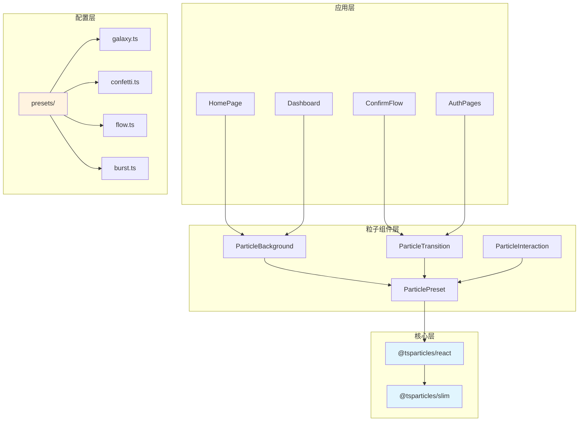
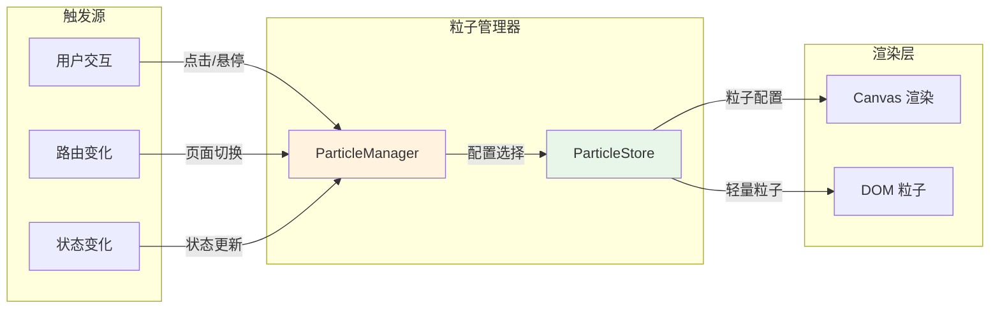
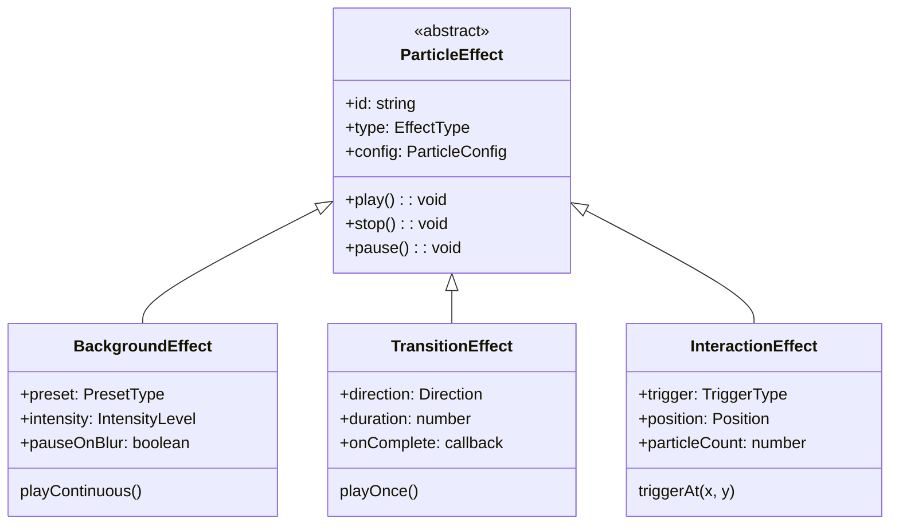

# 架构设计: 粒子特效系统

> **项目**: vibex-particle-effects  
> **版本**: 1.0  
> **架构师**: Architect Agent  
> **日期**: 2026-03-12

---

## 1. 技术栈选型

### 1.1 粒子引擎选型

| 技术 | 版本 | 选型理由 |
|------|------|----------|
| **tsParticles** | 3.x | React 官方支持、60+ 预设、TypeScript 原生、社区活跃 |
| **@tsparticles/react** | 3.x | React 官方组件封装 |
| **@tsparticles/slim** | 3.x | 轻量版核心引擎，减少包体积 |

### 1.2 选型决策矩阵

```
决策因素权重分析:
┌─────────────────┬────────┬────────────┐
│ 因素            │ 权重   │ tsParticles │
├─────────────────┼────────┼────────────┤
│ React 集成      │ 25%    │ ⭐⭐⭐⭐⭐    │
│ 预设效果丰富度   │ 20%    │ ⭐⭐⭐⭐⭐    │
│ TypeScript 支持  │ 15%    │ ⭐⭐⭐⭐⭐    │
│ 性能            │ 20%    │ ⭐⭐⭐⭐      │
│ 包体积          │ 10%    │ ⭐⭐⭐       │
│ 维护状态        │ 10%    │ ⭐⭐⭐⭐⭐    │
├─────────────────┼────────┼────────────┤
│ 加权得分        │ 100%   │ 4.35/5     │
└─────────────────┴────────┴────────────┘
```

### 1.3 备选方案对比

| 方案 | 包体积 | 优势 | 劣势 |
|------|--------|------|------|
| **tsParticles** | ~45KB | 功能全面、社区活跃 | 体积较大 |
| 自研 Canvas | ~10KB | 体积最小、完全可控 | 开发成本高 |
| Canvas Confetti | ~8KB | 轻量、庆祝效果 | 功能单一 |
| Particles.js | ~25KB | 成熟 | 无 TypeScript、停止维护 |

**最终决策**: tsParticles - 平衡功能、开发效率和可维护性

---

## 2. 架构图

### 2.1 组件架构



### 2.2 粒子系统数据流



### 2.3 效果类型层次



---

## 3. 接口定义

### 3.1 核心类型定义

```typescript
// types/particles.ts

/** 粒子效果类型 */
export type ParticleEffectType = 'background' | 'transition' | 'interaction';

/** 预设类型 */
export type PresetType = 'galaxy' | 'confetti' | 'flow' | 'burst' | 'minimal';

/** 强度级别 */
export type IntensityLevel = 'low' | 'medium' | 'high';

/** 过渡方向 */
export type TransitionDirection = 'left' | 'right' | 'up' | 'down' | 'fade';

/** 触发类型 */
export type TriggerType = 'click' | 'hover' | 'focus' | 'success' | 'error';

/** 粒子配置 */
export interface ParticleConfig {
  /** 粒子数量 */
  count?: number;
  /** 颜色配置 */
  colors?: string[];
  /** 大小范围 */
  size?: { min: number; max: number };
  /** 速度范围 */
  speed?: { min: number; max: number };
  /** 生命周期 */
  life?: number;
  /** 形状 */
  shape?: 'circle' | 'square' | 'triangle' | 'star';
  /** 链接配置 */
  links?: {
    enable: boolean;
    color?: string;
    distance?: number;
    opacity?: number;
  };
}

/** 背景粒子 Props */
export interface ParticleBackgroundProps {
  /** 预设效果 */
  preset: PresetType;
  /** 强度级别 */
  intensity?: IntensityLevel;
  /** 是否在离屏时暂停 */
  pauseOnBlur?: boolean;
  /** 自定义配置覆盖 */
  customConfig?: Partial<ParticleConfig>;
  /** CSS 类名 */
  className?: string;
  /** 层级 */
  zIndex?: number;
}

/** 过渡粒子 Props */
export interface ParticleTransitionProps {
  /** 过渡方向 */
  direction: TransitionDirection;
  /** 持续时间(ms) */
  duration?: number;
  /** 完成回调 */
  onComplete?: () => void;
  /** 是否激活 */
  active: boolean;
}

/** 交互粒子 Props */
export interface ParticleInteractionProps {
  /** 触发类型 */
  trigger: TriggerType;
  /** 子元素 */
  children: React.ReactNode;
  /** 粒子数量 */
  particleCount?: number;
  /** 颜色 */
  colors?: string[];
  /** 是否禁用 */
  disabled?: boolean;
}

/** 粒子管理器接口 */
export interface ParticleManager {
  /** 初始化 */
  init(container: HTMLElement): void;
  /** 播放背景效果 */
  playBackground(preset: PresetType, config?: Partial<ParticleConfig>): void;
  /** 播放过渡效果 */
  playTransition(direction: TransitionDirection, onComplete?: () => void): void;
  /** 触发交互效果 */
  triggerInteraction(position: { x: number; y: number }, config?: ParticleConfig): void;
  /** 暂停 */
  pause(): void;
  /** 恢复 */
  resume(): void;
  /** 销毁 */
  destroy(): void;
}
```

### 3.2 预设配置接口

```typescript
// types/presets.ts

/** 完整预设配置 */
export interface PresetConfig {
  id: PresetType;
  name: string;
  description: string;
  config: ISourceOptions;
  thumbnail?: string;
}

/** 预设配置注册表 */
export const presetRegistry: Record<PresetType, PresetConfig> = {
  galaxy: {
    id: 'galaxy',
    name: '星系',
    description: '星系粒子效果，适合首页背景',
    config: { /* ... */ },
  },
  confetti: {
    id: 'confetti',
    name: '庆祝',
    description: '彩色纸屑效果，适合成功反馈',
    config: { /* ... */ },
  },
  flow: {
    id: 'flow',
    name: '流动',
    description: '流动粒子效果，适合进度指示',
    config: { /* ... */ },
  },
  burst: {
    id: 'burst',
    name: '爆发',
    description: '爆发粒子效果，适合按钮交互',
    config: { /* ... */ },
  },
  minimal: {
    id: 'minimal',
    name: '极简',
    description: '极简粒子效果，适合轻量场景',
    config: { /* ... */ },
  },
};
```

### 3.3 Hook 接口

```typescript
// hooks/useParticles.ts

export interface UseParticlesOptions {
  /** 是否自动初始化 */
  autoInit?: boolean;
  /** 默认预设 */
  defaultPreset?: PresetType;
  /** 性能模式 */
  performanceMode?: 'auto' | 'high' | 'low';
}

export interface UseParticlesReturn {
  /** 粒子实例 */
  particles: Particles | null;
  /** 是否已初始化 */
  isInitialized: boolean;
  /** 初始化函数 */
  init: () => Promise<void>;
  /** 播放背景效果 */
  playBackground: (preset: PresetType) => void;
  /** 触发爆发效果 */
  burst: (x: number, y: number, count?: number) => void;
  /** 暂停 */
  pause: () => void;
  /** 恢复 */
  resume: () => void;
}

export function useParticles(options?: UseParticlesOptions): UseParticlesReturn;
```

```typescript
// hooks/useParticleTransition.ts

export interface UseParticleTransitionOptions {
  /** 过渡持续时间 */
  duration?: number;
  /** 是否自动触发 */
  autoTrigger?: boolean;
}

export interface UseParticleTransitionReturn {
  /** 播放过渡 */
  play: (direction?: TransitionDirection) => Promise<void>;
  /** 是否正在播放 */
  isPlaying: boolean;
  /** 过渡组件 */
  TransitionComponent: React.FC<{ active: boolean }>;
}

export function useParticleTransition(
  options?: UseParticleTransitionOptions
): UseParticleTransitionReturn;
```

---

## 4. 组件设计

### 4.1 组件目录结构

```
src/components/effects/
├── index.ts                      # 导出入口
├── ParticleBackground.tsx        # 背景粒子组件
├── ParticleBackground.module.css
├── ParticleTransition.tsx        # 过渡粒子组件
├── ParticleTransition.module.css
├── ParticleInteraction.tsx       # 交互粒子组件
├── ParticleInteraction.module.css
├── ParticleContainer.tsx         # 粒子容器（管理生命周期）
├── presets/
│   ├── index.ts                  # 预设导出
│   ├── galaxy.ts                 # 星系预设
│   ├── confetti.ts               # 庆祝预设
│   ├── flow.ts                   # 流动预设
│   ├── burst.ts                  # 爆发预设
│   └── minimal.ts                # 极简预设
└── hooks/
    ├── useParticles.ts           # 粒子 Hook
    ├── useParticleTransition.ts  # 过渡 Hook
    └── useParticleInteraction.ts # 交互 Hook
```

### 4.2 核心组件实现

#### ParticleBackground

```typescript
// components/effects/ParticleBackground.tsx
import { useCallback, useMemo } from 'react';
import Particles, { initParticlesEngine } from '@tsparticles/react';
import { loadSlim } from '@tsparticles/slim';
import type { ISourceOptions } from '@tsparticles/engine';
import { presetRegistry, IntensityLevel } from '@/types/particles';
import styles from './ParticleBackground.module.css';

interface ParticleBackgroundProps {
  preset: PresetType;
  intensity?: IntensityLevel;
  pauseOnBlur?: boolean;
  customConfig?: Partial<ParticleConfig>;
  className?: string;
  zIndex?: number;
}

const intensityMultiplier: Record<IntensityLevel, number> = {
  low: 0.5,
  medium: 1,
  high: 1.5,
};

export function ParticleBackground({
  preset,
  intensity = 'medium',
  pauseOnBlur = true,
  customConfig,
  className,
  zIndex = 0,
}: ParticleBackgroundProps) {
  const particlesInit = useCallback(async (engine: Engine) => {
    await loadSlim(engine);
  }, []);

  const options: ISourceOptions = useMemo(() => {
    const baseConfig = presetRegistry[preset].config;
    const multiplier = intensityMultiplier[intensity];

    return {
      ...baseConfig,
      particles: {
        ...baseConfig.particles,
        number: {
          value: Math.round((baseConfig.particles?.number?.value ?? 60) * multiplier),
          density: { enable: true, area: 800 },
        },
        ...customConfig,
      },
      pauseOnBlur,
    };
  }, [preset, intensity, customConfig, pauseOnBlur]);

  return (
    <Particles
      id={`particles-${preset}`}
      init={particlesInit}
      options={options}
      className={`${styles.container} ${className ?? ''}`}
      style={{ zIndex }}
    />
  );
}
```

#### ParticleInteraction

```typescript
// components/effects/ParticleInteraction.tsx
import { useRef, useCallback } from 'react';
import { useParticles } from './hooks/useParticles';
import styles from './ParticleInteraction.module.css';

interface ParticleInteractionProps {
  trigger: 'click' | 'hover' | 'success';
  children: React.ReactNode;
  particleCount?: number;
  colors?: string[];
  disabled?: boolean;
}

export function ParticleInteraction({
  trigger,
  children,
  particleCount = 30,
  colors = ['#00d4ff', '#8b5cf6', '#00ff88'],
  disabled = false,
}: ParticleInteractionProps) {
  const containerRef = useRef<HTMLDivElement>(null);
  const { burst } = useParticles();

  const handleInteraction = useCallback(
    (e: React.MouseEvent | React.FocusEvent) => {
      if (disabled) return;

      const rect = containerRef.current?.getBoundingClientRect();
      if (!rect) return;

      const x = 'clientX' in e ? e.clientX : rect.left + rect.width / 2;
      const y = 'clientY' in e ? e.clientY : rect.top + rect.height / 2;

      burst(x, y, particleCount);
    },
    [burst, particleCount, disabled]
  );

  const events = {
    click: { onClick: handleInteraction },
    hover: { onMouseEnter: handleInteraction },
    success: { onAnimationEnd: handleInteraction },
  };

  return (
    <div
      ref={containerRef}
      className={styles.interactionWrapper}
      {...events[trigger]}
    >
      {children}
    </div>
  );
}
```

### 4.3 预设配置实现

```typescript
// components/effects/presets/galaxy.ts
import type { ISourceOptions } from '@tsparticles/engine';

export const galaxyPreset: ISourceOptions = {
  background: {
    color: 'transparent',
  },
  fpsLimit: 60,
  interactivity: {
    events: {
      onHover: {
        enable: true,
        mode: 'grab',
      },
    },
    modes: {
      grab: {
        distance: 140,
        links: {
          opacity: 0.5,
        },
      },
    },
  },
  particles: {
    color: {
      value: ['#00d4ff', '#8b5cf6', '#00ff88'],
    },
    links: {
      color: '#00d4ff',
      distance: 150,
      enable: true,
      opacity: 0.3,
      width: 1,
    },
    move: {
      enable: true,
      speed: 0.5,
      direction: 'none',
      random: true,
      straight: false,
      outModes: {
        default: 'out',
      },
    },
    number: {
      density: {
        enable: true,
        area: 800,
      },
      value: 60,
    },
    opacity: {
      value: {
        min: 0.1,
        max: 0.5,
      },
      animation: {
        enable: true,
        speed: 1,
        sync: false,
      },
    },
    shape: {
      type: 'circle',
    },
    size: {
      value: {
        min: 1,
        max: 3,
      },
    },
  },
  detectRetina: true,
};

// components/effects/presets/burst.ts
export const burstPreset: ISourceOptions = {
  background: {
    color: 'transparent',
  },
  particles: {
    color: {
      value: ['#00d4ff', '#8b5cf6', '#00ff88', '#ffd700', '#ff6b6b'],
    },
    move: {
      enable: true,
      speed: {
        min: 5,
        max: 15,
      },
      direction: 'none',
      random: true,
      straight: false,
      outModes: {
        default: 'destroy',
      },
    },
    number: {
      value: 0, // 动态添加
    },
    opacity: {
      value: 1,
      animation: {
        enable: true,
        speed: 2,
        minimumValue: 0,
        sync: false,
        startValue: 'max',
        destroy: 'min',
      },
    },
    shape: {
      type: ['circle', 'star'],
    },
    size: {
      value: {
        min: 3,
        max: 8,
      },
    },
    life: {
      duration: {
        value: 1,
      },
      count: 1,
    },
  },
  detectRetina: true,
};

// components/effects/presets/confetti.ts
export const confettiPreset: ISourceOptions = {
  background: {
    color: 'transparent',
  },
  particles: {
    color: {
      value: ['#ff0000', '#00ff00', '#0000ff', '#ffff00', '#ff00ff', '#00ffff'],
    },
    move: {
      enable: true,
      speed: {
        min: 10,
        max: 20,
      },
      direction: 'bottom',
      random: true,
      straight: false,
      gravity: {
        enable: true,
        acceleration: 10,
      },
      outModes: {
        default: 'destroy',
      },
    },
    number: {
      value: 100,
    },
    opacity: {
      value: 1,
    },
    shape: {
      type: ['circle', 'square', 'triangle'],
    },
    size: {
      value: {
        min: 5,
        max: 10,
      },
    },
    life: {
      duration: {
        value: 3,
      },
      count: 1,
    },
    tilt: {
      enable: true,
      value: {
        min: 0,
        max: 360,
      },
      animation: {
        enable: true,
        speed: 30,
        sync: false,
      },
    },
    roll: {
      enable: true,
      mode: 'both',
      speed: {
        min: 5,
        max: 15,
      },
    },
  },
  detectRetina: true,
};
```

---

## 5. 性能优化策略

### 5.1 按需加载

```typescript
// 动态导入 tsParticles
const ParticleBackground = dynamic(
  () => import('@/components/effects/ParticleBackground').then((m) => m.ParticleBackground),
  {
    ssr: false,
    loading: () => null,
  }
);
```

### 5.2 移动端降级

```typescript
// hooks/useDeviceCapabilities.ts
export function useDeviceCapabilities() {
  const [capabilities, setCapabilities] = useState({
    isMobile: false,
    prefersReducedMotion: false,
    lowPerformance: false,
  });

  useEffect(() => {
    const isMobile = /Android|webOS|iPhone|iPad|iPod|BlackBerry|IEMobile|Opera Mini/i.test(
      navigator.userAgent
    );
    const prefersReducedMotion = window.matchMedia('(prefers-reduced-motion: reduce)').matches;
    const lowPerformance = isMobile || (navigator.hardwareConcurrency ?? 4) < 4;

    setCapabilities({ isMobile, prefersReducedMotion, lowPerformance });
  }, []);

  return capabilities;
}

// 在组件中应用降级
function ParticleBackground({ preset, intensity, ...props }) {
  const { lowPerformance, prefersReducedMotion } = useDeviceCapabilities();
  
  // 性能降级
  const effectiveIntensity = lowPerformance ? 'low' : intensity;
  
  // 禁用动画偏好
  if (prefersReducedMotion) {
    return null;
  }
  
  return <Particles options={getOptions(preset, effectiveIntensity)} {...props} />;
}
```

### 5.3 离屏暂停

```typescript
// 使用 Page Visibility API 自动暂停
function useVisibilityPause(particles: Particles | null) {
  useEffect(() => {
    const handleVisibilityChange = () => {
      if (!particles) return;
      
      if (document.hidden) {
        particles.pause();
      } else {
        particles.play();
      }
    };

    document.addEventListener('visibilitychange', handleVisibilityChange);
    return () => document.removeEventListener('visibilitychange', handleVisibilityChange);
  }, [particles]);
}
```

### 5.4 FPS 限制

```typescript
// 在预设中配置 FPS 限制
const options: ISourceOptions = {
  fpsLimit: 60, // 限制最大帧率
  // ...
};
```

---

## 6. 测试策略

### 6.1 测试框架

| 工具 | 用途 |
|------|------|
| **Jest** | 单元测试 |
| **React Testing Library** | 组件测试 |
| **Playwright** | E2E 测试（视觉回归） |

### 6.2 覆盖率要求

| 类型 | 目标覆盖率 |
|------|------------|
| 语句覆盖率 | ≥ 80% |
| 分支覆盖率 | ≥ 75% |
| 函数覆盖率 | ≥ 80% |

### 6.3 核心测试用例

#### 组件测试

```typescript
// __tests__/components/ParticleBackground.test.tsx
import { render, screen } from '@testing-library/react';
import { ParticleBackground } from '@/components/effects/ParticleBackground';

// Mock tsParticles
jest.mock('@tsparticles/react', () => ({
  __esModule: true,
  default: () => <div data-testid="particles-mock" />,
}));

describe('ParticleBackground', () => {
  it('应该渲染粒子容器', () => {
    render(<ParticleBackground preset="galaxy" />);
    expect(screen.getByTestId('particles-mock')).toBeInTheDocument();
  });

  it('应该根据强度调整粒子数量', () => {
    const { rerender } = render(<ParticleBackground preset="galaxy" intensity="low" />);
    // 验证低强度配置
    
    rerender(<ParticleBackground preset="galaxy" intensity="high" />);
    // 验证高强度配置
  });

  it('应该在 prefers-reduced-motion 时返回 null', () => {
    // Mock matchMedia
    window.matchMedia = jest.fn().mockReturnValue({ matches: true });
    
    const { container } = render(<ParticleBackground preset="galaxy" />);
    expect(container.firstChild).toBeNull();
  });
});
```

#### Hook 测试

```typescript
// __tests__/hooks/useParticles.test.ts
import { renderHook, act } from '@testing-library/react';
import { useParticles } from '@/components/effects/hooks/useParticles';

describe('useParticles', () => {
  it('应该初始化粒子实例', async () => {
    const { result } = renderHook(() => useParticles());
    
    await act(async () => {
      await result.current.init();
    });
    
    expect(result.current.isInitialized).toBe(true);
  });

  it('应该触发爆发效果', async () => {
    const { result } = renderHook(() => useParticles());
    
    await act(async () => {
      await result.current.init();
    });
    
    act(() => {
      result.current.burst(100, 100, 50);
    });
    
    // 验证粒子被添加
  });
});
```

#### E2E 测试

```typescript
// e2e/particle-effects.spec.ts
import { test, expect } from '@playwright/test';

test.describe('粒子特效系统', () => {
  test('首页应该显示背景粒子', async ({ page }) => {
    await page.goto('/');
    
    // 等待粒子加载
    await page.waitForSelector('#particles-galaxy', { timeout: 5000 });
    
    // 验证 Canvas 元素存在
    const canvas = page.locator('#particles-galaxy canvas');
    await expect(canvas).toBeVisible();
  });

  test('点击按钮应该触发粒子爆发', async ({ page }) => {
    await page.goto('/');
    
    // 点击生成按钮
    await page.click('button:has-text("生成")');
    
    // 验证爆发粒子出现
    const particles = page.locator('.particles-burst');
    await expect(particles).toBeVisible({ timeout: 1000 });
  });

  test('移动端应该使用低强度效果', async ({ page, isMobile }) => {
    if (!isMobile) test.skip();
    
    await page.goto('/');
    
    // 验证粒子数量减少
    const options = await page.evaluate(() => {
      const container = document.querySelector('#particles-galaxy');
      return container?.getAttribute('data-particle-count');
    });
    
    expect(parseInt(options ?? '0')).toBeLessThan(50);
  });
});
```

---

## 7. 集成方案

### 7.1 首页集成

```typescript
// app/page.tsx
import dynamic from 'next/dynamic';
import styles from './page.module.css';

const ParticleBackground = dynamic(
  () => import('@/components/effects/ParticleBackground').then((m) => m.ParticleBackground),
  { ssr: false }
);

export default function HomePage() {
  return (
    <main className={styles.main}>
      <ParticleBackground 
        preset="galaxy" 
        intensity="medium" 
        zIndex={-1}
      />
      
      {/* Hero Section */}
      <section className={styles.hero}>
        {/* ... */}
      </section>
      
      {/* Content */}
    </main>
  );
}
```

### 7.2 按钮交互集成

```typescript
// components/GenerateButton.tsx
import { ParticleInteraction } from '@/components/effects/ParticleInteraction';

export function GenerateButton({ onClick }: { onClick: () => void }) {
  return (
    <ParticleInteraction trigger="click" particleCount={30}>
      <button onClick={onClick} className={styles.button}>
        开始生成
      </button>
    </ParticleInteraction>
  );
}
```

### 7.3 成功反馈集成

```typescript
// components/SuccessFeedback.tsx
import { useEffect, useState } from 'react';
import { ParticleBackground } from '@/components/effects/ParticleBackground';

export function SuccessFeedback({ show, onComplete }: { 
  show: boolean; 
  onComplete: () => void;
}) {
  const [showParticles, setShowParticles] = useState(false);

  useEffect(() => {
    if (show) {
      setShowParticles(true);
      setTimeout(() => {
        setShowParticles(false);
        onComplete();
      }, 3000);
    }
  }, [show, onComplete]);

  if (!showParticles) return null;

  return (
    <div className={styles.overlay}>
      <ParticleBackground preset="confetti" intensity="high" />
      <div className={styles.content}>
        ✅ 操作成功！
      </div>
    </div>
  );
}
```

---

## 8. 风险与缓解

| 风险 | 概率 | 影响 | 缓解措施 |
|------|------|------|----------|
| 包体积过大 | 中 | 中 | 使用 slim 版本、动态导入 |
| 移动端性能 | 中 | 中 | 自动降级、减少粒子数 |
| 与现有特效冲突 | 低 | 低 | z-index 分层管理 |
| 浏览器兼容性 | 低 | 低 | 渐进增强、降级处理 |
| prefers-reduced-motion | 中 | 低 | 尊重用户偏好，禁用动画 |

---

## 9. 总结

### 9.1 关键决策

1. **粒子引擎**: tsParticles (slim 版本) - 平衡功能与体积
2. **组件架构**: 三层设计 - 背景、过渡、交互
3. **性能优化**: 动态加载 + 移动端降级 + 离屏暂停
4. **测试策略**: Jest 单元测试 + Playwright E2E

### 9.2 工作量评估

| 阶段 | 任务 | 工作量 |
|------|------|--------|
| 1 | tsParticles 集成 + 基础组件 | 1 天 |
| 2 | 预设配置 + Hook 封装 | 1 天 |
| 3 | 页面集成（首页、交互） | 1 天 |
| 4 | 性能优化 + 测试 | 1 天 |
| **总计** | | **4 天** |

### 9.3 产出物清单

| 文件 | 位置 |
|------|------|
| 架构设计文档 | `docs/vibex-particle-effects/architecture.md` |
| 类型定义 | `src/types/particles.ts` |
| 粒子组件 | `src/components/effects/` |
| 预设配置 | `src/components/effects/presets/` |
| Hooks | `src/components/effects/hooks/` |

---

**验证命令**: `test -f docs/vibex-particle-effects/architecture.md`