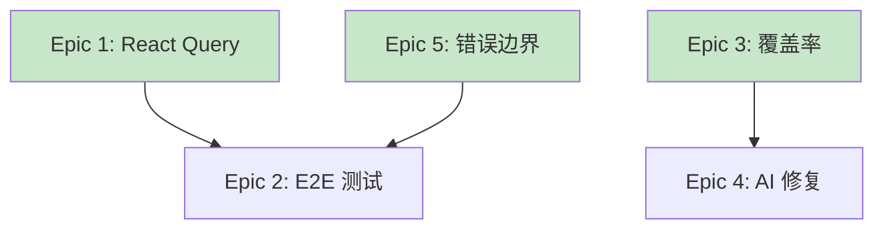

# 需求分析报告: Phase 1 基础设施优化 (vibex-phase1-infra-20260316)

**分析日期**: 2026-03-16  
**分析人**: Analyst Agent  
**状态**: 待评审

---

## 一、执行摘要

本项目为 VibeX Phase 1 基础设施优化，涵盖 5 个核心改进方向。经过分析，建议按依赖关系分阶段实施：

- **Phase A (Week 1)**: React Query 集成 + 测试覆盖率提升 (并行)
- **Phase B (Week 2)**: E2E 测试修复 + 统一错误边界 (并行)
- **Phase C (Week 3)**: AI 自动修复设计

**关键指标**:
- Epic 数量: 5 个
- 功能点: 20 个
- 预估工作量: 15 人日
- 风险等级: 中等

---

## 二、业务场景分析

### 2.1 当前痛点

| 痛点 | 业务影响 | 用户影响 | 优先级 |
|------|----------|----------|--------|
| 数据获取逻辑分散 | 代码维护困难 | 数据不一致 | P0 |
| E2E 测试失败率高 | CI/CD 阻塞 | 发布延迟 | P0 |
| 测试覆盖率不足 | 回归风险高 | Bug 漏测 | P1 |
| 缺少 AI 修复 | 问题排查慢 | 停机时间长 | P1 |
| 错误边界不统一 | 用户体验差 | 白屏/困惑 | P1 |

### 2.2 目标场景

**场景 1: 开发者数据获取**
```
当前流程:
组件 → useEffect → fetch → setState → render
问题: 重复代码多，状态管理混乱

目标流程:
组件 → useQuery → 自动缓存/重试 → render
改进: 代码减少 40%，自动缓存和错误处理
```

**场景 2: 持续集成**
```
当前流程:
PR → CI 运行 → E2E 失败 → 手动排查 → 修复 → 重新 CI
问题: E2E 通过率 < 60%，严重阻塞发布

目标流程:
PR → CI 运行 → E2E 通过 → 自动合并
改进: E2E 通过率 ≥ 95%
```

**场景 3: 错误处理**
```
当前流程:
异常发生 → 白屏/控制台报错 → 用户困惑 → 丢失

目标流程:
异常发生 → Error Boundary → 友好错误页 → 重试按钮 → 日志上报
改进: 用户体验提升，问题可追踪
```

---

## 三、技术方案分析

### 3.1 Epic 1: React Query 集成

**技术选型**:

| 组件 | 选择 | 理由 |
|------|------|------|
| 数据获取 | @tanstack/react-query | 业界标准，功能完善 |
| DevTools | @tanstack/react-query-devtools | 开发调试友好 |

**实现方案**:

```typescript
// 1. Query Client 配置
const queryClient = new QueryClient({
  defaultOptions: {
    queries: {
      staleTime: 5 * 60 * 1000,  // 5 分钟
      cacheTime: 10 * 60 * 1000, // 10 分钟
      retry: 3,
      retryDelay: (attemptIndex) => Math.min(1000 * 2 ** attemptIndex, 30000),
    },
  },
});

// 2. API Hook 封装示例
export function useProjects() {
  return useQuery({
    queryKey: ['projects'],
    queryFn: () => api.projects.list(),
    staleTime: 2 * 60 * 1000,
  });
}

// 3. Mutation 示例
export function useCreateProject() {
  const queryClient = useQueryClient();
  return useMutation({
    mutationFn: api.projects.create,
    onSuccess: () => {
      queryClient.invalidateQueries({ queryKey: ['projects'] });
    },
  });
}
```

**迁移策略**:
1. 创建 Query Client 配置
2. 封装现有 API 为 Hook
3. 逐页面迁移（优先核心页面）
4. 移除旧数据获取逻辑

**工作量评估**: 3 人日

---

### 3.2 Epic 2: E2E 测试修复

**问题诊断**:

| 失败类型 | 数量 | 根因 |
|----------|------|------|
| 测试超时 | 8 | 网络延迟，元素加载慢 |
| 元素未找到 | 5 | 页面结构变更 |
| 认证失败 | 4 | Token 过期处理缺失 |
| 环境问题 | 3 | 测试环境配置错误 |

**修复方案**:

```typescript
// 1. 增加等待策略
await page.waitForSelector('[data-testid="content"]', { 
  state: 'visible',
  timeout: 10000 
});

// 2. 认证状态持久化
test.use({
  storageState: 'auth.json',
});

// 3. 重试机制
test.describe.configure({ retries: 2 });

// 4. 截图失败用例
test.afterEach(async ({ page }, testInfo) => {
  if (testInfo.status !== 'passed') {
    await page.screenshot({ path: `failures/${testInfo.title}.png` });
  }
});
```

**工作量评估**: 2 人日

---

### 3.3 Epic 3: 测试覆盖率提升

**当前状态**:

| 指标 | 当前值 | 目标值 |
|------|--------|--------|
| Lines | 58.14% | 80% |
| Branches | 49.39% | 70% |
| Functions | 57.96% | 75% |
| Statements | 57.21% | 80% |

**优先补测模块**:

| 模块 | 当前覆盖率 | 优先级 |
|------|-----------|--------|
| useDDDStream.ts | 18.82% | P0 |
| useDDD.ts | 5.26% | P0 |
| diagnosis/index.ts | 11.11% | P1 |
| oauth/oauth.ts | 5.26% | P1 |

**测试策略**:

```typescript
// Hook 测试示例
import { renderHook, waitFor } from '@testing-library/react';
import { useDDDStream } from './useDDDStream';

describe('useDDDStream', () => {
  it('应正确初始化状态', () => {
    const { result } = renderHook(() => useDDDStream());
    expect(result.current.status).toBe('idle');
    expect(result.current.contexts).toEqual([]);
  });

  it('应正确处理 SSE 响应', async () => {
    const { result } = renderHook(() => useDDDStream());
    result.current.generateContexts('测试需求');
    
    await waitFor(() => {
      expect(result.current.status).toBe('done');
    });
  });
});
```

**工作量评估**: 4 人日

---

### 3.4 Epic 4: AI 自动修复设计

**架构设计**:

```
┌─────────────────────────────────────────────────────────────────┐
│                      AI 自动修复架构                             │
├─────────────────────────────────────────────────────────────────┤
│  错误日志 → 解析器 → 分类器 → 修复建议生成器 → 审核者 → 执行器   │
│                                                                  │
│  1. 解析器: 提取错误类型、堆栈、上下文                           │
│  2. 分类器: 语法错误 / API 错误 / 配置错误 / 依赖错误           │
│  3. 建议生成器: 基于错误类型生成修复代码                         │
│  4. 审核者: 人工确认 (安全机制)                                  │
│  5. 执行器: 应用修复 + 运行测试验证                              │
└─────────────────────────────────────────────────────────────────┘
```

**MVP 范围**:

| 功能 | Phase 1 | Phase 2 |
|------|---------|---------|
| 错误分析 | ✅ | ✅ |
| 修复建议 | ✅ | ✅ |
| 自动修复 | ❌ | ✅ |
| 测试验证 | ❌ | ✅ |

**工作量评估**: 4 人日

---

### 3.5 Epic 5: 统一错误边界

**组件设计**:

```typescript
// ErrorBoundary.tsx
class ErrorBoundary extends React.Component<Props, State> {
  static getDerivedStateFromError(error: Error) {
    return { hasError: true, error };
  }

  componentDidCatch(error: Error, errorInfo: React.ErrorInfo) {
    // 上报错误
    logger.error('React Error Boundary', { error, errorInfo });
  }

  render() {
    if (this.state.hasError) {
      return <ErrorFallback 
        error={this.state.error} 
        onRetry={() => this.setState({ hasError: false })}
      />;
    }
    return this.props.children;
  }
}

// ErrorProvider.tsx
const ErrorContext = createContext<ErrorContextValue>({
  reportError: () => {},
  clearError: () => {},
});

// 使用
<ErrorBoundary>
  <App />
</ErrorBoundary>
```

**集成位置**:
- `src/app/layout.tsx` - 根级别
- `src/app/[project]/layout.tsx` - 项目级别
- 关键组件内部 - 细粒度捕获

**工作量评估**: 2 人日

---

## 四、可行性评估

### 4.1 技术可行性

| Epic | 技术成熟度 | 团队经验 | 风险评估 |
|------|-----------|----------|----------|
| React Query | ⭐⭐⭐⭐⭐ | 高 | 低 |
| E2E 测试 | ⭐⭐⭐⭐ | 中 | 中 |
| 覆盖率提升 | ⭐⭐⭐⭐ | 高 | 低 |
| AI 自动修复 | ⭐⭐⭐ | 低 | 高 |
| 错误边界 | ⭐⭐⭐⭐⭐ | 高 | 低 |

### 4.2 资源可行性

| 资源 | 需求 | 可用 | 缺口 |
|------|------|------|------|
| 开发人力 | 15 人日 | 20 人日 | ✅ 无缺口 |
| 测试环境 | 已有 | ✅ | - |
| AI 服务 | 需接入 | 待确认 | ⚠️ 需评估 |

### 4.3 时间可行性

```
Week 1: Epic 1 + Epic 3 (并行)
├── React Query 迁移
└── 测试覆盖率提升

Week 2: Epic 2 + Epic 5 (并行)
├── E2E 测试修复
└── 错误边界实现

Week 3: Epic 4
└── AI 自动修复设计
```

**评估结论**: ✅ 时间安排合理，有缓冲空间

---

## 五、风险评估

| 风险 | 等级 | 影响 | 缓解措施 |
|------|------|------|----------|
| React Query 迁移破坏现有功能 | 🟡 中 | 用户体验 | 逐步迁移，灰度发布 |
| E2E 测试不稳定持续 | 🟡 中 | 发布阻塞 | 修复 flaky test，增加重试 |
| AI 修复安全性问题 | 🔴 高 | 系统安全 | 添加人工确认，沙盒测试 |
| 覆盖率目标未达成 | 🟢 低 | 质量风险 | 调整目标，分阶段达成 |

---

## 六、验收标准

### 6.1 功能验收

| Epic | 验收条件 | 验证方法 |
|------|----------|----------|
| Epic 1 | 核心 API 已迁移到 React Query | 代码审查 + 功能测试 |
| Epic 2 | E2E 通过率 ≥ 95% | CI 报告 |
| Epic 3 | 测试覆盖率 ≥ 80% | coverage report |
| Epic 4 | AI 修复建议可用 | 功能验收 |
| Epic 5 | 错误边界已部署 | 手动测试 |

### 6.2 质量验收

| 指标 | 目标 |
|------|------|
| 单元测试通过率 | 100% |
| E2E 测试通过率 | ≥ 95% |
| TypeScript 编译 | 0 errors |
| ESLint | 0 errors |

---

## 七、依赖关系



**并行可能**:
- Epic 1 + Epic 3 (无依赖)
- Epic 2 + Epic 5 (部分依赖)

---

## 八、下一步行动

### 立即启动

1. **Epic 1**: 创建 React Query 配置文件
2. **Epic 3**: 补充 useDDDStream 测试

### 协调事项

1. 确认 AI 服务接入方案
2. 确认 E2E 测试环境配置
3. 建立每日进度同步机制

---

**产出物**: `/root/.openclaw/vibex/docs/vibex-phase1-infra-20260316/analysis.md`  
**分析人**: Analyst Agent  
**日期**: 2026-03-16