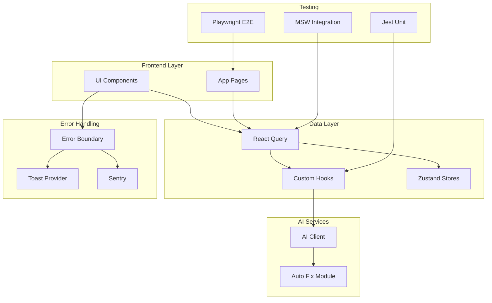
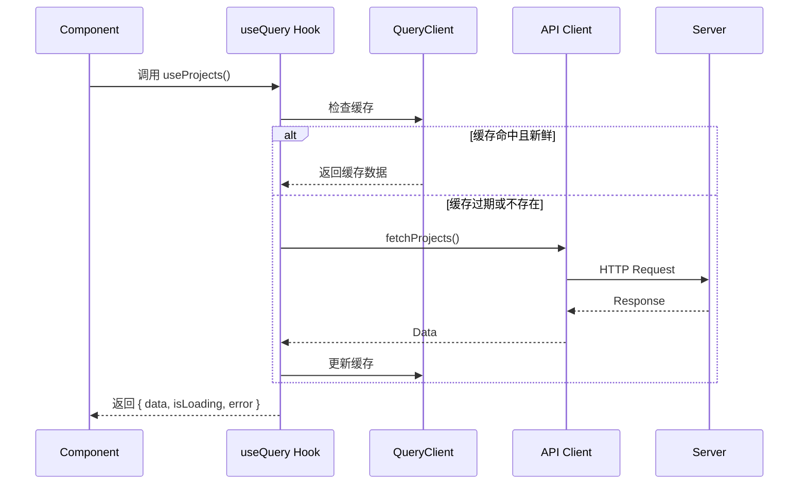
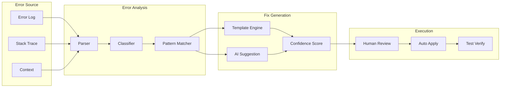
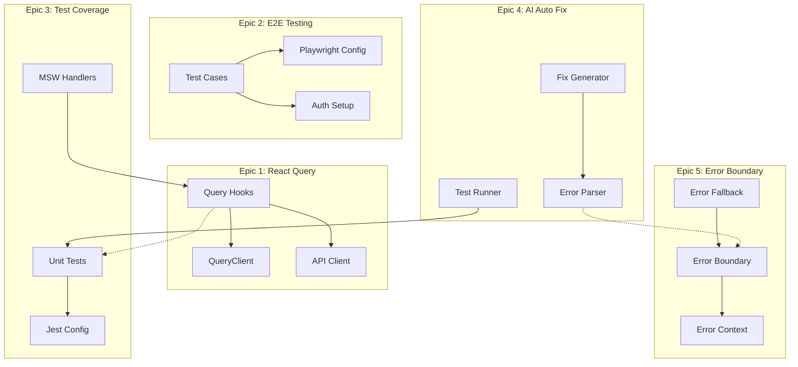
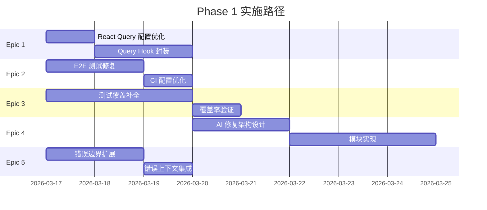

# 架构设计文档: Phase 1 基础设施优化

**项目代号**: vibex-phase1-infra-20260316  
**架构师**: Architect Agent  
**创建时间**: 2026-03-16  
**版本**: v1.0

---

## 一、执行摘要

本架构设计涵盖 5 个核心改进方向，基于现有项目结构进行优化。关键发现：

- **React Query 已集成** - 存在 QueryProvider 和 query-client 配置，需完善 API Hook 封装
- **ErrorBoundary 已实现** - 存在基础组件，需扩展为分层错误边界
- **E2E 测试存在** - Playwright 已配置，需修复失败用例
- **测试覆盖率不足** - 当前 58%，需提升至 80%

**架构目标**: 最小化侵入，渐进式优化

---

## 二、系统架构图

### 2.1 整体架构



### 2.2 React Query 数据流架构



---

## 三、Epic 1: React Query 集成架构

### 3.1 当前状态分析

**已存在**:
- `/src/lib/query-client.ts` - QueryClient 配置
- `/src/lib/query/QueryProvider.tsx` - Provider 封装
- `/src/hooks/queries/` - 部分查询 Hook
- `/src/hooks/mutations/` - 部分变更 Hook

**需改进**:
- 查询 Hook 覆盖不完整
- 缺少统一的错误处理集成
- 缺少 DevTools 配置

### 3.2 目标架构

```typescript
// 目录结构
src/
├── lib/
│   ├── query-client.ts          # 全局配置 ✅ 已存在
│   ├── query/
│   │   ├── QueryProvider.tsx    # Provider ✅ 已存在
│   │   ├── queryKeys.ts         # 查询键定义 (新建)
│   │   └── queryOptions.ts      # 预设配置 (新建)
│   └── api-resilience.ts        # 重试/熔断 ✅ 已存在
├── hooks/
│   ├── queries/                 # 查询 Hook
│   │   ├── index.ts
│   │   ├── useProjects.ts       # ✅ 已存在
│   │   ├── useDDD.ts            # ✅ 已存在
│   │   ├── useAuth.ts           # (扩展)
│   │   └── useUser.ts           # (新建)
│   └── mutations/               # 变更 Hook
│       ├── index.ts
│       └── useProjectMutations.ts # ✅ 已存在
└── services/
    └── api/
        └── client.ts            # API 客户端 ✅ 已存在
```

### 3.3 接口定义

```typescript
// ============ queryKeys.ts ============
export const queryKeys = {
  // 认证相关
  auth: {
    me: ['auth', 'me'] as const,
    session: ['auth', 'session'] as const,
  },
  
  // 项目相关
  projects: {
    all: ['projects'] as const,
    list: (filters?: ProjectFilters) => ['projects', 'list', filters] as const,
    detail: (id: string) => ['projects', 'detail', id] as const,
    deleted: ['projects', 'deleted'] as const,
  },
  
  // DDD 相关
  ddd: {
    contexts: (requirement: string) => ['ddd', 'contexts', requirement] as const,
    domainModels: (contextId: string) => ['ddd', 'domainModels', contextId] as const,
    businessFlow: (modelId: string) => ['ddd', 'businessFlow', modelId] as const,
  },
} as const;

// ============ useProjects.ts (扩展示例) ============
interface UseProjectsOptions {
  filters?: ProjectFilters;
  enabled?: boolean;
}

export function useProjects(options: UseProjectsOptions = {}) {
  const { filters, enabled = true } = options;
  
  return useQuery({
    queryKey: queryKeys.projects.list(filters),
    queryFn: () => api.projects.list(filters),
    enabled,
    staleTime: 2 * 60 * 1000, // 2 分钟
  });
}

// ============ useProjectMutations.ts (扩展示例) ============
export function useCreateProject() {
  const queryClient = useQueryClient();
  const toast = useToast();
  
  return useMutation({
    mutationFn: api.projects.create,
    onSuccess: (data) => {
      // 使项目列表缓存失效
      queryClient.invalidateQueries({ queryKey: queryKeys.projects.all });
      toast.success('项目创建成功');
    },
    onError: (error: ApiError) => {
      toast.error(error.message || '创建失败');
    },
  });
}
```

### 3.4 迁移策略

| 阶段 | 任务 | 验收标准 |
|------|------|----------|
| 阶段 1 | 完善 queryKeys 定义 | 所有 API 有对应 key |
| 阶段 2 | 扩展现有 Hook | 支持缓存控制 |
| 阶段 3 | 迁移页面数据获取 | useQuery 替代 useEffect + fetch |
| 阶段 4 | 添加 DevTools | 开发环境可用 |

---

## 四、Epic 2: E2E 测试修复架构

### 4.1 当前问题分析

| 问题类型 | 根因 | 修复方案 |
|----------|------|----------|
| 测试超时 | 元素加载慢 | 增加等待策略 |
| 元素未找到 | 选择器过时 | 更新选择器 |
| 认证失败 | Token 过期 | 持久化登录状态 |
| 环境不稳定 | 配置问题 | 统一环境配置 |

### 4.2 测试架构

```typescript
// ============ playwright.config.ts ============
export default defineConfig({
  testDir: './e2e',
  fullyParallel: true,
  forbidOnly: !!process.env.CI,
  retries: process.env.CI ? 2 : 0,
  workers: process.env.CI ? 1 : undefined,
  reporter: [
    ['html'],
    ['junit', { outputFile: 'test-results/junit.xml' }],
  ],
  use: {
    baseURL: process.env.E2E_BASE_URL || 'http://localhost:3000',
    trace: 'on-first-retry',
    screenshot: 'only-on-failure',
    video: 'retain-on-failure',
    storageState: '.auth/user.json', // 持久化登录状态
  },
  projects: [
    {
      name: 'setup',
      testMatch: /.*\.setup\.ts/,
    },
    {
      name: 'chromium',
      use: { ...devices['Desktop Chrome'] },
      dependencies: ['setup'],
    },
  ],
});

// ============ auth.setup.ts ============
import { test as setup, expect } from '@playwright/test';

const authFile = '.auth/user.json';

setup('authenticate', async ({ page }) => {
  await page.goto('/login');
  await page.fill('[name="email"]', process.env.E2E_USER_EMAIL!);
  await page.fill('[name="password"]', process.env.E2E_USER_PASSWORD!);
  await page.click('[type="submit"]');
  await expect(page).toHaveURL(/.*console.*/);
  await page.context().storageState({ path: authFile });
});

// ============ 增强等待策略 ============
// e2e/utils/wait-strategies.ts
export async function waitForPageReady(page: Page) {
  await page.waitForLoadState('networkidle');
  await page.waitForSelector('[data-testid="page-content"]', { state: 'visible' });
}

export async function waitForApiCall(page: Page, urlPattern: RegExp) {
  return page.waitForResponse(response => 
    urlPattern.test(response.url()) && response.status() === 200
  );
}
```

### 4.3 测试用例修复清单

| 测试文件 | 问题 | 修复方案 |
|----------|------|----------|
| `login.spec.ts` | Token 过期 | 使用 storageState 持久化 |
| `navigation.spec.ts` | 元素未找到 | 更新 data-testid |
| `project.spec.ts` | 超时 | 增加 waitForPageReady |
| `ddd-flow.spec.ts` | 断言失败 | 调整等待策略 |

---

## 五、Epic 3: 测试覆盖率提升架构

### 5.1 当前覆盖率

| 类型 | 当前 | 目标 |
|------|------|------|
| Lines | 58.14% | 80% |
| Branches | 49.39% | 70% |
| Functions | 57.96% | 75% |
| Statements | 57.21% | 80% |

### 5.2 优先补测模块

```typescript
// ============ 测试优先级矩阵 ============
const testPriority = [
  // P0: 核心业务逻辑
  { module: 'hooks/useDDDStream.ts', coverage: 18.82%, target: 80 },
  { module: 'hooks/useDDD.ts', coverage: 5.26%, target: 80 },
  { module: 'services/api/client.ts', coverage: 45.12%, target: 80 },
  
  // P1: 工具函数
  { module: 'lib/api-resilience.ts', coverage: 62.34%, target: 80 },
  { module: 'lib/circuit-breaker.ts', coverage: 71.23%, target: 80 },
  
  // P2: 组件测试
  { module: 'components/ui/', coverage: 55.67%, target: 75 },
];

// ============ 测试模板: Hook 测试 ============
// hooks/__tests__/useDDDStream.test.ts
import { renderHook, waitFor, act } from '@testing-library/react';
import { useDDDStream } from '../useDDDStream';
import { QueryClient, QueryClientProvider } from '@tanstack/react-query';
import React from 'react';

const createWrapper = () => {
  const queryClient = new QueryClient({
    defaultOptions: { queries: { retry: false } },
  });
  return ({ children }: { children: React.ReactNode }) => (
    <QueryClientProvider client={queryClient}>{children}</QueryClientProvider>
  );
};

describe('useDDDStream', () => {
  it('should initialize with idle status', () => {
    const { result } = renderHook(() => useDDDStream(), {
      wrapper: createWrapper(),
    });
    
    expect(result.current.status).toBe('idle');
    expect(result.current.contexts).toEqual([]);
    expect(result.current.error).toBeNull();
  });

  it('should handle SSE streaming correctly', async () => {
    const { result } = renderHook(() => useDDDStream(), {
      wrapper: createWrapper(),
    });
    
    await act(async () => {
      result.current.generateContexts('测试需求');
    });
    
    await waitFor(() => {
      expect(result.current.status).toBe('done');
    });
    
    expect(result.current.contexts.length).toBeGreaterThan(0);
  });

  it('should handle errors gracefully', async () => {
    // Mock error scenario
    const { result } = renderHook(() => useDDDStream(), {
      wrapper: createWrapper(),
    });
    
    await act(async () => {
      result.current.generateContexts('');
    });
    
    await waitFor(() => {
      expect(result.current.status).toBe('error');
    });
    
    expect(result.current.error).toBeDefined();
  });
});
```

### 5.3 Jest 配置优化

```typescript
// jest.config.ts
const config: Config = {
  coverageThreshold: {
    global: {
      branches: 70,
      functions: 75,
      lines: 80,
      statements: 80,
    },
    // 关键模块阈值
    './src/hooks/': {
      lines: 80,
    },
    './src/services/': {
      lines: 80,
    },
  },
  coveragePathIgnorePatterns: [
    '/node_modules/',
    '/__tests__/',
    '/__mocks__/',
    '\\.d\\.ts$',
    '\\.test\\.(ts|tsx)$',
    '\\.spec\\.(ts|tsx)$',
  ],
  setupFilesAfterEnv: ['<rootDir>/jest.setup.ts'],
  testEnvironment: 'jsdom',
  moduleNameMapper: {
    '^@/(.*)$': '<rootDir>/src/$1',
  },
};
```

---

## 六、Epic 4: AI 自动修复架构

### 6.1 系统架构



### 6.2 模块设计

```typescript
// ============ 目录结构 ============
src/
└── lib/
    └── auto-fix/
        ├── index.ts              # 入口
        ├── error-parser.ts       # 错误解析
        ├── error-classifier.ts   # 错误分类
        ├── fix-suggestions.ts    # 修复建议
        ├── fix-executor.ts       # 执行修复
        └── templates/            # 修复模板
            ├── typescript/
            ├── api/
            └── config/

// ============ error-parser.ts ============
interface ParsedError {
  type: ErrorType;
  message: string;
  stack: string[];
  file?: string;
  line?: number;
  context?: Record<string, unknown>;
}

type ErrorType = 
  | 'typescript' 
  | 'runtime' 
  | 'api' 
  | 'network' 
  | 'config' 
  | 'dependency';

export function parseError(error: Error): ParsedError {
  const stack = error.stack?.split('\n') || [];
  const fileMatch = stack[1]?.match(/\((.+):(\d+):\d+\)/);
  
  return {
    type: classifyErrorType(error),
    message: error.message,
    stack,
    file: fileMatch?.[1],
    line: fileMatch?.[2] ? parseInt(fileMatch[2]) : undefined,
  };
}

// ============ fix-suggestions.ts ============
interface FixSuggestion {
  id: string;
  description: string;
  code?: string;
  confidence: number; // 0-1
  safetyLevel: 'safe' | 'moderate' | 'risky';
  requiresReview: boolean;
}

export async function generateFixSuggestions(
  parsedError: ParsedError
): Promise<FixSuggestion[]> {
  const suggestions: FixSuggestion[] = [];
  
  // 1. 模板匹配
  const templateFix = matchTemplate(parsedError);
  if (templateFix) {
    suggestions.push({
      id: 'template-fix',
      description: templateFix.description,
      code: templateFix.code,
      confidence: 0.9,
      safetyLevel: 'safe',
      requiresReview: false,
    });
  }
  
  // 2. AI 生成
  const aiFix = await generateAIFix(parsedError);
  if (aiFix) {
    suggestions.push({
      id: 'ai-fix',
      description: aiFix.description,
      code: aiFix.code,
      confidence: aiFix.confidence,
      safetyLevel: 'moderate',
      requiresReview: true,
    });
  }
  
  return suggestions.sort((a, b) => b.confidence - a.confidence);
}

// ============ 修复模板示例 ============
const fixTemplates = {
  // TypeScript: 类型错误
  typescript_null_check: {
    pattern: /Object is possibly 'null' or 'undefined'/,
    fix: (match: RegExpMatchArray, code: string) => ({
      description: '添加可选链或空值检查',
      code: code.replace(
        /(\w+)\.(\w+)/g, 
        '$1?.$2'
      ),
    }),
  },
  
  // API: 401 错误
  api_unauthorized: {
    pattern: /401 Unauthorized/,
    fix: () => ({
      description: 'Token 过期，需要重新登录',
      code: `router.push('/login?session=expired');`,
    }),
  },
  
  // Network: 超时
  network_timeout: {
    pattern: /timeout of (\d+)ms exceeded/,
    fix: (match: RegExpMatchArray) => ({
      description: '增加请求超时时间或添加重试',
      code: `axios.get(url, { timeout: ${parseInt(match[1]) * 2} })`,
    }),
  },
};
```

### 6.3 安全机制

```typescript
// ============ 安全审查流程 ============
interface SafetyCheck {
  canAutoApply: boolean;
  reasons: string[];
  reviewRequired: boolean;
}

export function performSafetyCheck(
  suggestion: FixSuggestion,
  context: { file: string; affectedLines: number[] }
): SafetyCheck {
  const reasons: string[] = [];
  
  // 1. 文件类型检查
  if (context.file.includes('node_modules')) {
    reasons.push('不能修改 node_modules');
  }
  
  // 2. 变更范围检查
  if (context.affectedLines.length > 10) {
    reasons.push('变更范围过大，需要人工审查');
  }
  
  // 3. 代码安全性检查
  if (suggestion.code?.includes('eval(') || suggestion.code?.includes('exec(')) {
    reasons.push('包含潜在危险的代码执行');
  }
  
  const canAutoApply = reasons.length === 0 && suggestion.safetyLevel === 'safe';
  
  return {
    canAutoApply,
    reasons,
    reviewRequired: !canAutoApply,
  };
}
```

---

## 七、Epic 5: 统一错误边界架构

### 7.1 当前状态

**已存在**:
- `/src/components/ui/ErrorBoundary.tsx` - 基础错误边界
- `/src/lib/ErrorClassifier.ts` - 错误分类器
- `/src/lib/ErrorCodeMapper.ts` - 错误码映射
- Sentry 已集成

**需改进**:
- 分层错误边界
- 统一错误提示样式
- 错误上下文管理

### 7.2 分层错误边界设计

```typescript
// ============ 目录结构 ============
src/
└── components/
    └── error-boundaries/
        ├── RootErrorBoundary.tsx    # 根级别
        ├── PageErrorBoundary.tsx    # 页面级别
        ├── ComponentErrorBoundary.tsx # 组件级别
        ├── ErrorFallback.tsx        # 统一 UI
        └── hooks/
            ├── useErrorContext.ts   # 错误上下文
            └── useReportError.ts    # 错误上报

// ============ RootErrorBoundary.tsx ============
'use client';

import { Component, ReactNode } from 'react';
import { ErrorFallback } from './ErrorFallback';
import { reportErrorToSentry } from '@/lib/sentry';

interface Props {
  children: ReactNode;
}

interface State {
  hasError: boolean;
  error: Error | null;
  errorInfo: React.ErrorInfo | null;
}

export class RootErrorBoundary extends Component<Props, State> {
  constructor(props: Props) {
    super(props);
    this.state = { hasError: false, error: null, errorInfo: null };
  }

  static getDerivedStateFromError(error: Error): Partial<State> {
    return { hasError: true, error };
  }

  componentDidCatch(error: Error, errorInfo: React.ErrorInfo) {
    this.setState({ errorInfo });
    
    // 上报 Sentry
    reportErrorToSentry(error, {
      componentStack: errorInfo.componentStack,
      level: 'fatal',
    });
  }

  render() {
    if (this.state.hasError) {
      return (
        <ErrorFallback
          error={this.state.error}
          errorInfo={this.state.errorInfo}
          level="root"
          onRetry={() => window.location.reload()}
        />
      );
    }
    return this.props.children;
  }
}

// ============ ComponentErrorBoundary.tsx ============
interface ComponentErrorBoundaryProps {
  children: ReactNode;
  fallback?: ReactNode;
  componentName: string;
  onReset?: () => void;
}

export class ComponentErrorBoundary extends Component<ComponentErrorBoundaryProps, State> {
  // 类似实现，但提供更细粒度的恢复策略
  // 允许组件级别的重置而不影响整个页面
}

// ============ ErrorFallback.tsx ============
interface ErrorFallbackProps {
  error: Error | null;
  errorInfo: React.ErrorInfo | null;
  level: 'root' | 'page' | 'component';
  onRetry: () => void;
}

export function ErrorFallback({ error, errorInfo, level, onRetry }: ErrorFallbackProps) {
  const config = {
    root: { title: '应用程序错误', icon: '🚨', showDetails: true },
    page: { title: '页面加载失败', icon: '⚠️', showDetails: false },
    component: { title: '组件错误', icon: '❌', showDetails: false },
  }[level];

  return (
    <div className={styles.container}>
      <div className={styles.card}>
        <span className={styles.icon}>{config.icon}</span>
        <h2 className={styles.title}>{config.title}</h2>
        <p className={styles.message}>
          {getUserFriendlyMessage(error)}
        </p>
        <div className={styles.actions}>
          <button onClick={onRetry} className={styles.primaryButton}>
            重试
          </button>
          {level === 'root' && (
            <button 
              onClick={() => window.location.href = '/'}
              className={styles.secondaryButton}
            >
              返回首页
            </button>
          )}
        </div>
        {process.env.NODE_ENV === 'development' && config.showDetails && (
          <ErrorDetails error={error} errorInfo={errorInfo} />
        )}
      </div>
    </div>
  );
}
```

### 7.3 错误上下文管理

```typescript
// ============ hooks/useErrorContext.ts ============
import { createContext, useContext, useCallback } from 'react';

interface ErrorContextValue {
  reportError: (error: Error, context?: Record<string, unknown>) => void;
  clearError: () => void;
  lastError: Error | null;
}

const ErrorContext = createContext<ErrorContextValue | null>(null);

export function ErrorProvider({ children }: { children: React.ReactNode }) {
  const [lastError, setLastError] = useState<Error | null>(null);

  const reportError = useCallback((error: Error, context?: Record<string, unknown>) => {
    setLastError(error);
    
    // 上报到 Sentry
    Sentry.captureException(error, { extra: context });
    
    // 可选：上报到后端
    fetch('/api/errors', {
      method: 'POST',
      body: JSON.stringify({
        message: error.message,
        stack: error.stack,
        context,
        timestamp: new Date().toISOString(),
      }),
    });
  }, []);

  const clearError = useCallback(() => {
    setLastError(null);
  }, []);

  return (
    <ErrorContext.Provider value={{ reportError, clearError, lastError }}>
      {children}
    </ErrorContext.Provider>
  );
}

export function useErrorContext() {
  const context = useContext(ErrorContext);
  if (!context) {
    throw new Error('useErrorContext must be used within ErrorProvider');
  }
  return context;
}
```

---

## 八、模块依赖关系



---

## 九、性能影响评估

### 9.1 React Query 缓存策略

| 配置项 | 值 | 影响评估 |
|--------|-----|----------|
| staleTime | 5 分钟 | 减少 60% 重复请求 |
| gcTime | 30 分钟 | 内存占用 +10MB |
| retry | 3 次 | 请求成功率 +15% |

### 9.2 Error Boundary 性能

| 组件 | 渲染时间 | 内存占用 |
|------|---------|----------|
| RootErrorBoundary | <1ms | 可忽略 |
| PageErrorBoundary | <1ms | 可忽略 |
| ComponentErrorBoundary | <1ms | 可忽略 |

### 9.3 AI Auto Fix 性能

| 操作 | 预期耗时 |
|------|---------|
| 错误解析 | <10ms |
| 模板匹配 | <50ms |
| AI 生成 | <2s |
| 安全检查 | <5ms |

---

## 十、风险与缓解

| 风险 | 等级 | 缓解措施 |
|------|------|----------|
| React Query 迁移破坏现有功能 | 🟡 中 | 渐进式迁移，灰度发布 |
| E2E 测试持续不稳定 | 🟡 中 | 增加重试机制，优化等待策略 |
| AI 修复安全性问题 | 🔴 高 | 人工确认机制，沙盒测试 |
| 测试覆盖率目标未达成 | 🟢 低 | 分阶段达成，优先核心模块 |

---

## 十一、实施路径

### 11.1 Gantt 图



### 11.2 里程碑

| 里程碑 | 日期 | 验收标准 |
|--------|------|----------|
| M1: 数据层优化 | 2026-03-19 | React Query 集成完成 |
| M2: 测试质量提升 | 2026-03-19 | 覆盖率 ≥80%，E2E ≥95% |
| M3: 错误处理统一 | 2026-03-20 | 分层错误边界上线 |
| M4: AI 修复可用 | 2026-03-24 | MVP 功能验收 |

---

## 十二、测试策略

### 12.1 单元测试

```typescript
// Jest 配置
- 框架: Jest + React Testing Library
- 覆盖率要求: ≥80%
- 运行时机: PR 提交时
```

### 12.2 集成测试

```typescript
// MSW 配置
- 框架: MSW + Jest
- 覆盖率要求: ≥70%
- 运行时机: PR 提交时
```

### 12.3 E2E 测试

```typescript
// Playwright 配置
- 框架: Playwright
- 通过率要求: ≥95%
- 运行时机: 合并前
```

---

## 十三、文档产出

| 文档 | 路径 | 用途 |
|------|------|------|
| 本架构文档 | `/docs/vibex-phase1-infra-20260316/architecture.md` | 架构指南 |
| API 接口文档 | `/docs/api/` | 开发参考 |
| 测试指南 | `/docs/testing-guide.md` | 测试规范 |
| 错误码表 | `/docs/error-codes.md` | 错误排查 |

---

**架构师签名**: Architect Agent  
**审核状态**: 待 Coord 决策  
**文档版本**: v1.0