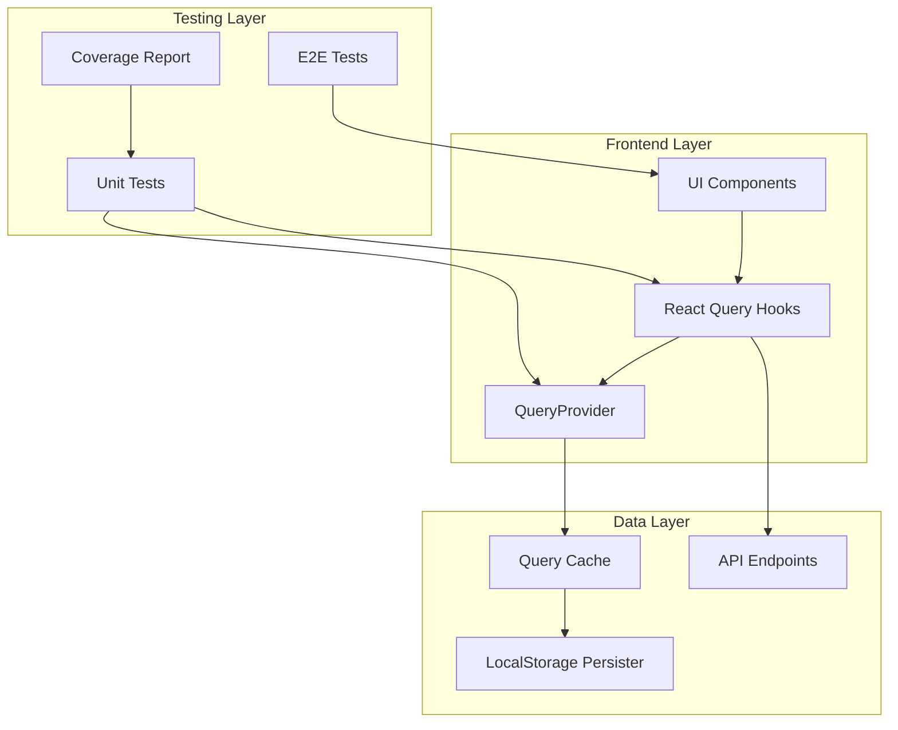
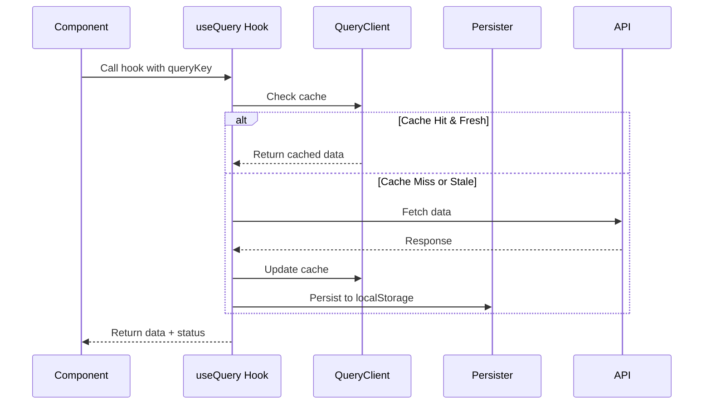
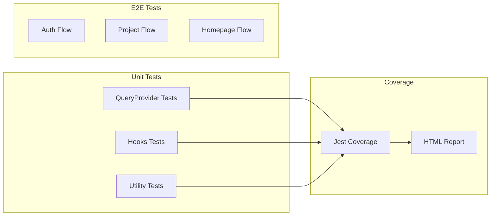
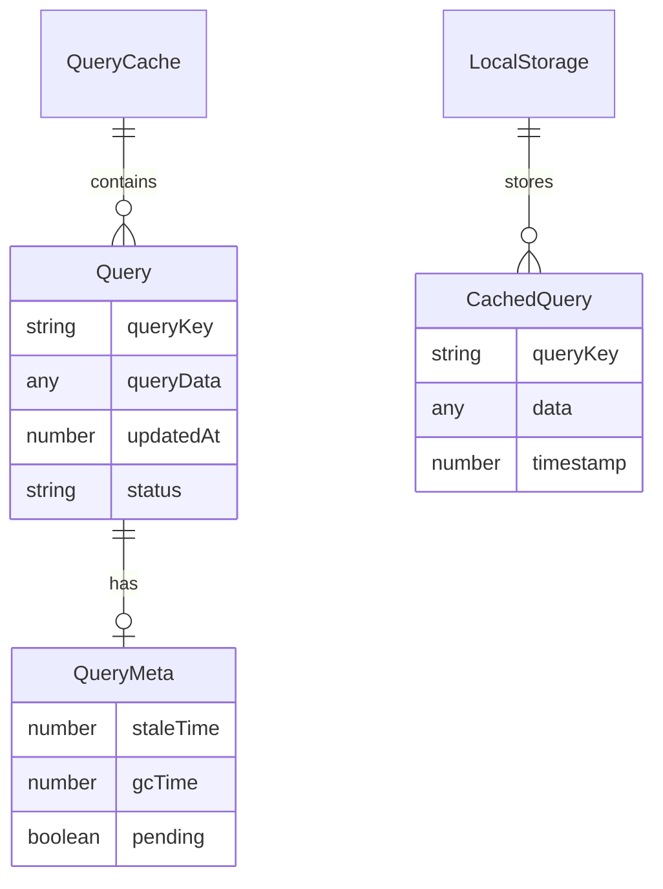
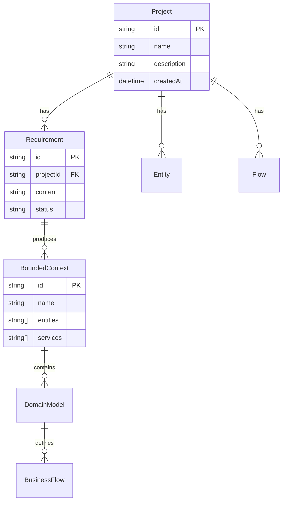
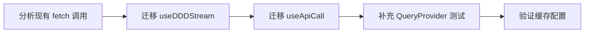
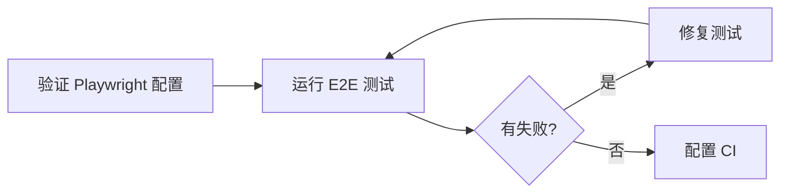
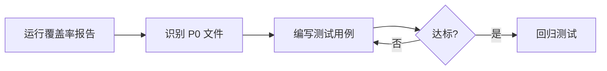

# Architecture: Phase 1 基础设施优化

**项目**: vibex-phase1-infra-20260317  
**架构师**: Architect Agent  
**日期**: 2026-03-17  
**状态**: ✅ 设计完成

---

## 1. Tech Stack (版本选择及理由)

### 1.1 React Query 生态

| 依赖 | 版本 | 理由 |
|------|------|------|
| `@tanstack/react-query` | ^5.90.21 | 已安装，稳定版本，支持持久化 |
| `@tanstack/react-query-persist-client` | ^5.90.24 | 已安装，支持离线缓存 |

### 1.2 测试框架

| 依赖 | 版本 | 理由 |
|------|------|------|
| `@playwright/test` | latest | 已配置，E2E 测试标准 |
| `jest` | ^29.x | 已配置，单元测试 |
| `@testing-library/react` | ^14.x | 已配置，组件测试 |

---

## 2. Architecture Diagram (Mermaid)

### 2.1 整体架构



### 2.2 React Query 数据流



### 2.3 测试架构



---

## 3. API Definitions (接口签名)

### 3.1 QueryProvider 接口

```typescript
// src/lib/query/QueryProvider.tsx

export interface QueryProviderProps {
  children: ReactNode;
}

export function QueryProvider({ children }: QueryProviderProps): JSX.Element;

// Query Keys Factory
export const queryKeys = {
  auth: {
    me: readonly ['auth', 'me'];
  };
  projects: {
    all: readonly ['projects'];
    list: (filters: Record<string, unknown>) => readonly [...];
    detail: (id: string) => readonly [...];
  };
  requirements: {
    all: readonly ['requirements'];
    byProject: (projectId: string) => readonly [...];
  };
  entities: {
    all: readonly ['entities'];
    byProject: (projectId: string) => readonly [...];
  };
  ddd: {
    contexts: (requirement: string) => readonly [...];
    domainModels: (...contextIds: string[]) => readonly [...];
    businessFlow: (...modelIds: string[]) => readonly [...];
  };
};
```

### 3.2 React Query Hooks 接口

```typescript
// src/hooks/queries/use-ddd.ts

export interface UseBoundedContextsOptions {
  requirement: string;
  enabled?: boolean;
}

export function useBoundedContexts(options: UseBoundedContextsOptions): {
  data: BoundedContext[] | undefined;
  isLoading: boolean;
  error: Error | null;
  refetch: () => void;
};

export interface UseDomainModelsOptions {
  requirement: string;
  contexts: BoundedContext[];
  enabled?: boolean;
}

export function useDomainModels(options: UseDomainModelsOptions): {
  data: DomainModel[] | undefined;
  isLoading: boolean;
  error: Error | null;
};

export function useBusinessFlow(options: UseBusinessFlowOptions): {
  data: BusinessFlow | undefined;
  isLoading: boolean;
  error: Error | null;
};
```

### 3.3 缓存配置接口

```typescript
// src/lib/query/queryClient.ts

export interface QueryClientConfig {
  defaultOptions: {
    queries: {
      staleTime: number;      // 5 minutes
      gcTime: number;         // 10 minutes
      retry: number;          // 3
      refetchOnWindowFocus: boolean;
      refetchOnReconnect: boolean;
      refetchOnMount: boolean;
    };
    mutations: {
      retry: number;          // 1
    };
  };
}

export interface PersistConfig {
  queryClient: QueryClient;
  persister: StoragePersister;
  maxAge: number;            // 24 hours
}
```

---

## 4. Data Model (核心实体关系)

### 4.1 查询缓存数据结构



### 4.2 Domain 实体关系



---

## 5. Testing Strategy (测试契约)

### 5.1 测试框架

| 类型 | 框架 | 覆盖目标 |
|------|------|----------|
| Unit Tests | Jest + React Testing Library | Lines ≥ 65%, Branches ≥ 60% |
| E2E Tests | Playwright | Pass Rate ≥ 90% |
| Integration Tests | Jest | API Integration |

### 5.2 覆盖率要求

```yaml
coverageThreshold:
  global:
    lines: 65
    statements: 65
    functions: 60
    branches: 60
  
  # P0 文件特殊要求
  "./src/components/homepage/hooks/":
    lines: 80
    branches: 70
```

### 5.3 核心测试用例示例

#### QueryProvider 测试

```typescript
// src/lib/query/__tests__/QueryProvider.test.tsx

import { render, screen } from '@testing-library/react';
import { QueryProvider } from '../QueryProvider';
import { useQuery } from '@tanstack/react-query';

describe('QueryProvider', () => {
  it('should provide query client to children', () => {
    render(
      <QueryProvider>
        <TestComponent />
      </QueryProvider>
    );
    
    expect(screen.getByText('Query Client Ready')).toBeInTheDocument();
  });

  it('should persist queries to localStorage', async () => {
    // 测试持久化逻辑
  });

  it('should handle query errors gracefully', async () => {
    // 测试错误处理
  });

  it('should configure correct default options', () => {
    // 验证 staleTime, gcTime, retry 配置
  });
});
```

#### useBoundedContexts Hook 测试

```typescript
// src/hooks/queries/__tests__/use-ddd.test.ts

import { renderHook, waitFor } from '@testing-library/react';
import { useBoundedContexts } from '../use-ddd';

describe('useBoundedContexts', () => {
  it('should return loading state initially', () => {
    const { result } = renderHook(() => 
      useBoundedContexts({ requirement: 'test' })
    );
    
    expect(result.current.isLoading).toBe(true);
  });

  it('should fetch bounded contexts successfully', async () => {
    const { result } = renderHook(() => 
      useBoundedContexts({ requirement: 'valid requirement' })
    );
    
    await waitFor(() => {
      expect(result.current.data).toBeDefined();
    });
  });

  it('should not fetch when requirement is empty', () => {
    const { result } = renderHook(() => 
      useBoundedContexts({ requirement: '' })
    );
    
    expect(result.current.isLoading).toBe(false);
  });
});
```

#### E2E 测试示例

```typescript
// tests/e2e/react-query.spec.ts

import { test, expect } from '@playwright/test';

test.describe('React Query Integration', () => {
  test('should load projects on dashboard', async ({ page }) => {
    await page.goto('/dashboard');
    
    // 等待 React Query 加载完成
    await expect(page.getByRole('heading', { name: 'Projects' })).toBeVisible();
    
    // 验证数据加载
    const projectCards = page.getByTestId('project-card');
    await expect(projectCards.first()).toBeVisible();
  });

  test('should cache project data', async ({ page }) => {
    await page.goto('/dashboard');
    await page.waitForSelector('[data-testid="project-card"]');
    
    // 导航到详情页再返回
    await page.click('[data-testid="project-card"]:first-child');
    await page.goBack();
    
    // 验证缓存数据立即可见（无 loading）
    await expect(page.getByTestId('project-card').first()).toBeVisible();
  });
});
```

### 5.4 测试文件清单

| 文件 | 测试类型 | 目标覆盖率 |
|------|----------|------------|
| `QueryProvider.test.tsx` | Unit | ≥ 90% |
| `use-ddd.test.ts` | Unit | ≥ 80% |
| `useProjects.test.ts` | Unit | ≥ 80% |
| `useHomeGeneration.test.ts` | Unit | ≥ 80% |
| `useHomePageState.test.ts` | Unit | ≥ 80% |
| `useHomePanel.test.ts` | Unit | ≥ 80% |
| `react-query.spec.ts` | E2E | Pass |
| `project-flow.spec.ts` | E2E | Pass |

---

## 6. 实施路径

### Phase 1: React Query 迁移 (Day 1-2)



### Phase 2: E2E 环境修复 (Day 3-4)



### Phase 3: 覆盖率提升 (Day 5-6)



---

## 7. 技术决策记录

### ADR-001: React Query 缓存策略

**Status**: Accepted

**Context**: 需要决定默认的缓存过期时间，平衡数据新鲜度和性能。

**Decision**: 
- `staleTime`: 5 分钟（数据保持新鲜）
- `gcTime`: 10 分钟（缓存保留时间）
- `retry`: 3 次（网络容错）

**Consequences**:
- ✅ 减少不必要的 API 调用
- ✅ 提升页面切换性能
- ⚠️ 数据可能有 5 分钟延迟

### ADR-002: E2E 测试环境策略

**Status**: Accepted

**Context**: E2E 测试需要完整的运行环境，包括前端和后端。

**Decision**: 
- 使用 Playwright 内置 `webServer` 启动前端
- 单 worker 运行避免资源竞争
- 失败时保留截图和视频

**Consequences**:
- ✅ 测试稳定性提升
- ✅ 调试信息完整
- ⚠️ 测试时间较长

---

## 8. 验收检查清单

- [x] 架构图使用 Mermaid 格式
- [x] API 定义完整
- [x] 测试策略清晰
- [x] 覆盖率目标明确
- [x] 实施路径可执行

---

**产出物**: `/root/.openclaw/vibex/docs/vibex-phase1-infra-20260317/architecture.md`