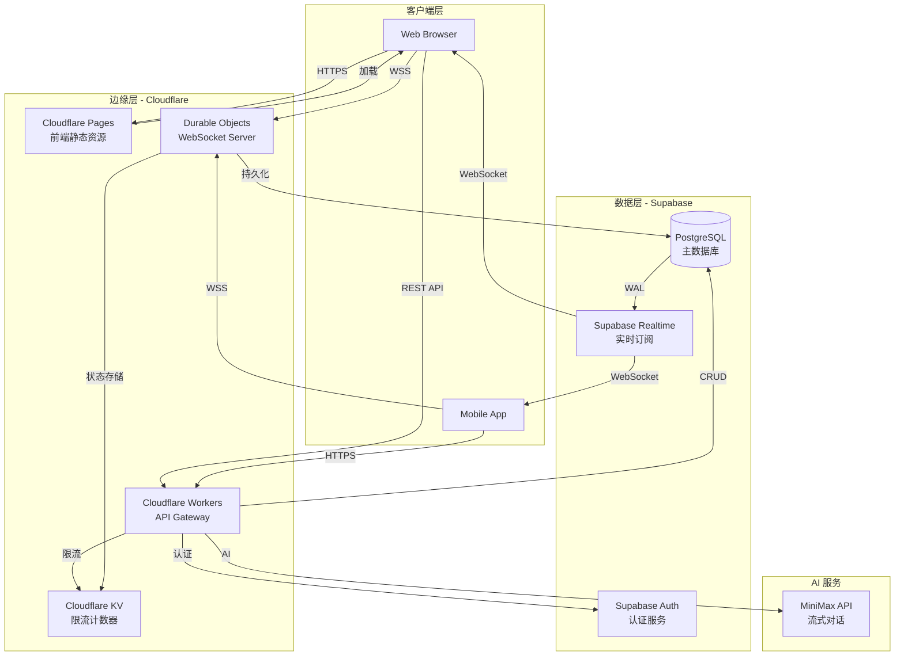
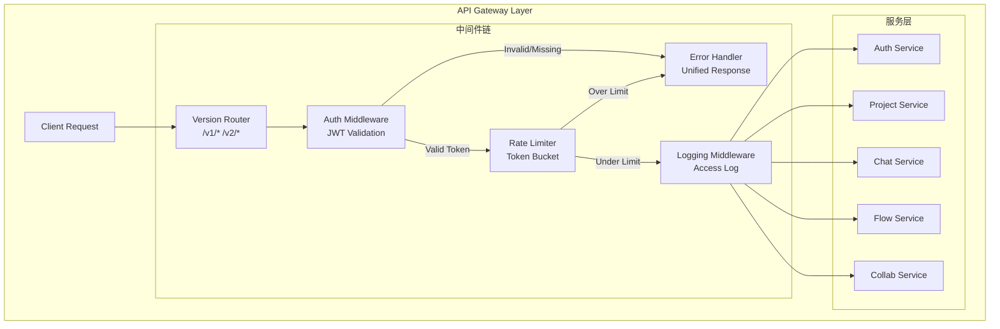
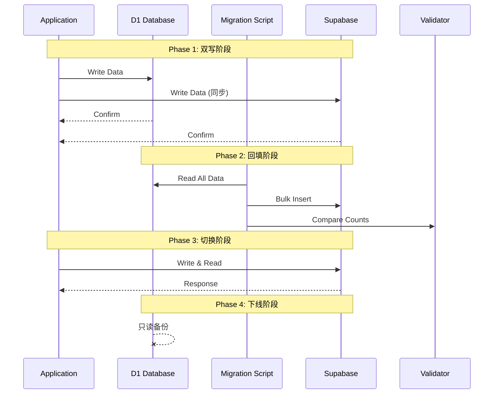
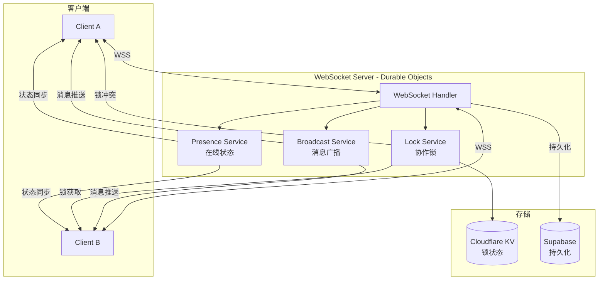
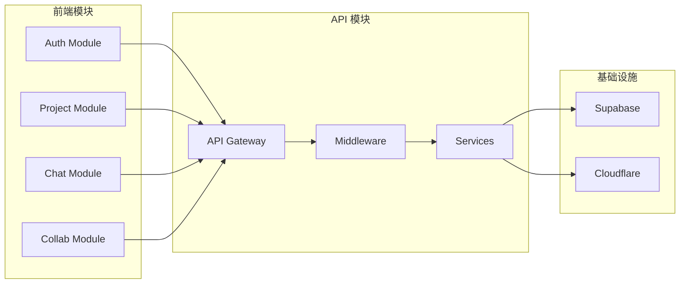
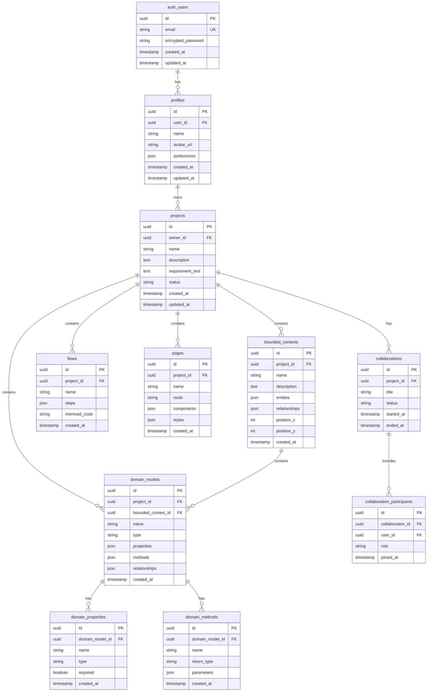

# 架构设计: VibeX Phase 2 核心功能

**项目**: vibex-phase2-core-20260316
**版本**: 1.0
**日期**: 2026-03-16
**作者**: Architect Agent

---

## 1. Tech Stack (技术栈选型)

### 1.1 核心技术栈

| 组件 | 选型 | 版本 | 理由 |
|------|------|------|------|
| **数据库** | Supabase PostgreSQL | 15+ | 托管 PostgreSQL，内置 Auth + Realtime |
| **认证** | Supabase Auth | 内置 | OAuth + Email/Password，JWT 支持 |
| **实时订阅** | Supabase Realtime | 内置 | PostgreSQL WAL 监听，WebSocket |
| **API 运行时** | Cloudflare Workers | 现有 | Edge 分布式，低延迟 |
| **API 框架** | Hono | 现有 | 轻量、TypeScript 友好 |
| **WebSocket** | Cloudflare Durable Objects | 新增 | 有状态服务，支持持久连接 |
| **限流** | Cloudflare KV | 现有 | 分布式计数器存储 |
| **日志** | Cloudflare Analytics | 现有 | 结构化日志，实时监控 |

### 1.2 技术选型对比

| 方案 | 优点 | 缺点 | 推荐度 |
|------|------|------|--------|
| **Supabase PostgreSQL** | 全托管、内置功能丰富 | 供应商锁定 | ⭐⭐⭐⭐⭐ |
| 自建 PostgreSQL | 完全控制 | 运维成本高 | ⭐⭐ |
| MongoDB Atlas | NoSQL 灵活 | 无实时订阅 | ⭐⭐⭐ |
| Cloudflare D1 | 边缘部署 | 功能有限，无实时 | ⭐⭐⭐ |

**结论**: 采用 **Supabase** 作为数据库和认证解决方案，**Cloudflare Workers** 作为 API 运行时，**Durable Objects** 作为 WebSocket 服务。

---

## 2. Architecture Diagram (架构图)

### 2.1 整体架构



### 2.2 API Gateway 架构



### 2.3 数据迁移架构



### 2.4 WebSocket 协作架构



### 2.5 模块依赖关系



---

## 3. API Definitions (接口定义)

### 3.1 认证 API

```typescript
// POST /v1/auth/login
interface LoginRequest {
  email: string;
  password: string;
}

interface LoginResponse {
  success: boolean;
  accessToken: string;
  refreshToken: string;
  user: {
    id: string;
    email: string;
    name: string;
  };
}

// POST /v1/auth/oauth/:provider
interface OAuthRequest {
  provider: 'google' | 'github' | 'apple';
  redirectUri: string;
}

interface OAuthResponse {
  authUrl: string;
  state: string;
}

// POST /v1/auth/refresh
interface RefreshRequest {
  refreshToken: string;
}

interface RefreshResponse {
  accessToken: string;
  expiresIn: number;
}

// POST /v1/auth/logout
interface LogoutResponse {
  success: boolean;
}
```

### 3.2 项目 API

```typescript
// GET /v1/projects
interface ListProjectsQuery {
  page?: number;
  limit?: number;
  status?: 'active' | 'archived';
}

interface ListProjectsResponse {
  projects: Project[];
  total: number;
  page: number;
  limit: number;
}

// POST /v1/projects
interface CreateProjectRequest {
  name: string;
  description?: string;
  requirementText: string;
}

interface CreateProjectResponse {
  id: string;
  name: string;
  createdAt: Date;
}

// GET /v1/projects/:id
interface GetProjectResponse {
  id: string;
  name: string;
  description: string;
  requirementText: string;
  boundedContexts: BoundedContext[];
  domainModels: DomainModel[];
  flows: Flow[];
  createdAt: Date;
  updatedAt: Date;
}

// PUT /v1/projects/:id
interface UpdateProjectRequest {
  name?: string;
  description?: string;
}

// DELETE /v1/projects/:id
interface DeleteProjectResponse {
  success: boolean;
}
```

### 3.3 AI 对话 API

```typescript
// POST /v1/chat/stream (SSE)
interface ChatStreamRequest {
  projectId: string;
  message: string;
  context?: {
    boundedContexts?: BoundedContext[];
    domainModels?: DomainModel[];
  };
}

// SSE Events
interface ThinkingEvent {
  type: 'thinking';
  step: string;
  content: string;
  progress: number;
}

interface ContentEvent {
  type: 'content';
  content: string;
}

interface DoneEvent {
  type: 'done';
  result: {
    boundedContexts?: BoundedContext[];
    domainModels?: DomainModel[];
    mermaidCode?: string;
  };
}

interface ErrorEvent {
  type: 'error';
  code: string;
  message: string;
}
```

### 3.4 协作 API

```typescript
// WebSocket 消息类型
interface WSMessage<T = unknown> {
  type: string;
  payload: T;
  timestamp: number;
}

// 在线状态
interface PresenceUpdate {
  type: 'presence:update';
  payload: {
    userId: string;
    userName: string;
    status: 'online' | 'offline' | 'editing';
    projectId: string;
  };
}

// 协作锁
interface LockRequest {
  type: 'lock:acquire';
  payload: {
    resourceId: string;
    resourceType: 'project' | 'flow' | 'page';
  };
}

interface LockResponse {
  type: 'lock:result';
  payload: {
    success: boolean;
    lockedBy?: {
      userId: string;
      userName: string;
    };
    expiresAt?: Date;
  };
}

// 消息广播
interface BroadcastMessage {
  type: 'broadcast:message';
  payload: {
    content: string;
    senderId: string;
    senderName: string;
    projectId: string;
  };
}
```

### 3.5 错误响应格式

```typescript
// 统一错误响应
interface ErrorResponse {
  success: false;
  error: {
    code: string;        // ERROR_CODE
    message: string;     // Human readable
    details?: unknown;   // Additional info
    requestId: string;   // For tracing
  };
  timestamp: string;
}

// 错误码定义
enum ErrorCode {
  // 认证错误 (1xxx)
  UNAUTHORIZED = 'AUTH_1001',
  INVALID_TOKEN = 'AUTH_1002',
  TOKEN_EXPIRED = 'AUTH_1003',
  
  // 限流错误 (2xxx)
  RATE_LIMITED = 'RATE_2001',
  
  // 资源错误 (3xxx)
  NOT_FOUND = 'RES_3001',
  ALREADY_EXISTS = 'RES_3002',
  CONFLICT = 'RES_3003',
  
  // 业务错误 (4xxx)
  VALIDATION_ERROR = 'BIZ_4001',
  LOCK_CONFLICT = 'BIZ_4002',
  
  // 服务错误 (5xxx)
  INTERNAL_ERROR = 'SVC_5001',
  SERVICE_UNAVAILABLE = 'SVC_5002',
}
```

---

## 4. Data Model (数据模型)

### 4.1 数据库 Schema



### 4.2 迁移映射

| D1 表 | Supabase 表 | 字段映射说明 |
|-------|-------------|--------------|
| User | auth.users + profiles | 拆分为认证表和配置表 |
| Project | projects | 直接映射 |
| Message | messages | 直接映射（可选：改为实时订阅） |
| FlowData | flows | 直接映射 |
| Agent | agents | 直接映射 |
| Page | pages | 直接映射 |
| PrototypeCollaboration | collaborations + participants | 拆分为协作会话和参与者 |

### 4.3 Supabase RLS 策略

```sql
-- 项目访问策略
CREATE POLICY "Users can view own projects"
  ON projects FOR SELECT
  USING (owner_id = auth.uid());

CREATE POLICY "Users can create projects"
  ON projects FOR INSERT
  WITH CHECK (owner_id = auth.uid());

CREATE POLICY "Users can update own projects"
  ON projects FOR UPDATE
  USING (owner_id = auth.uid());

CREATE POLICY "Users can delete own projects"
  ON projects FOR DELETE
  USING (owner_id = auth.uid());

-- 协作访问策略
CREATE POLICY "Collaborators can view project"
  ON projects FOR SELECT
  USING (
    owner_id = auth.uid() 
    OR EXISTS (
      SELECT 1 FROM collaboration_participants
      WHERE user_id = auth.uid()
      AND collaboration_id IN (
        SELECT id FROM collaborations 
        WHERE project_id = projects.id
      )
    )
  );
```

---

## 5. Implementation Details (实现细节)

### 5.1 API Gateway 中间件

```typescript
// src/middleware/auth.ts
import { createMiddleware } from 'hono/factory';
import { verify } from 'jsonwebtoken';

export const authMiddleware = createMiddleware(async (c, next) => {
  const authHeader = c.req.header('Authorization');
  
  if (!authHeader?.startsWith('Bearer ')) {
    return c.json({
      success: false,
      error: {
        code: 'AUTH_1001',
        message: 'Missing authorization token',
      }
    }, 401);
  }
  
  const token = authHeader.slice(7);
  
  try {
    const payload = await verify(token, c.env.JWT_SECRET);
    c.set('userId', payload.sub);
    c.set('userEmail', payload.email);
    await next();
  } catch (error) {
    return c.json({
      success: false,
      error: {
        code: 'AUTH_1002',
        message: 'Invalid token',
      }
    }, 401);
  }
});
```

```typescript
// src/middleware/rateLimit.ts
import { createMiddleware } from 'hono/factory';

interface RateLimitConfig {
  windowMs: number;
  max: number;
  keyGenerator?: (c: Context) => string;
}

export const rateLimitMiddleware = (config: RateLimitConfig) => 
  createMiddleware(async (c, next) => {
    const key = config.keyGenerator?.(c) ?? 
      c.get('userId') ?? 
      c.req.header('x-forwarded-for') ?? 
      'anonymous';
    
    const kvKey = `ratelimit:${key}`;
    const current = parseInt(await c.env.KV.get(kvKey) ?? '0');
    
    if (current >= config.max) {
      return c.json({
        success: false,
        error: {
          code: 'RATE_2001',
          message: 'Rate limit exceeded',
          details: {
            limit: config.max,
            windowMs: config.windowMs,
          }
        }
      }, 429);
    }
    
    await c.env.KV.put(kvKey, String(current + 1), {
      expirationTtl: config.windowMs / 1000,
    });
    
    await next();
  });
```

### 5.2 WebSocket Durable Object

```typescript
// src/websocket/CollaborationRoom.ts
import { DurableObject } from 'cloudflare:workers';

interface Connection {
  id: string;
  userId: string;
  userName: string;
  projectId: string;
  webSocket: WebSocket;
}

export class CollaborationRoom extends DurableObject {
  private connections: Map<string, Connection> = new Map();
  private locks: Map<string, { userId: string; expiresAt: number }> = new Map();

  async fetch(request: Request): Promise<Response> {
    const url = new URL(request.url);
    
    if (url.pathname === '/ws') {
      return this.handleWebSocket(request);
    }
    
    return new Response('Not found', { status: 404 });
  }

  private async handleWebSocket(request: Request): Promise<Response> {
    const pair = new WebSocketPair();
    const [client, server] = Object.values(pair);
    
    server.accept();
    
    const userId = request.headers.get('x-user-id')!;
    const userName = request.headers.get('x-user-name')!;
    const projectId = request.headers.get('x-project-id')!;
    
    const connectionId = crypto.randomUUID();
    const connection: Connection = {
      id: connectionId,
      userId,
      userName,
      projectId,
      webSocket: server,
    };
    
    this.connections.set(connectionId, connection);
    
    // 广播上线状态
    this.broadcast({
      type: 'presence:update',
      payload: {
        userId,
        userName,
        status: 'online',
        projectId,
      },
      timestamp: Date.now(),
    }, connectionId);
    
    server.addEventListener('message', (event) => {
      this.handleMessage(connectionId, JSON.parse(event.data as string));
    });
    
    server.addEventListener('close', () => {
      this.connections.delete(connectionId);
      this.broadcast({
        type: 'presence:update',
        payload: {
          userId,
          userName,
          status: 'offline',
          projectId,
        },
        timestamp: Date.now(),
      });
    });
    
    return new Response(null, { status: 101, webSocket: client });
  }

  private async handleMessage(connectionId: string, message: WSMessage): Promise<void> {
    const connection = this.connections.get(connectionId);
    if (!connection) return;

    switch (message.type) {
      case 'lock:acquire':
        await this.acquireLock(connection, message.payload);
        break;
      case 'lock:release':
        await this.releaseLock(connection, message.payload);
        break;
      case 'broadcast:message':
        this.broadcast({
          ...message,
          payload: {
            ...message.payload,
            senderId: connection.userId,
            senderName: connection.userName,
          },
        }, connectionId);
        break;
    }
  }

  private async acquireLock(
    connection: Connection, 
    payload: { resourceId: string; resourceType: string }
  ): Promise<void> {
    const existingLock = this.locks.get(payload.resourceId);
    const now = Date.now();
    
    if (existingLock && existingLock.expiresAt > now) {
      connection.webSocket.send(JSON.stringify({
        type: 'lock:result',
        payload: {
          success: false,
          lockedBy: {
            userId: existingLock.userId,
          },
        },
        timestamp: now,
      }));
      return;
    }
    
    this.locks.set(payload.resourceId, {
      userId: connection.userId,
      expiresAt: now + 5 * 60 * 1000, // 5 分钟过期
    });
    
    connection.webSocket.send(JSON.stringify({
      type: 'lock:result',
      payload: {
        success: true,
        expiresAt: new Date(now + 5 * 60 * 1000),
      },
      timestamp: now,
    }));
  }

  private async releaseLock(
    connection: Connection,
    payload: { resourceId: string }
  ): Promise<void> {
    const lock = this.locks.get(payload.resourceId);
    
    if (lock?.userId === connection.userId) {
      this.locks.delete(payload.resourceId);
    }
  }

  private broadcast(message: WSMessage, excludeId?: string): void {
    const messageStr = JSON.stringify(message);
    
    for (const [id, conn] of this.connections) {
      if (id !== excludeId) {
        conn.webSocket.send(messageStr);
      }
    }
  }
}
```

### 5.3 数据迁移脚本

```typescript
// scripts/migrate-d1-to-supabase.ts
import { D1Database } from '@cloudflare/workers-types';
import { createClient } from '@supabase/supabase-js';

interface MigrationConfig {
  d1: D1Database;
  supabase: SupabaseClient;
  batchSize: number;
}

export async function migrateData(config: MigrationConfig): Promise<MigrationResult> {
  const { d1, supabase, batchSize } = config;
  const results: MigrationResult = {
    users: { migrated: 0, failed: 0 },
    projects: { migrated: 0, failed: 0 },
    messages: { migrated: 0, failed: 0 },
    flows: { migrated: 0, failed: 0 },
    pages: { migrated: 0, failed: 0 },
    collaborations: { migrated: 0, failed: 0 },
  };

  // 迁移用户
  await migrateTable(d1, supabase, 'users', 'profiles', batchSize, results.users);

  // 迁移项目
  await migrateTable(d1, supabase, 'projects', 'projects', batchSize, results.projects);

  // 迁移消息
  await migrateTable(d1, supabase, 'messages', 'messages', batchSize, results.messages);

  // 迁移流程
  await migrateTable(d1, supabase, 'flows', 'flows', batchSize, results.flows);

  // 迁移页面
  await migrateTable(d1, supabase, 'pages', 'pages', batchSize, results.pages);

  // 迁移协作
  await migrateTable(d1, supabase, 'collaborations', 'collaborations', batchSize, results.collaborations);

  return results;
}

async function migrateTable(
  d1: D1Database,
  supabase: SupabaseClient,
  sourceTable: string,
  targetTable: string,
  batchSize: number,
  result: { migrated: number; failed: number }
): Promise<void> {
  let offset = 0;
  let hasMore = true;

  while (hasMore) {
    const rows = await d1.prepare(
      `SELECT * FROM ${sourceTable} LIMIT ? OFFSET ?`
    ).bind(batchSize, offset).all();

    if (rows.results.length === 0) {
      hasMore = false;
      break;
    }

    for (const row of rows.results) {
      try {
        const mappedRow = mapFields(row, sourceTable);
        const { error } = await supabase.from(targetTable).insert(mappedRow);
        
        if (error) {
          result.failed++;
          console.error(`Failed to migrate row: ${JSON.stringify(error)}`);
        } else {
          result.migrated++;
        }
      } catch (error) {
        result.failed++;
        console.error(`Exception during migration: ${error}`);
      }
    }

    offset += batchSize;
  }
}

function mapFields(row: any, tableName: string): any {
  switch (tableName) {
    case 'users':
      return {
        id: row.id,
        email: row.email,
        name: row.name,
        avatar_url: row.avatar_url,
        preferences: JSON.parse(row.preferences || '{}'),
      };
    case 'projects':
      return {
        id: row.id,
        owner_id: row.user_id,
        name: row.name,
        description: row.description,
        requirement_text: row.requirement_text,
        status: row.status || 'active',
      };
    default:
      return row;
  }
}
```

---

## 6. Testing Strategy (测试策略)

### 6.1 测试框架

| 测试类型 | 框架 | 工具 | 覆盖率目标 |
|----------|------|------|-----------|
| 单元测试 | Jest 30 | @testing-library/react | ≥ 80% |
| 集成测试 | Jest | MSW (Mock Service Worker) | ≥ 70% |
| E2E 测试 | Playwright | - | 关键路径 100% |

### 6.2 核心测试用例

#### 6.2.1 认证中间件测试

```typescript
// __tests__/middleware/auth.test.ts
import { authMiddleware } from '@/middleware/auth';
import { createMockContext } from 'hono/testing';

describe('Auth Middleware', () => {
  it('should return 401 when no token provided', async () => {
    const c = createMockContext({
      req: { headers: {} },
    });
    
    await authMiddleware(c, () => Promise.resolve());
    
    expect(c.res.status).toBe(401);
    expect(await c.res.json()).toMatchObject({
      success: false,
      error: { code: 'AUTH_1001' },
    });
  });

  it('should return 401 when token is invalid', async () => {
    const c = createMockContext({
      req: { headers: { Authorization: 'Bearer invalid-token' } },
    });
    
    await authMiddleware(c, () => Promise.resolve());
    
    expect(c.res.status).toBe(401);
    expect(await c.res.json()).toMatchObject({
      success: false,
      error: { code: 'AUTH_1002' },
    });
  });

  it('should set userId when token is valid', async () => {
    const validToken = generateTestToken({ sub: 'user-123', email: 'test@example.com' });
    const c = createMockContext({
      req: { headers: { Authorization: `Bearer ${validToken}` } },
    });
    
    await authMiddleware(c, () => Promise.resolve());
    
    expect(c.get('userId')).toBe('user-123');
  });
});
```

#### 6.2.2 限流中间件测试

```typescript
// __tests__/middleware/rateLimit.test.ts
import { rateLimitMiddleware } from '@/middleware/rateLimit';

describe('Rate Limit Middleware', () => {
  it('should allow requests under limit', async () => {
    const middleware = rateLimitMiddleware({ windowMs: 60000, max: 10 });
    const c = createMockContext();
    
    for (let i = 0; i < 5; i++) {
      await middleware(c, () => Promise.resolve());
      expect(c.res.status).not.toBe(429);
    }
  });

  it('should block requests over limit', async () => {
    const middleware = rateLimitMiddleware({ windowMs: 60000, max: 3 });
    const c = createMockContext();
    
    // 3 次应该成功
    for (let i = 0; i < 3; i++) {
      await middleware(c, () => Promise.resolve());
    }
    
    // 第 4 次应该被拒绝
    await middleware(c, () => Promise.resolve());
    expect(c.res.status).toBe(429);
    expect(await c.res.json()).toMatchObject({
      error: { code: 'RATE_2001' },
    });
  });
});
```

#### 6.2.3 WebSocket 协作测试

```typescript
// __tests__/websocket/collaboration.test.ts
import { CollaborationRoom } from '@/websocket/CollaborationRoom';

describe('CollaborationRoom', () => {
  it('should broadcast presence update on connect', async () => {
    const room = new CollaborationRoom();
    const messages: any[] = [];
    
    const client = createMockWebSocket((msg) => messages.push(JSON.parse(msg)));
    await room.handleConnect(client, 'user-1', 'Alice', 'project-1');
    
    expect(messages).toContainEqual(
      expect.objectContaining({
        type: 'presence:update',
        payload: expect.objectContaining({
          userId: 'user-1',
          status: 'online',
        }),
      })
    );
  });

  it('should handle lock conflict', async () => {
    const room = new CollaborationRoom();
    
    // 用户 A 获取锁
    const clientA = createMockWebSocket();
    await room.handleConnect(clientA, 'user-A', 'Alice', 'project-1');
    await room.handleMessage(clientA, {
      type: 'lock:acquire',
      payload: { resourceId: 'resource-1' },
    });
    
    // 用户 B 尝试获取同一锁
    const clientB = createMockWebSocket();
    const messages: any[] = [];
    await room.handleConnect(clientB, 'user-B', 'Bob', 'project-1');
    clientB.onMessage = (msg) => messages.push(JSON.parse(msg));
    
    await room.handleMessage(clientB, {
      type: 'lock:acquire',
      payload: { resourceId: 'resource-1' },
    });
    
    expect(messages).toContainEqual(
      expect.objectContaining({
        type: 'lock:result',
        payload: {
          success: false,
          lockedBy: { userId: 'user-A' },
        },
      })
    );
  });

  it('should auto-release lock on expiry', async () => {
    const room = new CollaborationRoom();
    jest.useFakeTimers();
    
    const client = createMockWebSocket();
    await room.handleConnect(client, 'user-1', 'Alice', 'project-1');
    await room.handleMessage(client, {
      type: 'lock:acquire',
      payload: { resourceId: 'resource-1' },
    });
    
    // 5 分钟后锁应该过期
    jest.advanceTimersByTime(5 * 60 * 1000);
    
    const client2 = createMockWebSocket();
    await room.handleConnect(client2, 'user-2', 'Bob', 'project-1');
    await room.handleMessage(client2, {
      type: 'lock:acquire',
      payload: { resourceId: 'resource-1' },
    });
    
    // 用户 2 应该能获取锁
    expect(room.getLock('resource-1')?.userId).toBe('user-2');
  });
});
```

### 6.3 测试覆盖率目标

| 模块 | 目标覆盖率 |
|------|-----------|
| 认证中间件 | 95% |
| 限流中间件 | 95% |
| WebSocket 服务 | 85% |
| 数据迁移脚本 | 90% |
| API 端点 | 80% |

---

## 7. Implementation Roadmap (实施路线图)

### Phase 1: Supabase 基础设施 (1 人日)

| 步骤 | 工时 | 产出物 |
|------|------|--------|
| 1.1 创建 Supabase 项目 | 0.5h | 项目配置 |
| 1.2 设计 Schema | 2h | SQL 迁移文件 |
| 1.3 配置 RLS 策略 | 1h | 安全策略 |
| 1.4 配置 Realtime | 0.5h | 订阅配置 |

### Phase 2: 数据迁移 (2 人日)

| 步骤 | 工时 | 产出物 |
|------|------|--------|
| 2.1 编写迁移脚本 | 4h | migration.ts |
| 2.2 双写实现 | 3h | 双写中间件 |
| 2.3 数据回填 | 2h | 回填脚本 |
| 2.4 验证脚本 | 1h | 校验脚本 |

### Phase 3: Auth 集成 (2 人日)

| 步骤 | 工时 | 产出物 |
|------|------|--------|
| 3.1 Supabase Auth 集成 | 3h | 认证服务 |
| 3.2 JWT 验证中间件 | 2h | auth.ts |
| 3.3 OAuth 集成 | 3h | OAuth 流程 |

### Phase 4: API Gateway (2 人日)

| 步骤 | 工时 | 产出物 |
|------|------|--------|
| 4.1 限流中间件 | 3h | rateLimit.ts |
| 4.2 日志中间件 | 2h | logging.ts |
| 4.3 错误处理 | 2h | error.ts |
| 4.4 版本路由 | 1h | version.ts |

### Phase 5: WebSocket 服务 (3 人日)

| 步骤 | 工时 | 产出物 |
|------|------|--------|
| 5.1 Durable Objects 搭建 | 4h | CollaborationRoom.ts |
| 5.2 心跳检测 | 2h | 心跳机制 |
| 5.3 自动重连 | 2h | 重连逻辑 |
| 5.4 消息广播 | 2h | 广播服务 |

### Phase 6: 协作功能 (2 人日)

| 步骤 | 工时 | 产出物 |
|------|------|--------|
| 6.1 在线状态服务 | 3h | presence.ts |
| 6.2 协作锁服务 | 3h | lock.ts |
| 6.3 前端集成 | 2h | 前端组件 |

**总工期**: 12 人日

---

## 8. 风险评估

| 风险 | 等级 | 影响 | 缓解措施 |
|------|------|------|----------|
| 数据迁移丢失 | 🔴 高 | 用户数据丢失 | 双写验证 + 校验和比对 + 回滚预案 |
| WebSocket 不稳定 | 🟡 中 | 协作体验差 | 心跳 + 自动重连 + 降级方案 |
| API Gateway 瓶颈 | 🟢 低 | 响应变慢 | Cloudflare Edge 分布式 |
| Supabase 限流 | 🟡 中 | 服务不可用 | 监控告警 + 配置优化 |
| 认证兼容问题 | 🟡 中 | 用户登录失败 | JWT 回退方案 |

---

## 9. Acceptance Criteria (验收标准)

### 9.1 数据库集成

- [ ] DB-001: 所有 D1 数据完整迁移到 Supabase
- [ ] DB-002: 用户登录功能正常（Email + OAuth）
- [ ] DB-003: 项目 CRUD 功能正常
- [ ] DB-004: 实时订阅功能正常
- [ ] DB-005: 数据迁移验证通过

### 9.2 API Gateway

- [ ] GW-001: 所有 API 请求经过认证中间件
- [ ] GW-002: 限流功能正常生效
- [ ] GW-003: 请求日志完整记录
- [ ] GW-004: 错误响应格式统一
- [ ] GW-005: API 版本路由正常

### 9.3 实时协作

- [ ] RT-001: WebSocket 连接正常建立
- [ ] RT-002: 在线状态正确显示
- [ ] RT-003: 协作锁功能正常
- [ ] RT-004: 消息广播正常
- [ ] RT-005: 自动重连机制正常

### 9.4 验证命令

```bash
# 运行测试
npm test

# E2E 测试
npm run test:e2e

# 构建检查
npm run build

# 类型检查
npm run typecheck
```

---

## 10. References (参考文档)

| 文档 | 路径 |
|------|------|
| 需求分析 | `/root/.openclaw/vibex/docs/vibex-phase2-core-20260316/analysis.md` |
| PRD | `/root/.openclaw/vibex/docs/prd/vibex-phase2-core-20260316-prd.md` |
| Supabase 文档 | https://supabase.com/docs |
| Cloudflare DO 文档 | https://developers.cloudflare.com/durable-objects/ |

---

**产出物**: `/root/.openclaw/vibex/docs/vibex-phase2-core-20260316/architecture.md`
**作者**: Architect Agent
**日期**: 2026-03-16