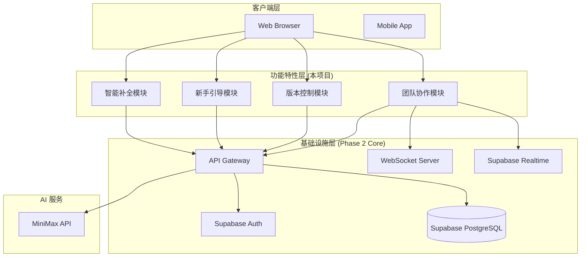
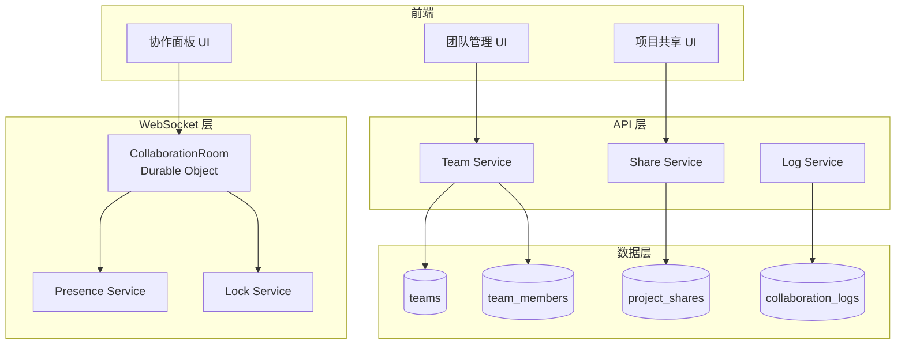
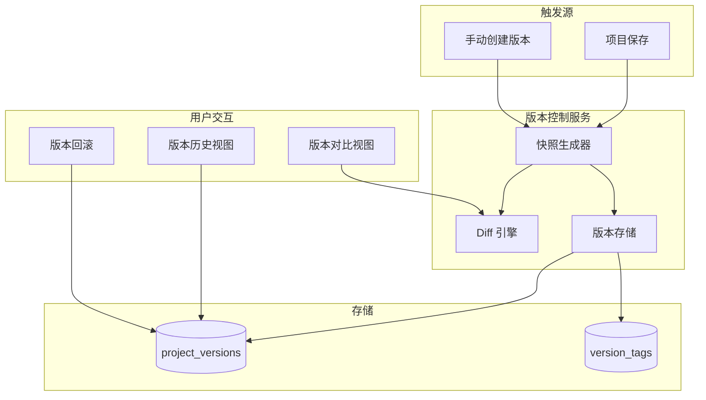
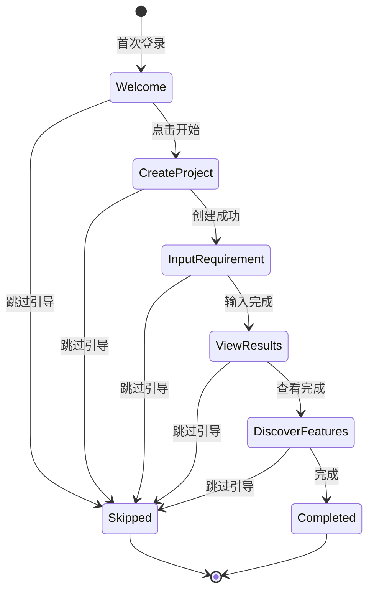
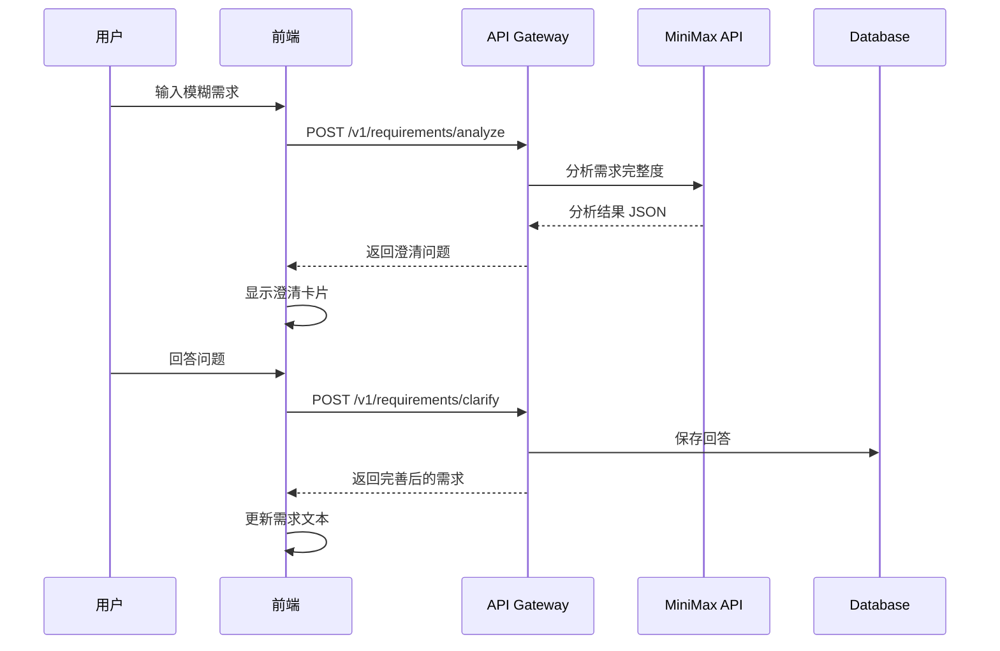

# 架构设计: Phase 2 核心功能特性

**项目**: vibex-phase2-core-features-20260316
**版本**: 1.0
**日期**: 2026-03-16
**作者**: Architect Agent
**基础设施参考**: [vibex-phase2-core-20260316/architecture.md](../vibex-phase2-core-20260316/architecture.md)

---

## 1. Tech Stack (技术栈选型)

### 1.1 核心技术栈

| 组件 | 选型 | 版本 | 理由 |
|------|------|------|------|
| **数据库** | Supabase PostgreSQL | 15+ | Phase 2 已集成 |
| **认证** | Supabase Auth | 内置 | Phase 2 已集成 |
| **实时通信** | WebSocket + Supabase Realtime | 已实现 | Phase 2 已实现 |
| **API 运行时** | Cloudflare Workers + Hono | 现有 | 已部署 |
| **前端** | Next.js 14 + React 18 | 现有 | App Router |
| **状态管理** | Zustand + React Query | 现有 | 已集成 |
| **Diff 算法** | diff-match-patch + deep-diff | 新增 | 版本对比 |
| **引导组件** | 自研 + Radix UI | 新增 | 新手引导 |

### 1.2 技术选型对比

| 功能 | 方案 A | 方案 B | 推荐 |
|------|--------|--------|------|
| 版本对比 | diff-match-patch | jsondiffpatch | A (更成熟) |
| 引导组件 | 自研 | driver.js | 自研 (更灵活) |
| 实时协作 | Durable Objects | Socket.io | Durable Objects (已实现) |

---

## 2. Architecture Diagram (架构图)

### 2.1 整体架构



### 2.2 团队协作架构



### 2.3 版本控制架构



### 2.4 新手引导状态机



### 2.5 智能补全数据流



---

## 3. API Definitions (接口定义)

### 3.1 团队协作 API

```typescript
// POST /v1/teams
interface CreateTeamRequest {
  name: string;
  description?: string;
}

interface CreateTeamResponse {
  id: string;
  name: string;
  owner_id: string;
  created_at: string;
}

// GET /v1/teams
interface ListTeamsResponse {
  teams: Team[];
  total: number;
}

// POST /v1/teams/:id/members
interface InviteMemberRequest {
  email: string;
  role: 'admin' | 'member' | 'viewer';
}

// POST /v1/projects/:id/share
interface ShareProjectRequest {
  team_id?: string;
  user_id?: string;
  permission: 'owner' | 'edit' | 'view';
}

// GET /v1/projects/:id/logs
interface ListCollaborationLogsQuery {
  page?: number;
  limit?: number;
  action?: string;
}

interface CollaborationLog {
  id: string;
  project_id: string;
  user_id: string;
  user_name: string;
  action: string;
  entity_type?: string;
  entity_id?: string;
  changes?: Record<string, unknown>;
  created_at: string;
}
```

### 3.2 版本控制 API

```typescript
// GET /v1/projects/:id/versions
interface ListVersionsResponse {
  versions: ProjectVersion[];
  total: number;
}

interface ProjectVersion {
  id: string;
  project_id: string;
  version_number: number;
  change_summary?: string;
  created_by: string;
  created_at: string;
  tags?: VersionTag[];
}

// GET /v1/projects/:id/versions/:version
interface GetVersionResponse {
  version: ProjectVersion;
  snapshot: ProjectSnapshot;
}

// GET /v1/projects/:id/versions/compare
interface CompareVersionsQuery {
  from_version: number;
  to_version: number;
}

interface CompareVersionsResponse {
  from_version: number;
  to_version: number;
  diff: VersionDiff;
}

// POST /v1/projects/:id/versions/:version/restore
interface RestoreVersionResponse {
  success: boolean;
  new_version: number;
  restored_at: string;
}
```

### 3.3 新手引导 API

```typescript
// GET /v1/onboarding/state
interface OnboardingState {
  user_id: string;
  has_seen_welcome: boolean;
  current_step: string;
  completed_steps: string[];
  dismissed_at?: string;
}

// POST /v1/onboarding/complete-step
interface CompleteStepRequest {
  step: string;
}

// POST /v1/onboarding/dismiss
interface DismissOnboardingResponse {
  success: boolean;
}
```

### 3.4 智能补全 API

```typescript
// POST /v1/requirements/analyze
interface AnalyzeRequirementRequest {
  requirement: string;
}

interface AnalyzeRequirementResponse {
  domain: string;
  completeness: number;
  detected_features: string[];
  missing_areas: string[];
  clarification_questions: ClarificationQuestion[];
  suggestions: string[];
}

interface ClarificationQuestion {
  id: string;
  question: string;
  type: 'single_select' | 'multi_select' | 'text';
  options?: string[];
  reason: string;
}

// POST /v1/requirements/clarify
interface ClarifyRequirementRequest {
  requirement: string;
  question_id: string;
  answer: string | string[];
}

interface ClarifyRequirementResponse {
  updated_requirement: string;
  new_completeness: number;
}
```

---

## 4. Data Model (数据模型)

### 4.1 团队协作 Schema

```sql
-- 团队表
CREATE TABLE teams (
  id UUID PRIMARY KEY DEFAULT gen_random_uuid(),
  name VARCHAR(100) NOT NULL,
  description TEXT,
  owner_id UUID NOT NULL REFERENCES auth.users(id),
  created_at TIMESTAMPTZ DEFAULT NOW(),
  updated_at TIMESTAMPTZ DEFAULT NOW()
);

-- 团队成员表
CREATE TABLE team_members (
  id UUID PRIMARY KEY DEFAULT gen_random_uuid(),
  team_id UUID NOT NULL REFERENCES teams(id) ON DELETE CASCADE,
  user_id UUID NOT NULL REFERENCES auth.users(id),
  role VARCHAR(20) NOT NULL DEFAULT 'member',
  invited_by UUID REFERENCES auth.users(id),
  joined_at TIMESTAMPTZ DEFAULT NOW(),
  UNIQUE(team_id, user_id)
);

-- 项目共享表
CREATE TABLE project_shares (
  id UUID PRIMARY KEY DEFAULT gen_random_uuid(),
  project_id UUID NOT NULL REFERENCES projects(id) ON DELETE CASCADE,
  team_id UUID REFERENCES teams(id),
  user_id UUID REFERENCES auth.users(id),
  permission VARCHAR(20) NOT NULL DEFAULT 'view',
  shared_by UUID NOT NULL REFERENCES auth.users(id),
  shared_at TIMESTAMPTZ DEFAULT NOW(),
  UNIQUE(project_id, COALESCE(team_id, user_id))
);

-- 协作日志表
CREATE TABLE collaboration_logs (
  id UUID PRIMARY KEY DEFAULT gen_random_uuid(),
  project_id UUID NOT NULL REFERENCES projects(id),
  user_id UUID NOT NULL REFERENCES auth.users(id),
  action VARCHAR(50) NOT NULL,
  entity_type VARCHAR(50),
  entity_id UUID,
  changes JSONB,
  created_at TIMESTAMPTZ DEFAULT NOW()
);

-- RLS 策略
CREATE POLICY "Team members can view team"
  ON teams FOR SELECT
  USING (
    owner_id = auth.uid() 
    OR EXISTS (SELECT 1 FROM team_members WHERE team_id = teams.id AND user_id = auth.uid())
  );
```

### 4.2 版本控制 Schema

```sql
-- 项目版本表
CREATE TABLE project_versions (
  id UUID PRIMARY KEY DEFAULT gen_random_uuid(),
  project_id UUID NOT NULL REFERENCES projects(id) ON DELETE CASCADE,
  version_number INTEGER NOT NULL,
  snapshot JSONB NOT NULL,
  changes JSONB,
  change_summary TEXT,
  created_by UUID NOT NULL REFERENCES auth.users(id),
  created_at TIMESTAMPTZ DEFAULT NOW(),
  UNIQUE(project_id, version_number)
);

-- 版本标签表
CREATE TABLE version_tags (
  id UUID PRIMARY KEY DEFAULT gen_random_uuid(),
  version_id UUID NOT NULL REFERENCES project_versions(id) ON DELETE CASCADE,
  name VARCHAR(50) NOT NULL,
  description TEXT,
  created_at TIMESTAMPTZ DEFAULT NOW()
);

-- 索引
CREATE INDEX idx_project_versions_project ON project_versions(project_id);
CREATE INDEX idx_project_versions_created ON project_versions(created_at DESC);
```

### 4.3 新手引导 Schema

```sql
-- 引导状态表
CREATE TABLE onboarding_states (
  id UUID PRIMARY KEY DEFAULT gen_random_uuid(),
  user_id UUID NOT NULL UNIQUE REFERENCES auth.users(id),
  has_seen_welcome BOOLEAN DEFAULT FALSE,
  current_step VARCHAR(50) DEFAULT 'welcome',
  completed_steps TEXT[] DEFAULT '{}',
  dismissed_at TIMESTAMPTZ,
  last_active_at TIMESTAMPTZ DEFAULT NOW()
);
```

---

## 5. Implementation Details (实现细节)

### 5.1 版本快照生成器

```typescript
// src/services/version-service.ts

export class VersionService {
  /**
   * 创建项目版本快照
   */
  async createSnapshot(projectId: string, userId: string): Promise<ProjectVersion> {
    // 获取项目完整数据
    const project = await this.getProject(projectId);
    
    // 生成快照
    const snapshot: ProjectSnapshot = {
      requirementText: project.requirementText,
      boundedContexts: project.boundedContexts,
      domainModels: project.domainModels,
      businessFlows: project.businessFlows,
      pages: project.pages,
      createdAt: new Date().toISOString(),
      createdBy: userId,
    };
    
    // 获取当前最大版本号
    const maxVersion = await this.getMaxVersion(projectId);
    const newVersion = maxVersion + 1;
    
    // 计算与上一版本的差异
    let changes = null;
    if (maxVersion > 0) {
      const prevSnapshot = await this.getSnapshot(projectId, maxVersion);
      changes = this.diffService.diff(prevSnapshot, snapshot);
    }
    
    // 保存版本
    const version = await this.db.insert('project_versions', {
      project_id: projectId,
      version_number: newVersion,
      snapshot,
      changes,
      created_by: userId,
    });
    
    return version;
  }
}
```

### 5.2 Diff 引擎

```typescript
// src/services/diff-service.ts

import * as Diff from 'diff';
import { diff as deepDiff } from 'deep-diff';

export class DiffService {
  /**
   * 文本 Diff
   */
  textDiff(oldText: string, newText: string): TextDiff {
    const changes = Diff.diffChars(oldText, newText);
    return {
      type: 'text',
      changes: changes.map(c => ({
        value: c.value,
        added: c.added,
        removed: c.removed,
      })),
    };
  }

  /**
   * JSON Diff
   */
  jsonDiff(oldObj: unknown, newObj: unknown): JsonDiff {
    const changes = deepDiff(oldObj, newObj);
    return {
      type: 'json',
      changes: changes?.map(c => ({
        kind: c.kind, // N: new, D: deleted, E: edited, A: array
        path: c.path,
        lhs: (c as any).lhs,
        rhs: (c as any).rhs,
      })) || [],
    };
  }

  /**
   * 完整版本对比
   */
  diff(oldSnapshot: ProjectSnapshot, newSnapshot: ProjectSnapshot): VersionDiff {
    return {
      requirementText: this.textDiff(oldSnapshot.requirementText, newSnapshot.requirementText),
      boundedContexts: this.jsonDiff(oldSnapshot.boundedContexts, newSnapshot.boundedContexts),
      domainModels: this.jsonDiff(oldSnapshot.domainModels, newSnapshot.domainModels),
      businessFlows: this.jsonDiff(oldSnapshot.businessFlows, newSnapshot.businessFlows),
      pages: this.jsonDiff(oldSnapshot.pages, newSnapshot.pages),
    };
  }
}
```

### 5.3 引导状态管理

```typescript
// src/hooks/useOnboarding.ts

import { create } from 'zustand';
import { persist } from 'zustand/middleware';

interface OnboardingState {
  hasSeenWelcome: boolean;
  currentStep: OnboardingStep;
  completedSteps: OnboardingStep[];
  dismissedAt: string | null;
  
  completeStep: (step: OnboardingStep) => void;
  skip: () => void;
  reset: () => void;
}

export const useOnboarding = create<OnboardingState>()(
  persist(
    (set, get) => ({
      hasSeenWelcome: false,
      currentStep: 'welcome',
      completedSteps: [],
      dismissedAt: null,
      
      completeStep: (step) => {
        const { completedSteps } = get();
        if (!completedSteps.includes(step)) {
          set({
            completedSteps: [...completedSteps, step],
            currentStep: getNextStep(step),
          });
        }
      },
      
      skip: () => {
        set({
          dismissedAt: new Date().toISOString(),
          currentStep: 'completed',
        });
      },
      
      reset: () => {
        set({
          hasSeenWelcome: false,
          currentStep: 'welcome',
          completedSteps: [],
          dismissedAt: null,
        });
      },
    }),
    {
      name: 'onboarding-state',
    }
  )
);

function getNextStep(current: OnboardingStep): OnboardingStep {
  const steps: OnboardingStep[] = [
    'welcome',
    'create_project',
    'input_requirement',
    'view_results',
    'discover_features',
    'completed',
  ];
  const index = steps.indexOf(current);
  return steps[Math.min(index + 1, steps.length - 1)];
}
```

---

## 6. Testing Strategy (测试策略)

### 6.1 测试框架

| 测试类型 | 框架 | 覆盖率目标 |
|----------|------|-----------|
| 单元测试 | Jest | ≥ 80% |
| 集成测试 | Jest + MSW | ≥ 70% |
| E2E 测试 | Playwright | 关键路径 100% |

### 6.2 核心测试用例

#### 6.2.1 团队协作测试

```typescript
// __tests__/services/team.test.ts

describe('TeamService', () => {
  it('should create team with owner', async () => {
    const team = await teamService.create({
      name: 'Test Team',
      ownerId: 'user-1',
    });
    
    expect(team.id).toBeDefined();
    expect(team.name).toBe('Test Team');
    
    // 验证创建者自动成为 owner
    const members = await teamService.getMembers(team.id);
    expect(members).toContainEqual(
      expect.objectContaining({ userId: 'user-1', role: 'owner' })
    );
  });

  it('should invite member with correct role', async () => {
    const team = await createTestTeam();
    
    await teamService.inviteMember(team.id, {
      email: 'newuser@test.com',
      role: 'member',
    });
    
    const members = await teamService.getMembers(team.id);
    expect(members.find(m => m.email === 'newuser@test.com')?.role).toBe('member');
  });
});
```

#### 6.2.2 版本对比测试

```typescript
// __tests__/services/version.test.ts

describe('VersionService', () => {
  it('should create version with correct number', async () => {
    const project = await createTestProject();
    
    const v1 = await versionService.createSnapshot(project.id, 'user-1');
    expect(v1.version_number).toBe(1);
    
    const v2 = await versionService.createSnapshot(project.id, 'user-1');
    expect(v2.version_number).toBe(2);
  });

  it('should calculate diff correctly', async () => {
    const oldSnapshot = { requirementText: 'Old text', boundedContexts: [] };
    const newSnapshot = { requirementText: 'New text', boundedContexts: [] };
    
    const diff = diffService.diff(oldSnapshot, newSnapshot);
    
    expect(diff.requirementText.changes).toHaveLength(2); // removed + added
  });
});
```

---

## 7. Implementation Roadmap (实施路线图)

### Phase 1: 团队协作 (4 人日)

| 步骤 | 工时 | 产出物 |
|------|------|--------|
| 1.1 数据库 Schema | 0.5h | SQL 迁移文件 |
| 1.2 Team API | 2h | API 端点 |
| 1.3 Share API | 2h | API 端点 |
| 1.4 前端 UI | 4h | 组件代码 |
| 1.5 测试 | 1.5h | 测试用例 |

### Phase 2: 版本控制 (3 人日)

| 步骤 | 工时 | 产出物 |
|------|------|--------|
| 2.1 Schema + API | 2h | 数据库 + API |
| 2.2 Diff 引擎 | 3h | DiffService |
| 2.3 前端 UI | 4h | 组件代码 |
| 2.4 测试 | 1h | 测试用例 |

### Phase 3: 新手引导 (2 人日)

| 步骤 | 工时 | 产出物 |
|------|------|--------|
| 3.1 状态管理 | 1h | useOnboarding hook |
| 3.2 引导组件 | 3h | UI 组件 |
| 3.3 步骤集成 | 2h | 流程集成 |
| 3.4 测试 | 1h | 测试用例 |

**总工期**: 9 人日

---

## 8. 风险评估

| 风险 | 等级 | 影响 | 缓解措施 |
|------|------|------|----------|
| 权限泄露 | 🔴 高 | 用户数据安全 | RLS 策略 + API 双重验证 |
| 版本数据膨胀 | 🟡 中 | 存储成本 | 增量存储 + 定期归档 |
| 协作冲突 | 🟡 中 | 用户体验 | 协作锁 + 冲突检测 |
| AI 成本增加 | 🟢 低 | 预算 | 限流 + 缓存 |

---

## 9. Acceptance Criteria (验收标准)

### 9.1 团队协作

- [ ] TC-001: 创建团队成功，创建者自动成为 owner
- [ ] TC-002: 邀请成员成功，成员收到通知
- [ ] TC-003: 项目共享成功，权限正确生效
- [ ] TC-004: 实时协作正常，协作锁防止冲突
- [ ] TC-005: 协作历史完整记录

### 9.2 版本控制

- [ ] VC-001: 每次保存创建新版本
- [ ] VC-002: 版本历史正确展示
- [ ] VC-003: 版本对比正确显示差异
- [ ] VC-004: 版本回滚成功
- [ ] VC-005: 版本标签正确保存

### 9.3 新手引导

- [ ] OB-001: 新用户首次进入显示欢迎 Modal
- [ ] OB-002: 引导步骤正确推进
- [ ] OB-003: 跳过引导后不再显示
- [ ] OB-004: 引导进度持久化

---

## 10. References (参考文档)

| 文档 | 路径 |
|------|------|
| 基础设施架构 | `/root/.openclaw/vibex/docs/vibex-phase2-core-20260316/architecture.md` |
| 需求分析 | `/root/.openclaw/vibex/docs/vibex-phase2-core-features-20260316/analysis.md` |
| PRD | `/root/.openclaw/vibex/docs/prd/vibex-phase2-core-features-20260316-prd.md` |

---

**产出物**: `/root/.openclaw/vibex/docs/vibex-phase2-core-features-20260316/architecture.md`
**作者**: Architect Agent
**日期**: 2026-03-16