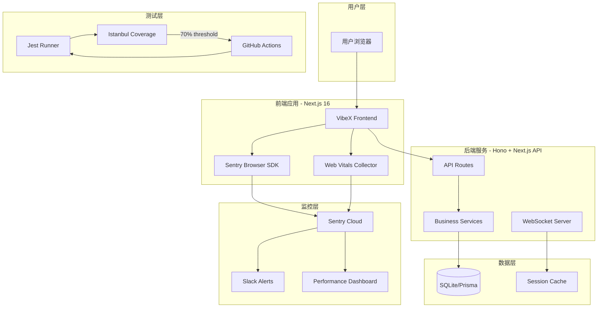
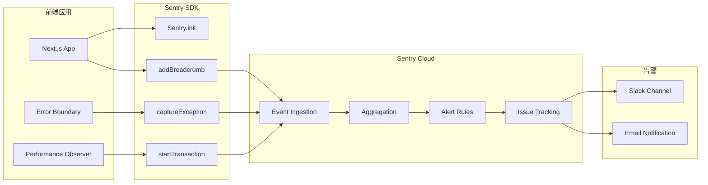
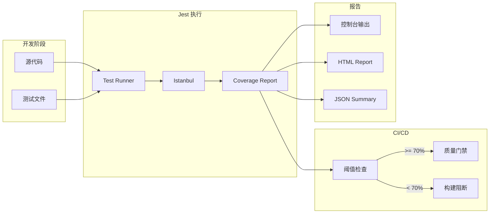
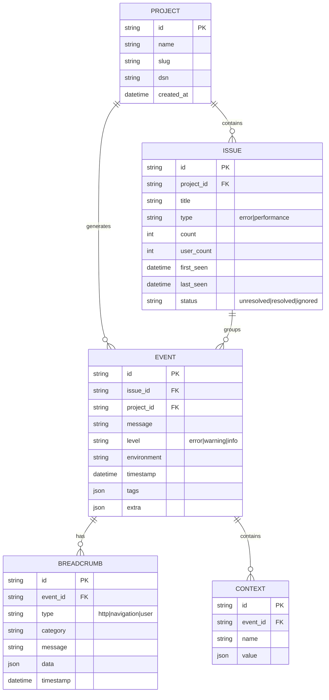
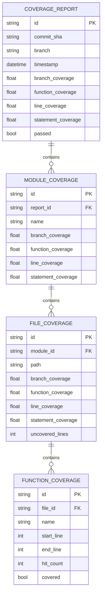
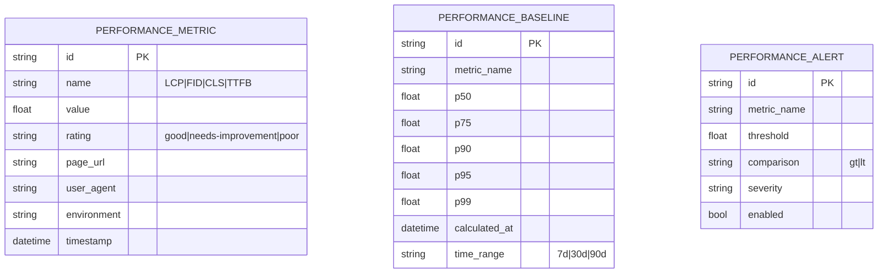

# Phase 3 增强架构设计文档

**项目**: vibex-phase3-enhancements  
**版本**: v1.0  
**日期**: 2026-03-15  
**作者**: Architect Agent

---

## 1. Tech Stack (技术栈选型)

### 1.1 APM 监控技术栈

| 组件 | 选型 | 版本 | 理由 |
|------|------|------|------|
| **APM 平台** | Sentry | SaaS | 开源、功能完整、社区活跃、支持全栈监控 |
| **前端 SDK** | @sentry/nextjs | ^8.x | 官方 Next.js 集成，支持 SSR/SSG |
| **性能指标** | Web Vitals | - | Google 标准性能指标 |
| **错误追踪** | Sentry Browser SDK | 内置 | 自动捕获 JS 错误、Promise 错误、资源错误 |
| **告警通道** | Slack Integration | - | 团队现有沟通工具 |

### 1.2 测试覆盖率技术栈

| 组件 | 选型 | 版本 | 理由 |
|------|------|------|------|
| **测试框架** | Jest | 30.2.0 | 现有技术栈，零学习成本 |
| **覆盖率工具** | Istanbul (内置) | - | Jest 内置，配置简单 |
| **API 测试** | Supertest | ^6.x | HTTP 断言库，与 Jest 集成良好 |
| **Mock 工具** | MSW | 2.12.10 | 现有技术栈，API Mock |
| **E2E 测试** | Playwright | 1.58.2 | 现有技术栈，端到端验证 |

### 1.3 版本选择理由

**Sentry vs 其他 APM 方案对比**:

| 方案 | 优点 | 缺点 | 结论 |
|------|------|------|------|
| Sentry | 开源、免费额度大、全栈支持 | 无基础设施监控 | ✅ 推荐 |
| Datadog | 功能全面、可视化强 | 价格昂贵 | ❌ 成本高 |
| New Relic | 功能丰富 | 免费版限制多 | ❌ 限制多 |
| 自建 ELK | 完全控制 | 运维成本高 | ❌ 维护复杂 |

**结论**: Sentry 是最佳选择，满足需求且成本可控。

---

## 2. Architecture Diagram (架构图)

### 2.1 整体架构



### 2.2 Sentry 集成架构



### 2.3 测试覆盖率流水线



---

## 3. API Definitions (接口定义)

### 3.1 Sentry 配置接口

```typescript
// lib/sentry.ts
import * as Sentry from '@sentry/nextjs';

interface SentryConfig {
  dsn: string;
  environment: 'development' | 'staging' | 'production';
  tracesSampleRate: number;      // 0.0 - 1.0
  replaysSessionSampleRate: number;
  replaysOnErrorSampleRate: number;
}

interface SentryUser {
  id: string;
  email?: string;
  username?: string;
}

// 初始化配置
export function initSentry(config: SentryConfig): void;

// 设置用户上下文
export function setSentryUser(user: SentryUser): void;

// 手动捕获错误
export function captureError(error: Error, context?: Record<string, unknown>): string;

// 性能追踪
export function startTransaction(name: string, op: string): Sentry.Transaction;

// 添加面包屑
export function addBreadcrumb(category: string, message: string, data?: Record<string, unknown>): void;
```

### 3.2 Web Vitals 采集接口

```typescript
// lib/web-vitals.ts
import { Metric } from 'web-vitals';

interface VitalMetric {
  name: 'LCP' | 'FID' | 'CLS' | 'TTFB' | 'FCP' | 'INP';
  value: number;
  rating: 'good' | 'needs-improvement' | 'poor';
  delta: number;
  id: string;
}

interface PerformanceConfig {
  reportEndpoint?: string;
  sampleRate: number;
}

// 初始化性能监控
export function initPerformanceMonitoring(config: PerformanceConfig): void;

// 上报性能指标到 Sentry
export function reportWebVital(metric: VitalMetric): void;

// 获取当前性能快照
export function getPerformanceSnapshot(): Record<string, number>;
```

### 3.3 覆盖率检查接口

```typescript
// scripts/check-coverage.ts
interface CoverageThreshold {
  branches: number;
  functions: number;
  lines: number;
  statements: number;
}

interface CoverageResult {
  total: CoverageThreshold;
  modules: Record<string, CoverageThreshold>;
  passed: boolean;
  failures: string[];
}

interface ModuleThreshold {
  pattern: string;  // glob pattern
  threshold: CoverageThreshold;
}

// 检查覆盖率
export function checkCoverage(): Promise<CoverageResult>;

// 生成覆盖率报告
export function generateCoverageReport(format: 'text' | 'html' | 'json'): Promise<string>;

// 对比覆盖率变化
export function compareCoverage(baseline: CoverageResult, current: CoverageResult): CoverageDiff;

// 阻断构建
export function blockOnCoverage(result: CoverageResult): void;
```

### 3.4 告警规则接口

```typescript
// lib/alert-rules.ts
interface AlertRule {
  id: string;
  name: string;
  condition: AlertCondition;
  action: AlertAction;
  enabled: boolean;
}

interface AlertCondition {
  type: 'error_rate' | 'latency' | 'coverage_drop' | 'new_error';
  threshold: number;
  timeWindow: string;  // e.g., '5m', '1h', '1d'
  comparison: 'gt' | 'lt' | 'eq';
}

interface AlertAction {
  type: 'slack' | 'email' | 'webhook';
  target: string;
  severity: 'critical' | 'warning' | 'info';
}

// 创建告警规则
export function createAlertRule(rule: AlertRule): Promise<AlertRule>;

// 评估告警条件
export function evaluateAlert(ruleId: string): Promise<boolean>;

// 触发告警
export function triggerAlert(rule: AlertRule, context: Record<string, unknown>): Promise<void>;
```

---

## 4. Data Model (数据模型)

### 4.1 Sentry 事件模型



### 4.2 覆盖率数据模型



### 4.3 性能指标模型



---

## 5. Testing Strategy (测试策略)

### 5.1 测试框架与工具

| 测试类型 | 框架 | 工具 | 目标覆盖率 |
|----------|------|------|-----------|
| 单元测试 | Jest 30.2 | Istanbul | 70%+ branches |
| 集成测试 | Jest + Supertest | MSW | 80%+ API 端点 |
| E2E 测试 | Playwright | - | 关键流程 |

### 5.2 覆盖率目标

**全局阈值**:
```javascript
// coverage.config.js
module.exports = {
  thresholds: {
    global: {
      branches: 70,    // 从 35.51% 提升
      functions: 70,
      lines: 70,
      statements: 70,
    },
  },
};
```

**模块优先级**:

| 优先级 | 模块 | 当前覆盖率 | 目标覆盖率 | 预计工时 |
|--------|------|-----------|-----------|----------|
| P0 | `src/app/api/v1/` | 待测 | 80% | 6h |
| P0 | `src/services/domain-model/` | 有测试 | 80% | 2h |
| P1 | `src/services/diagnosis/` | 部分测试 | 75% | 3h |
| P1 | `src/services/business-flow/` | 有测试 | 75% | 3h |

### 5.3 核心测试用例示例

#### 5.3.1 Sentry 集成测试

```typescript
// __tests__/lib/sentry.test.ts
import { initSentry, captureError, setSentryUser } from '@/lib/sentry';
import * as Sentry from '@sentry/nextjs';

jest.mock('@sentry/nextjs');

describe('Sentry Integration', () => {
  beforeEach(() => {
    jest.clearAllMocks();
  });

  describe('initSentry', () => {
    it('should initialize Sentry with correct config', () => {
      const config = {
        dsn: 'https://test@sentry.io/123',
        environment: 'production' as const,
        tracesSampleRate: 0.1,
        replaysSessionSampleRate: 0.1,
        replaysOnErrorSampleRate: 1.0,
      };

      initSentry(config);

      expect(Sentry.init).toHaveBeenCalledWith(
        expect.objectContaining({
          dsn: config.dsn,
          environment: config.environment,
        })
      );
    });
  });

  describe('setSentryUser', () => {
    it('should set user context', () => {
      const user = { id: '123', email: 'test@example.com' };

      setSentryUser(user);

      expect(Sentry.setUser).toHaveBeenCalledWith(user);
    });
  });

  describe('captureError', () => {
    it('should capture exception with context', () => {
      const error = new Error('Test error');
      const context = { component: 'HomePage' };

      captureError(error, context);

      expect(Sentry.captureException).toHaveBeenCalledWith(
        error,
        expect.objectContaining({ extra: context })
      );
    });
  });
});
```

#### 5.3.2 API 覆盖率测试

```typescript
// __tests__/api/v1/projects/route.test.ts
import { GET, POST } from '@/app/api/v1/projects/route';
import { NextRequest } from 'next/server';

describe('/api/v1/projects', () => {
  describe('GET', () => {
    it('should return list of projects', async () => {
      const request = new NextRequest('http://localhost/api/v1/projects');
      const response = await GET(request);

      expect(response.status).toBe(200);
      const data = await response.json();
      expect(Array.isArray(data.projects)).toBe(true);
    });

    it('should filter projects by status', async () => {
      const request = new NextRequest(
        'http://localhost/api/v1/projects?status=active'
      );
      const response = await GET(request);

      expect(response.status).toBe(200);
    });

    it('should handle unauthorized access', async () => {
      // Mock unauthorized session
      const request = new NextRequest('http://localhost/api/v1/projects');
      const response = await GET(request);

      // Branch: unauthorized path
      expect(response.status).toBe(401);
    });
  });

  describe('POST', () => {
    it('should create a new project', async () => {
      const body = { name: 'Test Project', description: 'Test' };
      const request = new NextRequest('http://localhost/api/v1/projects', {
        method: 'POST',
        body: JSON.stringify(body),
      });

      const response = await POST(request);

      expect(response.status).toBe(201);
    });

    it('should validate request body', async () => {
      const body = {}; // Missing required fields
      const request = new NextRequest('http://localhost/api/v1/projects', {
        method: 'POST',
        body: JSON.stringify(body),
      });

      const response = await POST(request);

      // Branch: validation error path
      expect(response.status).toBe(400);
    });
  });
});
```

#### 5.3.3 Web Vitals 测试

```typescript
// __tests__/lib/web-vitals.test.ts
import { reportWebVital, getPerformanceSnapshot } from '@/lib/web-vitals';
import * as Sentry from '@sentry/nextjs';

jest.mock('@sentry/nextjs');

describe('Web Vitals', () => {
  describe('reportWebVital', () => {
    it('should report good LCP metric', () => {
      const metric = {
        name: 'LCP' as const,
        value: 1500,
        rating: 'good' as const,
        delta: 1500,
        id: 'v1-1234567890',
      };

      reportWebVital(metric);

      expect(Sentry.addBreadcrumb).toHaveBeenCalledWith(
        expect.objectContaining({
          category: 'web-vital',
          message: 'LCP: 1500ms (good)',
        })
      );
    });

    it('should report poor CLS metric', () => {
      const metric = {
        name: 'CLS' as const,
        value: 0.35,
        rating: 'poor' as const,
        delta: 0.35,
        id: 'v1-1234567890',
      };

      reportWebVital(metric);

      expect(Sentry.addBreadcrumb).toHaveBeenCalled();
    });
  });

  describe('getPerformanceSnapshot', () => {
    it('should return current metrics', () => {
      const snapshot = getPerformanceSnapshot();

      expect(snapshot).toHaveProperty('LCP');
      expect(snapshot).toHaveProperty('FID');
      expect(snapshot).toHaveProperty('CLS');
    });
  });
});
```

### 5.4 测试执行命令

```bash
# 运行所有测试并生成覆盖率报告
npm run test:coverage

# 运行特定模块测试
npm test -- --testPathPattern="api/v1"

# 检查覆盖率阈值
npm run coverage:check

# 对比覆盖率变化
npm run coverage:diff

# 保存覆盖率历史
npm run coverage:history
```

### 5.5 CI 集成配置

```yaml
# .github/workflows/test-coverage.yml
name: Test Coverage

on:
  push:
    branches: [main, develop]
  pull_request:
    branches: [main]

jobs:
  coverage:
    runs-on: ubuntu-latest

    steps:
      - uses: actions/checkout@v4

      - name: Setup Node.js
        uses: actions/setup-node@v4
        with:
          node-version: '20'
          cache: 'npm'

      - name: Install dependencies
        run: npm ci

      - name: Run tests with coverage
        run: npm run test:coverage

      - name: Check coverage threshold
        run: npm run coverage:check

      - name: Upload coverage report
        uses: codecov/codecov-action@v4
        with:
          files: ./coverage/lcov.info
          fail_ci_if_error: true
```

---

## 6. 实施路线图

### Phase 1: Sentry 集成 (8h)

| 步骤 | 工时 | 产出物 |
|------|------|--------|
| 1.1 Sentry 项目创建 | 1h | Sentry Dashboard |
| 1.2 SDK 集成 | 2h | lib/sentry.ts |
| 1.3 错误捕获配置 | 2h | ErrorBoundary 集成 |
| 1.4 性能监控配置 | 2h | Web Vitals 上报 |
| 1.5 Slack 告警配置 | 1h | 告警规则 |

### Phase 2: 覆盖率提升 (14h)

| 步骤 | 工时 | 目标模块 |
|------|------|----------|
| 2.1 API v1 模块测试 | 6h | src/app/api/v1/** |
| 2.2 Domain Model 测试 | 2h | src/services/domain-model/ |
| 2.3 Diagnosis 测试 | 3h | src/services/diagnosis/ |
| 2.4 Business Flow 测试 | 3h | src/services/business-flow/ |

### Phase 3: 验收 (4h)

| 步骤 | 工时 | 验收内容 |
|------|------|----------|
| 3.1 监控验证 | 2h | Sentry Dashboard 可访问 |
| 3.2 覆盖率验证 | 2h | branches ≥ 70% |

**总工期**: 26 小时 ≈ **3.5 天**

---

## 7. 风险与缓解

| 风险 | 等级 | 缓解措施 |
|------|------|----------|
| Sentry 配额限制 | 🟡 中 | 选择合适套餐，设置采样率 |
| 覆盖率提升困难 | 🟡 中 | 优先核心模块，逐步推进 |
| 告警风暴 | 🟢 低 | 配置告警阈值和聚合规则 |
| 测试维护成本 | 🟡 中 | 自动化测试，CI 集成 |

---

## 8. 验收清单

### 8.1 功能验收

**APM 监控**:
- [ ] Sentry Dashboard 可访问
- [ ] 前端错误自动上报
- [ ] Web Vitals 指标收集
- [ ] Slack 告警正常触发

**覆盖率**:
- [ ] 分支覆盖率 ≥ 70%
- [ ] 所有 API 模块有单元测试
- [ ] CI 覆盖率检查生效

### 8.2 验证命令

```bash
# 覆盖率验证
npm run test:coverage
# 期望: Branch coverage ≥ 70%

# Sentry 验证
curl -I https://sentry.io/api/0/projects/{org}/{project}/
# 期望: 200 OK
```

---

**产出物**: `docs/vibex-phase3-enhancements/architecture.md`  
**作者**: Architect Agent  
**日期**: 2026-03-15