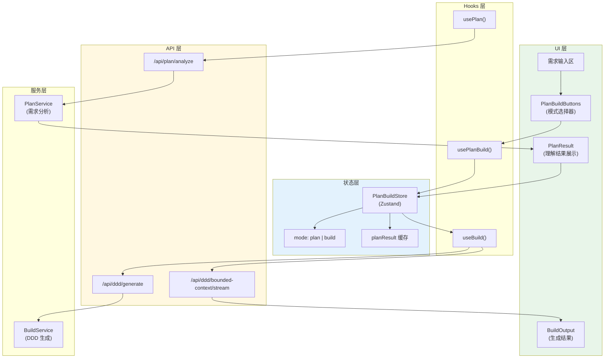
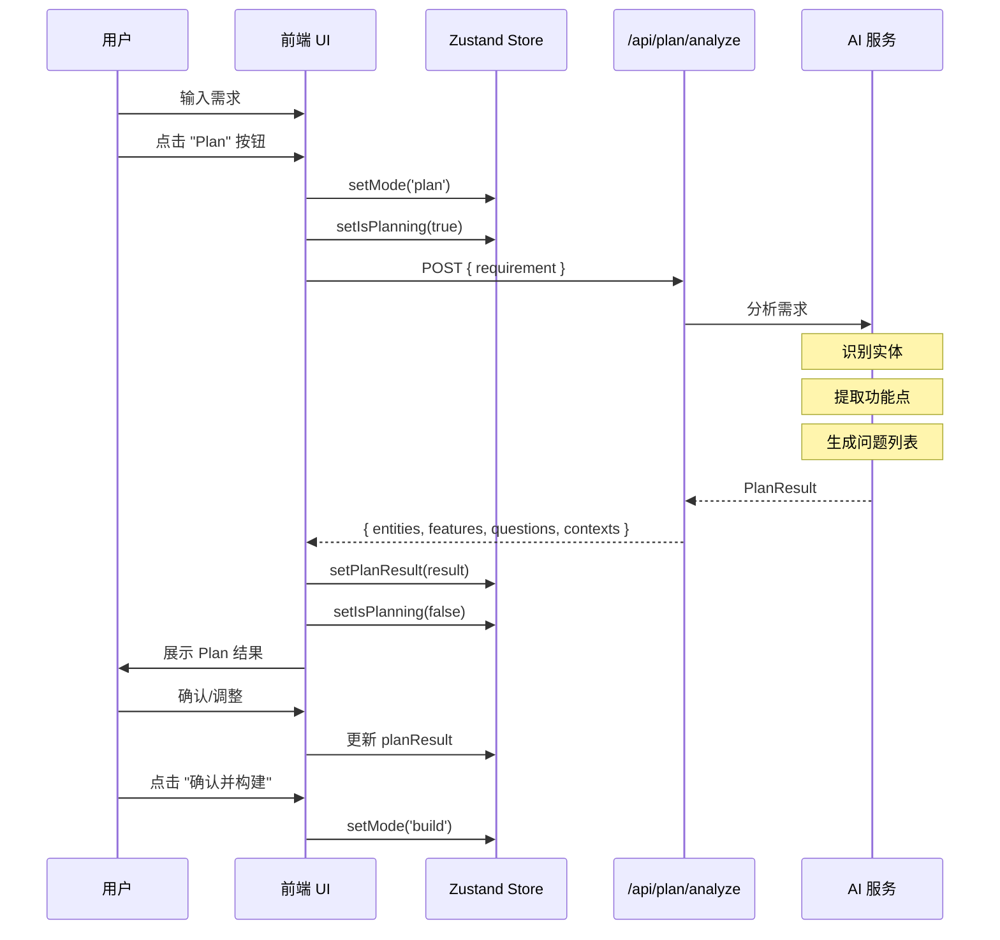
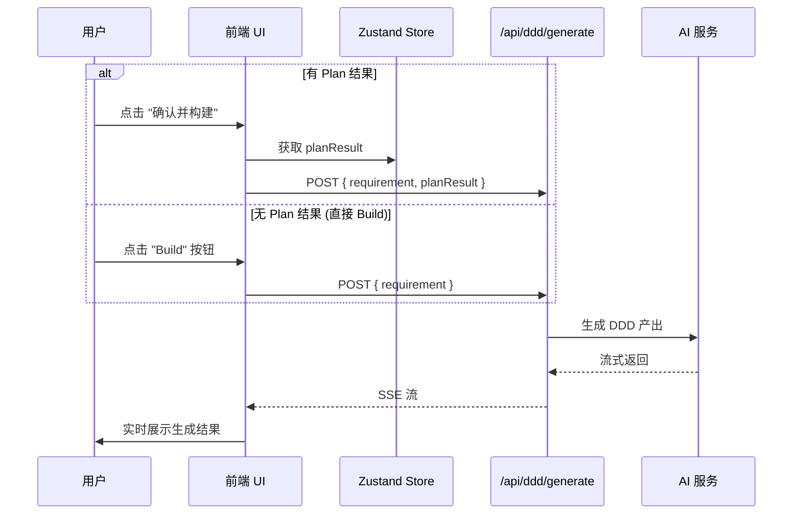
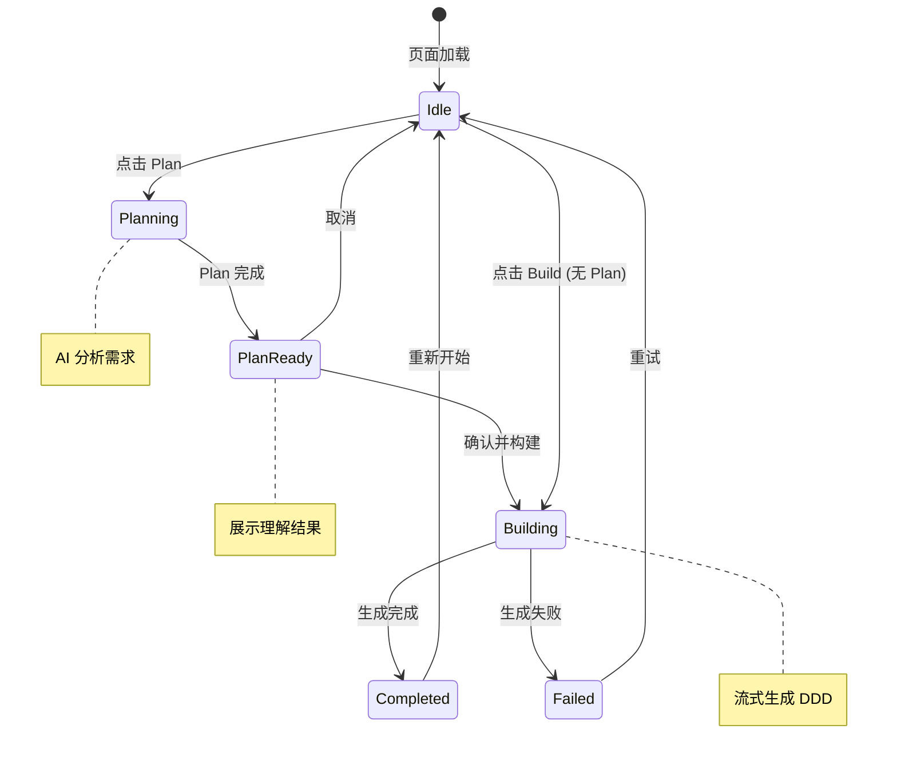

# 架构设计: Plan/Build 双模式切换

**项目**: vibex-plan-build-mode  
**架构师**: Architect Agent  
**版本**: 1.0  
**日期**: 2026-03-14

---

## 1. 技术栈

| 技术 | 版本 | 用途 | 选择理由 |
|------|------|------|----------|
| React | 19.x | UI 框架 | 已有项目基础 |
| Zustand | 4.x | 状态管理 | 已有项目基础，Slice 模式 |
| SSE | - | 流式传输 | 已有 SSE 架构 |
| TypeScript | 5.x | 类型系统 | 已有项目基础 |

---

## 2. 架构图

### 2.1 系统架构



### 2.2 Plan 模式流程



### 2.3 Build 模式流程



### 2.4 状态流转



---

## 3. API 定义

### 3.1 Plan 分析 API

```typescript
// routes/plan.ts

/**
 * POST /api/plan/analyze
 * 分析需求并返回 AI 理解结果
 */
interface PlanAnalyzeRequest {
  requirement: string
  context?: {
    projectId?: string
    previousPlans?: PlanResult[]
  }
}

interface PlanAnalyzeResponse {
  success: boolean
  result: PlanResult
  timestamp: string
}

interface PlanResult {
  // 识别的实体
  entities: Entity[]
  // 功能点列表
  features: Feature[]
  // 需要澄清的问题
  questions: Question[]
  // 建议的限界上下文
  suggestedContexts: SuggestedContext[]
  // 需求摘要
  summary: string
  // 置信度
  confidence: number
}

interface Entity {
  id: string
  name: string
  type: 'aggregate' | 'entity' | 'valueObject' | 'service'
  description: string
  attributes?: string[]
}

interface Feature {
  id: string
  name: string
  description: string
  priority: 'P0' | 'P1' | 'P2'
  relatedEntities: string[]
}

interface Question {
  id: string
  question: string
  type: 'choice' | 'text' | 'confirm'
  options?: string[]
  impact: string  // 影响说明
}

interface SuggestedContext {
  id: string
  name: string
  type: 'core' | 'supporting' | 'generic'
  entities: string[]
  description: string
}

// 实现示例
router.post('/analyze', async (c) => {
  const { requirement } = await c.req.json<PlanAnalyzeRequest>()
  
  const prompt = buildPlanPrompt(requirement)
  const result = await aiService.generateJSON<PlanResult>(prompt, PlanResultSchema)
  
  return c.json<PlanAnalyzeResponse>({
    success: true,
    result,
    timestamp: new Date().toISOString(),
  })
})
```

### 3.2 Build API 扩展

```typescript
// routes/ddd.ts (扩展现有 API)

/**
 * POST /api/ddd/generate
 * 生成 DDD 产出 (支持 Plan 结果)
 */
interface GenerateRequest {
  requirement: string
  planResult?: PlanResult  // 可选：从 Plan 模式传入
}

/**
 * POST /api/ddd/bounded-context/stream
 * 流式生成限界上下文 (支持 Plan 结果)
 */
interface StreamRequest {
  requirementText: string
  planResult?: PlanResult
}
```

### 3.3 前端 Hooks

```typescript
// hooks/use-plan-build.ts

import { create } from 'zustand'

interface PlanBuildState {
  // 模式状态
  mode: 'idle' | 'plan' | 'build' | null
  // Plan 结果
  planResult: PlanResult | null
  // 加载状态
  isPlanning: boolean
  isBuilding: boolean
  // 错误
  error: Error | null
  
  // Actions
  setMode: (mode: 'plan' | 'build' | null) => void
  setPlanResult: (result: PlanResult | null) => void
  setIsPlanning: (value: boolean) => void
  setIsBuilding: (value: boolean) => void
  setError: (error: Error | null) => void
  reset: () => void
}

export const usePlanBuildStore = create<PlanBuildState>((set) => ({
  mode: null,
  planResult: null,
  isPlanning: false,
  isBuilding: false,
  error: null,
  
  setMode: (mode) => set({ mode }),
  setPlanResult: (planResult) => set({ planResult }),
  setIsPlanning: (isPlanning) => set({ isPlanning }),
  setIsBuilding: (isBuilding) => set({ isBuilding }),
  setError: (error) => set({ error }),
  reset: () => set({
    mode: null,
    planResult: null,
    isPlanning: false,
    isBuilding: false,
    error: null,
  }),
}))

// hooks/use-plan.ts

export function usePlan() {
  const { setMode, setPlanResult, setIsPlanning, setError } = usePlanBuildStore()
  
  const analyze = useCallback(async (requirement: string) => {
    setIsPlanning(true)
    setError(null)
    setMode('plan')
    
    try {
      const response = await fetch('/api/plan/analyze', {
        method: 'POST',
        headers: { 'Content-Type': 'application/json' },
        body: JSON.stringify({ requirement }),
      })
      
      if (!response.ok) {
        throw new Error(`Plan failed: ${response.status}`)
      }
      
      const data = await response.json()
      setPlanResult(data.result)
      return data.result
    } catch (err) {
      setError(err instanceof Error ? err : new Error('Plan failed'))
      return null
    } finally {
      setIsPlanning(false)
    }
  }, [])
  
  return { analyze }
}

// hooks/use-build.ts

export function useBuild() {
  const { planResult, setMode, setIsBuilding, setError } = usePlanBuildStore()
  const { generateContexts } = useDDDStream()  // 现有 Hook
  
  const build = useCallback(async (requirement: string) => {
    setIsBuilding(true)
    setError(null)
    setMode('build')
    
    try {
      // 如果有 Plan 结果，一起传入
      await generateContexts(requirement, planResult)
    } catch (err) {
      setError(err instanceof Error ? err : new Error('Build failed'))
    } finally {
      setIsBuilding(false)
    }
  }, [planResult, generateContexts])
  
  const buildDirect = useCallback(async (requirement: string) => {
    // 直接 Build，不使用 Plan 结果
    setIsBuilding(true)
    setMode('build')
    
    try {
      await generateContexts(requirement)
    } catch (err) {
      setError(err instanceof Error ? err : new Error('Build failed'))
    } finally {
      setIsBuilding(false)
    }
  }, [generateContexts])
  
  return { build, buildDirect }
}
```

---

## 4. 数据模型

### 4.1 状态模型

```typescript
// types/plan-build.ts

type Mode = 'idle' | 'plan' | 'build'

interface PlanBuildState {
  mode: Mode
  planResult: PlanResult | null
  isPlanning: boolean
  isBuilding: boolean
  error: Error | null
  
  // 持久化相关
  cachedAt?: number
  requirement?: string
}

// localStorage 持久化
const STORAGE_KEY = 'vibex-plan-build-state'

function persistState(state: PlanBuildState) {
  localStorage.setItem(STORAGE_KEY, JSON.stringify({
    ...state,
    cachedAt: Date.now(),
  }))
}

function loadState(): PlanBuildState | null {
  const saved = localStorage.getItem(STORAGE_KEY)
  if (!saved) return null
  
  const state = JSON.parse(saved)
  // 24 小时过期
  if (Date.now() - state.cachedAt > 24 * 60 * 60 * 1000) {
    localStorage.removeItem(STORAGE_KEY)
    return null
  }
  
  return state
}
```

### 4.2 Plan 结果模型

```typescript
// types/plan-result.ts

interface PlanResult {
  id: string
  requirement: string
  summary: string
  confidence: number  // 0-100
  
  entities: Entity[]
  features: Feature[]
  questions: Question[]
  suggestedContexts: SuggestedContext[]
  
  metadata: {
    analyzedAt: string
    model: string
    tokens: number
  }
}

interface Entity {
  id: string
  name: string
  type: 'aggregate' | 'entity' | 'valueObject' | 'service'
  description: string
  attributes: EntityAttribute[]
  relationships?: EntityRelationship[]
}

interface EntityAttribute {
  name: string
  type: string
  required: boolean
  description?: string
}

interface Feature {
  id: string
  name: string
  description: string
  priority: 'P0' | 'P1' | 'P2'
  category: string
  relatedEntities: string[]
  userStories?: string[]
}

interface Question {
  id: string
  question: string
  type: 'choice' | 'text' | 'confirm' | 'multi'
  options?: string[]
  defaultAnswer?: string
  impact: string
  affectsEntities?: string[]
}

interface SuggestedContext {
  id: string
  name: string
  type: 'core' | 'supporting' | 'generic'
  entities: string[]
  description: string
  dependencies?: string[]
}
```

---

## 5. 模块划分

### 5.1 文件结构

```
src/
├── components/plan-build/
│   ├── PlanBuildButtons.tsx        # Plan/Build 按钮组
│   ├── PlanBuildButtons.module.css
│   ├── PlanResult.tsx              # Plan 结果展示
│   ├── PlanResult.module.css
│   ├── EntityList.tsx              # 实体列表
│   ├── FeatureList.tsx             # 功能点列表
│   ├── QuestionPanel.tsx           # 问题确认面板
│   ├── SuggestedContexts.tsx       # 建议上下文
│   ├── ModeIndicator.tsx           # 模式指示器
│   └── index.ts
│
├── hooks/
│   ├── use-plan-build.ts           # 状态管理 Hook
│   ├── use-plan.ts                 # Plan 逻辑 Hook
│   └── use-build.ts                # Build 逻辑 Hook
│
├── stores/
│   └── plan-build-store.ts         # Zustand Store
│
├── services/
│   └── plan-service.ts             # Plan API 服务
│
├── routes/
│   └── plan.ts                     # Plan API 端点
│
└── types/
    └── plan-build.ts               # 类型定义
```

### 5.2 模块职责

| 模块 | 职责 | 类型 |
|------|------|------|
| PlanBuildButtons | 模式选择 UI | 组件 |
| PlanResult | 结果展示 | 组件 |
| EntityList | 实体列表展示 | 组件 |
| FeatureList | 功能点列表展示 | 组件 |
| QuestionPanel | 问题确认交互 | 组件 |
| use-plan-build | 状态管理 | Hook |
| use-plan | Plan 逻辑 | Hook |
| use-build | Build 逻辑 | Hook |
| plan-service | API 调用 | 服务 |

---

## 6. 核心实现

### 6.1 PlanBuildButtons 组件

```typescript
// components/plan-build/PlanBuildButtons.tsx

import { usePlanBuildStore } from '@/stores/plan-build-store'
import { usePlan } from '@/hooks/use-plan'
import { useBuild } from '@/hooks/use-build'
import styles from './PlanBuildButtons.module.css'

interface PlanBuildButtonsProps {
  requirement: string
  disabled?: boolean
}

export function PlanBuildButtons({ requirement, disabled }: PlanBuildButtonsProps) {
  const { mode, isPlanning, isBuilding, planResult } = usePlanBuildStore()
  const { analyze } = usePlan()
  const { build, buildDirect } = useBuild()
  
  const handlePlan = () => {
    if (!requirement.trim()) return
    analyze(requirement)
  }
  
  const handleBuild = () => {
    if (!requirement.trim()) return
    
    if (planResult) {
      // 有 Plan 结果，基于 Plan 构建
      build(requirement)
    } else {
      // 无 Plan 结果，直接构建
      buildDirect(requirement)
    }
  }
  
  return (
    <div className={styles.container}>
      <button
        className={`${styles.button} ${styles.planButton}`}
        onClick={handlePlan}
        disabled={disabled || isPlanning || isBuilding}
      >
        <span className={styles.icon}>📋</span>
        <span className={styles.label}>Plan</span>
        <span className={styles.hint}>先规划再确认</span>
        {isPlanning && <span className={styles.spinner}>⏳</span>}
      </button>
      
      <button
        className={`${styles.button} ${styles.buildButton}`}
        onClick={handleBuild}
        disabled={disabled || isPlanning || isBuilding}
      >
        <span className={styles.icon}>🚀</span>
        <span className={styles.label}>Build</span>
        <span className={styles.hint}>
          {planResult ? '确认并构建' : '直接开始'}
        </span>
        {isBuilding && <span className={styles.spinner}>⏳</span>}
      </button>
      
      <div className={styles.hint}>
        💡 复杂需求建议使用 Plan 模式
      </div>
    </div>
  )
}
```

### 6.2 PlanResult 组件

```typescript
// components/plan-build/PlanResult.tsx

import { usePlanBuildStore } from '@/stores/plan-build-store'
import { EntityList } from './EntityList'
import { FeatureList } from './FeatureList'
import { QuestionPanel } from './QuestionPanel'
import { SuggestedContexts } from './SuggestedContexts'
import styles from './PlanResult.module.css'

export function PlanResult() {
  const { planResult, isPlanning, setPlanResult } = usePlanBuildStore()
  const { build } = useBuild()
  
  if (isPlanning) {
    return (
      <div className={styles.loading}>
        <div className={styles.spinner}>⏳</div>
        <p>AI 正在分析您的需求...</p>
      </div>
    )
  }
  
  if (!planResult) return null
  
  const handleConfirm = () => {
    build(planResult.requirement)
  }
  
  const handleCancel = () => {
    setPlanResult(null)
  }
  
  const handleUpdateResult = (updates: Partial<PlanResult>) => {
    setPlanResult({ ...planResult, ...updates })
  }
  
  return (
    <div className={styles.container}>
      <div className={styles.header}>
        <h3>📋 AI 需求理解</h3>
        <span className={styles.confidence}>
          置信度: {planResult.confidence}%
        </span>
      </div>
      
      <div className={styles.summary}>
        <p>{planResult.summary}</p>
      </div>
      
      <EntityList 
        entities={planResult.entities} 
        onUpdate={(entities) => handleUpdateResult({ entities })}
      />
      
      <FeatureList 
        features={planResult.features}
        onUpdate={(features) => handleUpdateResult({ features })}
      />
      
      {planResult.questions.length > 0 && (
        <QuestionPanel 
          questions={planResult.questions}
          onAnswer={(questionId, answer) => {
            // 处理用户回答
          }}
        />
      )}
      
      <SuggestedContexts contexts={planResult.suggestedContexts} />
      
      <div className={styles.actions}>
        <button className={styles.secondaryBtn} onClick={handleCancel}>
          ❌ 取消
        </button>
        <button className={styles.primaryBtn} onClick={handleConfirm}>
          ✅ 确认并构建
        </button>
      </div>
    </div>
  )
}
```

### 6.3 Plan 服务

```typescript
// services/plan-service.ts

import type { PlanResult, PlanAnalyzeRequest, PlanAnalyzeResponse } from '@/types/plan-build'

const API_BASE = process.env.NEXT_PUBLIC_API_URL || ''

export class PlanService {
  async analyze(requirement: string): Promise<PlanResult> {
    const response = await fetch(`${API_BASE}/api/plan/analyze`, {
      method: 'POST',
      headers: { 'Content-Type': 'application/json' },
      body: JSON.stringify({ requirement } as PlanAnalyzeRequest),
    })
    
    if (!response.ok) {
      throw new Error(`Plan analysis failed: ${response.status}`)
    }
    
    const data: PlanAnalyzeResponse = await response.json()
    return data.result
  }
  
  buildPrompt(requirement: string): string {
    return `
你是一个 DDD 架构师。请分析以下需求，提取关键信息：

需求描述：
${requirement}

请以 JSON 格式返回：
1. summary: 需求摘要（2-3 句话）
2. entities: 识别的核心实体列表
3. features: 功能点列表
4. questions: 需要澄清的问题
5. suggestedContexts: 建议的限界上下文
6. confidence: 分析置信度 (0-100)

要求：
- 实体名称使用英文
- 功能点按优先级排序
- 问题要具体且有意义
    `.trim()
  }
}

export const planService = new PlanService()
```

### 6.4 首页集成

```typescript
// app/page.tsx (修改部分)

import { PlanBuildButtons } from '@/components/plan-build/PlanBuildButtons'
import { PlanResult } from '@/components/plan-build/PlanResult'
import { usePlanBuildStore } from '@/stores/plan-build-store'

export default function HomePage() {
  const [requirementText, setRequirementText] = useState('')
  const { planResult } = usePlanBuildStore()
  
  return (
    <main className={styles.main}>
      {/* 需求输入区 */}
      <textarea
        value={requirementText}
        onChange={(e) => setRequirementText(e.target.value)}
        placeholder="描述你的产品需求..."
      />
      
      {/* Plan/Build 按钮组 - 替换原有的"开始设计"按钮 */}
      <PlanBuildButtons requirement={requirementText} />
      
      {/* Plan 结果展示 */}
      {planResult && <PlanResult />}
      
      {/* 其他内容 */}
    </main>
  )
}
```

---

## 7. 测试策略

### 7.1 单元测试

```typescript
// __tests__/hooks/use-plan-build.test.ts
import { renderHook, act } from '@testing-library/react'
import { usePlanBuildStore } from '@/stores/plan-build-store'

describe('usePlanBuildStore', () => {
  it('initializes with correct state', () => {
    const { result } = renderHook(() => usePlanBuildStore())
    
    expect(result.current.mode).toBeNull()
    expect(result.current.planResult).toBeNull()
    expect(result.current.isPlanning).toBe(false)
  })
  
  it('sets mode correctly', () => {
    const { result } = renderHook(() => usePlanBuildStore())
    
    act(() => {
      result.current.setMode('plan')
    })
    
    expect(result.current.mode).toBe('plan')
  })
  
  it('resets state', () => {
    const { result } = renderHook(() => usePlanBuildStore())
    
    act(() => {
      result.current.setMode('plan')
      result.current.setPlanResult({} as any)
    })
    
    act(() => {
      result.current.reset()
    })
    
    expect(result.current.mode).toBeNull()
    expect(result.current.planResult).toBeNull()
  })
})

// __tests__/services/plan-service.test.ts
describe('PlanService', () => {
  it('analyzes requirement and returns result', async () => {
    const result = await planService.analyze('开发一个电商平台')
    
    expect(result.entities).toBeDefined()
    expect(result.features).toBeDefined()
    expect(result.confidence).toBeGreaterThan(0)
  })
})
```

### 7.2 E2E 测试

```typescript
// tests/e2e/plan-build-flow.spec.ts
import { test, expect } from '@playwright/test'

test('Plan mode flow', async ({ page }) => {
  await page.goto('/')
  
  // 输入需求
  await page.fill('textarea', '开发一个电商平台，支持商品管理、订单处理和用户系统')
  
  // 点击 Plan
  await page.click('button:has-text("Plan")')
  
  // 等待 Plan 结果
  await expect(page.locator('.plan-result')).toBeVisible({ timeout: 10000 })
  
  // 验证实体列表
  await expect(page.locator('.entity-list')).toBeVisible()
  
  // 点击确认构建
  await page.click('button:has-text("确认并构建")')
  
  // 验证进入 Build 流程
  await expect(page.locator('.thinking-panel')).toBeVisible()
})

test('Build direct flow', async ({ page }) => {
  await page.goto('/')
  
  await page.fill('textarea', '开发一个博客系统')
  
  // 直接点击 Build
  await page.click('button:has-text("Build")')
  
  // 验证直接进入生成
  await expect(page.locator('.thinking-panel')).toBeVisible()
})
```

### 7.3 覆盖率目标

| 模块 | 覆盖率目标 |
|------|-----------|
| usePlanBuildStore | 90% |
| usePlan | 85% |
| useBuild | 85% |
| PlanService | 80% |
| PlanBuildButtons | 75% |
| PlanResult | 70% |

---

## 8. 性能优化

### 8.1 Plan 结果缓存

| 策略 | 实现 |
|------|------|
| localStorage 持久化 | 缓存 24 小时 |
| 相似需求复用 | 基于需求文本 hash |
| 增量更新 | 用户调整时只更新变化部分 |

### 8.2 UI 性能

| 策略 | 实现 |
|------|------|
| 组件懒加载 | PlanResult 按需加载 |
| 虚拟列表 | 实体/功能点过多时使用 |
| 防抖 | 输入时防抖触发 Plan |

---

## 9. 风险评估

| 风险 | 概率 | 影响 | 缓解措施 |
|------|------|------|----------|
| Plan 结果不准确 | 中 | 中 | 用户可调整 + 置信度提示 |
| 增加用户操作步骤 | 中 | 低 | 保留 Build 快捷模式 |
| API 响应慢 | 中 | 中 | 流式输出 + Loading 动画 |
| 状态同步问题 | 低 | 高 | Zustand 统一管理 |

---

## 10. 实施计划

| 阶段 | 内容 | 工时 |
|------|------|------|
| Phase 1 | Zustand Store + Hooks | 0.5 天 |
| Phase 2 | Plan API + 服务 | 1 天 |
| Phase 3 | UI 组件 (按钮/结果展示) | 1.5 天 |
| Phase 4 | 首页集成 | 0.5 天 |
| Phase 5 | 测试 + 优化 | 0.5 天 |

**总工时**: 4 天

---

## 11. 检查清单

- [x] 技术栈选型 (Zustand + SSE)
- [x] 架构图 (系统架构 + 流程 + 状态流转)
- [x] API 定义 (Plan API + Build 扩展)
- [x] 数据模型 (状态 + Plan 结果)
- [x] 核心实现 (组件 + Hooks + 服务)
- [x] 首页集成方案
- [x] 测试策略 (单元 + E2E)
- [x] 性能优化策略
- [x] 风险评估

---

**产出物**: `/root/.openclaw/vibex/docs/vibex-plan-build-mode/architecture.md`