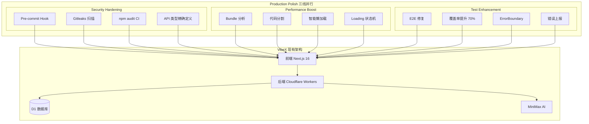
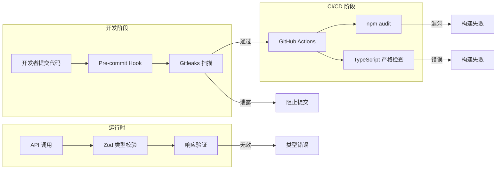
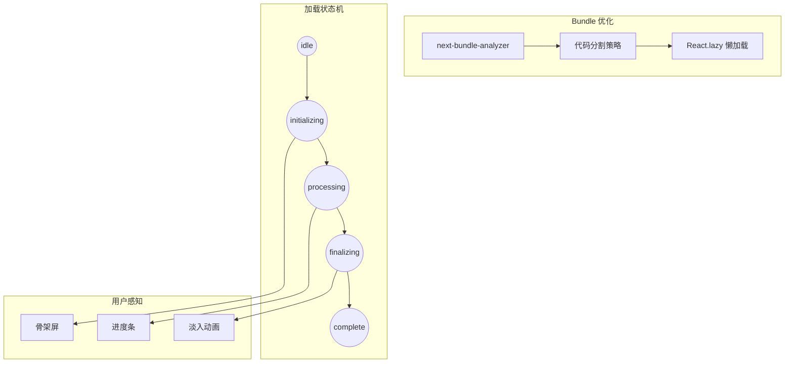
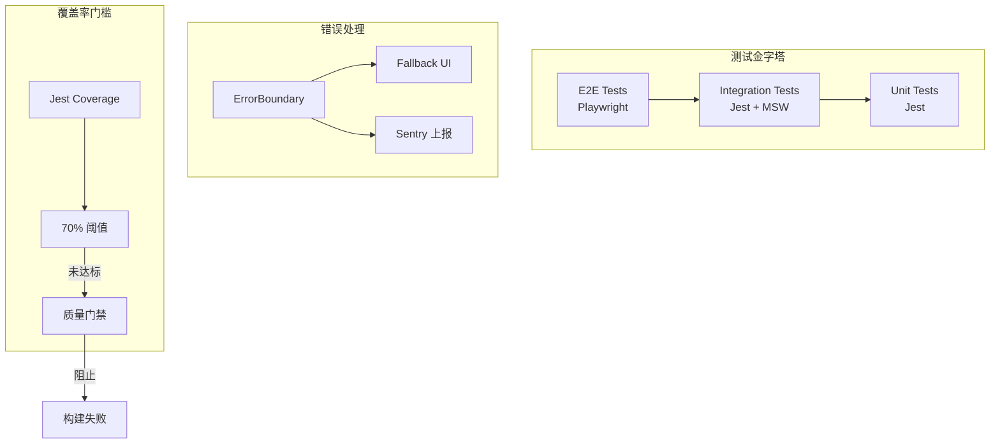
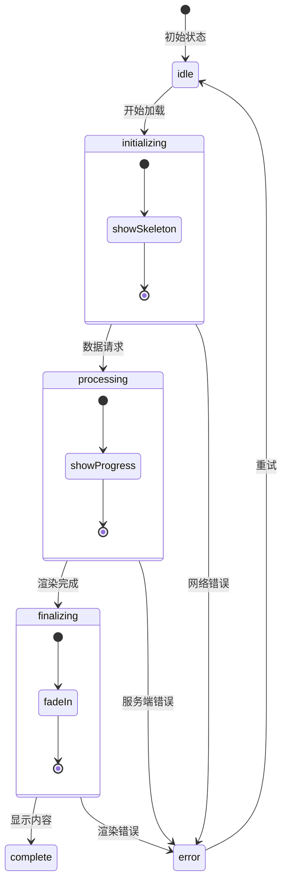
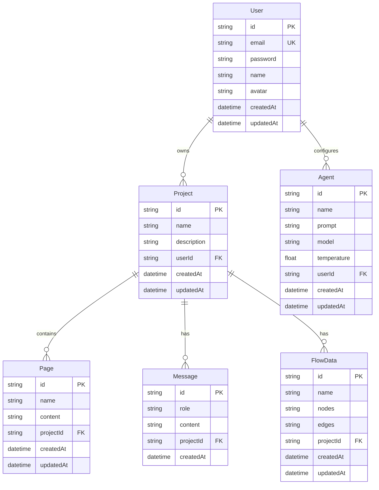

# VibeX Production Polish - 架构设计

**项目**: vibex-production-polish  
**架构师**: Architect Agent  
**日期**: 2026-03-11  
**状态**: in-progress

---

## 1. 技术栈

### 1.1 前端技术栈 (基于现有架构)

| 技术 | 版本 | 选择理由 |
|-----|------|---------|
| Next.js | 16.1.6 | 现有版本，App Router 模式 |
| React | 19.2.3 | 现有版本，支持 Suspense |
| TypeScript | 5.x | 现有版本，类型安全 |
| Zustand | 现有 | 轻量级状态管理 |
| React Flow | 11.11.4 | 流程图可视化 |
| Mermaid | 11.12.3 | 图表渲染 |
| Jest | 30.2.0 | 单元测试框架 |
| Playwright | 1.58.2 | E2E 测试框架 |

### 1.2 生产就绪新增依赖

| 技术 | 版本 | 选择理由 | 子项目 |
|-----|------|---------|--------|
| Gitleaks | 8.x | 敏感信息扫描，成熟工具 | security-hardening |
| next-bundle-analyzer | 1.x | Bundle 分析，Next.js 官方推荐 | performance-boost |
| @sentry/nextjs | 8.x | 错误监控，生产必备 | test-enhancement |
| zod | 3.x | 运行时类型校验 | security-hardening |

### 1.3 后端技术栈

| 技术 | 版本 | 说明 |
|-----|------|------|
| Cloudflare Workers | - | Edge 部署 |
| D1 | - | SQLite 数据库 |
| Prisma | 现有 | ORM |
| MiniMax API | - | AI 对话服务 |

---

## 2. 架构图

### 2.1 生产就绪总体架构



### 2.2 安全加固架构



### 2.3 性能优化架构



### 2.4 测试增强架构



### 2.5 Loading 状态机流程



---

## 3. API 定义

### 3.1 新增 Health Check API

```typescript
// GET /api/health
interface HealthCheckResponse {
  status: 'ok' | 'degraded' | 'error';
  timestamp: string;
  version: string;
  services: {
    database: 'connected' | 'disconnected';
    ai: 'available' | 'unavailable';
  };
}

// 实现示例
export async function GET() {
  const dbStatus = await checkDatabaseConnection();
  const aiStatus = await checkAIService();
  
  return Response.json({
    status: dbStatus && aiStatus ? 'ok' : 'degraded',
    timestamp: new Date().toISOString(),
    version: process.env.npm_package_version || '1.0.0',
    services: {
      database: dbStatus ? 'connected' : 'disconnected',
      ai: aiStatus ? 'available' : 'unavailable',
    }
  });
}
```

### 3.2 API 类型精确定义

```typescript
// types/api.ts
import { z } from 'zod';

// 项目 API 类型
export const ProjectSchema = z.object({
  id: z.string().uuid(),
  name: z.string().min(1).max(100),
  description: z.string().nullable(),
  userId: z.string().uuid(),
  createdAt: z.string().datetime(),
  updatedAt: z.string().datetime(),
});

export const ProjectCreateSchema = ProjectSchema.omit({
  id: true,
  createdAt: true,
  updatedAt: true,
});

export const ProjectUpdateSchema = ProjectCreateSchema.partial();

// 消息 API 类型
export const MessageSchema = z.object({
  id: z.string().uuid(),
  role: z.enum(['user', 'assistant', 'system']),
  content: z.string(),
  projectId: z.string().uuid(),
  createdAt: z.string().datetime(),
});

export const MessageCreateSchema = MessageSchema.omit({
  id: true,
  createdAt: true,
});

// 统一响应类型
export const ApiResponseSchema = <T extends z.ZodTypeAny>(dataSchema: T) =>
  z.object({
    success: z.boolean(),
    data: dataSchema.optional(),
    error: z.string().optional(),
    code: z.number().optional(),
  });

// 类型导出
export type Project = z.infer<typeof ProjectSchema>;
export type ProjectCreate = z.infer<typeof ProjectCreateSchema>;
export type Message = z.infer<typeof MessageSchema>;
```

### 3.3 Loading 状态机 API

```typescript
// hooks/useLoadingState.ts
type LoadingState = 
  | 'idle'
  | 'initializing'
  | 'processing'
  | 'finalizing'
  | 'complete'
  | 'error';

interface LoadingStateMachine {
  state: LoadingState;
  progress: number;
  message: string;
  start: () => void;
  updateProgress: (progress: number, message?: string) => void;
  complete: () => void;
  error: (message: string) => void;
  reset: () => void;
}

function useLoadingState(): LoadingStateMachine {
  const [state, setState] = useState<LoadingState>('idle');
  const [progress, setProgress] = useState(0);
  const [message, setMessage] = useState('');
  
  const start = () => {
    setState('initializing');
    setProgress(0);
    setMessage('正在初始化...');
  };
  
  const updateProgress = (p: number, msg?: string) => {
    setState('processing');
    setProgress(Math.min(100, Math.max(0, p)));
    if (msg) setMessage(msg);
  };
  
  const complete = () => {
    setState('finalizing');
    setProgress(100);
    setTimeout(() => setState('complete'), 300);
  };
  
  const error = (msg: string) => {
    setState('error');
    setMessage(msg);
  };
  
  const reset = () => {
    setState('idle');
    setProgress(0);
    setMessage('');
  };
  
  return { state, progress, message, start, updateProgress, complete, error, reset };
}
```

### 3.4 ErrorBoundary 组件 API

```typescript
// components/ui/ErrorBoundary.tsx
interface ErrorBoundaryProps {
  children: React.ReactNode;
  fallback?: React.ReactNode | FallbackRender;
  onError?: (error: Error, errorInfo: React.ErrorInfo) => void;
  onRetry?: () => void;
  level?: 'global' | 'page' | 'component';
}

type FallbackRender = (params: {
  error: Error;
  resetErrorBoundary: () => void;
  level: 'global' | 'page' | 'component';
}) => React.ReactNode;

// HOC 包装器
function withErrorBoundary<P extends object>(
  Component: React.ComponentType<P>,
  errorBoundaryProps?: Omit<ErrorBoundaryProps, 'children'>
): React.FC<P>;

// 使用示例
const SafeMermaidPreview = withErrorBoundary(MermaidPreview, {
  level: 'component',
  onError: (error) => console.error('Mermaid error:', error),
});
```

---

## 4. 数据模型

### 4.1 核心实体关系 (ER 图)



### 4.2 Loading 状态模型

```typescript
// models/loading-state.ts
interface LoadingStateModel {
  // 状态机
  current: LoadingState;
  
  // 进度信息
  progress: {
    value: number;      // 0-100
    message: string;    // 用户可见描述
    estimatedTime?: number;  // 预计剩余秒数
  };
  
  // 错误信息
  error?: {
    code: string;
    message: string;
    retryable: boolean;
  };
  
  // 动画配置
  animation: {
    skeletonDelay: number;   // 骨架屏显示延迟
    fadeInDuration: number;  // 淡入动画时长
    minDisplayTime: number;  // 最小显示时间
  };
}

type LoadingState = 
  | { type: 'idle' }
  | { type: 'initializing'; animation: SkeletonConfig }
  | { type: 'processing'; progress: ProgressInfo }
  | { type: 'finalizing'; animation: FadeConfig }
  | { type: 'complete' }
  | { type: 'error'; error: ErrorInfo };
```

### 4.3 错误分类模型

```typescript
// models/error-classification.ts
enum ErrorSeverity {
  CRITICAL = 'critical',   // 应用级崩溃
  HIGH = 'high',           // 页面级崩溃
  MEDIUM = 'medium',       // 组件级崩溃
  LOW = 'low'              // 功能降级
}

enum ErrorCategory {
  NETWORK = 'network',
  RENDER = 'render',
  VALIDATION = 'validation',
  BUSINESS = 'business',
  UNKNOWN = 'unknown'
}

interface ClassifiedError {
  severity: ErrorSeverity;
  category: ErrorCategory;
  message: string;
  userMessage: string;     // 用户可见消息
  stack?: string;
  componentStack?: string;
  retryable: boolean;
  recoveryAction?: string; // 恢复动作提示
}

// 错误分类器
function classifyError(error: Error, context?: string): ClassifiedError {
  // 网络错误
  if (error.message.includes('fetch') || error.message.includes('network')) {
    return {
      severity: ErrorSeverity.HIGH,
      category: ErrorCategory.NETWORK,
      message: error.message,
      userMessage: '网络连接失败，请检查网络后重试',
      retryable: true,
      recoveryAction: '点击重试按钮',
    };
  }
  
  // 渲染错误 (Mermaid 等)
  if (context?.includes('Mermaid') || context?.includes('render')) {
    return {
      severity: ErrorSeverity.MEDIUM,
      category: ErrorCategory.RENDER,
      message: error.message,
      userMessage: '图表渲染失败，可能是语法错误',
      retryable: true,
      recoveryAction: '检查图表语法或重试',
    };
  }
  
  // 默认
  return {
    severity: ErrorSeverity.HIGH,
    category: ErrorCategory.UNKNOWN,
    message: error.message,
    userMessage: '发生未知错误，请刷新页面重试',
    retryable: false,
  };
}
```

---

## 5. 测试策略

### 5.1 测试框架与工具

| 框架/工具 | 版本 | 用途 |
|----------|------|------|
| Jest | 30.2.0 | 单元测试、覆盖率 |
| React Testing Library | 16.x | 组件测试 |
| Playwright | 1.58.2 | E2E 测试 |
| MSW | 2.12.10 | API Mock |
| @testing-library/jest-dom | 6.9.1 | DOM 断言扩展 |

### 5.2 覆盖率要求

| 层级 | 当前覆盖率 | 目标覆盖率 | 说明 |
|-----|----------|-----------|------|
| 全局 | 62% | **70%** | 质量门槛 |
| 组件 | 40% | 60% | UI 组件 |
| 服务 | 50% | 75% | 业务逻辑 |
| Hooks | 40% | 65% | 状态管理 |
| 工具函数 | 45% | 80% | 纯函数 |

### 5.3 测试配置更新

```typescript
// jest.config.ts 更新
export default {
  // ... 现有配置
  coverageThreshold: {
    global: {
      branches: 70,
      functions: 70,
      lines: 70,
      statements: 70
    }
  },
  // 新增 E2E 测试忽略
  testPathIgnorePatterns: [
    '/node_modules/',
    '/e2e/',
    '/.next/',
    '/coverage/'
  ]
};
```

### 5.4 核心测试用例

#### 5.4.1 Loading 状态机测试

```typescript
// __tests__/hooks/useLoadingState.test.ts
describe('useLoadingState', () => {
  it('should start with idle state', () => {
    const { result } = renderHook(() => useLoadingState());
    expect(result.current.state).toBe('idle');
    expect(result.current.progress).toBe(0);
  });

  it('should transition through states correctly', () => {
    const { result } = renderHook(() => useLoadingState());
    
    act(() => result.current.start());
    expect(result.current.state).toBe('initializing');
    
    act(() => result.current.updateProgress(50, '处理中'));
    expect(result.current.state).toBe('processing');
    expect(result.current.progress).toBe(50);
    expect(result.current.message).toBe('处理中');
    
    act(() => result.current.complete());
    expect(result.current.state).toBe('complete');
  });

  it('should handle errors', () => {
    const { result } = renderHook(() => useLoadingState());
    
    act(() => result.current.start());
    act(() => result.current.error('Something went wrong'));
    
    expect(result.current.state).toBe('error');
    expect(result.current.message).toBe('Something went wrong');
  });

  it('should reset to idle', () => {
    const { result } = renderHook(() => useLoadingState());
    
    act(() => result.current.start());
    act(() => result.current.reset());
    
    expect(result.current.state).toBe('idle');
    expect(result.current.progress).toBe(0);
  });
});
```

#### 5.4.2 ErrorBoundary 测试

```typescript
// __tests__/components/ErrorBoundary.test.tsx
describe('ErrorBoundary', () => {
  const ThrowError = () => {
    throw new Error('Test error');
  };

  it('should catch rendering errors from children', () => {
    render(
      <ErrorBoundary fallback={<div>Error caught</div>}>
        <ThrowError />
      </ErrorBoundary>
    );
    expect(screen.getByText('Error caught')).toBeInTheDocument();
  });

  it('should call onError callback', () => {
    const onError = jest.fn();
    render(
      <ErrorBoundary onError={onError}>
        <ThrowError />
      </ErrorBoundary>
    );
    expect(onError).toHaveBeenCalledWith(
      expect.any(Error),
      expect.objectContaining({ componentStack: expect.any(String) })
    );
  });

  it('should reset error state on retry', async () => {
    const { rerender } = render(
      <ErrorBoundary>
        <ThrowError />
      </ErrorBoundary>
    );
    
    fireEvent.click(screen.getByText('重试'));
    expect(screen.queryByText('Error')).not.toBeInTheDocument();
  });

  it('should render custom fallback', () => {
    render(
      <ErrorBoundary fallback={<div data-testid="custom-error">Custom</div>}>
        <ThrowError />
      </ErrorBoundary>
    );
    expect(screen.getByTestId('custom-error')).toBeInTheDocument();
  });
});
```

#### 5.4.3 E2E 测试场景

```typescript
// e2e/production-readiness.spec.ts
import { test, expect } from '@playwright/test';

test.describe('Production Readiness', () => {
  test('Health check endpoint should return ok', async ({ request }) => {
    const response = await request.get('/api/health');
    expect(response.ok()).toBeTruthy();
    
    const data = await response.json();
    expect(data.status).toBe('ok');
    expect(data.services.database).toBe('connected');
  });

  test('Loading state should show skeleton then content', async ({ page }) => {
    await page.goto('/confirm/context');
    
    // 应该先看到骨架屏
    await expect(page.locator('[data-testid="skeleton"]')).toBeVisible();
    
    // 然后看到内容
    await expect(page.locator('[data-testid="content"]')).toBeVisible({
      timeout: 5000
    });
  });

  test('Error boundary should catch and show retry', async ({ page }) => {
    await page.goto('/confirm/context');
    
    // 模拟错误
    await page.evaluate(() => {
      window.__simulateMermaidError = true;
    });
    
    // 应该看到错误边界 UI
    await expect(page.locator('text=图表渲染失败')).toBeVisible();
    await expect(page.locator('button:has-text("重试")')).toBeVisible();
    
    // 点击重试
    await page.click('button:has-text("重试")');
    await expect(page.locator('text=图表渲染失败')).not.toBeVisible();
  });

  test('Bundle should be optimized', async ({ page }) => {
    // 检查主要 chunk 大小
    const response = await page.goto('/');
    const resources = await page.evaluate(() => 
      performance.getEntriesByType('resource')
        .filter(r => r.name.includes('.js'))
        .map(r => ({ name: r.name, size: r.transferSize }))
    );
    
    // 主 bundle 应该小于 500KB
    const mainBundle = resources.find(r => r.name.includes('main'));
    expect(mainBundle?.size).toBeLessThan(500 * 1024);
  });
});
```

### 5.5 测试命令

```bash
# 单元测试
pnpm test

# 覆盖率检查
pnpm test:coverage

# E2E 测试
pnpm test:e2e

# 覆盖率门槛检查
pnpm coverage:check
```

---

## 6. 实施检查清单

### 6.1 安全加固 (security-hardening)

- [ ] 配置 Gitleaks pre-commit hook
- [ ] 添加 npm audit CI 检查
- [ ] 更新 TypeScript strict 模式
- [ ] 添加 Zod 运行时校验
- [ ] API 类型精确化

### 6.2 性能优化 (performance-boost)

- [ ] 安装 next-bundle-analyzer
- [ ] 分析 Bundle 大小
- [ ] 实施代码分割策略
- [ ] 添加 React.lazy 懒加载
- [ ] 实现 Loading 状态机
- [ ] 添加骨架屏组件

### 6.3 测试增强 (test-enhancement)

- [ ] 修复 E2E 测试配置
- [ ] 提升测试覆盖率至 70%
- [ ] 部署全局 ErrorBoundary
- [ ] 添加组件级 ErrorBoundary
- [ ] 集成 Sentry 错误上报

---

## 7. 风险评估

| 风险 | 可能性 | 影响 | 缓解措施 |
|-----|-------|------|---------|
| Bundle 优化影响现有功能 | 中 | 中 | E2E 回归测试 |
| TypeScript 严格模式引入类型错误 | 低 | 低 | 渐进式迁移 |
| 测试覆盖率提升困难 | 低 | 中 | 聚焦核心模块 |
| Sentry 配置复杂 | 低 | 低 | 使用官方文档 |

---

## 8. 交付物

| 产出物 | 路径 | 验证方式 |
|-------|------|---------|
| 架构设计文档 | `docs/vibex-production-polish/architecture.md` | 文件存在 |
| Health API 实现 | `app/api/health/route.ts` | GET /api/health 返回 200 |
| Loading 状态机 | `hooks/useLoadingState.ts` | 单元测试通过 |
| ErrorBoundary 增强 | `components/ui/ErrorBoundary.tsx` | 组件测试通过 |
| 测试配置更新 | `jest.config.ts` | 覆盖率 >= 70% |

---

*文档版本: 1.0*  
*创建时间: 2026-03-11*  
*作者: Architect Agent*