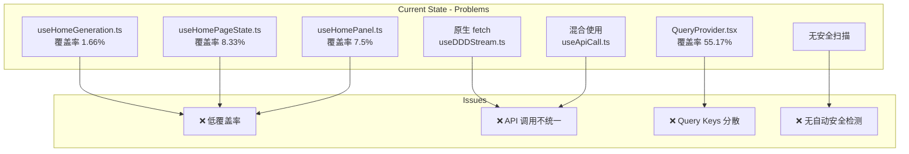
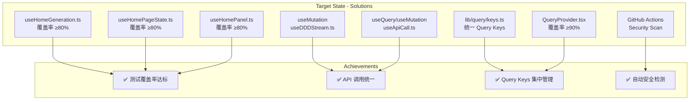
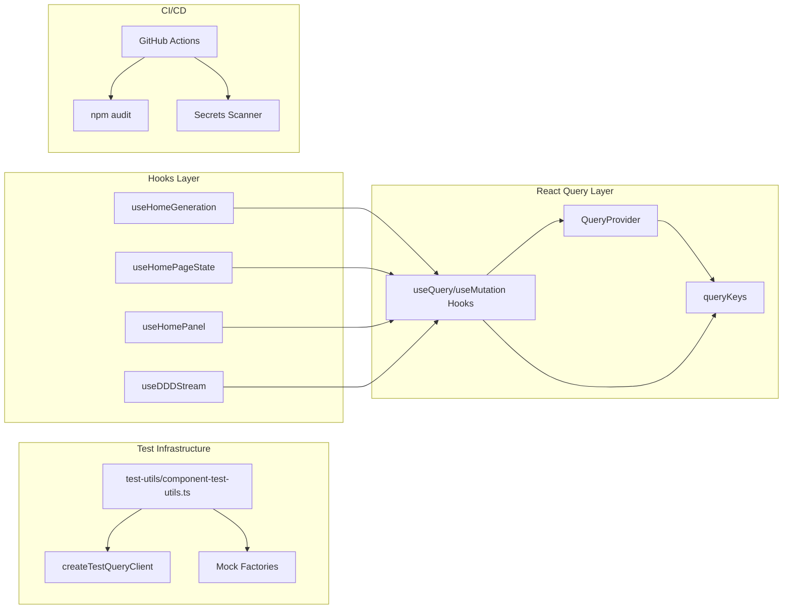
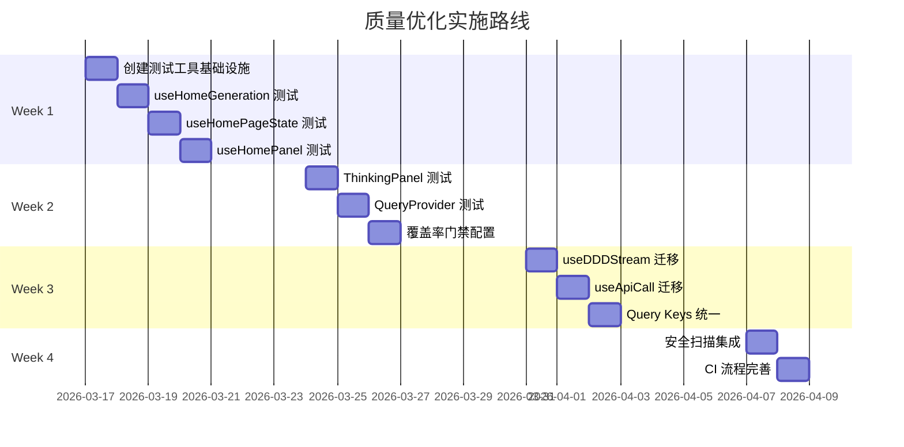

# Vibex 质量优化 Phase 1 架构设计

**项目**: vibex-quality-optimization-20260317  
**架构师**: Architect Agent  
**日期**: 2026-03-17  
**状态**: ✅ 设计完成

---

## 一、技术栈

| 技术 | 版本 | 用途 | 说明 |
|------|------|------|------|
| React Query | 5.x | 数据获取与缓存 | 已集成，需统一使用 |
| Jest | 29.x | 单元测试 | 已配置，需提升覆盖率 |
| React Testing Library | 14.x | 组件测试 | 已配置 |
| TypeScript | 5.x | 类型安全 | 已配置 |
| GitHub Actions | - | CI/CD | 需新增安全扫描 |

---

## 二、架构图

### 2.1 当前架构状态



### 2.2 目标架构



### 2.3 组件依赖关系



---

## 三、核心模块设计

### 3.1 测试基础设施

#### 3.1.1 统一测试工具 (新增)

```typescript
// src/test-utils/component-test-utils.ts

import { ReactElement } from 'react';
import { render, RenderOptions } from '@testing-library/react';
import { QueryClient, QueryClientProvider } from '@tanstack/react-query';

/**
 * 创建测试用 QueryClient
 * - 禁用重试以加速测试
 * - 禁用窗口聚焦刷新
 */
export function createTestQueryClient(): QueryClient {
  return new QueryClient({
    defaultOptions: {
      queries: {
        retry: false,
        gcTime: 0,
        staleTime: 0,
        refetchOnWindowFocus: false,
      },
      mutations: {
        retry: false,
      },
    },
  });
}

/**
 * 带所有 Provider 的渲染函数
 */
interface CustomRenderOptions extends Omit<RenderOptions, 'wrapper'> {
  queryClient?: QueryClient;
}

export function renderWithProviders(
  ui: ReactElement,
  options: CustomRenderOptions = {}
) {
  const { queryClient = createTestQueryClient(), ...renderOptions } = options;
  
  const Wrapper: React.FC<{ children: React.ReactNode }> = ({ children }) => (
    <QueryClientProvider client={queryClient}>
      {children}
    </QueryClientProvider>
  );
  
  return render(ui, { wrapper: Wrapper, ...renderOptions });
}

// Re-export everything from @testing-library/react
export * from '@testing-library/react';
export { renderWithProviders as render };
```

#### 3.1.2 Mock 数据工厂

```typescript
// src/test-utils/factories/index.ts

import { BoundedContext, DomainModel, BusinessFlow } from '@/types/homepage';

export const mockBoundedContext = (overrides?: Partial<BoundedContext>): BoundedContext => ({
  id: 'ctx-1',
  name: 'UserManagement',
  description: '用户管理上下文',
  entities: [],
  ...overrides,
});

export const mockDomainModel = (overrides?: Partial<DomainModel>): DomainModel => ({
  id: 'model-1',
  name: 'User',
  type: 'Entity',
  attributes: [{ name: 'id', type: 'string' }],
  ...overrides,
});

export const mockBusinessFlow = (overrides?: Partial<BusinessFlow>): BusinessFlow => ({
  id: 'flow-1',
  name: 'User Registration',
  steps: [],
  ...overrides,
});
```

### 3.2 React Query 统一集成

#### 3.2.1 Query Keys 工厂模式 (已存在，需扩展)

```typescript
// src/lib/query/keys.ts (扩展现有)

// 现有 keys 保持不变，新增 DDD 相关
export const queryKeys = {
  // ... 现有 keys ...
  
  // DDD 生成相关 (新增)
  generation: {
    contexts: (requirement: string) => ['generation', 'contexts', requirement] as const,
    domainModels: (contextIds: string[]) => ['generation', 'domainModels', ...contextIds] as const,
    businessFlow: (modelIds: string[]) => ['generation', 'businessFlow', ...modelIds] as const,
  },
  
  // 流式生成状态
  stream: {
    status: (taskId: string) => ['stream', 'status', taskId] as const,
  },
};
```

#### 3.2.2 API 调用迁移方案

**useDDDStream.ts 迁移**:

```typescript
// src/hooks/useDDDStream.ts (迁移后)

import { useMutation } from '@tanstack/react-query';
import { queryKeys } from '@/lib/query/keys';
import { dddService } from '@/services/ddd';

export function useDDDStream() {
  const generateContextsMutation = useMutation({
    mutationKey: queryKeys.generation.contexts,
    mutationFn: (requirement: string) => dddService.generateContexts(requirement),
  });
  
  const generateDomainModelsMutation = useMutation({
    mutationKey: queryKeys.generation.domainModels,
    mutationFn: (contextIds: string[]) => dddService.generateDomainModels(contextIds),
  });
  
  return {
    generateContexts: generateContextsMutation.mutateAsync,
    generateDomainModels: generateDomainModelsMutation.mutateAsync,
    isGenerating: generateContextsMutation.isPending || generateDomainModelsMutation.isPending,
    error: generateContextsMutation.error || generateDomainModelsMutation.error,
  };
}
```

### 3.3 Jest 覆盖率门禁配置

#### 3.3.1 更新 package.json 配置

```json
{
  "jest": {
    "coverageThreshold": {
      "global": {
        "branches": 60,
        "functions": 60,
        "lines": 65,
        "statements": 65
      },
      "./src/components/homepage/hooks/": {
        "branches": 70,
        "functions": 80,
        "lines": 80
      },
      "./src/lib/query/QueryProvider.tsx": {
        "branches": 85,
        "functions": 90,
        "lines": 90
      }
    }
  }
}
```

### 3.4 安全扫描配置

#### 3.4.1 GitHub Actions 工作流

```yaml
# .github/workflows/security-scan.yml

name: Security Scan

on:
  push:
    branches: [main, develop]
  pull_request:
    branches: [main]

jobs:
  security:
    runs-on: ubuntu-latest
    steps:
      - uses: actions/checkout@v4
      
      - name: Setup Node.js
        uses: actions/setup-node@v4
        with:
          node-version: '20'
          cache: 'npm'
      
      - name: Install dependencies
        run: npm ci
      
      - name: Run npm audit
        run: npm audit --audit-level=moderate
        continue-on-error: true
      
      - name: Check for hardcoded secrets
        run: |
          npx gitleaks detect --source . --no-git --verbose
        continue-on-error: true
      
      - name: Sensitive file check
        run: |
          if git ls-files | grep -E '\.env$|\.env\.local$|\.env\.production$'; then
            echo "⚠️ Warning: .env file detected in repository"
            exit 1
          fi
        continue-on-error: true
```

---

## 四、接口定义

### 4.1 测试工具接口

```typescript
// src/test-utils/types.ts

import { QueryClient } from '@tanstack/react-query';
import { RenderOptions } from '@testing-library/react';

export interface TestQueryClientOptions {
  /** 禁用重试 */
  retry?: boolean;
  /** 缓存时间 */
  gcTime?: number;
  /** 新鲜时间 */
  staleTime?: number;
}

export interface RenderWithProvidersOptions extends Omit<RenderOptions, 'wrapper'> {
  /** 自定义 QueryClient */
  queryClient?: QueryClient;
  /** 初始路由 */
  initialRoute?: string;
}

export interface MockFactory<T> {
  (overrides?: Partial<T>): T;
  list: (count?: number) => T[];
}
```

### 4.2 React Query Hooks 接口

```typescript
// src/hooks/types.ts

import { UseMutationResult } from '@tanstack/react-query';

export interface DDDStreamResult {
  generateContexts: (requirement: string) => Promise<BoundedContext[]>;
  generateDomainModels: (contextIds: string[]) => Promise<DomainModel[]>;
  generateBusinessFlow: (modelIds: string[]) => Promise<BusinessFlow>;
  isGenerating: boolean;
  error: Error | null;
  abort: () => void;
  retry: () => void;
}

export interface HomeGenerationResult {
  isGenerating: boolean;
  generationError: Error | null;
  streamStatus: StreamStatus;
  generateContexts: (requirement: string) => Promise<void>;
  generateDomainModels: (contexts: BoundedContext[]) => Promise<void>;
  generateBusinessFlow: (models: DomainModel[]) => Promise<void>;
  createProject: () => Promise<void>;
  abort: () => void;
  retry: () => void;
  clearError: () => void;
}
```

---

## 五、测试策略

### 5.1 测试框架与工具

| 工具 | 用途 | 已有/新增 |
|------|------|-----------|
| Jest | 单元测试框架 | 已有 |
| React Testing Library | 组件测试 | 已有 |
| @testing-library/user-event | 用户交互测试 | 已有 |
| MSW (可选) | API Mock | 可选新增 |

### 5.2 覆盖率目标

| 文件/目录 | 当前 | 目标 |
|-----------|------|------|
| **全局** |  |  |
| Lines | 61.45% | ≥65% |
| Branches | 51.25% | ≥60% |
| **P0 Hooks** |  |  |
| useHomeGeneration.ts | 1.66% | ≥80% |
| useHomePageState.ts | 8.33% | ≥80% |
| useHomePanel.ts | 7.5% | ≥80% |
| **P0 Components** |  |  |
| ThinkingPanel.tsx | 3.12% | ≥70% |
| **P1 Files** |  |  |
| AIPanel.tsx | 9.09% | ≥70% |
| QueryProvider.tsx | 55.17% | ≥90% |

### 5.3 测试用例模板

```typescript
// src/components/homepage/hooks/__tests__/useHomeGeneration.test.ts

import { renderHook, waitFor } from '@testing-library/react';
import { renderWithProviders } from '@/test-utils/component-test-utils';
import { useHomeGeneration } from '../useHomeGeneration';
import { mockBoundedContext } from '@/test-utils/factories';

describe('useHomeGeneration', () => {
  it('should initialize with idle state', () => {
    const { result } = renderHook(() => useHomeGeneration(), {
      wrapper: ({ children }) => renderWithProviders(children).wrapper,
    });
    
    expect(result.current.isGenerating).toBe(false);
    expect(result.current.generationError).toBeNull();
    expect(result.current.streamStatus).toBe('idle');
  });
  
  it('should generate contexts successfully', async () => {
    const onContextsGenerated = jest.fn();
    const { result } = renderHook(() => useHomeGeneration(onContextsGenerated), {
      wrapper: ({ children }) => renderWithProviders(children).wrapper,
    });
    
    result.current.generateContexts('Test requirement');
    
    await waitFor(() => {
      expect(result.current.streamStatus).toBe('complete');
    });
    
    expect(onContextsGenerated).toHaveBeenCalled();
  });
  
  it('should handle generation errors', async () => {
    const onError = jest.fn();
    const { result } = renderHook(() => useHomeGeneration(undefined, undefined, undefined, undefined, onError), {
      wrapper: ({ children }) => renderWithProviders(children).wrapper,
    });
    
    // Mock API to throw error
    result.current.generateContexts('');
    
    await waitFor(() => {
      expect(result.current.generationError).not.toBeNull();
    });
    
    expect(onError).toHaveBeenCalled();
  });
});
```

---

## 六、性能考量

### 6.1 测试性能

| 优化项 | 措施 | 预期效果 |
|--------|------|----------|
| 测试执行时间 | 并行执行 | ≤5 分钟 |
| Mock 初始化 | 全局 setup | 减少重复 |
| 断言优化 | 使用 toBe 而非 toEqual | 提升速度 |

### 6.2 React Query 性能

| 优化项 | 配置 | 说明 |
|--------|------|------|
| 缓存时间 | staleTime: 5min | 减少重复请求 |
| 持久化 | localStorage | 离线支持 |
| 重试策略 | retry: 3 | 网络容错 |

---

## 七、迁移计划

### 7.1 阶段划分



### 7.2 回归风险

| 风险 | 可能性 | 影响 | 缓解措施 |
|------|--------|------|----------|
| React Query 迁移影响功能 | 中 | 高 | 增量迁移，逐步验证 |
| 测试补充引入 bug | 低 | 中 | Code Review + 手动测试 |
| 覆盖率门禁阻塞发布 | 低 | 中 | 分阶段提升阈值 |

---

## 八、验收标准

| ID | 验收标准 | 验证方法 |
|----|----------|----------|
| ARCH-001 | Lines 覆盖率 ≥ 65% | `npm run test -- --coverage` |
| ARCH-002 | Branches 覆盖率 ≥ 60% | Jest coverage report |
| ARCH-003 | P0 Hooks 覆盖率 ≥ 80% | Jest coverage report |
| ARCH-004 | QueryProvider 覆盖率 ≥ 90% | Jest coverage report |
| ARCH-005 | 无原生 fetch 调用 | `grep -r "fetch(" src/` |
| ARCH-006 | Query Keys 统一 | 代码审查 |
| ARCH-007 | CI 安全扫描运行 | GitHub Actions 日志 |
| ARCH-008 | 测试执行时间 ≤ 5 分钟 | CI 日志 |

---

## 九、产出物

| 文件 | 位置 | 状态 |
|------|------|------|
| 架构文档 | `docs/vibex-quality-optimization-20260317/architecture.md` | ✅ 本文档 |
| 测试工具 | `src/test-utils/component-test-utils.ts` | 📝 待创建 |
| Mock 工厂 | `src/test-utils/factories/index.ts` | 📝 待创建 |
| Query Keys 扩展 | `src/lib/query/keys.ts` | 📝 待扩展 |
| 安全扫描工作流 | `.github/workflows/security-scan.yml` | 📝 待创建 |

---

**完成时间**: 2026-03-17 08:42  
**架构师**: Architect Agent