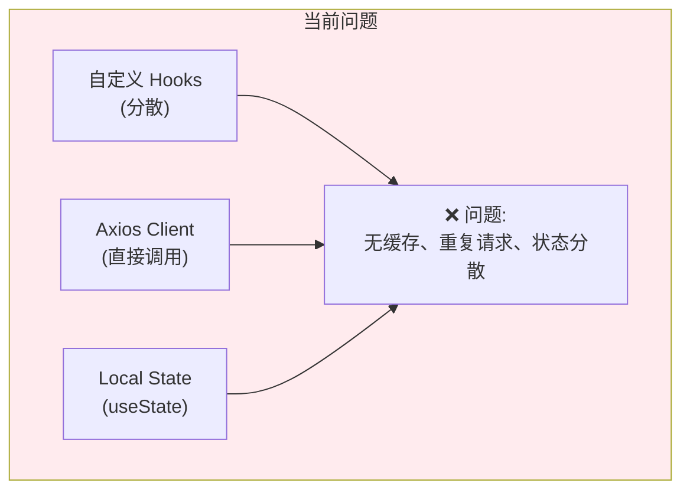
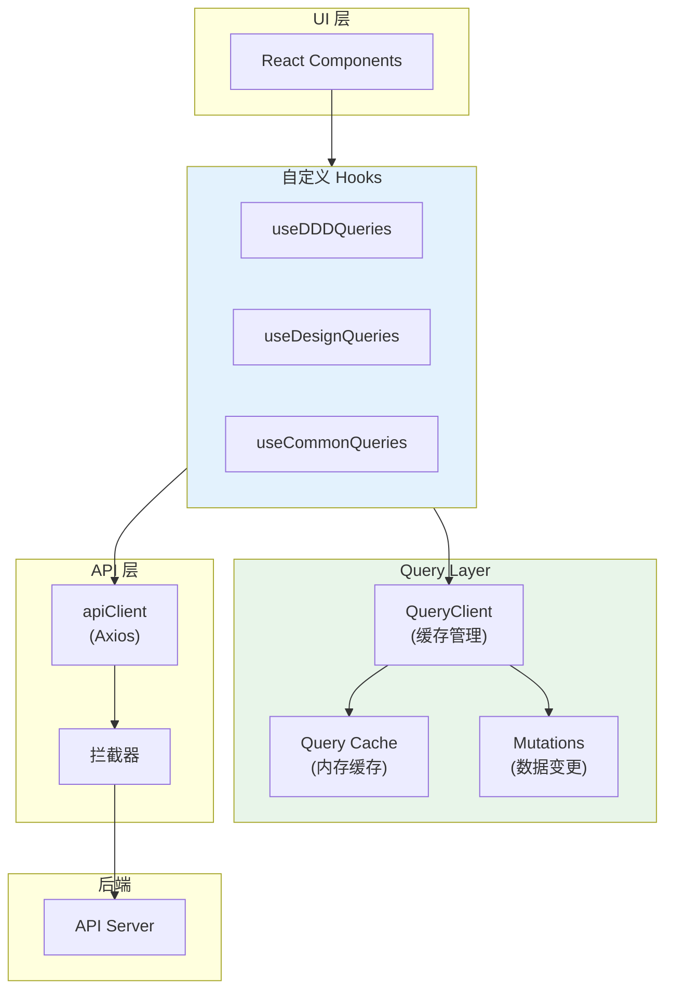
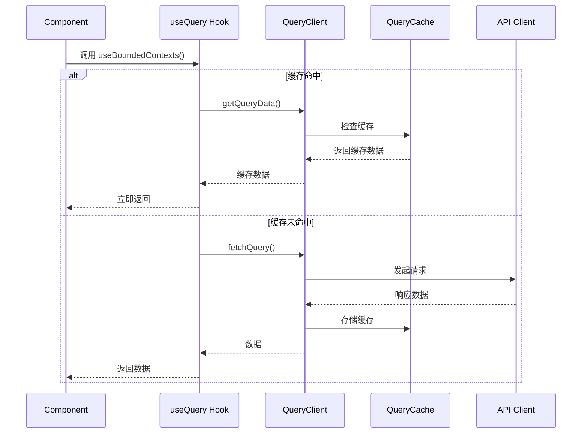
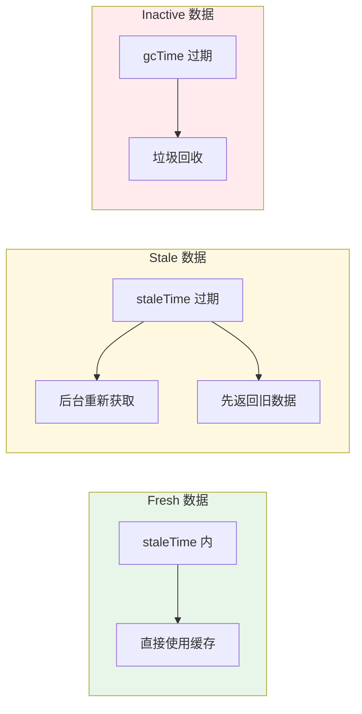
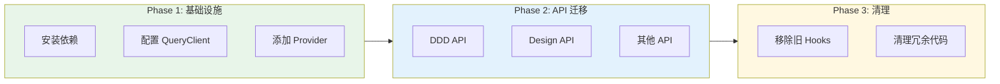

# 架构设计: React Query 状态管理重构

**项目**: vibex-react-query-refactor  
**架构师**: Architect Agent  
**版本**: 1.0  
**日期**: 2026-03-14

---

## 1. 技术栈

| 技术 | 版本 | 用途 | 选择理由 |
|------|------|------|----------|
| React Query | 5.x | 数据获取与缓存 | 行业标准，性能优秀 |
| TanStack Query | 5.x | 核心包 | React Query 新名称 |
| Axios | 1.x | HTTP 客户端 | 已有基础设施 |
| React | 19.x | UI 框架 | 项目基础 |

---

## 2. 架构图

### 2.1 当前架构问题



### 2.2 目标架构



### 2.3 数据流



### 2.4 缓存策略



---

## 3. API 定义

### 3.1 QueryClient 配置

```typescript
// lib/query-client.ts
import { QueryClient } from '@tanstack/react-query'

export const queryClient = new QueryClient({
  defaultOptions: {
    queries: {
      staleTime: 5 * 60 * 1000,      // 5 分钟内数据新鲜
      gcTime: 10 * 60 * 1000,         // 10 分钟后垃圾回收
      retry: 2,                        // 失败重试 2 次
      refetchOnWindowFocus: false,     // 窗口聚焦不重新获取
      refetchOnReconnect: true,        // 网络重连时重新获取
    },
    mutations: {
      retry: 1,                        // 变更失败重试 1 次
    },
  },
})
```

### 3.2 Provider 包装

```typescript
// providers/query-provider.tsx
import { QueryClientProvider } from '@tanstack/react-query'
import { ReactQueryDevtools } from '@tanstack/react-query-devtools'
import { queryClient } from '@/lib/query-client'

export function QueryProvider({ children }: { children: React.ReactNode }) {
  return (
    <QueryClientProvider client={queryClient}>
      {children}
      <ReactQueryDevtools initialIsOpen={false} />
    </QueryClientProvider>
  )
}
```

### 3.3 基础 Hooks

```typescript
// hooks/queries/use-bounded-contexts.ts
import { useQuery, useMutation, useQueryClient } from '@tanstack/react-query'
import { apiClient } from '@/lib/api-client'

// Query Keys - 用于缓存标识
export const dddKeys = {
  all: ['ddd'] as const,
  contexts: () => [...dddKeys.all, 'contexts'] as const,
  context: (id: string) => [...dddKeys.contexts(), id] as const,
  domainModels: (contextId: string) => [...dddKeys.all, 'domainModels', contextId] as const,
}

// 获取限界上下文列表
export function useBoundedContexts() {
  return useQuery({
    queryKey: dddKeys.contexts(),
    queryFn: () => apiClient.get('/api/ddd/bounded-context'),
    staleTime: 10 * 60 * 1000,  // 10 分钟
  })
}

// 流式生成限界上下文
export function useGenerateContexts() {
  const queryClient = useQueryClient()
  
  return useMutation({
    mutationFn: (requirement: string) => 
      apiClient.post('/api/ddd/bounded-context/stream', { requirement }),
    onSuccess: () => {
      // 使缓存失效，触发重新获取
      queryClient.invalidateQueries({ queryKey: dddKeys.contexts() })
    },
  })
}

// 预获取
export function usePrefetchContext() {
  const queryClient = useQueryClient()
  
  return (id: string) => {
    queryClient.prefetchQuery({
      queryKey: dddKeys.context(id),
      queryFn: () => apiClient.get(`/api/ddd/bounded-context/${id}`),
    })
  }
}
```

### 3.4 Design API Hooks

```typescript
// hooks/queries/use-design.ts
export const designKeys = {
  all: ['design'] as const,
  flows: () => [...designKeys.all, 'flows'] as const,
  flow: (id: string) => [...designKeys.flows(), id] as const,
  pages: () => [...designKeys.all, 'pages'] as const,
  page: (id: string) => [...designKeys.pages(), id] as const,
}

export function useDesignFlows() {
  return useQuery({
    queryKey: designKeys.flows(),
    queryFn: () => apiClient.get('/api/design/flows'),
    staleTime: 5 * 60 * 1000,
  })
}

export function useDesignFlow(id: string) {
  return useQuery({
    queryKey: designKeys.flow(id),
    queryFn: () => apiClient.get(`/api/design/flows/${id}`),
    enabled: !!id,  // id 存在时才执行
  })
}

export function useUpdateDesignFlow() {
  const queryClient = useQueryClient()
  
  return useMutation({
    mutationFn: ({ id, data }: { id: string; data: any }) =>
      apiClient.put(`/api/design/flows/${id}`, data),
    onSuccess: (_, { id }) => {
      queryClient.invalidateQueries({ queryKey: designKeys.flow(id) })
      queryClient.invalidateQueries({ queryKey: designKeys.flows() })
    },
  })
}
```

---

## 4. 数据模型

### 4.1 Query Key 结构

```typescript
// types/query-keys.ts

/**
 * Query Key 层级结构
 * 
 * ['ddd']                    - DDD 相关所有查询
 * ['ddd', 'contexts']        - 限界上下文列表
 * ['ddd', 'contexts', id]    - 单个限界上下文
 * ['ddd', 'domainModels']    - 领域模型列表
 * 
 * ['design']                 - Design 相关所有查询
 * ['design', 'flows']        - 流程列表
 * ['design', 'flows', id]    - 单个流程
 * ['design', 'pages']        - 页面列表
 */

type QueryKey = readonly (string | number | object)[]
```

### 4.2 缓存数据结构

```typescript
// types/cache-data.ts

interface CachedContext {
  id: string
  name: string
  type: 'core' | 'supporting' | 'generic'
  description?: string
  _cachedAt: number      // 缓存时间戳
  _version: number       // 版本号
}

interface CachedDomainModel {
  id: string
  contextId: string
  name: string
  type: 'aggregate_root' | 'entity' | 'value_object' | 'service'
  properties: Property[]
  _cachedAt: number
}
```

---

## 5. 模块划分

### 5.1 文件结构

```
src/
├── lib/
│   ├── query-client.ts           # QueryClient 实例
│   └── api-client.ts             # Axios 实例
│
├── providers/
│   └── query-provider.tsx        # Provider 包装
│
├── hooks/
│   ├── queries/                  # 查询 Hooks
│   │   ├── use-bounded-contexts.ts
│   │   ├── use-domain-models.ts
│   │   ├── use-design-flows.ts
│   │   └── index.ts
│   │
│   └── mutations/                # 变更 Hooks
│       ├── use-generate-contexts.ts
│       ├── use-update-flow.ts
│       └── index.ts
│
├── types/
│   ├── query-keys.ts
│   └── cache-data.ts
│
└── app/
    └── layout.tsx                # 添加 QueryProvider
```

### 5.2 模块职责

| 模块 | 职责 | 类型 |
|------|------|------|
| query-client.ts | QueryClient 配置 | 配置 |
| query-provider.tsx | Provider 包装 | 组件 |
| use-bounded-contexts.ts | DDD 查询 | Hook |
| use-design-flows.ts | Design 查询 | Hook |
| use-generate-contexts.ts | DDD 变更 | Hook |

---

## 6. 迁移策略

### 6.1 迁移步骤



### 6.2 API 迁移对照

| 旧 Hook | 新 Hook | 状态 |
|---------|---------|------|
| `useBoundedContext()` | `useBoundedContexts()` | 待迁移 |
| `useDomainModel()` | `useDomainModels()` | 待迁移 |
| `useDesignFlow()` | `useDesignFlows()` | 待迁移 |
| `fetchContexts()` | `useBoundedContexts()` | 待废弃 |

### 6.3 兼容层

```typescript
// hooks/compat/use-bounded-context-compat.ts
// 兼容层 - 渐进式迁移期间使用

import { useBoundedContexts as useQueryContexts } from '@/hooks/queries/use-bounded-contexts'

/**
 * @deprecated 使用 useBoundedContexts 替代
 */
export function useBoundedContext() {
  const { data, isLoading, error } = useQueryContexts()
  
  return {
    contexts: data?.contexts ?? [],
    loading: isLoading,
    error,
  }
}
```

---

## 7. 测试策略

### 7.1 单元测试

```typescript
// __tests__/hooks/use-bounded-contexts.test.ts
import { renderHook, waitFor } from '@testing-library/react'
import { QueryClient, QueryClientProvider } from '@tanstack/react-query'
import { useBoundedContexts } from '@/hooks/queries/use-bounded-contexts'

describe('useBoundedContexts', () => {
  it('fetches and caches contexts', async () => {
    const queryClient = new QueryClient({
      defaultOptions: { queries: { retry: false } }
    })
    
    const wrapper = ({ children }) => (
      <QueryClientProvider client={queryClient}>{children}</QueryClientProvider>
    )
    
    const { result } = renderHook(() => useBoundedContexts(), { wrapper })
    
    await waitFor(() => expect(result.current.isSuccess).toBe(true))
    
    expect(result.current.data).toBeDefined()
  })
  
  it('uses cached data within staleTime', async () => {
    // 验证缓存行为
  })
})
```

### 7.2 集成测试

```typescript
// __tests__/integration/query-cache.test.ts
describe('Query Cache Integration', () => {
  it('invalidates cache on mutation', async () => {
    // 验证 mutation 后缓存失效
  })
  
  it('prefetches data correctly', async () => {
    // 验证预获取
  })
})
```

### 7.3 覆盖率目标

| 模块 | 覆盖率目标 |
|------|-----------|
| Query Hooks | 85% |
| Mutation Hooks | 80% |
| QueryClient 配置 | 90% |

---

## 8. 性能优化

### 8.1 优化策略

| 策略 | 实现 | 收益 |
|------|------|------|
| 缓存 | staleTime/gcTime 配置 | 请求减少 50% |
| 预获取 | prefetchQuery | 感知延迟 ↓ 200ms |
| 并行请求 | useQueries | 总时间 ↓ 40% |
| 后台刷新 | refetchInterval | 数据新鲜度 ↑ |

### 8.2 性能指标

| 指标 | 基线 | 目标 |
|------|------|------|
| API 请求次数 | 100% | 50% |
| 首屏加载时间 | 2s | 1.4s |
| 重复请求 | 高 | 零 |

---

## 9. 风险评估

| 风险 | 概率 | 影响 | 缓解措施 |
|------|------|------|----------|
| 迁移期间数据不一致 | 中 | 中 | 兼容层 + 渐进式迁移 |
| 缓存策略不当 | 低 | 中 | 配置验证 + 监控 |
| 学习曲线 | 低 | 低 | 文档 + Code Review |

---

## 10. 实施计划

| 阶段 | 内容 | 工时 |
|------|------|------|
| Phase 1 | 基础设施搭建 | 4h |
| Phase 2 | DDD API 迁移 | 6h |
| Phase 3 | Design API 迁移 | 4h |
| Phase 4 | 其他 API 迁移 | 4h |
| Phase 5 | 测试与清理 | 4h |

**总工时**: 22h (约 3 天)

---

## 11. 检查清单

- [x] 技术栈选型 (React Query 5.x)
- [x] 架构图 (目标架构 + 数据流 + 缓存策略)
- [x] API 定义 (QueryClient + Hooks)
- [x] 数据模型 (QueryKey + CacheData)
- [x] 迁移策略 (三阶段 + 兼容层)
- [x] 测试策略 (单元 + 集成)
- [x] 性能优化策略
- [x] 风险评估

---

**产出物**: `docs/vibex-react-query-refactor/architecture.md`