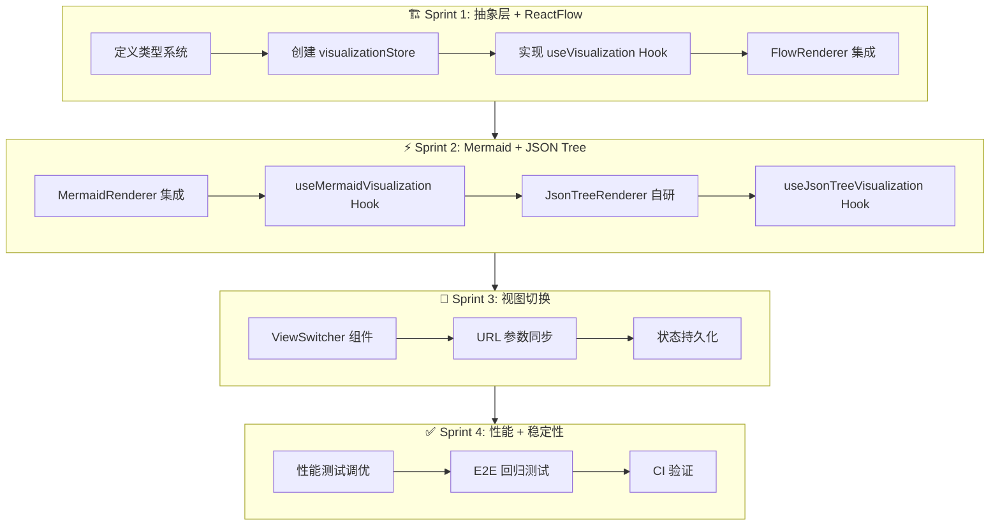

# AGENTS.md — Agent 职责与任务流转定义

**项目**: vibex-reactflow-visualization
**Architect**: architect
**日期**: 2026-03-23
**状态**: ✅ 完成

---

## 1. Agent 职责矩阵

| Agent | 核心职责 | Sprint | 产出物 |
|-------|---------|--------|--------|
| **dev** | Hook 实现 + 组件开发 + 集成 | Sprint 1-4 | useVisualization + 三个 Renderer + Store |
| **tester** | 单元测试 + 性能测试 + E2E | Sprint 2-4 | 测试报告 + 性能报告 |
| **reviewer** | 代码审查 + 类型安全审查 | Sprint 1-4 | 审查报告 |
| **pm** | 进度追踪 + 验收 | Sprint 4 | 验收报告 |
| **architect** | 架构设计 | Sprint 0 | 本文档 |
| **analyst** | — | — | — |

---

## 2. 任务流转图

---

## 3. 验收标准（expect 断言格式）

| ID | Given | When | Then |
|----|-------|------|------|
| AC-1 | FlowData | `useVisualization('flow', data)` | `expect(nodes.length).toBeGreaterThan(0)` |
| AC-2 | MermaidData | `useVisualization('mermaid', data)` | `expect(container.querySelector('.mermaid')).toBeTruthy()` |
| AC-3 | JSONData | `useVisualization('json', data)` | `expect(screen.queryByTestId('json-tree')).toBeTruthy()` |
| AC-4 | 任何视图 | 切换到其他视图 | `expect(transitionTime).toBeLessThan(500)` |
| AC-5 | 100 节点 | ReactFlow 渲染 | `expect(renderTime).toBeLessThan(2000)` |
| AC-6 | 1000 节点 | JSON 树渲染 | `expect(renderTime).toBeLessThan(1000)` |
| AC-7 | npm test | 代码变更后 | `expect(coverage).toBeGreaterThanOrEqual(0.99)` |
| AC-8 | tsc | 类型检查 | `expect(exitCode).toBe(0)` |

---

**AGENTS.md 完成**: 2026-03-23 12:53 (Asia/Shanghai)
