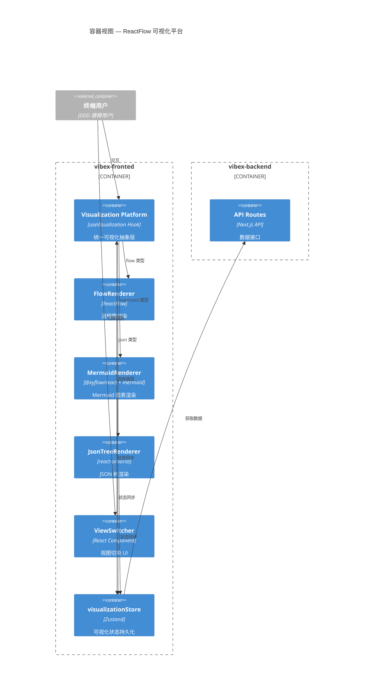
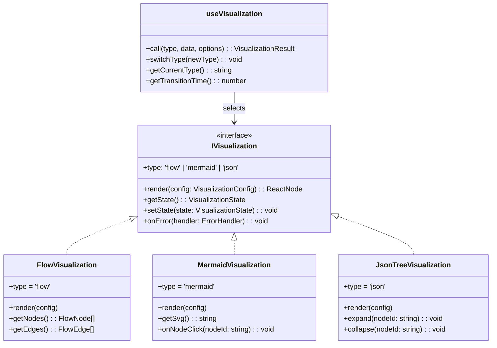

# Architecture: vibex-reactflow-visualization — ReactFlow 可视化能力整合

**项目**: vibex-reactflow-visualization
**阶段**: design-architecture
**Architect**: architect
**日期**: 2026-03-23
**状态**: ✅ 完成

---

## 1. Tech Stack

| 层级 | 技术 | 版本 | 选型理由 |
|------|------|------|---------|
| **可视化引擎** | ReactFlow | 11.x | 现有基础设施，支持自定义节点 |
| **Mermaid 渲染** | @xyflow/react + mermaid | 11.x / 10.x | 集成在 ReactFlow 中 |
| **JSON 树** | react-arborist / 自研 | — | 树形结构专用组件 |
| **状态管理** | Zustand | 4.x | 轻量，与 ReactFlow 集成良好 |
| **类型系统** | TypeScript strict | 5.x | 无 any，性能优化基础 |
| **测试** | Jest + RTL + Playwright | — | 现有测试基础设施 |

---

## 2. Architecture Diagram



---

## 3. Module Design

### 3.1 统一可视化抽象层



### 3.2 文件结构

```
src/
├── hooks/
│   ├── useVisualization.ts          # 统一 Hook 入口 (Epic 1)
│   ├── useFlowVisualization.ts      # ReactFlow 封装 (Epic 2)
│   ├── useMermaidVisualization.ts   # Mermaid 封装 (Epic 3)
│   └── useJsonTreeVisualization.ts  # JSON 树封装 (Epic 4)
├── components/
│   ├── visualization/
│   │   ├── VisualizationPlatform.tsx # 平台容器
│   │   ├── ViewSwitcher.tsx         # 视图切换
│   │   ├── FlowRenderer.tsx         # ReactFlow 渲染
│   │   ├── MermaidRenderer.tsx      # Mermaid 渲染
│   │   ├── JsonTreeRenderer.tsx     # JSON 树渲染
│   │   └── ErrorBoundary.tsx        # 错误边界
│   └── shared/
│       ├── NodeToolip.tsx
│       └── NodeDetailPanel.tsx
├── stores/
│   └── visualizationStore.ts        # Zustand — 可视化状态
└── types/
    ├── visualization.ts              # 类型定义
    ├── flow.ts                     # ReactFlow 类型
    ├── mermaid.ts                   # Mermaid 类型
    └── json-tree.ts                 # JSON 树类型
```

---

## 4. API Definitions

### 4.1 useVisualization Hook

```typescript
// hooks/useVisualization.ts
type VisualizationType = 'flow' | 'mermaid' | 'json';

interface VisualizationConfig {
  data: FlowData | MermaidData | JsonData;
  options?: {
    maxNodes?: number;
    maxDepth?: number;
    onNodeClick?: (nodeId: string) => void;
    onError?: (error: Error) => void;
  };
}

interface VisualizationResult {
  component: ReactNode;
  currentType: VisualizationType;
  transitionTime: number;
  state: VisualizationState;
  switchType: (type: VisualizationType) => void;
  error: Error | null;
}

// 核心接口
export function useVisualization(
  type: VisualizationType,
  data: unknown,
  options?: VisualizationConfig['options']
): VisualizationResult;
```

### 4.2 Store 接口

```typescript
// stores/visualizationStore.ts
interface VisualizationState {
  currentType: VisualizationType;
  previousType: VisualizationType | null;
  flowNodes: FlowNode[];
  flowEdges: FlowEdge[];
  mermaidCode: string;
  jsonData: JsonData;
  selectedNodeId: string | null;
  zoomLevel: number;
  viewportPosition: { x: number; y: number };
  isTransitioning: boolean;
  error: Error | null;
}

interface VisualizationActions {
  switchType: (type: VisualizationType) => void;
  setFlowData: (nodes: FlowNode[], edges: FlowEdge[]) => void;
  setMermaidData: (code: string) => void;
  setJsonData: (data: JsonData) => void;
  selectNode: (nodeId: string | null) => void;
  setZoom: (level: number) => void;
  setViewport: (position: { x: number; y: number }) => void;
  clearError: () => void;
}
```

---

## 5. Key Design Decisions

### 5.1 统一 Hook vs 分别 Hook

| 方案 | 优点 | 缺点 |
|------|------|------|
| 统一 `useVisualization` | 单一入口，类型安全，便于切换 | 需处理三种数据格式差异 |
| 分别 Hook | 职责单一，灵活 | 页面需管理多种 Hook，切换逻辑分散 |

**选择**: 统一 `useVisualization` 作为入口，内部路由到具体实现。页面组件只需一个 Hook。

### 5.2 JSON Tree 选型

| 方案 | 优点 | 缺点 |
|------|------|------|
| react-arborist | 功能完整，性能好 | 新增依赖 |
| 自研虚拟列表 | 无额外依赖 | 开发成本高 |

**选择**: 自研（基于 `useMemo` + 虚拟滚动），避免新增大型依赖。当前数据量（≤ 200 节点）不需要重型库。

### 5.3 Mermaid 集成

ReactFlow 内置 `@xyflow/react` 支持 Mermaid 渲染作为自定义节点。使用 `@xyflow/react` 的 `Mermaid` 节点类型，无需额外集成库。

---

## 6. Performance Strategy

| 关注点 | 策略 |
|-------|------|
| **ReactFlow 100 节点** | `nodeExtent` 限制 + 按需渲染，`fitView` 懒调用 |
| **Mermaid 50+ 节点** | `mermaid.run()` 异步渲染，`loading` 状态显示 |
| **JSON 1000 节点** | 虚拟滚动，仅渲染可见节点 + `shouldComponentUpdate` 优化 |
| **视图切换** | `React.Suspense` 异步加载，骨架屏过渡，`< 500ms` |
| **内存泄漏** | ReactFlow `onNodesChange` 清理 + Store 重置时 full cleanup |

---

## 7. Epic 映射

| Epic | 核心产出 | 关键里程碑 |
|------|---------|-----------|
| Epic 1 | `useVisualization` 接口 + `visualizationStore` | 接口稳定，TypeScript 0 error |
| Epic 2 | `FlowRenderer` 集成 | ReactFlow 功能完整 |
| Epic 3 | `MermaidRenderer` 集成 | Mermaid 渲染正确 |
| Epic 4 | `JsonTreeRenderer` 自研 | JSON 树功能完整 |
| Epic 5 | `ViewSwitcher` + 状态同步 | 视图切换 < 500ms |
| Epic 6 | 性能调优 + 稳定性保障 | 所有指标达标 |

---

## 8. Trade-offs

| 决策点 | 本方案 | 备选 | 理由 |
|-------|-------|------|------|
| 抽象层位置 | React Hook | Class Component | Hook 是 React 现状标准 |
| 状态管理 | Zustand store | Context API | Zustand 已有，无新依赖 |
| JSON Tree | 自研 | react-arborist | 避免新依赖，数据量可接受 |
| Mermaid 集成 | @xyflow/react 内置 | 独立 Mermaid 组件 | 减少集成复杂度 |
| 视图持久化 | URL 参数 | localStorage | URL 可分享，UX 更好 |

---

**架构文档完成**: 2026-03-23 12:50 (Asia/Shanghai)
